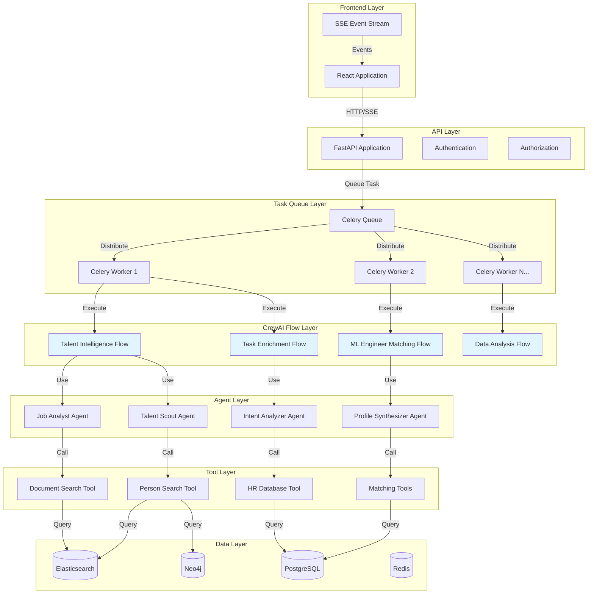
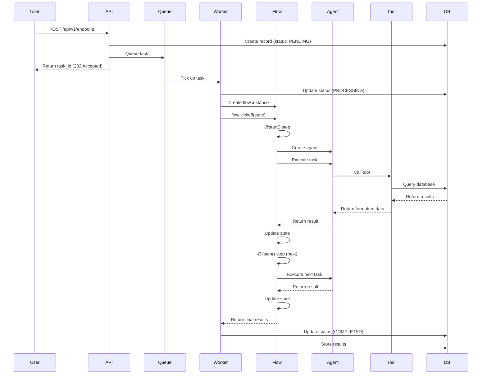

# Section 1: Introduction

## What is CrewAI?

CrewAI is a framework for building collaborative AI agent systems. It provides:

- **Agents**: Specialized AI workers with specific roles, goals, and tools
- **Flows**: Multi-step workflows that orchestrate agents
- **Tasks**: Structured work units assigned to agents
- **Tools**: Custom functions that agents can use to interact with external systems

### Why CrewAI for Enterprise Applications?

CrewAI excels in enterprise environments because it provides:

1. **Structured Orchestration**: Flows give you explicit control over multi-step processes
2. **Agent Specialization**: Each agent can be optimized for specific tasks
3. **Tool Integration**: Easy connection to databases, APIs, and services
4. **State Management**: Built-in state handling across flow steps
5. **Production Ready**: Designed for reliability, observability, and scalability

## Key Concepts

### Agents

Agents are specialized AI workers with:
- **Role**: Their function in the system (e.g., "Data Analyst", "Talent Scout")
- **Goal**: What they're trying to accomplish
- **Backstory**: Context that shapes their behavior
- **Tools**: Functions they can call (database queries, API calls, etc.)
- **LLM Configuration**: Model and parameters for their reasoning

### Flows

Flows orchestrate multi-step processes:
- **@start()**: Initial step that kicks off the flow
- **@listen()**: Subsequent steps that wait for previous steps
- **State**: Persistent data passed between steps
- **Agents**: Specialized agents called at each step

### Tasks

Tasks are work units assigned to agents:
- **Description**: What needs to be done
- **Expected Output**: Format specification
- **Agent**: Which agent handles the task
- **Tools**: Available tools for the agent

### Tools

Tools connect agents to external systems:
- **Database Tools**: Query databases
- **API Tools**: Call external services
- **Search Tools**: Perform semantic or structured searches
- **Custom Tools**: Any function your agents need

## Enterprise Requirements

When building production AI systems, you need:

### Scalability
- Handle thousands of concurrent requests
- Scale workers horizontally
- Efficient resource utilization

### Reliability
- Graceful error handling
- Retry mechanisms
- State persistence and recovery

### Observability
- Comprehensive logging
- Performance metrics
- Cost tracking
- Distributed tracing

### Security
- Multi-tenant isolation
- Authentication and authorization
- Data protection
- Audit logging

### Cost Management
- Token usage tracking
- Model selection optimization
- Caching strategies
- Cost alerts and limits

## Architecture Overview

Here's how CrewAI fits into a complete enterprise application:



## Flow Execution Lifecycle

Here's how a typical flow executes:



## Common Pitfalls and Solutions

### Pitfall 1: Storing Database Sessions in Flow State

**Problem:**
```python
# ❌ BAD: This will cause pickle errors!
class FlowState(BaseModel):
    db_session: Session  # SQLAlchemy sessions can't be pickled
```

**Solution:**
```python
# ✅ GOOD: Store only IDs, create sessions locally
class FlowState(BaseModel):
    customer_id: str
    analysis_id: str
    # No database sessions!

# In flow methods:
def my_method(self):
    if database.SessionLocal is None:
        database.init_database()
    db = database.SessionLocal()
    try:
        # Use db here
        pass
    finally:
        db.close()
```

### Pitfall 2: Direct Import of Global Variables

**Problem:**
```python
# ❌ BAD: Creates local binding that doesn't update
from src.models.database import SessionLocal

if SessionLocal is None:
    init_database()
db = SessionLocal()  # Still None!
```

**Solution:**
```python
# ✅ GOOD: Module import maintains reference
from src.models import database

if database.SessionLocal is None:
    database.init_database()
db = database.SessionLocal()  # Works correctly!
```

### Pitfall 3: Forgetting to Initialize Database

**Problem:**
```python
# ❌ BAD: Assumes database is initialized
from src.models.database import SessionLocal

db = SessionLocal()  # Fails if not initialized!
```

**Solution:**
```python
# ✅ GOOD: Always check and initialize
from src.models import database

if database.SessionLocal is None:
    database.init_database()
db = database.SessionLocal()
```

## Next Steps

Now that you understand the basics, let's dive into:

1. **Core Architecture Patterns** - How to structure flows and agents
2. **Integration Patterns** - Connecting CrewAI to your application
3. **Containerization** - Deploying in production
4. **Scalability** - Handling growth
5. **Monitoring** - Observing your system
6. **Optimization** - Improving performance and cost


