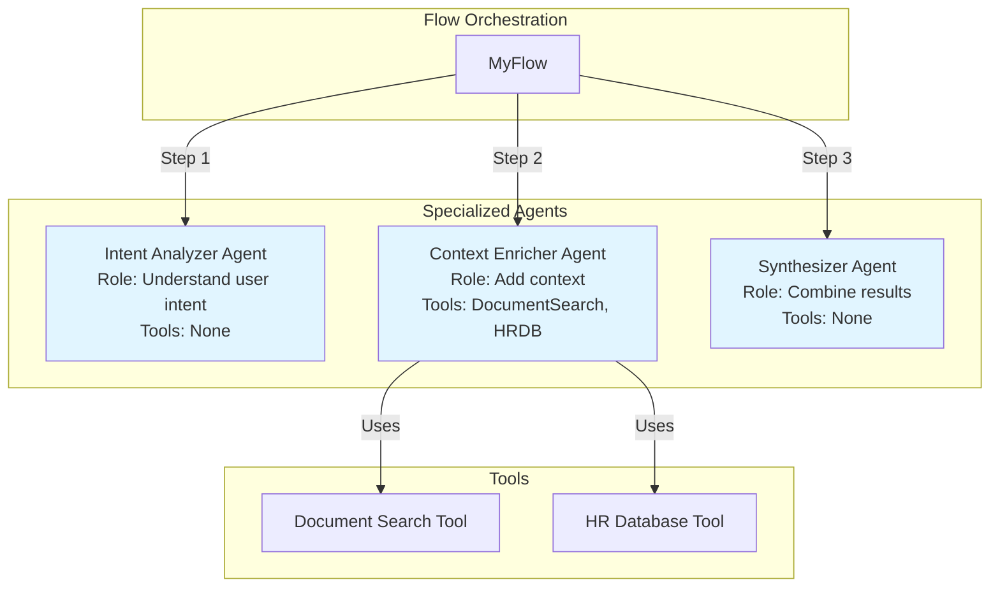
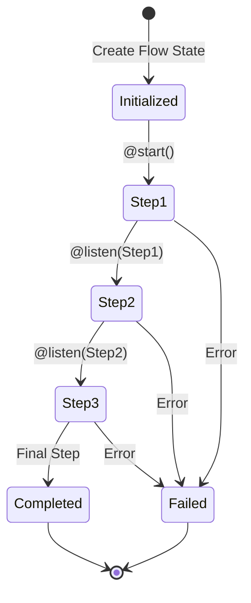
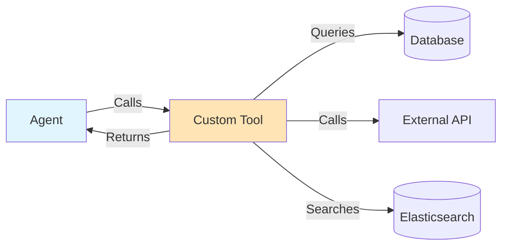

# Section 2: Core Architecture Patterns

## Overview

This section covers the fundamental patterns for structuring CrewAI flows and agents in enterprise applications. We'll explore how to design flows, create specialized agents, manage state, and integrate tools.

## Pattern 1: Flow-Based Orchestration

### High-Level Pattern

Flows orchestrate multi-step workflows where each step may involve one or more agents. Use `@start()` for the initial step and `@listen()` for subsequent steps that depend on previous results.

```mermaid
graph LR
    Start[@start] --> Step1[Step 1: Initial Analysis]
    Step1 --> Step2[@listen Step 1]
    Step2 --> Step3[@listen Step 2]
    Step3 --> Step4[@listen Step 3]
    Step4 --> End[Complete]
    
    style Start fill:#90EE90
    style End fill:#FFB6C1
```

### Step-by-Step Tutorial

#### Step 1: Define State Model

Create a Pydantic model for your flow state. **Critical**: Never include database sessions or non-serializable objects.

```python
from pydantic import BaseModel
from typing import Optional, Dict, Any, List
from datetime import datetime

class MyFlowState(BaseModel):
    """State maintained throughout the flow"""
    # Input parameters
    customer_id: str
    request_id: str
    
    # Intermediate results (Optional until set)
    step1_result: Optional[Dict[str, Any]] = None
    step2_result: Optional[List[Dict]] = None
    
    # Final results
    final_result: Optional[Dict[str, Any]] = None
    
    # Metadata
    start_time: datetime = datetime.now()
    error: Optional[str] = None
```

#### Step 2: Create Flow Class

```python
from crewai.flow.flow import Flow, listen, start

class MyFlow(Flow[MyFlowState]):
    """Example flow demonstrating multi-step orchestration"""
    
    def __init__(self):
        super().__init__()
        # Initialize LLM and tools here
        self.llm = LLM(
            model="gpt-4o-mini",
            temperature=0.3
        )
    
    @start()
    def initial_step(self):
        """First step: Analyze input"""
        # This step runs first
        agent = Agent(
            role="Analyzer",
            goal="Analyze the input",
            llm=self.llm
        )
        
        task = Task(
            description=f"Analyze: {self.state.customer_id}",
            agent=agent
        )
        
        crew = Crew(agents=[agent], tasks=[task])
        result = crew.kickoff()
        
        # Update state
        self.state.step1_result = {"analysis": str(result)}
    
    @listen(initial_step)
    def process_step(self):
        """Second step: Process analysis"""
        # Runs after initial_step completes
        # Access previous step's result via self.state.step1_result
        
        agent = Agent(
            role="Processor",
            goal="Process the analysis",
            llm=self.llm
        )
        
        task = Task(
            description=f"Process: {self.state.step1_result}",
            agent=agent
        )
        
        crew = Crew(agents=[agent], tasks=[task])
        result = crew.kickoff()
        
        self.state.step2_result = [{"processed": str(result)}]
    
    @listen(process_step)
    def finalize_step(self):
        """Final step: Combine results"""
        # Runs after process_step completes
        
        agent = Agent(
            role="Synthesizer",
            goal="Combine all results",
            llm=self.llm
        )
        
        task = Task(
            description=f"Combine: {self.state.step1_result} and {self.state.step2_result}",
            agent=agent
        )
        
        crew = Crew(agents=[agent], tasks=[task])
        result = crew.kickoff()
        
        self.state.final_result = {"combined": str(result)}
```

#### Step 3: Execute Flow

```python
# Create flow instance
flow = MyFlow()

# Initialize state
initial_state = MyFlowState(
    customer_id="customer123",
    request_id="req456"
)

# Execute flow
results = flow.kickoff(initial_state.dict())

# Access final state
final_state = flow.state
print(final_state.final_result)
```

### Real-World Example: Talent Intelligence Flow

Let's see how this pattern applies to a real flow:

```python
# src/flows/talent_intelligence_flow.py

class TalentIntelligenceFlow(Flow[TalentAnalysisState]):
    """Real-world flow: Talent candidate analysis"""
    
    @start()
    def analyze_job(self):
        """Step 1: Extract requirements from job description"""
        # Agent analyzes job description
        # Updates: self.state.ideal_persona
    
    @listen(analyze_job)
    def search_applicants(self):
        """Step 2: Search internal applicants"""
        # Agent searches internal database
        # Updates: self.state.applicant_results
    
    @listen(search_applicants)
    def search_market_candidates(self):
        """Step 3: Search external market"""
        # Agent searches external APIs
        # Updates: self.state.market_results
    
    @listen(search_market_candidates)
    def combine_and_rank(self):
        """Step 4: Combine and rank candidates"""
        # Agent combines and ranks results
        # Updates: self.state.top_overall
```

### Common Pitfalls

#### Pitfall: Modifying State Incorrectly

**Problem:**
```python
# ❌ BAD: Direct mutation may not persist
self.state.some_field = new_value  # May not work in all contexts
```

**Solution:**
```python
# ✅ GOOD: Create new state object or use proper assignment
self.state = self.state.copy(update={"some_field": new_value})
# OR use direct assignment (works in most cases)
self.state.some_field = new_value  # This usually works, but be careful
```

## Pattern 2: Agent Specialization

### High-Level Pattern

Create focused agents with specific roles, goals, and tools. Each agent should excel at one thing.



### Step-by-Step Tutorial

#### Step 1: Design Agent Roles

Before coding, design what each agent should do:

- **Intent Analyzer**: Understands what the user wants
- **Context Enricher**: Adds relevant business context
- **Synthesizer**: Combines information into final output

#### Step 2: Create Specialized Agents

```python
class TaskEnrichmentFlow(Flow[TaskEnrichmentFlowState]):
    """Example: Task enrichment with specialized agents"""
    
    def __init__(self):
        super().__init__()
        self.llm = LLM(model="gpt-4o-mini", temperature=0.3)
        
        # Initialize tools
        self.document_search_tool = DocumentSearchTool(
            customer_id=self.state.user_context.customer_id
        )
        
        # Create specialized agents
        self.intent_analyzer = self._create_intent_analyzer()
        self.context_enricher = self._create_context_enricher()
        self.synthesizer = self._create_synthesizer()
    
    def _create_intent_analyzer(self) -> Agent:
        """Agent specialized in understanding user intent"""
        return Agent(
            role="Intent Analysis Specialist",
            goal="Analyze user requests to determine intent, complexity, and requirements",
            backstory="""You are an expert at understanding user intentions and breaking down 
            complex requests into structured, analyzable components. You excel at identifying 
            ambiguities, extracting entities, and determining the appropriate processing approach.""",
            llm=self.llm,
            verbose=True,
            allow_delegation=False  # Focused agent, no delegation
        )
    
    def _create_context_enricher(self) -> Agent:
        """Agent specialized in enriching context"""
        return Agent(
            role="Context Enrichment Specialist",
            goal="Add relevant business context to user queries using available data sources",
            backstory="""You are an expert information retrieval specialist with deep knowledge 
            of semantic search, query optimization, and knowledge base navigation. You excel at 
            finding relevant context from diverse sources and synthesizing it into actionable insights.""",
            tools=[self.document_search_tool],  # This agent uses tools
            llm=self.llm,
            verbose=True,
            allow_delegation=False
        )
    
    def _create_synthesizer(self) -> Agent:
        """Agent specialized in synthesis"""
        return Agent(
            role="Synthesis Specialist",
            goal="Combine analyzed intent and enriched context into optimized prompts",
            backstory="""You are an expert at creating well-structured, optimized prompts that 
            guide AI agents to produce high-quality results. You understand how to balance 
            context, specificity, and clarity.""",
            llm=self.llm,
            verbose=True,
            allow_delegation=False
        )
```

### Real-World Examples

#### Example 1: Talent Intelligence Flow Agents

```python
# src/flows/talent_intelligence_flow.py

class TalentIntelligenceFlow(Flow[TalentAnalysisState]):
    def _create_job_analyst(self) -> Agent:
        """Specialized: Extract requirements from job descriptions"""
        return Agent(
            role="Senior Talent Acquisition Specialist",
            goal="Extract key requirements from job descriptions",
            backstory="15+ years recruiting top talent...",
            llm=self.llm
        )
    
    def _create_talent_scout(self) -> Agent:
        """Specialized: Search for candidates"""
        return Agent(
            role="Expert People Search Specialist",
            goal="Find top candidates matching requirements",
            backstory="10+ years mastering talent databases...",
            tools=self.search_tools,  # Has search tools
            llm=self.llm
        )
    
    def _create_insights_synthesizer(self) -> Agent:
        """Specialized: Generate insights"""
        return Agent(
            role="Talent Intelligence Analyst",
            goal="Transform search data into strategic insights",
            backstory="Advised hundreds of companies...",
            llm=self.llm
        )
```

#### Example 2: ML Engineer Matching Flow Agents

```python
# src/flows/ml_engineer_matching_flow.py

class MLEngineerMatchingFlow(Flow[MLEngineerMatchingState]):
    def _init_agents(self):
        """Multiple specialized agents"""
        # Profile Synthesizer: Analyzes JD + hiring manager + patterns
        self.profile_synthesizer = Agent(
            role="Ideal Candidate Profile Architect",
            goal="Synthesize ideal profile from multiple sources",
            backstory="Senior technical recruiter with 15+ years...",
            llm=self.llm
        )
        
        # Pattern Analyzer: Queries graph database
        self.pattern_analyzer = Agent(
            role="Employee Success Pattern Analyst",
            goal="Discover patterns in successful employees",
            tools=[self.pattern_search_tool],  # Uses graph DB tool
            llm=self.llm
        )
        
        # Candidate Ranker: Scores candidates
        self.candidate_ranker = Agent(
            role="Candidate Fit Scoring Specialist",
            goal="Score and rank candidates",
            tools=[self.scoring_tool],  # Uses scoring tool
            llm=self.llm
        )
```

### Common Pitfalls

#### Pitfall: Creating Generic Agents

**Problem:**
```python
# ❌ BAD: Agent tries to do everything
agent = Agent(
    role="Helper",
    goal="Help with everything",
    backstory="I can do anything"
)
```

**Solution:**
```python
# ✅ GOOD: Focused agent with clear purpose
agent = Agent(
    role="Intent Analysis Specialist",
    goal="Analyze user requests to determine intent",
    backstory="Expert at understanding user intentions...",
    # Specific tools if needed
    # Clear scope
)
```

## Pattern 3: State Management

### High-Level Pattern

Flow state must be serializable (for Celery) and persistent across steps. Use Pydantic models for type safety.



### Step-by-Step Tutorial

#### Step 1: Define Serializable State

```python
from pydantic import BaseModel
from typing import Optional, Dict, Any, List
from datetime import datetime

class MyFlowState(BaseModel):
    """State model - MUST be serializable"""
    
    # Required fields
    customer_id: str
    request_id: str
    
    # Optional intermediate results
    step1_output: Optional[Dict[str, Any]] = None
    step2_output: Optional[List[str]] = None
    
    # Final result
    final_output: Optional[Dict[str, Any]] = None
    
    # Metadata
    created_at: datetime = datetime.now()
    error: Optional[str] = None
    
    # ❌ NEVER include these:
    # db_session: Session  # NOT serializable!
    # file_handle: File     # NOT serializable!
    # http_client: Client   # NOT serializable!
```

#### Step 2: Update State in Flow Steps

```python
class MyFlow(Flow[MyFlowState]):
    @start()
    def first_step(self):
        """Update state after step completion"""
        # Do work...
        result = some_operation()
        
        # Update state
        self.state.step1_output = {"result": result}
    
    @listen(first_step)
    def second_step(self):
        """Access previous step's state"""
        # Access previous step's output
        previous_result = self.state.step1_output
        
        # Do work with previous result...
        new_result = process(previous_result)
        
        # Update state
        self.state.step2_output = new_result
```

### Real-World Example: ML Engineer Matching State

```python
# src/flows/ml_engineer_matching_flow.py

class MLEngineerMatchingState(BaseModel):
    """State maintained throughout matching flow"""
    
    # Input
    session_id: str
    customer_id: str
    job_description: str
    hiring_manager_notes: Optional[str] = None
    reference_employee_ids: Optional[List[int]] = None
    
    # Configuration
    analyze_internal: bool = True
    search_external: bool = True
    max_results: int = 20
    
    # Step 1: Profile synthesis
    ideal_profile: Optional[Dict[str, Any]] = None
    profile_synthesis_reasoning: Optional[str] = None
    
    # Step 2: Employee pattern analysis
    success_patterns: Optional[Dict[str, Any]] = None
    
    # Step 3: Internal candidates
    internal_candidates_scored: Optional[List[Dict]] = None
    
    # Step 4: External candidates
    external_candidates_scored: Optional[List[Dict]] = None
    
    # Step 5: Final results
    final_matches: Optional[Dict] = None
    
    # Performance tracking
    start_time: datetime = datetime.now()
    total_cost_usd: float = 0.0
```

### Common Pitfalls

#### Pitfall: Storing Non-Serializable Objects

**Problem:**
```python
# ❌ BAD: Non-serializable objects cause errors
class FlowState(BaseModel):
    db_session: Session  # Can't be pickled!
    file_handle: File    # Can't be pickled!
    client: httpx.Client # Can't be pickled!
```

**Solution:**
```python
# ✅ GOOD: Store only IDs and data
class FlowState(BaseModel):
    customer_id: str
    analysis_id: str
    # Create sessions/files/clients locally when needed
```

#### Pitfall: Not Initializing State Properly

**Problem:**
```python
# ❌ BAD: Missing required fields
flow.kickoff({})  # Missing required fields!
```

**Solution:**
```python
# ✅ GOOD: Provide all required fields
initial_state = MyFlowState(
    customer_id="customer123",
    request_id="req456"
)
flow.kickoff(initial_state.dict())
```

## Pattern 4: Tool Integration

### High-Level Pattern

Tools connect agents to external systems. Each tool extends `BaseTool` and implements `_run()`.



### Step-by-Step Tutorial

#### Step 1: Create Base Tool Class

```python
from crewai.tools import BaseTool
from pydantic import Field
from typing import Optional
import json

class MyCustomTool(BaseTool):
    """Example custom tool"""
    
    name: str = "My Custom Tool"
    description: str = "Does something useful"
    
    # Tool parameters
    customer_id: str = Field(description="Customer ID")
    limit: int = Field(default=10, description="Max results")
    
    def _run(self, query: str) -> str:
        """Execute tool logic"""
        try:
            # Do work here
            results = perform_search(query, self.customer_id, self.limit)
            
            # Return JSON string for agent consumption
            return json.dumps([r.dict() for r in results])
        except Exception as e:
            # Always handle errors gracefully
            return json.dumps({"error": str(e)})
```

#### Step 2: Initialize Tool with Context

```python
# In flow initialization
class MyFlow(Flow[MyFlowState]):
    def __init__(self):
        super().__init__()
        
        # Initialize tool with customer context
        self.document_tool = DocumentSearchTool(
            customer_id=self.state.customer_id,
            company_hr_dataset=self.state.company_id,
            limit=10
        )
```

#### Step 3: Assign Tool to Agent

```python
agent = Agent(
    role="Search Specialist",
    goal="Find relevant information",
    tools=[self.document_tool],  # Agent can use this tool
    llm=self.llm
)
```

### Real-World Example: Document Search Tool

```python
# src/crewai_custom_tools/document_search_tool.py

class DocumentSearchTool(BaseTool):
    """CrewAI tool for semantic document search"""
    
    name: str = "Document Semantic Search"
    description: str = """
    ALWAYS USE THIS TOOL to search company documents for relevant information.
    
    Performs semantic search across all ingested documents using FAISS vector similarity.
    Returns the most relevant document chunks based on the query.
    """
    
    customer_id: str = Field(description="Customer ID for data isolation")
    company_hr_dataset: Optional[str] = Field(
        None, 
        description="Target company for document index"
    )
    limit: int = Field(default=10, description="Max number of results")
    
    def _run(self, query: str) -> str:
        """Execute semantic search"""
        try:
            # Initialize service
            vector_service = VectorService()
            
            # Perform search
            results = await vector_service.search_similar_chunks(
                query=query,
                company_hr_dataset=self.company_hr_dataset or self.customer_id,
                limit=self.limit
            )
            
            # Return formatted results
            return json.dumps([r.dict() for r in results])
        except Exception as e:
            logger.error("document_search_error", error=str(e))
            return json.dumps({"error": str(e)})
```

### Common Pitfalls

#### Pitfall: Using Wrong Filtering Field

**Problem:**
```python
# ❌ BAD: Filtering by customer_id instead of company_hr_dataset
results = await vector_service.search_similar_chunks(
    query=query,
    customer_id=self.customer_id,  # Wrong! Filters out cross-company docs
    limit=self.limit
)
```

**Solution:**
```python
# ✅ GOOD: Use company_hr_dataset for data filtering
results = await vector_service.search_similar_chunks(
    query=query,
    company_hr_dataset=self.company_hr_dataset,  # Correct!
    limit=self.limit
)
```

#### Pitfall: Not Handling Async Operations

**Problem:**
```python
# ❌ BAD: Async function without proper handling
def _run(self, query: str) -> str:
    results = await async_search(query)  # Syntax error!
```

**Solution:**
```python
# ✅ GOOD: Handle async properly
import asyncio

def _run(self, query: str) -> str:
    loop = asyncio.get_event_loop()
    results = loop.run_until_complete(async_search(query))
    return json.dumps([r.dict() for r in results])
```

## Summary

These core patterns form the foundation of CrewAI enterprise applications:

1. **Flow-Based Orchestration**: Multi-step workflows with `@start()` and `@listen()`
2. **Agent Specialization**: Focused agents with specific roles and tools
3. **State Management**: Serializable state models passed between steps
4. **Tool Integration**: Custom tools connecting agents to external systems

Next, we'll see how these patterns integrate into your application architecture.


