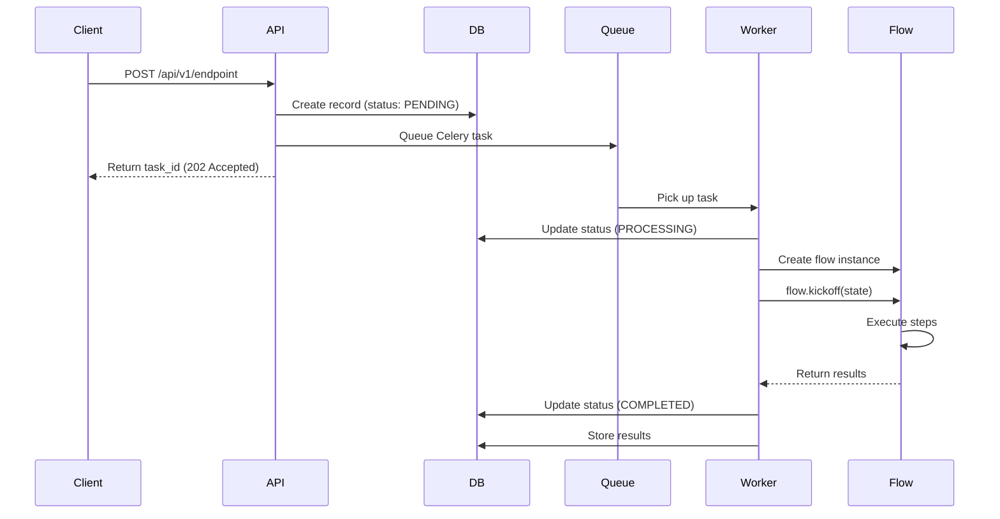
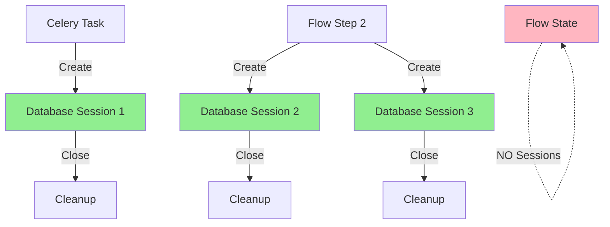
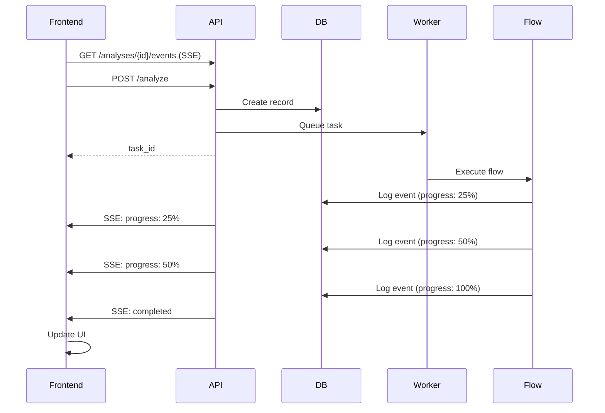
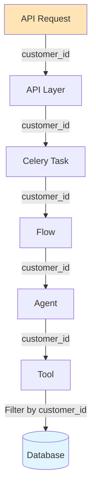

# Section 3: Integration Patterns

## Overview

This section covers how to integrate CrewAI flows into your enterprise application. We'll explore API integration, task queue patterns, database session management, and event-driven architecture.

## Pattern 1: API → Celery → Flow Integration

### High-Level Pattern

The standard pattern for integrating CrewAI flows into REST APIs:

1. **API Endpoint**: Receives request, validates, creates database record
2. **Queue Task**: Enqueues Celery task for async execution
3. **Celery Worker**: Picks up task, executes flow
4. **Flow Execution**: Runs CrewAI flow with state management
5. **Result Storage**: Stores results in database



### Step-by-Step Tutorial

#### Step 1: Create API Endpoint

```python
# src/api/routes/talent.py

from fastapi import APIRouter, Depends, HTTPException
from sqlalchemy.orm import Session
from typing import Optional

router = APIRouter(prefix="/api/v1/ml-talent", tags=["talent"])

@router.post("/analyze-from-connector")
async def analyze_from_connector(
    request: TalentAnalysisRequest,
    current_user: User = Depends(get_current_user),
    db: Session = Depends(get_db)
):
    """
    Queue talent analysis flow execution
    
    Returns immediately with task_id for status polling
    """
    # Generate unique analysis ID
    analysis_id = f"ml_ta_{uuid.uuid4().hex[:10]}"
    
    # Create database record
    analysis = TalentAnalysis(
        analysis_id=analysis_id,
        customer_id=current_user.customer_id,
        user_id=current_user.id,
        job_description=request.job_description,
        ideal_candidate_description=request.ideal_candidate_description,
        status=TalentAnalysisStatus.PENDING.value,
        started_at=datetime.utcnow()
    )
    db.add(analysis)
    db.commit()
    
    # Queue Celery task (non-blocking)
    task = run_talent_analysis_task.delay(
        customer_id=current_user.customer_id,
        analysis_id=analysis_id,
        job_description=request.job_description,
        ideal_candidate_description=request.ideal_candidate_description,
        user_id=current_user.id
    )
    
    # Return immediately (don't wait for task completion)
    return {
        "analysis_id": analysis_id,
        "status": "pending",
        "task_id": task.id,
        "message": "Analysis queued successfully"
    }
```

#### Step 2: Create Celery Task

```python
# src/tasks/talent_tasks.py

from celery import Task
from src.celery_app import celery_app
from src.models import database

class TalentAnalysisTask(Task):
    """Base task with database session management"""
    
    def __call__(self, *args, **kwargs):
        # Ensure database is initialized
        if database.SessionLocal is None:
            database.init_database()
        return super().__call__(*args, **kwargs)

@celery_app.task(
    base=TalentAnalysisTask,
    bind=True,
    name="talent.run_analysis",
    max_retries=3,
    default_retry_delay=60
)
def run_talent_analysis_task(
    self,
    customer_id: str,
    analysis_id: str,
    job_description: Optional[str] = None,
    ideal_candidate_description: Optional[str] = None,
    user_id: Optional[int] = None
):
    """
    Execute talent analysis flow
    
    This runs in a Celery worker, not in the API request thread
    """
    # Initialize database (CRITICAL: Do this in task, not in flow state)
    if database.SessionLocal is None:
        database.init_database()
    
    db = database.SessionLocal()
    
    try:
        # Update status
        analysis = db.query(TalentAnalysis).filter(
            TalentAnalysis.analysis_id == analysis_id
        ).first()
        
        if not analysis:
            raise ValueError(f"Analysis {analysis_id} not found")
        
        analysis.status = TalentAnalysisStatus.PROCESSING.value
        db.commit()
        
        # Log start event
        _log_event(
            db,
            analysis_id,
            event_type="analysis_started",
            message="AI agents are analyzing your requirements...",
            progress_percentage=0
        )
        
        # Import and create flow
        from src.flows.talent_intelligence_flow import TalentIntelligenceFlow
        
        flow = TalentIntelligenceFlow(
            customer_id=customer_id,
            analysis_id=analysis_id
        )
        
        # Execute flow
        results = flow.run(
            job_description=job_description,
            ideal_candidate_description=ideal_candidate_description
        )
        
        # Store results
        analysis.status = TalentAnalysisStatus.COMPLETED.value
        analysis.ideal_persona = results.get('ideal_persona')
        analysis.candidates = results.get('candidates', [])
        analysis.insights_report = results.get('insights_report')
        analysis.completed_at = datetime.utcnow()
        db.commit()
        
        # Log completion event
        _log_event(
            db,
            analysis_id,
            event_type="analysis_completed",
            message=f"Analysis complete! Found {len(results.get('candidates', []))} candidates.",
            progress_percentage=100
        )
        
        return {"success": True, "analysis_id": analysis_id}
        
    except Exception as e:
        # Handle errors
        logger.error("talent_analysis_failed", error=str(e), analysis_id=analysis_id)
        
        if db:
            analysis = db.query(TalentAnalysis).filter(
                TalentAnalysis.analysis_id == analysis_id
            ).first()
            if analysis:
                analysis.status = TalentAnalysisStatus.FAILED.value
                analysis.error_message = str(e)
                db.commit()
        
        # Retry if appropriate
        raise self.retry(exc=e, countdown=60)
        
    finally:
        # Always close database session
        if db:
            db.close()
```

#### Step 3: Status Polling Endpoint

```python
@router.get("/analyses/{analysis_id}")
async def get_analysis_status(
    analysis_id: str,
    current_user: User = Depends(get_current_user),
    db: Session = Depends(get_db)
):
    """Get analysis status and results"""
    analysis = db.query(TalentAnalysis).filter(
        TalentAnalysis.analysis_id == analysis_id,
        TalentAnalysis.customer_id == current_user.customer_id
    ).first()
    
    if not analysis:
        raise HTTPException(status_code=404, detail="Analysis not found")
    
    return {
        "analysis_id": analysis.analysis_id,
        "status": analysis.status,
        "created_at": analysis.started_at,
        "completed_at": analysis.completed_at,
        "results": {
            "ideal_persona": analysis.ideal_persona,
            "candidates": analysis.candidates,
            "insights_report": analysis.insights_report
        } if analysis.status == TalentAnalysisStatus.COMPLETED.value else None
    }
```

### Real-World Examples

#### Example 1: Talent Intelligence Flow Integration

```python
# src/api/routes/talent.py → src/tasks/talent_tasks.py

# API endpoint queues task
task = run_talent_analysis_task.delay(...)

# Celery worker executes flow
flow = TalentIntelligenceFlow(customer_id, analysis_id)
results = flow.run(...)
```

#### Example 2: Task Enrichment Flow Integration

```python
# src/tasks/business_intelligence_tasks.py

@celery_app.task(name="process_bi_question")
def process_bi_question(self, question_id: str, ...):
    """Processes BI question through enrichment flow"""
    
    # Create enrichment flow
    enrichment_flow = TaskEnrichmentFlow()
    enrichment_state = TaskEnrichmentFlowState(
        original_question=question.original_question,
        user_context=UserContext(...)
    )
    
    # Execute flow
    enrichment_flow.kickoff(enrichment_state.dict())
    
    # Get results from flow state
    enriched_prompt = enrichment_flow.state.enriched_prompt
```

#### Example 3: ML Engineer Matching Flow Integration

```python
# src/tasks/ml_matching_task.py

@celery_app.task(name="run_ml_matching_task")
def run_ml_matching_task(self, session_id: str, ...):
    """Runs ML engineer matching flow"""
    
    # Create flow
    flow = MLEngineerMatchingFlow()
    
    # Execute with initial state
    result = flow.kickoff({
        'session_id': session_id,
        'customer_id': customer_id,
        'job_description': job_description,
        ...
    })
    
    # Store results
    matching_session.status = 'completed'
    matching_session.results = result
    db.commit()
```

### Common Pitfalls

#### Pitfall: Blocking API Requests

**Problem:**
```python
# ❌ BAD: Blocking API request
@router.post("/analyze")
async def analyze(request: Request):
    # This blocks the API thread!
    results = flow.run(...)  # Takes 2+ minutes!
    return results
```

**Solution:**
```python
# ✅ GOOD: Queue task, return immediately
@router.post("/analyze")
async def analyze(request: Request):
    task = run_analysis_task.delay(...)  # Non-blocking
    return {"task_id": task.id, "status": "pending"}
```

#### Pitfall: Database Session in Flow State

**Problem:**
```python
# ❌ BAD: Session in state causes pickle errors
class FlowState(BaseModel):
    db_session: Session  # Can't be pickled by Celery!
```

**Solution:**
```python
# ✅ GOOD: Create session in task/flow method
def run_talent_analysis_task(self, ...):
    db = database.SessionLocal()  # Create in task
    try:
        flow = TalentIntelligenceFlow(...)
        # Flow creates its own sessions when needed
        results = flow.run(...)
    finally:
        db.close()
```

## Pattern 2: Database Session Management

### High-Level Pattern

Database sessions must be created locally in tasks and flow methods, never stored in flow state.



### Step-by-Step Tutorial

#### Step 1: Initialize Database in Task

```python
# src/tasks/my_task.py

from src.models import database  # Module import!

@celery_app.task(bind=True)
def my_task(self, customer_id: str):
    # CRITICAL: Check and initialize database
    if database.SessionLocal is None:
        database.init_database()
    
    # Create session
    db = database.SessionLocal()
    
    try:
        # Use database
        result = db.query(MyModel).filter(...).first()
        
        # Create flow (flow will create its own sessions)
        flow = MyFlow()
        results = flow.run(...)
        
        # Store results
        result.status = "completed"
        db.commit()
        
    finally:
        # Always close session
        db.close()
```

#### Step 2: Create Sessions in Flow Methods

```python
# src/flows/my_flow.py

from src.models import database  # Module import!

class MyFlow(Flow[MyFlowState]):
    @start()
    def first_step(self):
        # Create session for this step
        if database.SessionLocal is None:
            database.init_database()
        
        db = database.SessionLocal()
        try:
            # Query database
            data = db.query(MyModel).filter(...).all()
            
            # Use data in agent
            agent = Agent(...)
            task = Task(description=f"Process: {data}")
            # ...
            
        finally:
            db.close()
    
    @listen(first_step)
    def second_step(self):
        # Create NEW session for this step
        if database.SessionLocal is None:
            database.init_database()
        
        db = database.SessionLocal()
        try:
            # Use database
            # ...
        finally:
            db.close()
```

### Real-World Example: Task Enrichment Flow

```python
# src/crewai_flows/task_enrichment_flow.py

class TaskEnrichmentFlow(Flow[TaskEnrichmentFlowState]):
    def _get_complete_agent_config(self, agent_identifier: str):
        """Load agent configuration from database"""
        # CRITICAL: Create session locally
        from src.models import database
        
        if database.SessionLocal is None:
            database.init_database()
        
        db = database.SessionLocal()
        try:
            config_service = AgentConfigurationService(db)
            return config_service.get_complete_agent_config(
                customer_id=self.state.user_context.customer_id,
                flow_identifier="task_enrichment_flow",
                agent_identifier=agent_identifier
            )
        finally:
            db.close()  # Always close
```

### Critical Rules

#### Rule 1: Never Store Sessions in State

```python
# ❌ NEVER DO THIS
class FlowState(BaseModel):
    db_session: Session  # Causes pickle errors in Celery!
```

#### Rule 2: Always Use Module Imports

```python
# ✅ GOOD: Module import maintains reference
from src.models import database

if database.SessionLocal is None:
    database.init_database()
db = database.SessionLocal()

# ❌ BAD: Direct import creates local binding
from src.models.database import SessionLocal  # May not update!
```

#### Rule 3: Always Close Sessions

```python
# ✅ GOOD: Use try/finally
db = database.SessionLocal()
try:
    # Use db
    pass
finally:
    db.close()  # Always closes
```

### Common Pitfalls

#### Pitfall: Module Import Issue

**Problem:**
```python
# ❌ BAD: Direct import doesn't update
from src.models.database import SessionLocal, init_database

if SessionLocal is None:
    init_database()

db = SessionLocal()  # Still None! (local binding)
```

**Solution:**
```python
# ✅ GOOD: Module import maintains reference
from src.models import database

if database.SessionLocal is None:
    database.init_database()

db = database.SessionLocal()  # Works correctly!
```

## Pattern 3: Event-Driven Architecture with SSE

### High-Level Pattern

Use Server-Sent Events (SSE) to stream real-time updates to frontend clients.



### Step-by-Step Tutorial

#### Step 1: Log Events in Flow/Task

```python
# src/tasks/talent_tasks.py

def _log_event(
    db: Session,
    analysis_id: str,
    event_type: str,
    message: str,
    progress_percentage: int,
    data: Optional[Dict] = None
):
    """Log event for SSE streaming"""
    event = TalentAnalysisEvent(
        analysis_id=analysis_id,
        event_type=event_type,
        message=message,
        progress_percentage=progress_percentage,
        data=data or {}
    )
    db.add(event)
    db.commit()

@celery_app.task
def run_talent_analysis_task(self, ...):
    db = database.SessionLocal()
    try:
        # Log start
        _log_event(
            db, analysis_id,
            event_type="analysis_started",
            message="AI agents are analyzing...",
            progress_percentage=0
        )
        
        # Execute flow steps
        flow = TalentIntelligenceFlow(...)
        
        # After each major step, log progress
        _log_event(
            db, analysis_id,
            event_type="step_completed",
            message="Job analysis complete",
            progress_percentage=25
        )
        
        # Continue...
        
    finally:
        db.close()
```

#### Step 2: Create SSE Endpoint

```python
# src/api/routes/talent.py

from fastapi.responses import StreamingResponse
import json

@router.get("/analyses/{analysis_id}/events")
async def stream_analysis_events(
    analysis_id: str,
    current_user: User = Depends(get_current_user),
    db: Session = Depends(get_db)
):
    """Stream analysis events via SSE"""
    
    async def event_generator():
        # Send initial connection message
        yield f"data: {json.dumps({'type': 'connected', 'analysis_id': analysis_id})}\n\n"
        
        # Query for new events
        last_event_id = None
        
        while True:
            # Query database for new events
            query = db.query(TalentAnalysisEvent).filter(
                TalentAnalysisEvent.analysis_id == analysis_id
            )
            
            if last_event_id:
                query = query.filter(TalentAnalysisEvent.id > last_event_id)
            
            events = query.order_by(TalentAnalysisEvent.created_at).all()
            
            for event in events:
                yield f"data: {json.dumps({
                    'id': event.id,
                    'type': event.event_type,
                    'message': event.message,
                    'progress': event.progress_percentage,
                    'data': event.data
                })}\n\n"
                last_event_id = event.id
            
            # Check if analysis is complete
            analysis = db.query(TalentAnalysis).filter(
                TalentAnalysis.analysis_id == analysis_id
            ).first()
            
            if analysis and analysis.status in [
                TalentAnalysisStatus.COMPLETED.value,
                TalentAnalysisStatus.FAILED.value
            ]:
                yield f"data: {json.dumps({'type': 'complete'})}\n\n"
                break
            
            # Wait before next poll
            await asyncio.sleep(1)
    
    return StreamingResponse(
        event_generator(),
        media_type="text/event-stream",
        headers={
            "Cache-Control": "no-cache",
            "Connection": "keep-alive",
            "X-Accel-Buffering": "no"
        }
    )
```

#### Step 3: Frontend Integration

```typescript
// frontend/src/hooks/useTalentAnalysis.ts

const eventSource = new EventSource(
  `/api/v1/ml-talent/analyses/${analysisId}/events`
);

eventSource.onmessage = (event) => {
  const data = JSON.parse(event.data);
  
  switch (data.type) {
    case 'connected':
      console.log('SSE connected');
      break;
    case 'analysis_started':
      setProgress(0);
      setStatus('processing');
      break;
    case 'step_completed':
      setProgress(data.progress);
      addEvent(data.message);
      break;
    case 'complete':
      setProgress(100);
      setStatus('completed');
      eventSource.close();
      break;
  }
};
```

### Real-World Example: Talent Intelligence Flow Events

```python
# src/flows/talent_intelligence_flow.py

class TalentIntelligenceFlow(Flow[TalentAnalysisState]):
    def __init__(self, customer_id: str, analysis_id: str):
        super().__init__()
        self.customer_id = customer_id
        self.analysis_id = analysis_id
        
        # Flow can log events via database
        self.db = database.SessionLocal()
    
    def _log_event(self, event_type: str, message: str, progress: int):
        """Log event for SSE streaming"""
        event = TalentAnalysisEvent(
            analysis_id=self.analysis_id,
            event_type=event_type,
            message=message,
            progress_percentage=progress
        )
        self.db.add(event)
        self.db.commit()
    
    @start()
    def analyze_job(self):
        self._log_event("job_analysis_started", "Analyzing job description...", 10)
        # ... execute agent ...
        self._log_event("job_analysis_completed", "Job analysis complete", 25)
```

### Common Pitfalls

#### Pitfall: Not Closing SSE Connections

**Problem:**
```python
# ❌ BAD: SSE connection never closes
async def event_generator():
    while True:  # Infinite loop!
        yield "data: ...\n\n"
```

**Solution:**
```python
# ✅ GOOD: Close when complete
async def event_generator():
    while True:
        # ... yield events ...
        
        if analysis.status == "completed":
            yield "data: {\"type\": \"complete\"}\n\n"
            break  # Exit loop
```

## Pattern 4: Multi-Tenant Isolation

### High-Level Pattern

Ensure data isolation between customers/tenants at every layer.



### Step-by-Step Tutorial

#### Step 1: Pass Customer ID Through Layers

```python
# API Layer
@router.post("/analyze")
async def analyze(request: Request, current_user: User = Depends(get_current_user)):
    task = run_analysis_task.delay(
        customer_id=current_user.customer_id,  # Pass customer_id
        ...
    )

# Task Layer
@celery_app.task
def run_analysis_task(customer_id: str, ...):
    flow = MyFlow(customer_id=customer_id)  # Pass to flow
    results = flow.run(...)

# Flow Layer
class MyFlow(Flow[MyFlowState]):
    def __init__(self, customer_id: str):
        super().__init__()
        self.customer_id = customer_id
        
        # Initialize tool with customer_id
        self.document_tool = DocumentSearchTool(
            customer_id=customer_id  # Pass to tool
        )

# Tool Layer
class DocumentSearchTool(BaseTool):
    customer_id: str = Field(description="Customer ID")
    
    def _run(self, query: str) -> str:
        # Filter by customer_id
        results = vector_service.search(
            query=query,
            customer_id=self.customer_id  # Filter in query
        )
```

#### Step 2: Use company_hr_dataset for Data Filtering

```python
# ✅ GOOD: Use company_hr_dataset for document filtering
class DocumentSearchTool(BaseTool):
    customer_id: str = Field(description="Who owns the data")
    company_hr_dataset: Optional[str] = Field(
        None, 
        description="Which company's data to search"
    )
    
    def _run(self, query: str) -> str:
        # CRITICAL: Use company_hr_dataset, NOT customer_id
        results = vector_service.search_similar_chunks(
            query=query,
            company_hr_dataset=self.company_hr_dataset or self.customer_id
        )
```

### Real-World Example: Multi-Tenant Tool Usage

```python
# src/crewai_custom_tools/document_search_tool.py

class DocumentSearchTool(BaseTool):
    customer_id: str = Field(description="Customer ID for audit/ownership")
    company_hr_dataset: Optional[str] = Field(
        None, 
        description="Target company for document index"
    )
    
    def _run(self, query: str) -> str:
        # Use company_hr_dataset for filtering
        # customer_id is for audit/ownership tracking
        results = await vector_service.search_similar_chunks(
            query=query,
            company_hr_dataset=self.company_hr_dataset or self.customer_id,
            limit=self.limit
        )
```

### Common Pitfalls

#### Pitfall: Filtering by Wrong Field

**Problem:**
```python
# ❌ BAD: Filtering by customer_id filters out cross-company docs
results = await vector_service.search_similar_chunks(
    query=query,
    customer_id=self.customer_id  # Wrong! Use company_hr_dataset
)
```

**Solution:**
```python
# ✅ GOOD: Use company_hr_dataset for data filtering
results = await vector_service.search_similar_chunks(
    query=query,
    company_hr_dataset=self.company_hr_dataset  # Correct!
)
```

## Summary

These integration patterns connect CrewAI flows to your application:

1. **API → Celery → Flow**: Queue flows for async execution
2. **Database Session Management**: Create sessions locally, never in state
3. **Event-Driven Architecture**: Stream updates via SSE
4. **Multi-Tenant Isolation**: Pass customer_id through all layers

Next, we'll cover containerization and deployment.


