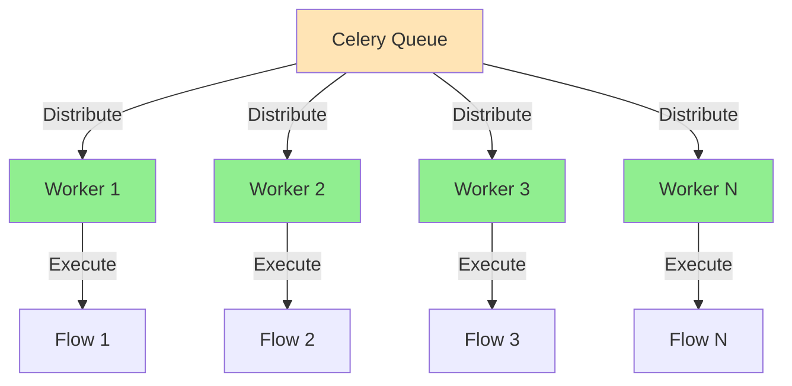
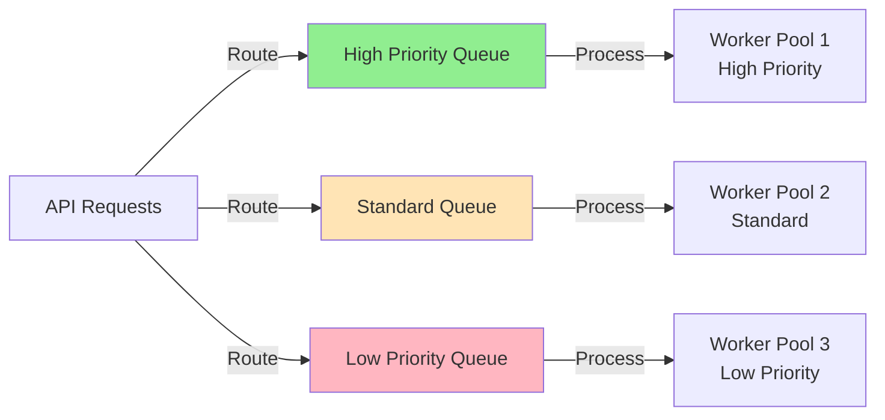
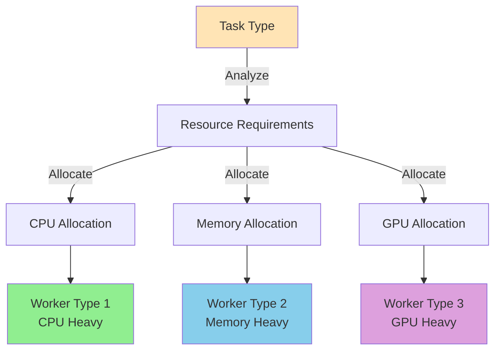
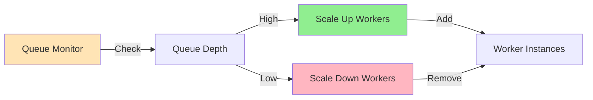

# Section 5: Scalability Strategies

## Overview

This section covers scaling CrewAI applications horizontally, managing queues, allocating resources, and handling increased load.

## Pattern 1: Horizontal Scaling

### High-Level Pattern

Scale workers horizontally to handle increased load. Celery automatically distributes tasks across available workers.



### Step-by-Step Tutorial

#### Step 1: Scale Workers with Docker Compose

```bash
# Scale celery-worker service
docker-compose up -d --scale celery-worker=4

# This creates 4 worker instances
# Celery automatically distributes tasks across them
```

#### Step 2: Configure Worker Concurrency

```yaml
# docker/docker-compose.yml

services:
  celery-worker:
    command: celery -A src.celery_app worker \
      --loglevel=info \
      --concurrency=4 \  # 4 concurrent tasks per worker
      --max-tasks-per-child=100  # Restart worker after 100 tasks
```

#### Step 3: Monitor Worker Distribution

```python
# Check active workers
from celery import current_app

# Get active workers
inspect = current_app.control.inspect()
active_workers = inspect.active()

# Check queue lengths
reserved = inspect.reserved()
scheduled = inspect.scheduled()
```

### Real-World Example: Eliza Platform Scaling

```yaml
# docker/docker-compose.yml

services:
  celery-worker:
    command: celery -A src.celery_app worker \
      --loglevel=info \
      --concurrency=4 \
      --max-tasks-per-child=100
    deploy:
      replicas: 4  # Kubernetes/Docker Swarm
      resources:
        limits:
          cpus: '2.0'
          memory: 3G
```

### Common Pitfalls

#### Pitfall: Too High Concurrency

**Problem:**
```bash
# ❌ BAD: Too many concurrent tasks cause memory issues
celery worker --concurrency=50  # Each task uses memory!
```

**Solution:**
```bash
# ✅ GOOD: Balance concurrency with available memory
celery worker --concurrency=4  # 4 tasks × ~500MB = ~2GB per worker
```

## Pattern 2: Queue Management

### High-Level Pattern

Use separate queues for different task types to prioritize and isolate workloads.



### Step-by-Step Tutorial

#### Step 1: Define Queue Routes

```python
# src/celery_app.py

from celery import Celery

celery_app = Celery("ai_enablement")

# Configure queue routes
celery_app.conf.task_routes = {
    'talent.run_analysis': {'queue': 'talent'},
    'process_bi_question': {'queue': 'bi'},
    'run_ml_matching_task': {'queue': 'matching'},
    'default': {'queue': 'default'}
}
```

#### Step 2: Create Dedicated Workers

```bash
# Start worker for specific queue
celery -A src.celery_app worker \
  --loglevel=info \
  --queues=talent \
  --concurrency=4

# Start worker for multiple queues
celery -A src.celery_app worker \
  --loglevel=info \
  --queues=talent,bi \
  --concurrency=4
```

#### Step 3: Monitor Queue Depths

```python
# Check queue lengths
from celery import current_app

inspect = current_app.control.inspect()

# Get queue stats
active_queues = inspect.active_queues()

# Check specific queue
queue_length = celery_app.connection().default_channel.queue_declare(
    queue='talent',
    passive=True
).method.message_count
```

### Real-World Example: Queue Configuration

```python
# src/celery_app.py

celery_app.conf.task_routes = {
    # High priority: Talent analysis
    'talent.run_analysis': {'queue': 'talent'},
    
    # Standard: BI questions
    'process_bi_question': {'queue': 'bi'},
    
    # Background: ML matching
    'run_ml_matching_task': {'queue': 'matching'},
    
    # Default queue
    'default': {'queue': 'default'}
}

# Queue priorities
celery_app.conf.task_queue_max_priority = 10
```

## Pattern 3: Resource Allocation

### High-Level Pattern

Allocate resources based on task requirements and worker capabilities.



### Step-by-Step Tutorial

#### Step 1: Configure Resource Limits

```yaml
# docker/docker-compose.yml

services:
  celery-worker:
    deploy:
      resources:
        limits:
          cpus: '2.0'      # Max 2 CPUs
          memory: 3G        # Max 3GB RAM
        reservations:
          cpus: '1.0'       # Guaranteed 1 CPU
          memory: 1.5G      # Guaranteed 1.5GB RAM
```

#### Step 2: Set Task Timeouts

```python
# src/celery_app.py

celery_app.conf.task_time_limit = 600  # 10 minutes hard limit
celery_app.conf.task_soft_time_limit = 540  # 9 minutes soft limit

# Per-task timeout
@celery_app.task(
    bind=True,
    time_limit=600,  # 10 minutes
    soft_time_limit=540  # 9 minutes
)
def long_running_task(self, ...):
    # Task will be killed after time_limit
    # Soft limit allows cleanup
    pass
```

#### Step 3: Monitor Resource Usage

```python
# Check worker stats
from celery import current_app

inspect = current_app.control.inspect()
stats = inspect.stats()

# Each worker returns stats like:
# {
#   'worker1': {
#     'pool': {'max-concurrency': 4},
#     'rusage': {'utime': 123.45, 'stime': 67.89},
#     'total': {'tasks': 100}
#   }
# }
```

### Real-World Example: Resource Configuration

```yaml
# docker/docker-compose.yml

services:
  celery-worker:
    deploy:
      resources:
        limits:
          cpus: '2.0'
          memory: 3G
        reservations:
          cpus: '1.0'
          memory: 1.5G
    healthcheck:
      test: ["CMD", "curl", "-f", "http://app:5001/health/ready"]
```

## Pattern 4: Auto-Scaling Patterns

### High-Level Pattern

Dynamically scale workers based on queue depth and load.



### Step-by-Step Tutorial

#### Step 1: Create Monitoring Script

```python
# scripts/monitor_queues.py

import redis
from celery import Celery

def check_queue_depth(queue_name: str, threshold: int = 100) -> bool:
    """Check if queue depth exceeds threshold"""
    r = redis.from_url("redis://localhost:6379/0")
    
    # Get queue length
    queue_length = r.llen(f"celery")  # Default queue prefix
    
    return queue_length > threshold

def scale_workers(action: str, count: int = 1):
    """Scale workers up or down"""
    if action == "up":
        # Add workers (implementation depends on orchestrator)
        print(f"Scaling up: +{count} workers")
    elif action == "down":
        # Remove workers
        print(f"Scaling down: -{count} workers")
```

#### Step 2: Implement Auto-Scaling Logic

```python
# scripts/auto_scaler.py

import time
from monitor_queues import check_queue_depth, scale_workers

def auto_scale_loop():
    """Continuously monitor and scale"""
    while True:
        if check_queue_depth("talent", threshold=50):
            # Queue is backed up, scale up
            scale_workers("up", count=2)
        elif check_queue_depth("talent", threshold=10):
            # Queue is empty, scale down
            scale_workers("down", count=1)
        
        time.sleep(60)  # Check every minute
```

### Common Pitfalls

#### Pitfall: Scaling Too Aggressively

**Problem:**
```python
# ❌ BAD: Scales up immediately on any queue depth
if queue_depth > 0:
    scale_up()  # Creates too many workers!
```

**Solution:**
```python
# ✅ GOOD: Scale based on thresholds and rate of change
if queue_depth > threshold and queue_growth_rate > 0:
    scale_up()  # Only if queue is growing
```

## Summary

Scalability strategies:

1. **Horizontal Scaling**: Add more worker instances
2. **Queue Management**: Separate queues by priority/type
3. **Resource Allocation**: Set appropriate limits and timeouts
4. **Auto-Scaling**: Dynamically adjust worker count based on load

Next, we'll cover monitoring and observability.


