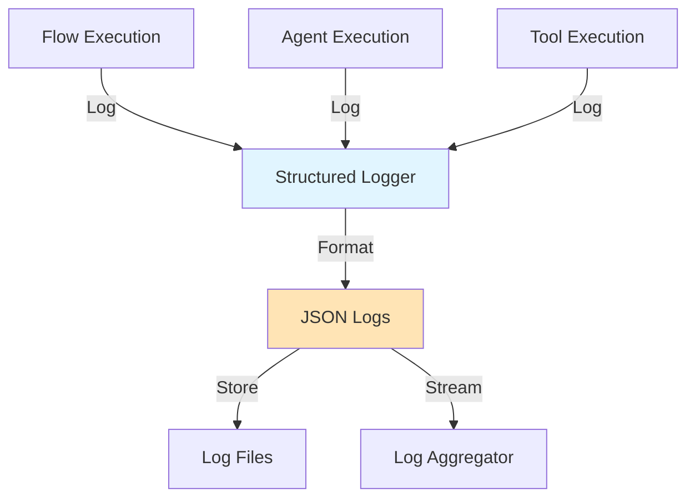
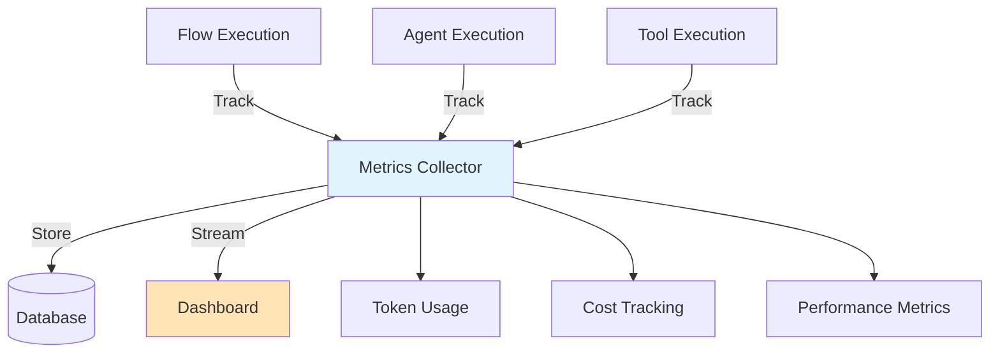
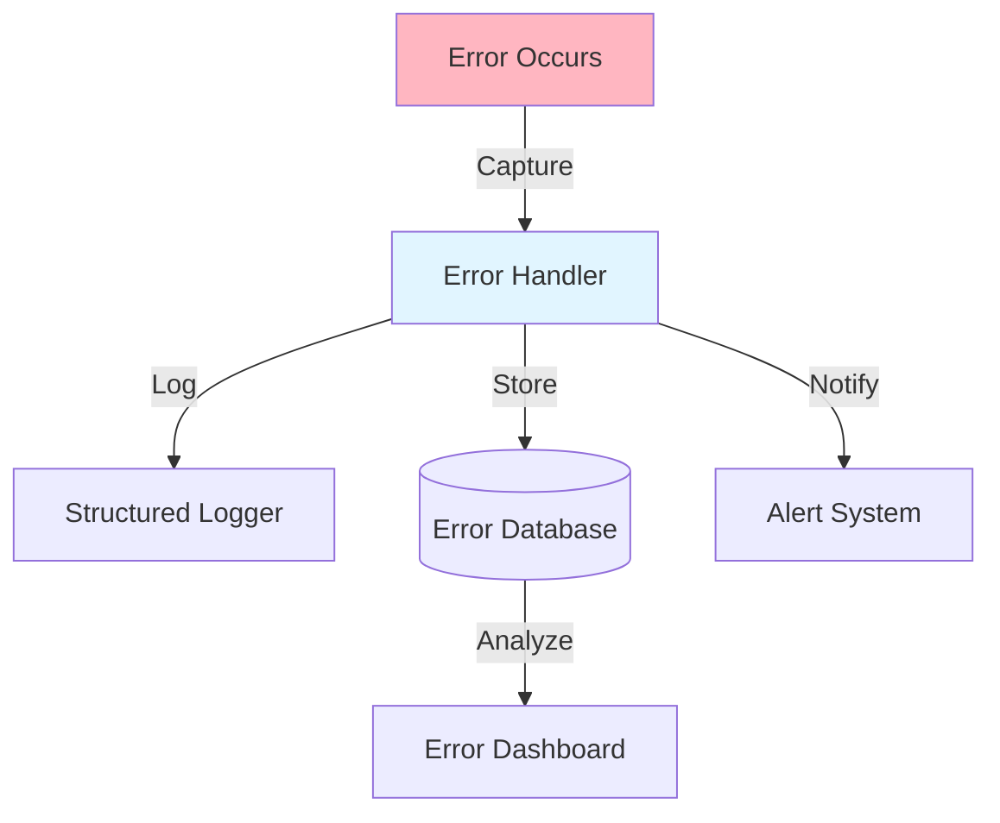
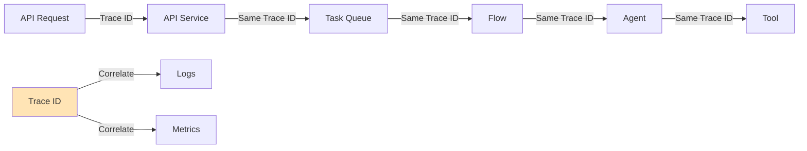

# Section 6: Monitoring and Observability

## Overview

This section covers monitoring CrewAI applications, including structured logging, metrics collection, distributed tracing, and error tracking.

## Pattern 1: Structured Logging

### High-Level Pattern

Use structured logging to capture agent execution details, flow state transitions, and system events.



### Step-by-Step Tutorial

#### Step 1: Configure Structured Logging

```python
# src/core/logging.py

import structlog
import logging
from typing import Dict, Any

def configure_logging():
    """Configure structured logging"""
    structlog.configure(
        processors=[
            structlog.stdlib.filter_by_level,
            structlog.stdlib.add_logger_name,
            structlog.stdlib.add_log_level,
            structlog.stdlib.PositionalArgumentsFormatter(),
            structlog.processors.TimeStamper(fmt="iso"),
            structlog.processors.StackInfoRenderer(),
            structlog.processors.format_exc_info,
            structlog.processors.UnicodeDecoder(),
            structlog.processors.JSONRenderer()  # JSON output
        ],
        context_class=dict,
        logger_factory=structlog.stdlib.LoggerFactory(),
        wrapper_class=structlog.stdlib.BoundLogger,
        cache_logger_on_first_use=True,
    )

# Get logger
def get_logger(name: str, component: str = "application") -> structlog.BoundLogger:
    return structlog.get_logger(name).bind(component=component)
```

#### Step 2: Log in Flow Steps

```python
# src/flows/my_flow.py

from src.core.logging import get_logger

logger = get_logger(__name__, component="talent_flow")

class MyFlow(Flow[MyFlowState]):
    @start()
    def first_step(self):
        logger.info(
            "flow_step_started",
            step="first_step",
            analysis_id=self.state.analysis_id,
            customer_id=self.state.customer_id
        )
        
        try:
            # Execute agent...
            result = agent.execute()
            
            logger.info(
                "flow_step_completed",
                step="first_step",
                analysis_id=self.state.analysis_id,
                result_count=len(result)
            )
        except Exception as e:
            logger.error(
                "flow_step_failed",
                step="first_step",
                analysis_id=self.state.analysis_id,
                error=str(e),
                exc_info=True
            )
            raise
```

#### Step 3: Log Agent Execution

```python
# In agent execution

logger.info(
    "agent_execution_started",
    agent_role="Job Analyst",
    analysis_id=self.state.analysis_id,
    input_length=len(self.state.job_description)
)

# After agent completes
logger.info(
    "agent_execution_completed",
    agent_role="Job Analyst",
    analysis_id=self.state.analysis_id,
    tokens_used=result.usage.total_tokens,
    cost_usd=calculate_cost(result.usage)
)
```

### Real-World Example: Eliza Platform Logging

```python
# src/core/logging.py

logger = structlog.get_logger(__name__)

# In talent task
logger.info(
    "talent_analysis_starting",
    analysis_id=analysis_id,
    customer_id=customer_id,
    task_id=self.request.id,
    has_job_description=bool(job_description)
)
```

### Common Pitfalls

#### Pitfall: Unstructured Logging

**Problem:**
```python
# ❌ BAD: Unstructured logs are hard to parse
print(f"Analysis {analysis_id} started for customer {customer_id}")
```

**Solution:**
```python
# ✅ GOOD: Structured logs with consistent fields
logger.info(
    "talent_analysis_starting",
    analysis_id=analysis_id,
    customer_id=customer_id
)
```

## Pattern 2: Metrics Collection

### High-Level Pattern

Track performance metrics, costs, and system health.



### Step-by-Step Tutorial

#### Step 1: Define Metrics Model

```python
# src/models/metrics.py

from sqlalchemy import Column, Integer, Float, String, DateTime
from src.models.database import BaseModel

class FlowExecutionMetrics(BaseModel):
    """Track flow execution metrics"""
    __tablename__ = "flow_execution_metrics"
    
    flow_id: str = Column(String(100), index=True)
    flow_type: str = Column(String(50))
    customer_id: str = Column(String(100), index=True)
    
    # Performance metrics
    duration_seconds: float = Column(Float)
    steps_completed: int = Column(Integer)
    steps_failed: int = Column(Integer)
    
    # Cost metrics
    total_tokens: int = Column(Integer)
    cost_usd: float = Column(Float)
    
    # Status
    status: str = Column(String(50))
    error_message: str = Column(String(1000), nullable=True)
    
    started_at: datetime = Column(DateTime)
    completed_at: datetime = Column(DateTime, nullable=True)
```

#### Step 2: Track Metrics in Flow

```python
# src/flows/my_flow.py

from datetime import datetime

class MyFlow(Flow[MyFlowState]):
    def __init__(self):
        super().__init__()
        self.start_time = datetime.now()
        self.token_count = 0
        self.cost_usd = 0.0
    
    @start()
    def first_step(self):
        step_start = datetime.now()
        
        # Execute agent
        result = crew.kickoff()
        
        # Track metrics
        self.token_count += result.usage.total_tokens
        self.cost_usd += calculate_cost(result.usage)
        
        step_duration = (datetime.now() - step_start).total_seconds()
        logger.info(
            "step_metrics",
            step="first_step",
            duration_seconds=step_duration,
            tokens_used=result.usage.total_tokens,
            cost_usd=calculate_cost(result.usage)
        )
    
    def finalize_metrics(self):
        """Store final metrics"""
        total_duration = (datetime.now() - self.start_time).total_seconds()
        
        # Store in database
        metrics = FlowExecutionMetrics(
            flow_id=self.state.analysis_id,
            flow_type="talent_intelligence",
            customer_id=self.state.customer_id,
            duration_seconds=total_duration,
            total_tokens=self.token_count,
            cost_usd=self.cost_usd,
            status="completed"
        )
        db.add(metrics)
        db.commit()
```

#### Step 3: Query Metrics

```python
# src/api/routes/metrics.py

@router.get("/metrics/flows")
async def get_flow_metrics(
    customer_id: str = Query(...),
    days: int = Query(default=7),
    db: Session = Depends(get_db)
):
    """Get flow execution metrics"""
    since = datetime.now() - timedelta(days=days)
    
    metrics = db.query(FlowExecutionMetrics).filter(
        FlowExecutionMetrics.customer_id == customer_id,
        FlowExecutionMetrics.started_at >= since
    ).all()
    
    return {
        "total_executions": len(metrics),
        "average_duration": sum(m.duration_seconds for m in metrics) / len(metrics),
        "total_cost": sum(m.cost_usd for m in metrics),
        "total_tokens": sum(m.total_tokens for m in metrics)
    }
```

### Real-World Example: Cost Tracking

```python
# Track costs in flow execution

class TalentIntelligenceFlow(Flow[TalentAnalysisState]):
    def __init__(self):
        super().__init__()
        self.total_cost_usd = 0.0
    
    def _calculate_cost(self, usage) -> float:
        """Calculate cost based on model and tokens"""
        # Pricing per 1K tokens
        pricing = {
            "gpt-4o-mini": {"input": 0.15, "output": 0.60},
            "gpt-4o": {"input": 2.50, "output": 10.00}
        }
        
        model = self.llm.model
        if model in pricing:
            cost = (
                usage.prompt_tokens / 1000 * pricing[model]["input"] +
                usage.completion_tokens / 1000 * pricing[model]["output"]
            )
            return cost
        return 0.0
```

## Pattern 3: Error Tracking

### High-Level Pattern

Track and analyze errors for debugging and improvement.



### Step-by-Step Tutorial

#### Step 1: Capture Errors in Tasks

```python
# src/tasks/talent_tasks.py

@celery_app.task(bind=True, max_retries=3)
def run_talent_analysis_task(self, ...):
    db = database.SessionLocal()
    try:
        # Execute flow
        flow = TalentIntelligenceFlow(...)
        results = flow.run(...)
        
    except Exception as e:
        # Log error with context
        logger.error(
            "talent_analysis_failed",
            analysis_id=analysis_id,
            customer_id=customer_id,
            error=str(e),
            error_type=type(e).__name__,
            exc_info=True
        )
        
        # Store error in database
        analysis = db.query(TalentAnalysis).filter(...).first()
        if analysis:
            analysis.status = TalentAnalysisStatus.FAILED.value
            analysis.error_message = str(e)
            db.commit()
        
        # Retry if appropriate
        raise self.retry(exc=e, countdown=60)
    
    finally:
        db.close()
```

#### Step 2: Track Error Patterns

```python
# src/models/errors.py

class ErrorLog(BaseModel):
    """Track errors for analysis"""
    __tablename__ = "error_logs"
    
    error_id: str = Column(String(100), primary_key=True)
    flow_type: str = Column(String(50))
    error_type: str = Column(String(100))
    error_message: str = Column(String(5000))
    
    customer_id: str = Column(String(100))
    analysis_id: str = Column(String(100), nullable=True)
    
    occurred_at: datetime = Column(DateTime)
    resolved: bool = Column(Boolean, default=False)
```

## Pattern 4: Distributed Tracing

### High-Level Pattern

Track requests across services and components.



### Step-by-Step Tutorial

#### Step 1: Generate Trace IDs

```python
# src/core/tracing.py

import uuid
from contextvars import ContextVar

trace_id_var: ContextVar[str] = ContextVar('trace_id', default=None)

def get_trace_id() -> str:
    """Get or create trace ID"""
    trace_id = trace_id_var.get()
    if trace_id is None:
        trace_id = str(uuid.uuid4())
        trace_id_var.set(trace_id)
    return trace_id

def set_trace_id(trace_id: str):
    """Set trace ID"""
    trace_id_var.set(trace_id)
```

#### Step 2: Include Trace ID in Logs

```python
# In API endpoint
@router.post("/analyze")
async def analyze(request: Request):
    trace_id = get_trace_id()
    
    logger.info(
        "analysis_requested",
        trace_id=trace_id,
        customer_id=current_user.customer_id
    )
    
    # Pass trace_id to task
    task = run_analysis_task.delay(
        trace_id=trace_id,
        ...
    )

# In task
@celery_app.task
def run_analysis_task(trace_id: str, ...):
    set_trace_id(trace_id)  # Set for this context
    
    logger.info(
        "task_started",
        trace_id=trace_id,
        task_id=self.request.id
    )
```

## Summary

Monitoring and observability patterns:

1. **Structured Logging**: Consistent JSON logs with context
2. **Metrics Collection**: Track performance, costs, and usage
3. **Error Tracking**: Capture and analyze errors
4. **Distributed Tracing**: Correlate logs across services

Next, we'll cover optimization strategies.


