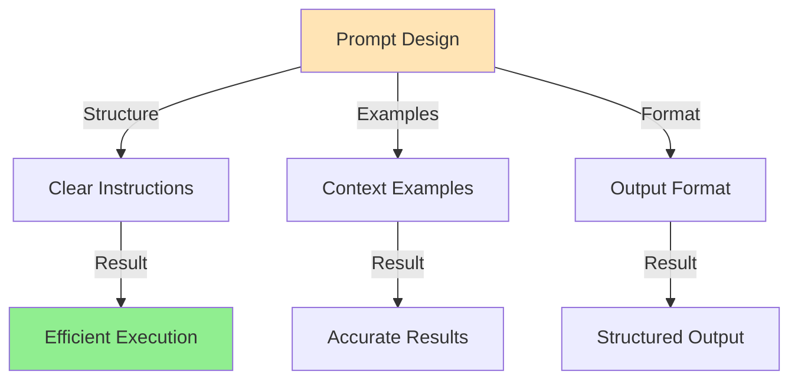
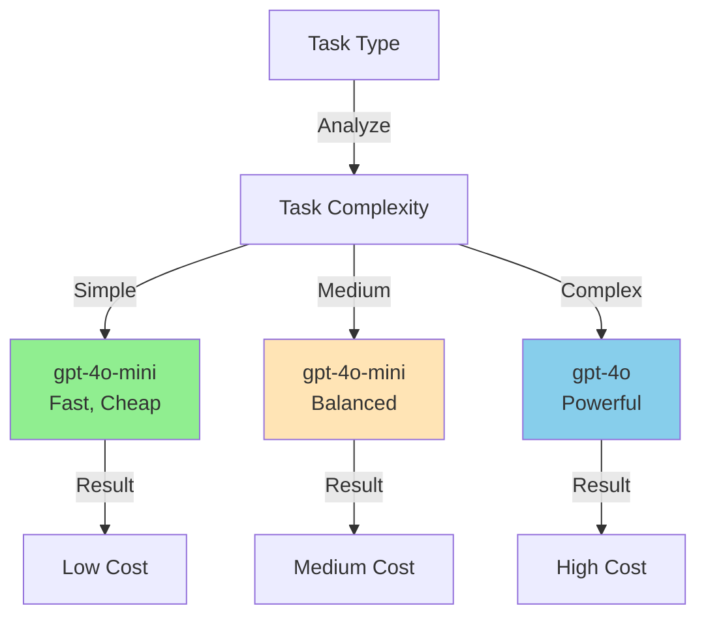
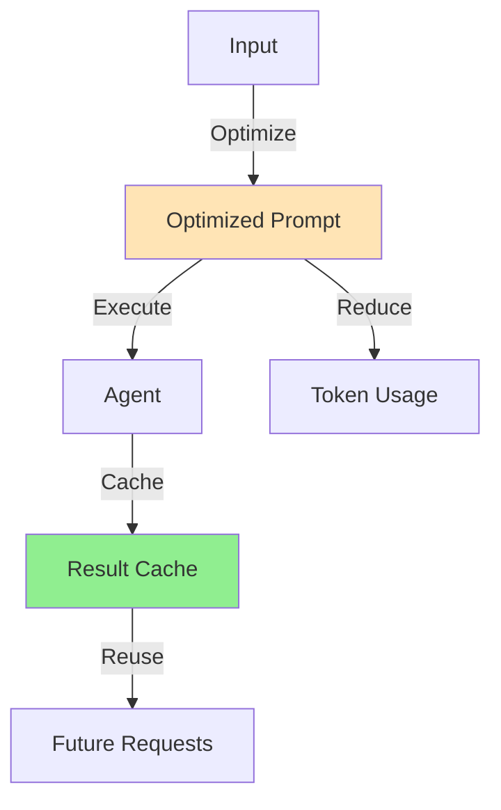
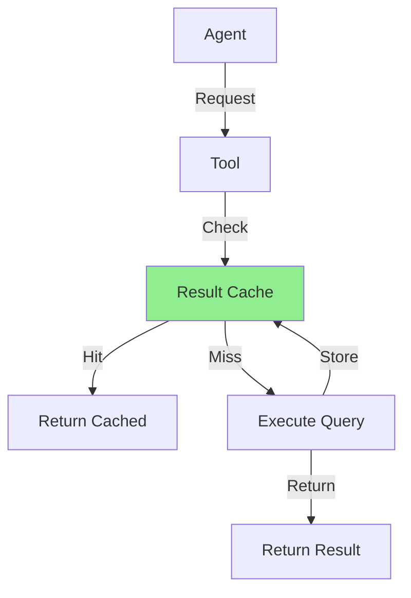

# Section 7: Optimization Strategies

## Overview

This section covers optimizing CrewAI applications for performance and cost, including prompt engineering, model selection, token optimization, and caching strategies.

## Pattern 1: Prompt Engineering

### High-Level Pattern

Well-structured prompts reduce token usage and improve agent performance.



### Step-by-Step Tutorial

#### Step 1: Structure Prompts Clearly

```python
# ✅ GOOD: Clear, structured prompt
task = Task(
    description=f"""
    Analyze the following job description and extract key requirements.
    
    Job Description:
    {job_description}
    
    Provide your analysis as a JSON object with these fields:
    - required_skills: List[str] - Must-have technical skills
    - nice_to_have_skills: List[str] - Nice-to-have skills
    - experience_years: int - Required years of experience
    - education_level: str - Required education level
    - cultural_fit: List[str] - Cultural fit indicators
    
    Be specific and extract only information explicitly stated or strongly implied.
    """,
    expected_output="JSON object with extracted requirements",
    agent=self.job_analyst
)

# ❌ BAD: Vague, unstructured prompt
task = Task(
    description=f"Analyze this: {job_description}",
    agent=self.job_analyst
)
```

#### Step 2: Use Examples When Helpful

```python
# ✅ GOOD: Include examples for complex tasks
task = Task(
    description=f"""
    Classify the following user query into one of these intent types:
    - question_answering: Simple factual questions
    - data_analysis: Requests for data analysis or reports
    - recommendation: Requests for recommendations
    - comparison: Requests to compare options
    
    Examples:
    - "What is our hiring policy?" → question_answering
    - "Show me employee retention trends" → data_analysis
    - "Who should we hire?" → recommendation
    - "Compare Python vs Java developers" → comparison
    
    User Query: {user_query}
    
    Return JSON: {{"intent_type": "...", "confidence": 0.0-1.0}}
    """,
    expected_output="JSON object with intent classification",
    agent=self.intent_analyzer
)
```

#### Step 3: Specify Output Format

```python
# ✅ GOOD: Explicit output format
task = Task(
    description=f"""
    Analyze job description and return structured data.
    
    Input: {job_description}
    
    Output format (JSON):
    {{
        "required_skills": ["skill1", "skill2"],
        "experience_years": 5,
        "education_level": "Bachelor's",
        "cultural_fit": ["indicator1", "indicator2"]
    }}
    """,
    expected_output="JSON object matching the specified format",
    agent=self.analyst
)
```

### Real-World Example: Talent Intelligence Flow

```python
# src/flows/talent_intelligence_flow.py

analysis_task = Task(
    description=f"""
    Analyze the following job description and extract key requirements:
    
    Job Description:
    {self.state.job_description}
    
    Ideal Candidate Description:
    {self.state.ideal_candidate_description}
    
    Extract and structure:
    1. Required technical skills (must-have vs nice-to-have)
    2. Experience requirements (years, level)
    3. Education requirements
    4. Cultural fit indicators
    5. Success factors
    
    Return as JSON with clear structure.
    """,
    expected_output="JSON object with extracted requirements",
    agent=self.job_analyst
)
```

### Common Pitfalls

#### Pitfall: Overly Verbose Prompts

**Problem:**
```python
# ❌ BAD: Too much context, wastes tokens
task = Task(
    description=f"""
    [500 words of background context]
    [Another 300 words of explanation]
    [100 words of examples]
    
    Now analyze: {input}
    """
)
```

**Solution:**
```python
# ✅ GOOD: Concise but complete
task = Task(
    description=f"""
    Analyze: {input}
    
    Extract: skills, experience, education
    Format: JSON
    """
)
```

## Pattern 2: Model Selection

### High-Level Pattern

Choose models based on task complexity and cost requirements.



### Step-by-Step Tutorial

#### Step 1: Match Model to Task

```python
# Simple extraction tasks → use mini model
simple_llm = LLM(
    model="gpt-4o-mini",
    temperature=0.2  # Low temperature for consistency
)

# Complex reasoning → use larger model
complex_llm = LLM(
    model="gpt-4o",
    temperature=0.3
)

# Agent selection
simple_agent = Agent(
    role="Data Extractor",
    goal="Extract structured data",
    llm=simple_llm  # Use mini for simple tasks
)

complex_agent = Agent(
    role="Strategic Analyst",
    goal="Provide strategic insights",
    llm=complex_llm  # Use larger model for complex reasoning
)
```

#### Step 2: Configure Temperature

```python
# Low temperature for consistent, deterministic outputs
extraction_agent = Agent(
    role="Data Extractor",
    llm=LLM(model="gpt-4o-mini", temperature=0.1)  # Very consistent
)

# Medium temperature for balanced creativity
analysis_agent = Agent(
    role="Analyst",
    llm=LLM(model="gpt-4o-mini", temperature=0.3)  # Balanced
)

# Higher temperature for creative tasks
synthesis_agent = Agent(
    role="Creative Synthesizer",
    llm=LLM(model="gpt-4o-mini", temperature=0.5)  # More creative
)
```

### Real-World Example: Model Selection in Flows

```python
# src/flows/talent_intelligence_flow.py

class TalentIntelligenceFlow(Flow[TalentAnalysisState]):
    def _create_job_analyst(self) -> Agent:
        """Extraction task → use mini model"""
        return Agent(
            role="Job Analyst",
            llm=LLM(
                model="gpt-4o-mini",  # Fast, cheap for extraction
                temperature=0.3
            )
        )
    
    def _create_insights_synthesizer(self) -> Agent:
        """Complex synthesis → could use larger model"""
        return Agent(
            role="Insights Synthesizer",
            llm=LLM(
                model="gpt-4o-mini",  # Still mini for cost control
                temperature=0.5  # Higher for creativity
            )
        )
```

### Common Pitfalls

#### Pitfall: Using Large Models for Simple Tasks

**Problem:**
```python
# ❌ BAD: Expensive model for simple extraction
agent = Agent(
    role="Extractor",
    llm=LLM(model="gpt-4o")  # Overkill, expensive!
)
```

**Solution:**
```python
# ✅ GOOD: Appropriate model for task
agent = Agent(
    role="Extractor",
    llm=LLM(model="gpt-4o-mini")  # Fast, cheap, sufficient
)
```

## Pattern 3: Token Optimization

### High-Level Pattern

Reduce token usage through prompt optimization and result caching.



### Step-by-Step Tutorial

#### Step 1: Minimize Prompt Length

```python
# ✅ GOOD: Concise prompt
task = Task(
    description=f"""
    Extract from: {job_description}
    
    Fields: skills, experience, education
    Format: JSON
    """,
    agent=agent
)

# ❌ BAD: Verbose prompt
task = Task(
    description=f"""
    Please analyze the following job description carefully.
    I want you to extract all the important information.
    [200 more words of instructions]
    
    Job Description:
    {job_description}
    
    [More verbose instructions]
    """,
    agent=agent
)
```

#### Step 2: Cache Expensive Operations

```python
# src/core/cache.py

from functools import lru_cache
import hashlib
import json

def cache_key(data: dict) -> str:
    """Generate cache key from data"""
    return hashlib.md5(json.dumps(data, sort_keys=True).encode()).hexdigest()

@lru_cache(maxsize=100)
def cached_analysis(job_description: str) -> dict:
    """Cache analysis results"""
    # Expensive analysis operation
    return perform_analysis(job_description)

# Use in flow
class MyFlow(Flow[MyFlowState]):
    @start()
    def analyze_step(self):
        # Check cache first
        cache_key = cache_key({"jd": self.state.job_description})
        cached_result = get_from_cache(cache_key)
        
        if cached_result:
            self.state.analysis_result = cached_result
            return
        
        # Perform analysis
        result = agent.execute()
        
        # Cache result
        set_cache(cache_key, result, ttl=3600)  # 1 hour TTL
        self.state.analysis_result = result
```

### Real-World Example: Token Tracking

```python
# Track token usage in flow execution

class TalentIntelligenceFlow(Flow[TalentAnalysisState]):
    def __init__(self):
        super().__init__()
        self.total_tokens = 0
    
    def _track_tokens(self, result):
        """Track token usage"""
        self.total_tokens += result.usage.total_tokens
        
        logger.info(
            "token_usage",
            step="current_step",
            tokens_used=result.usage.total_tokens,
            total_tokens=self.total_tokens
        )
```

## Pattern 4: Tool Optimization

### High-Level Pattern

Optimize tool usage to reduce calls and improve efficiency.



### Step-by-Step Tutorial

#### Step 1: Implement Tool Caching

```python
# src/crewai_custom_tools/document_search_tool.py

from functools import lru_cache
import hashlib

class DocumentSearchTool(BaseTool):
    def _run(self, query: str) -> str:
        # Generate cache key
        cache_key = hashlib.md5(
            f"{query}:{self.company_hr_dataset}:{self.limit}".encode()
        ).hexdigest()
        
        # Check cache
        cached_result = redis_client.get(f"tool:docsearch:{cache_key}")
        if cached_result:
            return cached_result
        
        # Execute search
        results = await vector_service.search_similar_chunks(
            query=query,
            company_hr_dataset=self.company_hr_dataset,
            limit=self.limit
        )
        
        # Cache result
        result_json = json.dumps([r.dict() for r in results])
        redis_client.setex(
            f"tool:docsearch:{cache_key}",
            3600,  # 1 hour TTL
            result_json
        )
        
        return result_json
```

#### Step 2: Batch Tool Calls

```python
# ✅ GOOD: Batch multiple queries
def search_multiple(self, queries: List[str]) -> List[dict]:
    """Batch search for efficiency"""
    # Single query that searches for all
    combined_query = " OR ".join(queries)
    results = await vector_service.search_similar_chunks(
        query=combined_query,
        limit=len(queries) * 10
    )
    return results

# ❌ BAD: Multiple separate calls
def search_multiple(self, queries: List[str]) -> List[dict]:
    results = []
    for query in queries:
        result = await vector_service.search_similar_chunks(query)
        results.append(result)  # Multiple API calls!
```

### Common Pitfalls

#### Pitfall: Not Caching Tool Results

**Problem:**
```python
# ❌ BAD: Every call hits the database
def _run(self, query: str) -> str:
    results = db.query(...).all()  # Expensive!
    return json.dumps([r.dict() for r in results])
```

**Solution:**
```python
# ✅ GOOD: Cache expensive operations
def _run(self, query: str) -> str:
    cache_key = f"tool:{hashlib.md5(query.encode()).hexdigest()}"
    cached = redis.get(cache_key)
    if cached:
        return cached
    
    results = db.query(...).all()
    result_json = json.dumps([r.dict() for r in results])
    redis.setex(cache_key, 3600, result_json)
    return result_json
```

## Summary

Optimization strategies:

1. **Prompt Engineering**: Clear, structured prompts reduce tokens
2. **Model Selection**: Match model to task complexity
3. **Token Optimization**: Minimize prompt length and cache results
4. **Tool Optimization**: Cache tool results and batch operations

Next, we'll explore real-world examples from the Eliza Platform.


