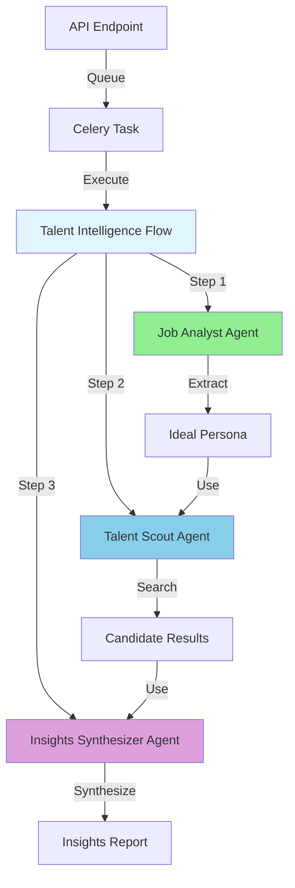
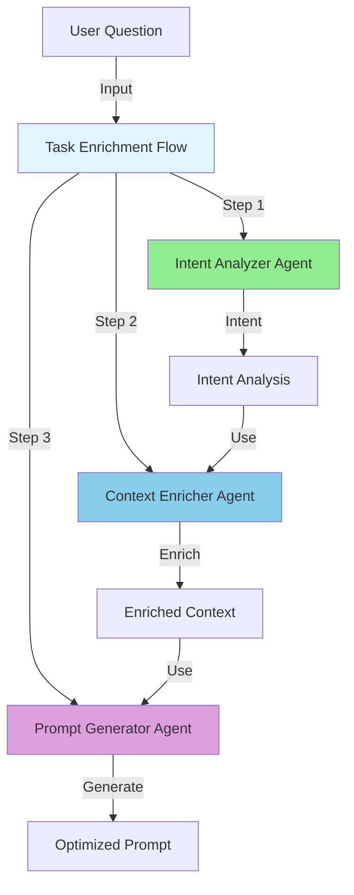
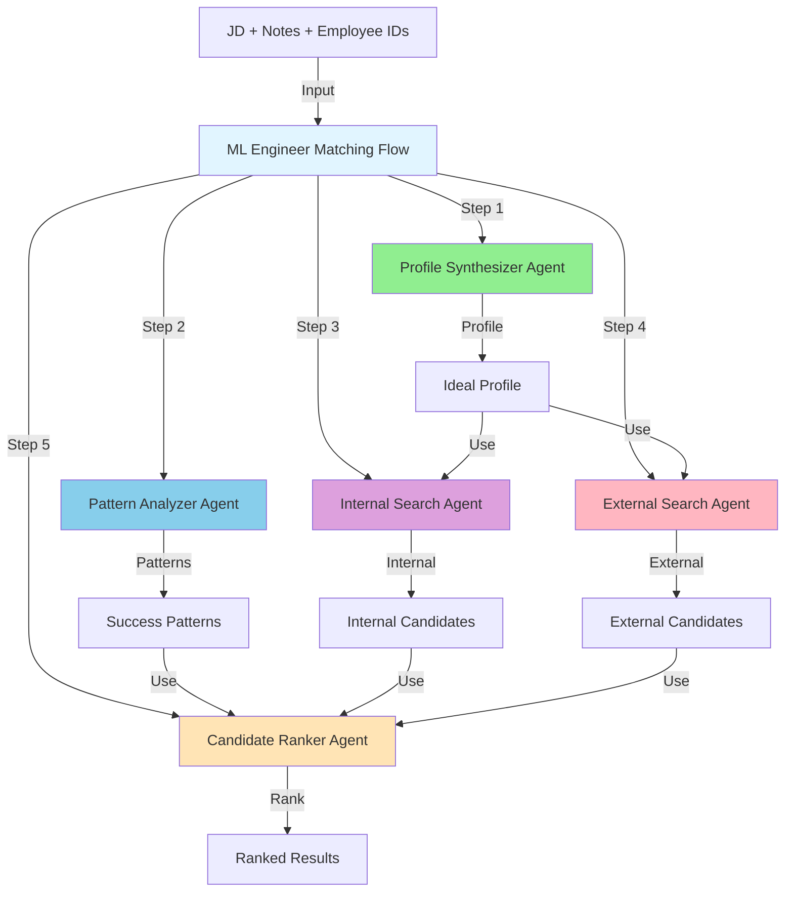

# Section 8: Real-World Examples

## Overview

This section provides detailed examples of how CrewAI flows are implemented in the Eliza Platform, showing how they fit into the broader application framework.

## Example 1: Talent Intelligence Flow

### Architecture Overview

The Talent Intelligence Flow demonstrates a multi-stage pipeline for analyzing job requirements and finding matching candidates.



### How It Fits Into the Application

#### 1. API Integration

```python
# src/api/routes/talent.py

@router.post("/analyze-from-connector")
async def analyze_from_connector(
    request: TalentAnalysisRequest,
    current_user: User = Depends(get_current_user)
):
    """Entry point: Queue talent analysis"""
    
    # Generate unique ID
    analysis_id = f"ml_ta_{uuid.uuid4().hex[:10]}"
    
    # Create database record
    analysis = TalentAnalysis(
        analysis_id=analysis_id,
        customer_id=current_user.customer_id,
        status=TalentAnalysisStatus.PENDING.value
    )
    db.add(analysis)
    db.commit()
    
    # Queue async task
    task = run_talent_analysis_task.delay(
        customer_id=current_user.customer_id,
        analysis_id=analysis_id,
        job_description=request.job_description,
        ideal_candidate_description=request.ideal_candidate_description
    )
    
    # Return immediately
    return {
        "analysis_id": analysis_id,
        "status": "pending",
        "task_id": task.id
    }
```

#### 2. Flow Implementation

```python
# src/flows/talent_intelligence_flow.py

class TalentIntelligenceFlow(Flow[TalentAnalysisState]):
    """Multi-stage talent analysis flow"""
    
    def __init__(self, customer_id: str, analysis_id: str):
        super().__init__()
        self.customer_id = customer_id
        self.analysis_id = analysis_id
        
        # Initialize agents
        self.job_analyst = self._create_job_analyst()
        self.talent_scout = self._create_talent_scout()
        self.insights_synthesizer = self._create_insights_synthesizer()
        
        # Initialize tools
        self.search_tools = create_person_search_tools(customer_id)
    
    @start()
    def analyze_job(self):
        """Step 1: Extract requirements from job description"""
        task = Task(
            description=f"""
            Analyze job description and ideal candidate description:
            
            Job Description: {self.state.job_description}
            Ideal Candidate: {self.state.ideal_candidate_description}
            
            Extract ideal candidate persona with:
            - Required skills
            - Experience requirements
            - Education requirements
            - Cultural fit indicators
            """,
            expected_output="JSON object with ideal persona",
            agent=self.job_analyst
        )
        
        crew = Crew(agents=[self.job_analyst], tasks=[task])
        result = crew.kickoff()
        
        # Parse and store result
        self.state.ideal_persona = json.loads(str(result))
    
    @listen(analyze_job)
    def search_candidates(self):
        """Step 2: Search for matching candidates"""
        task = Task(
            description=f"""
            Find candidates matching this persona:
            {json.dumps(self.state.ideal_persona, indent=2)}
            
            Use search tools to find top candidates.
            """,
            expected_output="List of matching candidates",
            agent=self.talent_scout,
            tools=self.search_tools
        )
        
        crew = Crew(agents=[self.talent_scout], tasks=[task])
        result = crew.kickoff()
        
        self.state.candidates = json.loads(str(result))
    
    @listen(search_candidates)
    def synthesize_insights(self):
        """Step 3: Generate insights report"""
        task = Task(
            description=f"""
            Synthesize insights from analysis:
            
            Ideal Persona: {json.dumps(self.state.ideal_persona)}
            Candidates Found: {len(self.state.candidates)}
            
            Generate strategic insights and recommendations.
            """,
            expected_output="JSON object with insights report",
            agent=self.insights_synthesizer
        )
        
        crew = Crew(agents=[self.insights_synthesizer], tasks=[task])
        result = crew.kickoff()
        
        self.state.insights_report = json.loads(str(result))
```

#### 3. Task Integration

```python
# src/tasks/talent_tasks.py

@celery_app.task(bind=True, name="talent.run_analysis")
def run_talent_analysis_task(self, customer_id: str, analysis_id: str, ...):
    """Execute talent intelligence flow"""
    
    db = database.SessionLocal()
    try:
        # Update status
        analysis = db.query(TalentAnalysis).filter(...).first()
        analysis.status = TalentAnalysisStatus.PROCESSING.value
        db.commit()
        
        # Create and execute flow
        flow = TalentIntelligenceFlow(
            customer_id=customer_id,
            analysis_id=analysis_id
        )
        
        # Initialize state
        flow.state = TalentAnalysisState(
            customer_id=customer_id,
            analysis_id=analysis_id,
            job_description=job_description,
            ideal_candidate_description=ideal_candidate_description
        )
        
        # Execute flow
        flow.run()
        
        # Store results
        analysis.status = TalentAnalysisStatus.COMPLETED.value
        analysis.ideal_persona = flow.state.ideal_persona
        analysis.candidates = flow.state.candidates
        analysis.insights_report = flow.state.insights_report
        db.commit()
        
    finally:
        db.close()
```

## Example 2: Task Enrichment Flow

### Architecture Overview

The Task Enrichment Flow transforms raw user questions into enriched prompts optimized for data analysis agents.



### How It Fits Into the Application

#### 1. Integration with BI Question Processing

```python
# src/tasks/business_intelligence_tasks.py

@celery_app.task(name="process_bi_question")
def process_bi_question(self, question_id: str, ...):
    """Process BI question through enrichment flow"""
    
    db = database.SessionLocal()
    try:
        # Get question
        question = db.query(BIQuestion).filter(...).first()
        
        # Create enrichment flow
        enrichment_flow = TaskEnrichmentFlow()
        enrichment_state = TaskEnrichmentFlowState(
            original_question=question.original_question,
            user_context=UserContext(
                user_id=user_id,
                customer_id=customer_id,
                role=role,
                department=department
            )
        )
        
        # Execute enrichment
        enrichment_flow.kickoff(enrichment_state.dict())
        
        # Get enriched prompt
        enriched_prompt = enrichment_flow.state.enriched_prompt
        
        # Use enriched prompt for data analysis
        # ... continue with data analysis flow ...
        
    finally:
        db.close()
```

#### 2. Flow Implementation

```python
# src/crewai_flows/task_enrichment_flow.py

class TaskEnrichmentFlow(Flow[TaskEnrichmentFlowState]):
    """Transform user questions into enriched prompts"""
    
    @start()
    def analyze_intent(self):
        """Step 1: Understand user intent"""
        intent_analyzer = Agent(
            role="Intent Analysis Specialist",
            goal="Analyze user requests to determine intent",
            llm=self.llm
        )
        
        task = Task(
            description=f"""
            Analyze user question: {self.state.original_question}
            
            Determine:
            - Intent type
            - Complexity level
            - Required data sources
            - Key entities
            """,
            expected_output="JSON object with intent analysis",
            agent=intent_analyzer
        )
        
        crew = Crew(agents=[intent_analyzer], tasks=[task])
        result = crew.kickoff()
        
        self.state.task_analysis = json.loads(str(result))
    
    @listen(analyze_intent)
    def enrich_context(self):
        """Step 2: Add relevant context"""
        context_enricher = Agent(
            role="Context Enrichment Specialist",
            goal="Add relevant business context",
            tools=[self.document_search_tool, self.hr_database_tool],
            llm=self.llm
        )
        
        task = Task(
            description=f"""
            Enrich this question with relevant context:
            {self.state.original_question}
            
            Intent: {json.dumps(self.state.task_analysis)}
            
            Use tools to find relevant documents and data.
            """,
            expected_output="Enriched context",
            agent=context_enricher
        )
        
        crew = Crew(agents=[context_enricher], tasks=[task])
        result = crew.kickoff()
        
        self.state.rag_context = {"context": str(result)}
    
    @listen(enrich_context)
    def generate_prompt(self):
        """Step 3: Generate optimized prompt"""
        prompt_generator = Agent(
            role="Prompt Generation Specialist",
            goal="Create optimized prompts",
            llm=self.llm
        )
        
        task = Task(
            description=f"""
            Generate optimized prompt from:
            - Original question: {self.state.original_question}
            - Intent: {json.dumps(self.state.task_analysis)}
            - Context: {json.dumps(self.state.rag_context)}
            
            Create a well-structured prompt for data analysis agents.
            """,
            expected_output="Optimized prompt string",
            agent=prompt_generator
        )
        
        crew = Crew(agents=[prompt_generator], tasks=[task])
        result = crew.kickoff()
        
        self.state.enriched_prompt = str(result)
```

## Example 3: ML Engineer Matching Flow

### Architecture Overview

The ML Engineer Matching Flow demonstrates a sophisticated multi-source candidate matching system.



### How It Fits Into the Application

#### 1. Flow Implementation

```python
# src/flows/ml_engineer_matching_flow.py

class MLEngineerMatchingFlow(Flow[MLEngineerMatchingState]):
    """Multi-source candidate matching flow"""
    
    @start()
    def synthesize_profile(self):
        """Step 1: Synthesize ideal profile from multiple sources"""
        agent = Agent(
            role="Ideal Candidate Profile Architect",
            goal="Synthesize ideal profile from JD, notes, and patterns",
            llm=self.llm
        )
        
        task = Task(
            description=f"""
            Synthesize ideal candidate profile from:
            - Job Description: {self.state.job_description}
            - Hiring Manager Notes: {self.state.hiring_manager_notes}
            - Reference Employees: {self.state.reference_employee_ids}
            
            Create comprehensive profile.
            """,
            expected_output="JSON object with ideal profile",
            agent=agent
        )
        
        crew = Crew(agents=[agent], tasks=[task])
        result = crew.kickoff()
        
        self.state.ideal_profile = json.loads(str(result))
    
    @listen(synthesize_profile)
    def analyze_patterns(self):
        """Step 2: Analyze employee success patterns"""
        agent = Agent(
            role="Employee Success Pattern Analyst",
            goal="Discover success patterns",
            tools=[self.pattern_search_tool],
            llm=self.llm
        )
        
        task = Task(
            description=f"""
            Analyze success patterns for employees: {self.state.reference_employee_ids}
            
            Find commonalities in backgrounds, skills, and career paths.
            """,
            expected_output="JSON object with success patterns",
            agent=agent
        )
        
        crew = Crew(agents=[agent], tasks=[task])
        result = crew.kickoff()
        
        self.state.success_patterns = json.loads(str(result))
    
    @listen(analyze_patterns)
    def search_internal(self):
        """Step 3: Search internal applicants"""
        agent = Agent(
            role="Internal Candidate Search Specialist",
            goal="Find internal applicants",
            tools=[self.internal_search_tool],
            llm=self.llm
        )
        
        task = Task(
            description=f"""
            Find internal applicants matching:
            {json.dumps(self.state.ideal_profile)}
            """,
            expected_output="List of internal candidates",
            agent=agent
        )
        
        crew = Crew(agents=[agent], tasks=[task])
        result = crew.kickoff()
        
        self.state.internal_candidates_scored = json.loads(str(result))
    
    @listen(search_internal)
    def search_external(self):
        """Step 4: Search external candidates"""
        agent = Agent(
            role="External Candidate Search Specialist",
            goal="Find external candidates",
            tools=[self.pdl_search_tool],
            llm=self.llm
        )
        
        task = Task(
            description=f"""
            Generate PDL query and find external candidates matching:
            {json.dumps(self.state.ideal_profile)}
            """,
            expected_output="List of external candidates",
            agent=agent
        )
        
        crew = Crew(agents=[agent], tasks=[task])
        result = crew.kickoff()
        
        self.state.external_candidates_scored = json.loads(str(result))
    
    @listen(search_external)
    def rank_candidates(self):
        """Step 5: Rank all candidates"""
        agent = Agent(
            role="Candidate Ranking Specialist",
            goal="Rank candidates using patterns",
            tools=[self.scoring_tool],
            llm=self.llm
        )
        
        task = Task(
            description=f"""
            Rank candidates using:
            - Ideal Profile: {json.dumps(self.state.ideal_profile)}
            - Success Patterns: {json.dumps(self.state.success_patterns)}
            - Internal Candidates: {len(self.state.internal_candidates_scored)}
            - External Candidates: {len(self.state.external_candidates_scored)}
            
            Provide final ranked list with insights.
            """,
            expected_output="JSON object with ranked candidates",
            agent=agent
        )
        
        crew = Crew(agents=[agent], tasks=[task])
        result = crew.kickoff()
        
        self.state.final_matches = json.loads(str(result))
```

#### 2. Task Integration

```python
# src/tasks/ml_matching_task.py

@celery_app.task(name="run_ml_matching_task")
def run_ml_matching_task(self, session_id: str, ...):
    """Execute ML engineer matching flow"""
    
    db = database.SessionLocal()
    try:
        # Create flow
        flow = MLEngineerMatchingFlow()
        
        # Execute with initial state
        result = flow.kickoff({
            'session_id': session_id,
            'customer_id': customer_id,
            'job_description': job_description,
            'hiring_manager_notes': hiring_manager_notes,
            'reference_employee_ids': reference_employee_ids
        })
        
        # Store results
        matching_session = db.query(MatchingSession).filter(...).first()
        matching_session.status = 'completed'
        matching_session.results = result
        matching_session.total_cost_usd = result.get('total_cost_usd', 0.0)
        db.commit()
        
    finally:
        db.close()
```

## Common Patterns Across All Flows

### Pattern 1: State Management

All flows use Pydantic models for state:

```python
# Common pattern
class FlowState(BaseModel):
    # Input
    customer_id: str
    request_id: str
    
    # Intermediate results
    step1_result: Optional[Dict] = None
    
    # Final results
    final_result: Optional[Dict] = None
```

### Pattern 2: Agent Specialization

All flows use specialized agents:

```python
# Each agent has a focused role
agent = Agent(
    role="Specific Role",
    goal="Clear Goal",
    tools=[relevant_tools],
    llm=appropriate_llm
)
```

### Pattern 3: Database Session Management

All flows create sessions locally:

```python
# Never in state, always created locally
def my_method(self):
    if database.SessionLocal is None:
        database.init_database()
    db = database.SessionLocal()
    try:
        # Use db
        pass
    finally:
        db.close()
```

### Pattern 4: Error Handling

All flows handle errors gracefully:

```python
try:
    result = crew.kickoff()
    self.state.result = result
except Exception as e:
    logger.error("flow_error", error=str(e))
    self.state.error = str(e)
    raise
```

## Summary

These real-world examples demonstrate:

1. **Talent Intelligence Flow**: Multi-stage candidate analysis
2. **Task Enrichment Flow**: Question transformation pipeline
3. **ML Engineer Matching Flow**: Sophisticated multi-source matching

All flows follow consistent patterns:
- API → Celery → Flow execution
- State management with Pydantic
- Agent specialization
- Local database session creation
- Error handling and logging

Next, we'll cover troubleshooting common issues.


