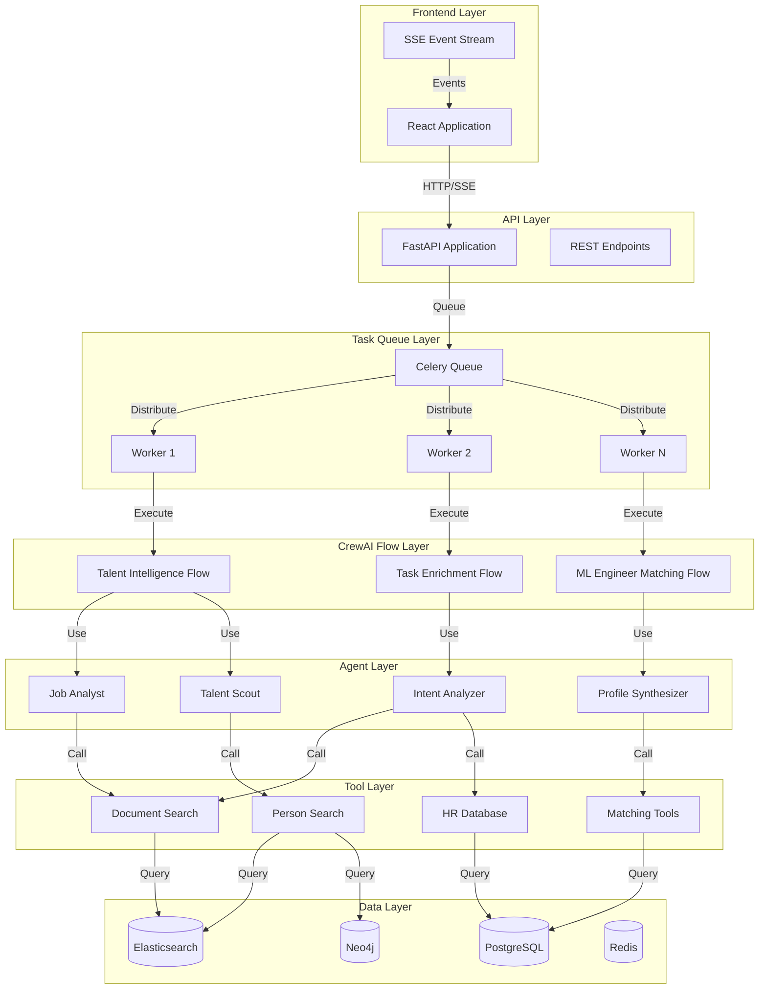

# CrewAI Enterprise Cookbook: Building AI-Native Applications

A comprehensive guide to integrating CrewAI flows and agents into production applications, based on real-world patterns from the Eliza Platform.

---

## Table of Contents

1. [Introduction](#introduction)
2. [Architecture Overview](#architecture-overview)
3. [Core Patterns](#core-patterns)
4. [Integration Framework](#integration-framework)
5. [Real-World Examples](#real-world-examples)
6. [Deployment Essentials](#deployment-essentials)
7. [Quick Start Guide](#quick-start-guide)

---

## Introduction

CrewAI provides a framework for building collaborative AI agent systems. In enterprise applications, CrewAI flows orchestrate multi-step AI processes that integrate seamlessly with your existing infrastructure.

### Key Concepts

- **Flows**: Multi-step workflows that orchestrate agents
- **Agents**: Specialized AI workers with specific roles and tools
- **Tasks**: Work units assigned to agents
- **Tools**: Custom functions connecting agents to your systems

### Why This Architecture?

This cookbook demonstrates how to build **AI-native applications** where AI agents are core to the application's functionality, not just add-ons. The patterns shown here enable:

- **Scalable AI Systems**: Handle thousands of concurrent requests
- **Reliable Orchestration**: Multi-step processes with error handling
- **Seamless Integration**: AI flows integrated with REST APIs, databases, and services
- **Production Ready**: Monitoring, observability, and deployment patterns

---

## Architecture Overview

### How CrewAI Fits Into Your Application



### Request Flow

```
User Request
    ↓
API Endpoint (FastAPI)
    ↓
Create Database Record (status: PENDING)
    ↓
Queue Celery Task
    ↓
Return task_id (202 Accepted)
    ↓
    [Background]
    ↓
Celery Worker Picks Up Task
    ↓
Update Status (PROCESSING)
    ↓
Create CrewAI Flow Instance
    ↓
Execute Flow Steps
    ├─ Step 1: Agent 1
    ├─ Step 2: Agent 2
    └─ Step 3: Agent 3
    ↓
Store Results in Database
    ↓
Update Status (COMPLETED)
    ↓
Stream Events via SSE (real-time updates)
```

### Key Architectural Decisions

1. **Async Execution**: API returns immediately, work happens in background
2. **State Management**: Flow state is serializable (Pydantic models)
3. **Database Sessions**: Created locally, never stored in state
4. **Agent Specialization**: Each agent has focused role and tools
5. **Tool Integration**: Custom tools connect agents to your systems

---

## Core Patterns

### Pattern 1: Flow-Based Orchestration

Flows orchestrate multi-step processes where each step may involve one or more agents.

#### Flow Structure

```python
from crewai.flow.flow import Flow, listen, start
from pydantic import BaseModel

class MyFlowState(BaseModel):
    """State passed between flow steps - MUST be serializable"""
    customer_id: str
    request_id: str
    step1_result: Optional[Dict[str, Any]] = None
    step2_result: Optional[List[Dict]] = None
    final_result: Optional[Dict[str, Any]] = None

class MyFlow(Flow[MyFlowState]):
    """Example flow demonstrating multi-step orchestration"""
    
    def __init__(self):
        super().__init__()
        self.llm = LLM(model="gpt-4o-mini", temperature=0.3)
    
    @start()
    def initial_step(self):
        """First step: Analyze input"""
        agent = Agent(
            role="Analyzer",
            goal="Analyze the input",
            llm=self.llm
        )
        
        task = Task(
            description=f"Analyze: {self.state.customer_id}",
            agent=agent
        )
        
        crew = Crew(agents=[agent], tasks=[task])
        result = crew.kickoff()
        
        # Update state
        self.state.step1_result = {"analysis": str(result)}
    
    @listen(initial_step)
    def process_step(self):
        """Second step: Process analysis"""
        # Access previous step's result
        agent = Agent(
            role="Processor",
            goal="Process the analysis",
            llm=self.llm
        )
        
        task = Task(
            description=f"Process: {self.state.step1_result}",
            agent=agent
        )
        
        crew = Crew(agents=[agent], tasks=[task])
        result = crew.kickoff()
        
        self.state.step2_result = [{"processed": str(result)}]
```

#### Critical Rules

**Rule 1: State Must Be Serializable**
```python
# ✅ GOOD: Serializable state
class FlowState(BaseModel):
    customer_id: str
    analysis_id: str
    results: Optional[Dict] = None

# ❌ BAD: Non-serializable objects cause errors
class FlowState(BaseModel):
    db_session: Session  # Can't be pickled!
    file_handle: File    # Can't be pickled!
```

**Rule 2: Never Store Database Sessions in State**
```python
# ✅ GOOD: Create sessions locally
def my_method(self):
    if database.SessionLocal is None:
        database.init_database()
    db = database.SessionLocal()
    try:
        # Use db
        pass
    finally:
        db.close()
```

**Rule 3: Use Module Imports**
```python
# ✅ GOOD: Module import maintains reference
from src.models import database

if database.SessionLocal is None:
    database.init_database()
db = database.SessionLocal()

# ❌ BAD: Direct import creates local binding
from src.models.database import SessionLocal  # May not update!
```

### Pattern 2: Agent Specialization

Create focused agents with specific roles, goals, and tools.

#### Agent Design

```python
class TaskEnrichmentFlow(Flow[TaskEnrichmentFlowState]):
    def _create_intent_analyzer(self) -> Agent:
        """Agent specialized in understanding user intent"""
        return Agent(
            role="Intent Analysis Specialist",
            goal="Analyze user requests to determine intent and complexity",
            backstory="""You are an expert at understanding user intentions and breaking down 
            complex requests into structured, analyzable components. You excel at identifying 
            ambiguities, extracting entities, and determining the appropriate processing approach.""",
            llm=self.llm,
            verbose=True,
            allow_delegation=False  # Focused agent
        )
    
    def _create_context_enricher(self) -> Agent:
        """Agent specialized in enriching context"""
        return Agent(
            role="Context Enrichment Specialist",
            goal="Add relevant business context to user queries",
            backstory="""You are an expert information retrieval specialist with deep knowledge 
            of semantic search and knowledge base navigation.""",
            tools=[self.document_search_tool, self.hr_database_tool],  # Has tools
            llm=self.llm,
            verbose=True
        )
```

#### Best Practices

- **Single Responsibility**: Each agent has one clear purpose
- **Rich Backstories**: Detailed backstories shape agent behavior
- **Appropriate Tools**: Assign tools only to agents that need them
- **Model Selection**: Use `gpt-4o-mini` for simple tasks, larger models for complex reasoning

### Pattern 3: Tool Integration

Tools connect agents to your external systems (databases, APIs, services).

#### Creating Custom Tools

```python
from crewai.tools import BaseTool
from pydantic import Field
import json

class DocumentSearchTool(BaseTool):
    """CrewAI tool for semantic document search"""
    
    name: str = "Document Semantic Search"
    description: str = """
    ALWAYS USE THIS TOOL to search company documents for relevant information.
    
    Performs semantic search across all ingested documents using FAISS vector similarity.
    Returns the most relevant document chunks based on the query.
    """
    
    customer_id: str = Field(description="Customer ID for data isolation")
    company_hr_dataset: Optional[str] = Field(
        None, 
        description="Target company for document index"
    )
    limit: int = Field(default=10, description="Max number of results")
    
    def _run(self, query: str) -> str:
        """Execute semantic search"""
        try:
            vector_service = VectorService()
            
            # CRITICAL: Use company_hr_dataset, not customer_id for filtering
            results = await vector_service.search_similar_chunks(
                query=query,
                company_hr_dataset=self.company_hr_dataset or self.customer_id,
                limit=self.limit
            )
            
            # Return JSON string for agent consumption
            return json.dumps([r.dict() for r in results])
        except Exception as e:
            return json.dumps({"error": str(e)})
```

#### Tool Best Practices

- **Clear Descriptions**: Agents need clear instructions on when to use tools
- **Error Handling**: Always handle errors gracefully
- **Data Filtering**: Use `company_hr_dataset` for filtering, not `customer_id`
- **JSON Output**: Return JSON strings for agent consumption

---

## Integration Framework

### Pattern: API → Celery → Flow

This is the standard pattern for integrating CrewAI flows into REST APIs.

#### Step 1: API Endpoint

```python
# src/api/routes/talent.py

@router.post("/analyze-from-connector")
async def analyze_from_connector(
    request: TalentAnalysisRequest,
    current_user: User = Depends(get_current_user)
):
    """Queue talent analysis flow execution"""
    
    # Generate unique ID
    analysis_id = f"ml_ta_{uuid.uuid4().hex[:10]}"
    
    # Create database record
    analysis = TalentAnalysis(
        analysis_id=analysis_id,
        customer_id=current_user.customer_id,
        status=TalentAnalysisStatus.PENDING.value,
        started_at=datetime.utcnow()
    )
    db.add(analysis)
    db.commit()
    
    # Queue Celery task (non-blocking)
    task = run_talent_analysis_task.delay(
        customer_id=current_user.customer_id,
        analysis_id=analysis_id,
        job_description=request.job_description,
        ideal_candidate_description=request.ideal_candidate_description
    )
    
    # Return immediately (don't wait for completion)
    return {
        "analysis_id": analysis_id,
        "status": "pending",
        "task_id": task.id,
        "message": "Analysis queued successfully"
    }
```

#### Step 2: Celery Task

```python
# src/tasks/talent_tasks.py

from celery import Task
from src.celery_app import celery_app
from src.models import database

class TalentAnalysisTask(Task):
    """Base task with database session management"""
    
    def __call__(self, *args, **kwargs):
        # Ensure database is initialized
        if database.SessionLocal is None:
            database.init_database()
        return super().__call__(*args, **kwargs)

@celery_app.task(
    base=TalentAnalysisTask,
    bind=True,
    name="talent.run_analysis",
    max_retries=3,
    default_retry_delay=60
)
def run_talent_analysis_task(
    self,
    customer_id: str,
    analysis_id: str,
    job_description: Optional[str] = None,
    ...
):
    """Execute talent analysis flow"""
    
    # CRITICAL: Initialize database in task
    if database.SessionLocal is None:
        database.init_database()
    
    db = database.SessionLocal()
    
    try:
        # Update status
        analysis = db.query(TalentAnalysis).filter(...).first()
        analysis.status = TalentAnalysisStatus.PROCESSING.value
        db.commit()
        
        # Create and execute flow
        from src.flows.talent_intelligence_flow import TalentIntelligenceFlow
        
        flow = TalentIntelligenceFlow(
            customer_id=customer_id,
            analysis_id=analysis_id
        )
        
        # Execute flow
        results = flow.run(
            job_description=job_description,
            ideal_candidate_description=ideal_candidate_description
        )
        
        # Store results
        analysis.status = TalentAnalysisStatus.COMPLETED.value
        analysis.ideal_persona = results.get('ideal_persona')
        analysis.candidates = results.get('candidates', [])
        analysis.insights_report = results.get('insights_report')
        analysis.completed_at = datetime.utcnow()
        db.commit()
        
        return {"success": True, "analysis_id": analysis_id}
        
    except Exception as e:
        # Handle errors
        logger.error("talent_analysis_failed", error=str(e))
        
        if db:
            analysis.status = TalentAnalysisStatus.FAILED.value
            analysis.error_message = str(e)
            db.commit()
        
        # Retry if appropriate
        raise self.retry(exc=e, countdown=60)
        
    finally:
        # Always close database session
        if db:
            db.close()
```

#### Step 3: Status Polling

```python
@router.get("/analyses/{analysis_id}")
async def get_analysis_status(
    analysis_id: str,
    current_user: User = Depends(get_current_user),
    db: Session = Depends(get_db)
):
    """Get analysis status and results"""
    analysis = db.query(TalentAnalysis).filter(
        TalentAnalysis.analysis_id == analysis_id,
        TalentAnalysis.customer_id == current_user.customer_id
    ).first()
    
    if not analysis:
        raise HTTPException(status_code=404, detail="Analysis not found")
    
    return {
        "analysis_id": analysis.analysis_id,
        "status": analysis.status,
        "results": {
            "ideal_persona": analysis.ideal_persona,
            "candidates": analysis.candidates,
            "insights_report": analysis.insights_report
        } if analysis.status == TalentAnalysisStatus.COMPLETED.value else None
    }
```

### Real-Time Updates with SSE

Stream progress updates to frontend:

```python
# src/api/routes/talent.py

@router.get("/analyses/{analysis_id}/events")
async def stream_analysis_events(
    analysis_id: str,
    current_user: User = Depends(get_current_user)
):
    """Stream analysis events via SSE"""
    
    async def event_generator():
        yield f"data: {json.dumps({'type': 'connected'})}\n\n"
        
        last_event_id = None
        while True:
            # Query for new events
            events = db.query(TalentAnalysisEvent).filter(
                TalentAnalysisEvent.analysis_id == analysis_id,
                TalentAnalysisEvent.id > last_event_id if last_event_id else True
            ).order_by(TalentAnalysisEvent.created_at).all()
            
            for event in events:
                yield f"data: {json.dumps({
                    'type': event.event_type,
                    'message': event.message,
                    'progress': event.progress_percentage
                })}\n\n"
                last_event_id = event.id
            
            # Check if complete
            analysis = db.query(TalentAnalysis).filter(...).first()
            if analysis.status in ["completed", "failed"]:
                yield f"data: {json.dumps({'type': 'complete'})}\n\n"
                break
            
            await asyncio.sleep(1)
    
    return StreamingResponse(
        event_generator(),
        media_type="text/event-stream"
    )
```

Log events in your flow:

```python
def _log_event(self, event_type: str, message: str, progress: int):
    """Log event for SSE streaming"""
    event = TalentAnalysisEvent(
        analysis_id=self.analysis_id,
        event_type=event_type,
        message=message,
        progress_percentage=progress
    )
    self.db.add(event)
    self.db.commit()
```

---

## Real-World Examples

### Example 1: Talent Intelligence Flow

**Purpose**: Analyze job requirements and find matching candidates

**Architecture**:
```
API Request → Queue Task → Flow Execution
    ↓
Step 1: Job Analyst Agent (extract requirements)
    ↓
Step 2: Talent Scout Agent (search candidates)
    ↓
Step 3: Insights Synthesizer Agent (generate report)
    ↓
Store Results → Return to Client
```

**Implementation**:

```python
# src/flows/talent_intelligence_flow.py

class TalentIntelligenceFlow(Flow[TalentAnalysisState]):
    """Multi-stage talent analysis flow"""
    
    def __init__(self, customer_id: str, analysis_id: str):
        super().__init__()
        self.customer_id = customer_id
        self.analysis_id = analysis_id
        
        # Initialize specialized agents
        self.job_analyst = self._create_job_analyst()
        self.talent_scout = self._create_talent_scout()
        self.insights_synthesizer = self._create_insights_synthesizer()
        
        # Initialize tools
        self.search_tools = create_person_search_tools(customer_id)
    
    @start()
    def analyze_job(self):
        """Step 1: Extract requirements from job description"""
        task = Task(
            description=f"""
            Analyze job description and ideal candidate description:
            
            Job Description: {self.state.job_description}
            Ideal Candidate: {self.state.ideal_candidate_description}
            
            Extract ideal candidate persona with:
            - Required skills
            - Experience requirements
            - Education requirements
            - Cultural fit indicators
            """,
            expected_output="JSON object with ideal persona",
            agent=self.job_analyst
        )
        
        crew = Crew(agents=[self.job_analyst], tasks=[task])
        result = crew.kickoff()
        self.state.ideal_persona = json.loads(str(result))
    
    @listen(analyze_job)
    def search_candidates(self):
        """Step 2: Search for matching candidates"""
        task = Task(
            description=f"""
            Find candidates matching this persona:
            {json.dumps(self.state.ideal_persona, indent=2)}
            
            Use search tools to find top candidates.
            """,
            expected_output="List of matching candidates",
            agent=self.talent_scout,
            tools=self.search_tools
        )
        
        crew = Crew(agents=[self.talent_scout], tasks=[task])
        result = crew.kickoff()
        self.state.candidates = json.loads(str(result))
    
    @listen(search_candidates)
    def synthesize_insights(self):
        """Step 3: Generate insights report"""
        task = Task(
            description=f"""
            Synthesize insights from analysis:
            
            Ideal Persona: {json.dumps(self.state.ideal_persona)}
            Candidates Found: {len(self.state.candidates)}
            
            Generate strategic insights and recommendations.
            """,
            expected_output="JSON object with insights report",
            agent=self.insights_synthesizer
        )
        
        crew = Crew(agents=[self.insights_synthesizer], tasks=[task])
        result = crew.kickoff()
        self.state.insights_report = json.loads(str(result))
```

**How It Fits**: 
- API endpoint queues the task
- Celery worker executes the flow
- Each step updates state
- Results stored in database
- Events streamed via SSE

### Example 2: Task Enrichment Flow

**Purpose**: Transform raw user questions into enriched prompts

**Architecture**:
```
BI Question → Enrichment Flow
    ↓
Step 1: Intent Analyzer (understand intent)
    ↓
Step 2: Context Enricher (add context via RAG)
    ↓
Step 3: Prompt Generator (create optimized prompt)
    ↓
Enriched Prompt → Data Analysis Flow
```

**Implementation**:

```python
# src/crewai_flows/task_enrichment_flow.py

class TaskEnrichmentFlow(Flow[TaskEnrichmentFlowState]):
    """Transform user questions into enriched prompts"""
    
    @start()
    def analyze_intent(self):
        """Step 1: Understand user intent"""
        intent_analyzer = Agent(
            role="Intent Analysis Specialist",
            goal="Analyze user requests to determine intent",
            llm=self.llm
        )
        
        task = Task(
            description=f"""
            Analyze user question: {self.state.original_question}
            
            Determine:
            - Intent type (question_answering, data_analysis, etc.)
            - Complexity level
            - Required data sources
            - Key entities
            """,
            expected_output="JSON object with intent analysis",
            agent=intent_analyzer
        )
        
        crew = Crew(agents=[intent_analyzer], tasks=[task])
        result = crew.kickoff()
        self.state.task_analysis = json.loads(str(result))
    
    @listen(analyze_intent)
    def enrich_context(self):
        """Step 2: Add relevant context"""
        context_enricher = Agent(
            role="Context Enrichment Specialist",
            goal="Add relevant business context",
            tools=[self.document_search_tool, self.hr_database_tool],
            llm=self.llm
        )
        
        task = Task(
            description=f"""
            Enrich this question with relevant context:
            {self.state.original_question}
            
            Use tools to find relevant documents and data.
            """,
            expected_output="Enriched context",
            agent=context_enricher
        )
        
        crew = Crew(agents=[context_enricher], tasks=[task])
        result = crew.kickoff()
        self.state.rag_context = {"context": str(result)}
    
    @listen(enrich_context)
    def generate_prompt(self):
        """Step 3: Generate optimized prompt"""
        prompt_generator = Agent(
            role="Prompt Generation Specialist",
            goal="Create optimized prompts",
            llm=self.llm
        )
        
        task = Task(
            description=f"""
            Generate optimized prompt from:
            - Original question: {self.state.original_question}
            - Intent: {json.dumps(self.state.task_analysis)}
            - Context: {json.dumps(self.state.rag_context)}
            
            Create a well-structured prompt for data analysis agents.
            """,
            expected_output="Optimized prompt string",
            agent=prompt_generator
        )
        
        crew = Crew(agents=[prompt_generator], tasks=[task])
        result = crew.kickoff()
        self.state.enriched_prompt = str(result)
```

**How It Fits**: 
- Integrated into BI question processing pipeline
- Enriches questions before data analysis
- Uses RAG tools to add context
- Produces optimized prompts for downstream agents

### Example 3: ML Engineer Matching Flow

**Purpose**: Multi-source candidate matching with pattern analysis

**Architecture**:
```
JD + Notes + Employee IDs → Matching Flow
    ↓
Step 1: Profile Synthesizer (analyze all sources)
    ↓
Step 2: Pattern Analyzer (find success patterns)
    ↓
Step 3: Internal Search (search applicants)
    ↓
Step 4: External Search (search market)
    ↓
Step 5: Candidate Ranker (rank all candidates)
    ↓
Ranked Results → Return to Client
```

**Implementation**:

```python
# src/flows/ml_engineer_matching_flow.py

class MLEngineerMatchingFlow(Flow[MLEngineerMatchingState]):
    """Multi-source candidate matching flow"""
    
    @start()
    def synthesize_profile(self):
        """Step 1: Synthesize ideal profile from multiple sources"""
        agent = Agent(
            role="Ideal Candidate Profile Architect",
            goal="Synthesize ideal profile from JD, notes, and patterns",
            llm=self.llm
        )
        
        task = Task(
            description=f"""
            Synthesize ideal candidate profile from:
            - Job Description: {self.state.job_description}
            - Hiring Manager Notes: {self.state.hiring_manager_notes}
            - Reference Employees: {self.state.reference_employee_ids}
            """,
            expected_output="JSON object with ideal profile",
            agent=agent
        )
        
        crew = Crew(agents=[agent], tasks=[task])
        result = crew.kickoff()
        self.state.ideal_profile = json.loads(str(result))
    
    @listen(synthesize_profile)
    def analyze_patterns(self):
        """Step 2: Analyze employee success patterns"""
        agent = Agent(
            role="Employee Success Pattern Analyst",
            goal="Discover success patterns",
            tools=[self.pattern_search_tool],
            llm=self.llm
        )
        
        task = Task(
            description=f"""
            Analyze success patterns for employees: {self.state.reference_employee_ids}
            Find commonalities in backgrounds, skills, and career paths.
            """,
            expected_output="JSON object with success patterns",
            agent=agent
        )
        
        crew = Crew(agents=[agent], tasks=[task])
        result = crew.kickoff()
        self.state.success_patterns = json.loads(str(result))
    
    # Additional steps: search_internal, search_external, rank_candidates
```

**How It Fits**: 
- Demonstrates complex multi-step orchestration
- Uses multiple specialized agents
- Combines internal and external data sources
- Applies pattern-based ranking

### Common Patterns Across All Flows

1. **State Management**: All use Pydantic models, never store sessions
2. **Agent Specialization**: Each agent has focused role and appropriate tools
3. **Database Sessions**: Created locally in methods, never in state
4. **Error Handling**: Try/except blocks with logging and retries
5. **Integration**: All follow API → Celery → Flow pattern

---

## Deployment Essentials

### Containerization

Multi-container Docker setup:

```yaml
# docker/docker-compose.yml

services:
  app:
    build: .
    environment:
      - RUN_MIGRATIONS=true  # Only app runs migrations
    depends_on:
      - postgres
      - redis
  
  celery-worker:
    build: .
    command: celery -A src.celery_app worker --loglevel=info --concurrency=4
    environment:
      - RUN_MIGRATIONS=false  # Workers skip migrations
    depends_on:
      - postgres
      - redis
  
  postgres:
    image: postgres:15
    volumes:
      - postgres_data:/var/lib/postgresql/data
  
  redis:
    image: redis:7-alpine
```

**Key Rules**:
- Only app container runs migrations (`RUN_MIGRATIONS=true`)
- Workers skip migrations (`RUN_MIGRATIONS=false`)
- Rebuild containers after code changes: `docker-compose build --no-cache`
- Use health checks for orchestration

### Monitoring & Observability

**Structured Logging**:
```python
logger.info(
    "talent_analysis_starting",
    analysis_id=analysis_id,
    customer_id=customer_id,
    task_id=task_id
)
```

**Metrics Tracking**:
- Token usage per agent
- Cost per flow execution
- Execution time per step
- Success/failure rates

**Error Tracking**:
- Capture errors with context
- Store in database for analysis
- Retry with exponential backoff

**Distributed Tracing**:
- Generate trace IDs for requests
- Correlate logs across services
- Track flow execution end-to-end

### Troubleshooting Quick Reference

| Issue | Solution |
|-------|----------|
| Pickle error | Remove sessions from state |
| SessionLocal None | Use module import, check before use |
| Container not updating | Rebuild with `docker-compose build` |
| Migrations fail | Only app container runs migrations |
| Tools not working | Initialize and assign to agent |
| Wrong data filtering | Use `company_hr_dataset`, not `customer_id` |

**Common Debugging Commands**:
```bash
# Check logs
docker-compose logs celery-worker --tail=100

# Check Celery status
celery -A src.celery_app inspect active

# Check queue depths
redis-cli LLEN celery

# Verify environment
docker exec docker-app-1 env | grep DATABASE_URL
```

---

## Quick Start Guide

### Step 1: Create Flow State Model

```python
from pydantic import BaseModel
from typing import Optional, Dict, Any

class MyFlowState(BaseModel):
    customer_id: str
    request_id: str
    step1_result: Optional[Dict[str, Any]] = None
    final_result: Optional[Dict[str, Any]] = None
```

### Step 2: Create Flow Class

```python
from crewai.flow.flow import Flow, listen, start
from crewai import Agent, Task, Crew, LLM

class MyFlow(Flow[MyFlowState]):
    def __init__(self):
        super().__init__()
        self.llm = LLM(model="gpt-4o-mini", temperature=0.3)
    
    @start()
    def first_step(self):
        agent = Agent(
            role="Analyst",
            goal="Analyze input",
            llm=self.llm
        )
        
        task = Task(
            description=f"Analyze: {self.state.customer_id}",
            agent=agent
        )
        
        crew = Crew(agents=[agent], tasks=[task])
        result = crew.kickoff()
        self.state.step1_result = {"analysis": str(result)}
    
    @listen(first_step)
    def second_step(self):
        # Access previous step: self.state.step1_result
        # Execute next step...
        pass
```

### Step 3: Create API Endpoint

```python
@router.post("/execute-flow")
async def execute_flow(request: FlowRequest):
    # Generate ID
    request_id = f"req_{uuid.uuid4().hex[:10]}"
    
    # Create database record
    record = MyRecord(request_id=request_id, status="pending")
    db.add(record)
    db.commit()
    
    # Queue task
    task = run_flow_task.delay(
        customer_id=request.customer_id,
        request_id=request_id
    )
    
    return {"request_id": request_id, "task_id": task.id}
```

### Step 4: Create Celery Task

```python
@celery_app.task(bind=True, name="run_flow_task")
def run_flow_task(self, customer_id: str, request_id: str):
    # Initialize database
    if database.SessionLocal is None:
        database.init_database()
    
    db = database.SessionLocal()
    try:
        # Update status
        record = db.query(MyRecord).filter(...).first()
        record.status = "processing"
        db.commit()
        
        # Create and execute flow
        flow = MyFlow()
        flow.state = MyFlowState(
            customer_id=customer_id,
            request_id=request_id
        )
        flow.run()
        
        # Store results
        record.status = "completed"
        record.results = flow.state.final_result
        db.commit()
        
    finally:
        db.close()
```

### Step 5: Deploy

```bash
# Build containers
docker-compose build

# Start services
docker-compose up -d

# Check status
docker-compose ps
curl http://localhost:5001/health/ready
```

### Checklist

- [ ] Flow state model is serializable (Pydantic)
- [ ] No database sessions in state
- [ ] Database sessions created locally in methods
- [ ] Module imports used (not direct imports)
- [ ] API endpoints queue tasks (don't block)
- [ ] Celery tasks initialize database
- [ ] Errors are logged and handled
- [ ] Containers rebuilt after code changes
- [ ] Only app container runs migrations

---

## Key Takeaways

1. **Flows orchestrate multi-step AI processes** - Use `@start()` and `@listen()` for step dependencies
2. **Agents are specialized workers** - Each agent has focused role, goal, and tools
3. **State must be serializable** - Use Pydantic models, never store sessions
4. **API → Celery → Flow pattern** - Queue tasks for async execution
5. **Database sessions created locally** - Never in state, always in methods
6. **Tools connect agents to your systems** - Custom tools extend `BaseTool`
7. **Module imports maintain references** - Use `from src.models import database`
8. **Containers require rebuilds** - `docker-compose build` after code changes
9. **Only app runs migrations** - Workers skip migrations to avoid conflicts
10. **Monitor and trace everything** - Logging, metrics, and error tracking are essential

This framework enables you to build AI-native applications where AI agents are core to functionality, seamlessly integrated with your existing infrastructure.

---

## Additional Resources

- **CrewAI Documentation**: https://docs.crewai.com
- **Eliza Platform Source**: See `src/flows/`, `src/crewai_flows/`, `src/tasks/`
- **Detailed Patterns**: See individual section documents in `cookbook/` directory

For troubleshooting specific issues, see the comprehensive troubleshooting guide in `09_TROUBLESHOOTING.md`.


