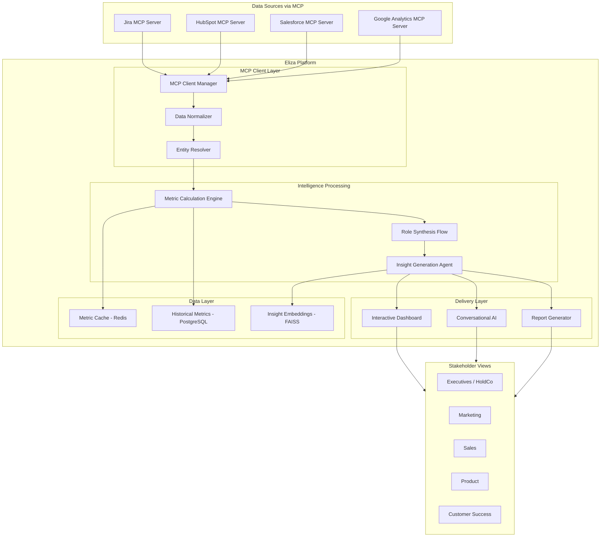
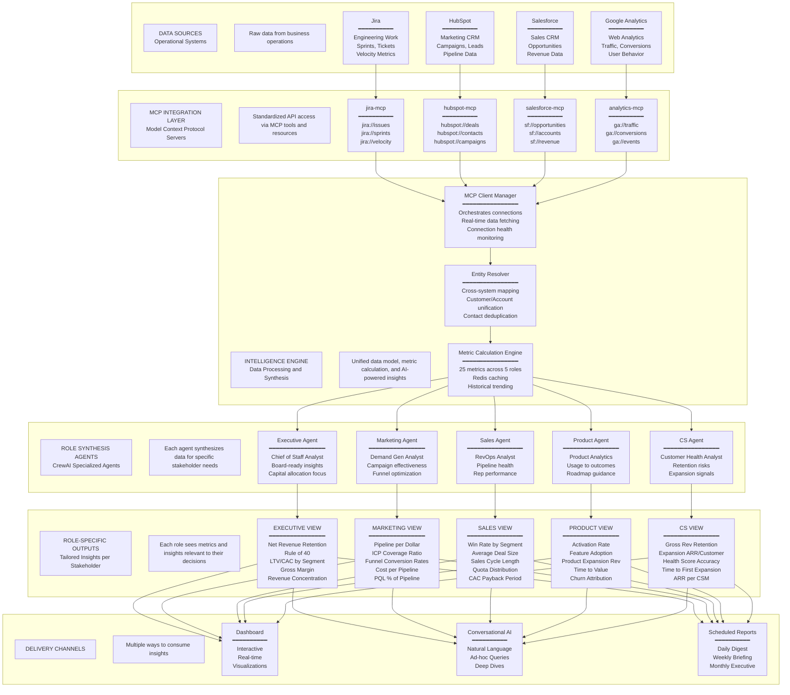
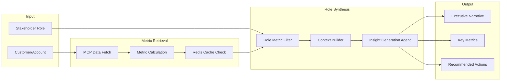

# Operations Intelligence Product Specification

## Executive Summary

A unified operations intelligence platform that connects to operational systems (Jira, HubSpot, Salesforce, Google Analytics) via Model Context Protocol (MCP) integrations and delivers role-tailored insights through dashboards, conversational AI, and scheduled reports.

---

## Implementation TODOs

| ID | Task | Status |
|----|------|--------|
| mcp-server-scaffold | Create MCP server scaffolding for HubSpot, Salesforce, Jira, and Google Analytics | Pending |
| database-schema | Create database migrations for mcp_connections, metric_history, role_insights, entity_mappings tables | Pending |
| metric-engine | Implement MetricCalculationEngine with Redis caching and PostgreSQL history | Pending |
| entity-resolver | Build EntityResolutionService for cross-system entity mapping | Pending |
| ops-flow | Create OpsInsightFlow with role-based synthesis agents | Pending |
| api-endpoints | Implement operations_intelligence API routes | Pending |
| dashboard-ui | Build Operations Intelligence dashboard React components | Pending |
| chat-integration | Extend conversational AI to support operations queries | Pending |
| scheduled-reports | Add Celery tasks for automated report generation | Pending |

---

## Architecture Overview (High-Level)



---

## Detailed Architecture Diagram



---

## 1. MCP Integration Layer

### 1.1 MCP Server Implementations

Each data source requires a dedicated MCP server following the pattern in `Eliza-platform-talent-mcp/`:

| MCP Server | Primary Data | Key Resources |
|------------|--------------|---------------|
| **jira-mcp** | Engineering velocity, sprint data, ticket lifecycle | `jira://issues`, `jira://sprints`, `jira://velocity` |
| **hubspot-mcp** | CRM contacts, deals, marketing campaigns | `hubspot://contacts`, `hubspot://deals`, `hubspot://campaigns` |
| **salesforce-mcp** | Opportunities, accounts, custom objects | `salesforce://opportunities`, `salesforce://accounts` |
| **analytics-mcp** | Web traffic, conversion funnels, user behavior | `analytics://traffic`, `analytics://conversions`, `analytics://events` |

### 1.2 MCP Tool Definitions (per server)

```python
# Example: hubspot-mcp tools
@mcp.tool()
def get_deals_by_stage(stage: str, date_range: str) -> list[Deal]:
    """Get deals in a specific pipeline stage within date range."""

@mcp.tool()
def get_pipeline_metrics(pipeline_id: str) -> PipelineMetrics:
    """Get conversion rates, velocity, and value by stage."""

@mcp.tool()
def get_customer_health(customer_id: str) -> CustomerHealth:
    """Get engagement score, NPS, support tickets, usage metrics."""

@mcp.tool()
def get_marketing_attribution(campaign_id: str) -> Attribution:
    """Get pipeline and revenue attributed to marketing campaigns."""
```

### 1.3 Entity Resolution Strategy

The **Entity Resolver** maps records across systems using:

| Entity | Primary Key | Cross-System Mapping |
|--------|-------------|----------------------|
| **Customer/Account** | `domain` or `company_name` | HubSpot Company ID ↔ Salesforce Account ID |
| **Contact** | `email` | HubSpot Contact ↔ Salesforce Contact |
| **Deal/Opportunity** | `deal_id` | HubSpot Deal ↔ Salesforce Opportunity |
| **Product/Feature** | `jira_project_key` | Jira Project ↔ Product SKU |

---

## 2. Metric Calculation Engine

### 2.1 Core Metric Definitions

All metrics are calculated by the engine and cached in Redis with PostgreSQL for historical trending.

#### Executive Metrics

| Metric | Formula | Data Sources | Refresh |
|--------|---------|--------------|---------|
| **Net Revenue Retention** | `(Starting MRR + Expansion - Contraction - Churn) / Starting MRR` | Salesforce, HubSpot | Daily |
| **Rule of 40** | `Revenue Growth Rate % + Profit Margin %` | Salesforce, Financial API | Weekly |
| **LTV/CAC by Segment** | `(ARPU × Gross Margin × Avg Lifetime) / CAC` | HubSpot, Salesforce, Analytics | Weekly |
| **Gross Margin by Product** | `(Revenue - COGS) / Revenue` per product | Salesforce | Weekly |
| **Revenue Concentration** | `Top N Customer Revenue / Total Revenue` | Salesforce | Daily |

#### Marketing Metrics

| Metric | Formula | Data Sources | Refresh |
|--------|---------|--------------|---------|
| **Pipeline per Dollar** | `Pipeline Value / Marketing Spend` | HubSpot, Analytics | Daily |
| **ICP Coverage Ratio** | `Engaged ICP Accounts / Total ICP Accounts` | HubSpot, Salesforce | Daily |
| **Funnel Conversion Rates** | `MQL→SQL→Opp→Won` conversion % | HubSpot, Salesforce | Hourly |
| **Cost per Qualified Pipeline** | `Marketing Spend / Qualified Pipeline Value` | HubSpot, Analytics | Daily |
| **PQL % of Pipeline** | `PQL-sourced Pipeline / Total Pipeline` | Product Analytics, HubSpot | Daily |

#### Sales Metrics

| Metric | Formula | Data Sources | Refresh |
|--------|---------|--------------|---------|
| **Win Rate** | `Won Deals / (Won + Lost Deals)` by segment | Salesforce | Daily |
| **Average Deal Size** | `Total Bookings / Deal Count` by segment | Salesforce | Daily |
| **Sales Cycle Length** | `Avg(Close Date - Create Date)` | Salesforce | Daily |
| **Quota Attainment Distribution** | `Rep Bookings / Rep Quota` histogram | Salesforce | Weekly |
| **CAC Payback Period** | `CAC / (ARPU × Gross Margin)` months | Salesforce, HubSpot | Weekly |

#### Product Metrics

| Metric | Formula | Data Sources | Refresh |
|--------|---------|--------------|---------|
| **Activation Rate** | `Users reaching value milestone / Total signups` | Product Analytics | Hourly |
| **Feature Adoption by Segment** | `Feature users / Segment users` | Product Analytics | Daily |
| **Product-Driven Expansion** | `Expansion from usage triggers / Total Expansion` | Salesforce, Product | Weekly |
| **Time to Value** | `Median(Value milestone date - Signup date)` | Product Analytics | Daily |
| **Churn Attribution** | `Churned ARR by product cause` | Salesforce, Product, Jira | Weekly |

#### Customer Success Metrics

| Metric | Formula | Data Sources | Refresh |
|--------|---------|--------------|---------|
| **Gross Revenue Retention** | `(Starting ARR - Churn) / Starting ARR` | Salesforce | Daily |
| **Expansion ARR per Customer** | `Expansion ARR / Customer Count` | Salesforce | Weekly |
| **Health Score Accuracy** | `Predicted Churn vs Actual` precision/recall | Internal, Salesforce | Monthly |
| **Time to First Expansion** | `Median(First Expansion Date - Start Date)` | Salesforce | Weekly |
| **ARR per CSM** | `Managed ARR / CSM Count` | Salesforce, HR | Weekly |

### 2.2 Metric Schema

```python
class MetricDefinition(BaseModel):
    metric_id: str                    # "nrr", "win_rate_enterprise"
    name: str                         # "Net Revenue Retention"
    category: MetricCategory          # EXECUTIVE, MARKETING, SALES, PRODUCT, CS
    metric_type: MetricType           # LEADING, LAGGING
    scope: MetricScope                # SHARED, LOCAL
    formula: str                      # Human-readable formula
    data_sources: list[str]           # ["salesforce", "hubspot"]
    refresh_interval: timedelta       # How often to recalculate
    segments: list[str]               # ["enterprise", "mid_market", "smb"]
    strategic_question: str           # "Is the core business compounding?"
    decisions_influenced: list[str]   # List of decisions this metric informs
```

---

## 3. Role-Based Synthesis Flow

### 3.1 CrewAI Flow Architecture

Extends existing `DataAnalysisFlow` pattern from `src/crewai_flows/data_analysis_flow.py`:



### 3.2 Role Synthesis Agents

Each role gets a specialized synthesis agent:

```python
# Executive Synthesis Agent
executive_agent = Agent(
    role="Chief of Staff Analyst",
    goal="Synthesize operational data into board-ready insights focusing on enterprise value, capital efficiency, and strategic positioning",
    backstory="You advise C-suite executives and board members on operational performance. You focus on metrics that drive valuation, identify risks, and surface capital allocation opportunities.",
    tools=[metric_tool, trend_tool, benchmark_tool]
)

# Marketing Synthesis Agent
marketing_agent = Agent(
    role="Demand Generation Analyst",
    goal="Analyze marketing effectiveness and pipeline health to optimize demand creation",
    backstory="You help marketing leaders understand which programs drive qualified demand, where funnel leakage occurs, and how to improve ICP engagement.",
    tools=[metric_tool, campaign_tool, funnel_tool]
)

# Sales Synthesis Agent
sales_agent = Agent(
    role="Revenue Operations Analyst",
    goal="Provide sales leadership with actionable insights on pipeline health, rep performance, and deal optimization",
    backstory="You support sales leaders with data-driven insights on win rates, deal velocity, and quota attainment to improve forecasting and rep productivity.",
    tools=[metric_tool, pipeline_tool, forecast_tool]
)

# Product Synthesis Agent
product_agent = Agent(
    role="Product Analytics Strategist",
    goal="Connect product usage data to business outcomes to guide roadmap prioritization",
    backstory="You help product leaders understand how features drive retention, expansion, and time-to-value. You identify gaps causing churn and opportunities for product-led growth.",
    tools=[metric_tool, usage_tool, churn_tool]
)

# Customer Success Synthesis Agent
cs_agent = Agent(
    role="Customer Health Analyst",
    goal="Identify retention risks and expansion opportunities through customer health analysis",
    backstory="You support CS leaders with proactive insights on customer health, churn prediction accuracy, and expansion timing to maximize gross retention and expansion ARR.",
    tools=[metric_tool, health_tool, expansion_tool]
)
```

### 3.3 Output Format by Role

Each role receives a structured output tailored to their decision-making needs:

```python
class RoleInsightOutput(BaseModel):
    # Common fields
    customer_name: str
    generated_at: datetime
    role: StakeholderRole
    
    # Role-specific sections
    headline: str                     # "Acme Corp: NRR 112%, High-Value Expansion Ready"
    executive_summary: str            # 2-3 sentence overview
    key_metrics: list[MetricValue]    # 5 role-specific metrics with trends
    strategic_context: str            # How metrics relate to role's strategic questions
    risk_signals: list[RiskSignal]    # Proactive alerts
    opportunities: list[Opportunity]  # Actionable opportunities
    recommended_actions: list[Action] # Prioritized next steps
    supporting_data: dict             # Raw data for drill-down
```

---

## 4. Delivery Mechanisms

### 4.1 Interactive Dashboard

New React components in `frontend/src/pages/`:

- **OperationsIntelligencePage.tsx** - Main dashboard with role selector
- **CustomerInsightPanel.tsx** - Customer 360 view with role-specific tabs
- **MetricTrendChart.tsx** - Time-series visualization for each metric
- **RoleInsightCard.tsx** - Synthesized insights per role

### 4.2 Conversational AI

Extend existing BI chat interface to support natural language queries:

```
User: "How is Acme Corp doing?"
→ System detects user role from profile
→ Returns role-appropriate synthesis

User: "Show me enterprise win rates for Q4"
→ Returns sales-specific metrics with competitive context

User: "Why is NRR declining?"
→ Returns executive view with drill-down into churn causes
```

### 4.3 Scheduled Reports

New Celery tasks for automated delivery:

- **Daily Digest**: Key metric changes, alerts
- **Weekly Briefing**: Full role synthesis, trends, recommendations
- **Monthly Executive Report**: Board-ready PDF with all executive metrics

---

## 5. Data Model Extensions

### 5.1 New Database Tables

```sql
-- MCP Connection Configuration
CREATE TABLE mcp_connections (
    id SERIAL PRIMARY KEY,
    customer_id VARCHAR(100) NOT NULL,
    mcp_server_type VARCHAR(50) NOT NULL,  -- 'jira', 'hubspot', 'salesforce', 'analytics'
    connection_name VARCHAR(255),
    credentials_encrypted JSONB,           -- Encrypted API keys, OAuth tokens
    config JSONB,                          -- Server-specific config
    is_active BOOLEAN DEFAULT true,
    last_sync_at TIMESTAMPTZ,
    created_at TIMESTAMPTZ DEFAULT NOW(),
    updated_at TIMESTAMPTZ DEFAULT NOW()
);

-- Calculated Metrics History
CREATE TABLE metric_history (
    id SERIAL PRIMARY KEY,
    customer_id VARCHAR(100) NOT NULL,
    metric_id VARCHAR(100) NOT NULL,       -- 'nrr', 'win_rate_enterprise'
    entity_type VARCHAR(50),               -- 'customer', 'segment', 'company'
    entity_id VARCHAR(255),                -- Customer ID or segment name
    value DECIMAL(20, 6),
    period_start TIMESTAMPTZ,
    period_end TIMESTAMPTZ,
    segment VARCHAR(100),                  -- 'enterprise', 'mid_market'
    metadata JSONB,
    created_at TIMESTAMPTZ DEFAULT NOW()
);

-- Role Insights Cache
CREATE TABLE role_insights (
    id SERIAL PRIMARY KEY,
    customer_id VARCHAR(100) NOT NULL,
    entity_type VARCHAR(50),               -- 'account', 'segment', 'company'
    entity_id VARCHAR(255),
    role VARCHAR(50) NOT NULL,             -- 'executive', 'marketing', etc.
    insight_json JSONB,                    -- Full RoleInsightOutput
    generated_at TIMESTAMPTZ,
    expires_at TIMESTAMPTZ,
    created_at TIMESTAMPTZ DEFAULT NOW()
);

-- Entity Cross-Reference
CREATE TABLE entity_mappings (
    id SERIAL PRIMARY KEY,
    customer_id VARCHAR(100) NOT NULL,
    canonical_entity_id VARCHAR(255),      -- Internal unified ID
    source_system VARCHAR(50),             -- 'hubspot', 'salesforce'
    source_entity_id VARCHAR(255),
    source_entity_type VARCHAR(50),        -- 'company', 'contact', 'deal'
    confidence_score DECIMAL(5, 4),
    created_at TIMESTAMPTZ DEFAULT NOW(),
    UNIQUE(customer_id, source_system, source_entity_id)
);
```

### 5.2 Redis Cache Schema

```
# Metric cache (TTL based on refresh_interval)
ops:metric:{customer_id}:{metric_id}:{entity_id} -> MetricValue JSON

# Role insight cache (TTL: 1 hour for dashboards)
ops:insight:{customer_id}:{role}:{entity_id} -> RoleInsightOutput JSON

# MCP connection status
ops:mcp:status:{customer_id}:{server_type} -> ConnectionStatus JSON
```

---

## 6. API Endpoints

### 6.1 New Routes in `src/api/routes/`

```python
# operations_intelligence.py

@router.get("/customers/{customer_id}/insights/{role}")
async def get_customer_insights(
    customer_id: str,
    role: StakeholderRole,
    refresh: bool = False
) -> RoleInsightResponse:
    """Get role-specific insights for a customer."""

@router.get("/metrics/{metric_id}")
async def get_metric(
    metric_id: str,
    entity_type: str = None,
    entity_id: str = None,
    segment: str = None,
    date_range: str = "30d"
) -> MetricResponse:
    """Get a specific metric with optional filtering."""

@router.get("/metrics/dashboard/{role}")
async def get_role_dashboard(
    role: StakeholderRole,
    entity_type: str = "company"
) -> DashboardResponse:
    """Get all metrics for a role's dashboard view."""

@router.post("/mcp/connections")
async def create_mcp_connection(
    connection: MCPConnectionCreate
) -> MCPConnectionResponse:
    """Configure a new MCP data source connection."""

@router.get("/mcp/connections/{connection_id}/test")
async def test_mcp_connection(
    connection_id: int
) -> ConnectionTestResponse:
    """Test an MCP connection."""
```

---

## 7. Implementation Phases

### Phase 1: Foundation (Weeks 1-3)

- MCP server scaffolding for HubSpot and Salesforce
- Metric calculation engine with caching
- Database schema and migrations
- Basic API endpoints

### Phase 2: Intelligence (Weeks 4-6)

- Entity resolution across systems
- Role synthesis agents and CrewAI flow
- Insight generation and caching
- Metric history and trending

### Phase 3: Delivery (Weeks 7-9)

- Dashboard UI components
- Conversational AI integration
- Scheduled report generation
- Alert and notification system

### Phase 4: Expansion (Weeks 10-12)

- Jira and Google Analytics MCP servers
- Advanced cross-system analytics
- Benchmarking and goal tracking
- Custom metric builder

---

## 8. Key Files to Create/Modify

### New Files

| File | Purpose |
|------|---------|
| `src/services/operations_intelligence_service.py` | Core service for metric calculation and synthesis |
| `src/services/mcp_client_service.py` | MCP client manager for multi-source data |
| `src/services/entity_resolution_service.py` | Cross-system entity mapping |
| `src/crewai_flows/ops_insight_flow.py` | Role-based synthesis flow |
| `src/api/routes/operations_intelligence.py` | API endpoints |
| `src/models/operations_intelligence.py` | Database models |
| `mcp-servers/hubspot-mcp/` | HubSpot MCP server |
| `mcp-servers/salesforce-mcp/` | Salesforce MCP server |
| `mcp-servers/jira-mcp/` | Jira MCP server |
| `mcp-servers/analytics-mcp/` | Google Analytics MCP server |
| `frontend/src/pages/operations-intelligence/` | Dashboard pages |

### Existing Files to Extend

| File | Changes |
|------|---------|
| `src/core/config.py` | Add MCP connection settings |
| `src/api/routes/__init__.py` | Register new routes |
| `docker/docker-compose.yml` | Add MCP server containers |
| `frontend/src/App.tsx` | Add Operations Intelligence routes |

---

## 9. Success Criteria

| Metric | Target |
|--------|--------|
| Data freshness | Real-time (< 5 min latency) |
| Insight generation time | < 10 seconds per customer view |
| Cross-system entity match rate | > 95% |
| Role-specific metric coverage | 100% of defined metrics per role |
| User satisfaction | Role-appropriate insights rated "actionable" by stakeholders |


