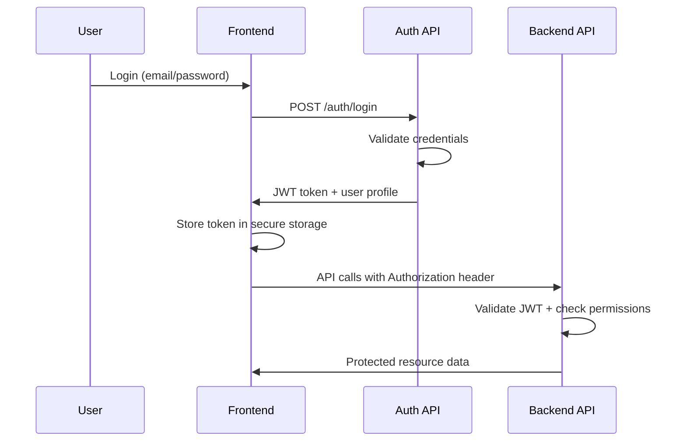

# Single-Tenant Role-Based Access Control (RBAC) Specification

## Executive Summary

This document defines the Role-Based Access Control (RBAC) system for the AI Enablement Platform frontend. The system provides secure, granular access control within a single-tenant environment, supporting multiple user roles with different permission levels for document management, AI model configuration, and system administration.

**Key Features:**
- Single-tenant architecture with multi-user support
- Hierarchical role-based permissions
- Granular resource-level access control
- Session-based authentication with JWT tokens
- Frontend route protection and UI element visibility control
- API endpoint authorization integration

---

## 1. Authentication Architecture

### 1.1 Authentication Flow



### 1.2 Token Structure

**JWT Token Payload:**
```json
{
  "sub": "user_id_123",
  "email": "user@company.com",
  "role": "analyst",
  "permissions": [
    "documents:read",
    "documents:upload",
    "search:execute"
  ],
  "customer_id": "local-dev",
  "session_id": "sess_abc123",
  "iat": 1695123456,
  "exp": 1695209856,
  "iss": "ai-enablement-platform"
}
```

### 1.3 Session Management

- **Session Duration:** 8 hours (configurable)
- **Refresh Strategy:** Automatic refresh 15 minutes before expiry
- **Storage:** Secure HTTP-only cookies + localStorage for UI state
- **Logout:** Server-side session invalidation + client-side cleanup

---

## 2. Role Hierarchy & Permissions

### 2.1 Role Definitions

#### **Super Admin**
- **Description:** Full system access and user management
- **Use Case:** Platform administrators, IT managers
- **Users:** 1-2 per organization

#### **Admin**
- **Description:** System configuration and user management (except super admin)
- **Use Case:** Department heads, senior managers
- **Users:** 2-5 per organization

#### **Manager**
- **Description:** Team oversight and advanced document management
- **Use Case:** Team leads, project managers
- **Users:** 5-15 per organization

#### **Analyst**
- **Description:** Document analysis and AI model usage
- **Use Case:** Business analysts, researchers
- **Users:** 10-50 per organization

#### **Viewer**
- **Description:** Read-only access to documents and reports
- **Use Case:** Stakeholders, external consultants
- **Users:** Unlimited

### 2.2 Permission Matrix

| Resource | Super Admin | Admin | Manager | Analyst | Viewer |
|----------|-------------|-------|---------|---------|--------|
| **User Management** |
| Create users | ✅ | ✅ | ❌ | ❌ | ❌ |
| Edit users | ✅ | ✅* | ❌ | ❌ | ❌ |
| Delete users | ✅ | ✅* | ❌ | ❌ | ❌ |
| View users | ✅ | ✅ | ✅ | ❌ | ❌ |
| **Document Management** |
| Upload documents | ✅ | ✅ | ✅ | ✅ | ❌ |
| Edit documents | ✅ | ✅ | ✅ | ✅** | ❌ |
| Delete documents | ✅ | ✅ | ✅ | ❌ | ❌ |
| View documents | ✅ | ✅ | ✅ | ✅ | ✅ |
| **Search & Analysis** |
| Execute searches | ✅ | ✅ | ✅ | ✅ | ✅ |
| Advanced search | ✅ | ✅ | ✅ | ✅ | ❌ |
| Export results | ✅ | ✅ | ✅ | ✅ | ❌ |
| **AI Model Configuration** |
| Configure models | ✅ | ✅ | ❌ | ❌ | ❌ |
| Test models | ✅ | ✅ | ✅ | ❌ | ❌ |
| View model status | ✅ | ✅ | ✅ | ✅ | ❌ |
| **System Administration** |
| System settings | ✅ | ❌ | ❌ | ❌ | ❌ |
| View logs | ✅ | ✅ | ❌ | ❌ | ❌ |
| Health monitoring | ✅ | ✅ | ✅ | ❌ | ❌ |

*Admin cannot edit/delete Super Admin users  
**Analyst can only edit documents they uploaded

---

## 3. Frontend Implementation

### 3.1 Route Protection

```typescript
// Route protection configuration
export const routePermissions = {
  '/dashboard': ['documents:read'],
  '/documents': ['documents:read'],
  '/documents/upload': ['documents:upload'],
  '/documents/:id/edit': ['documents:edit'],
  '/search': ['search:execute'],
  '/search/advanced': ['search:advanced'],
  '/admin/users': ['users:read'],
  '/admin/models': ['models:configure'],
  '/admin/system': ['system:admin']
};

// Protected Route Component
const ProtectedRoute: React.FC<{
  children: React.ReactNode;
  requiredPermissions: string[];
}> = ({ children, requiredPermissions }) => {
  const { user, hasPermissions } = useAuth();
  
  if (!user) {
    return <Navigate to="/login" />;
  }
  
  if (!hasPermissions(requiredPermissions)) {
    return <UnauthorizedPage />;
  }
  
  return <>{children}</>;
};
```

### 3.2 Component-Level Access Control

```typescript
// Permission-based component rendering
const DocumentActions: React.FC<{ document: Document }> = ({ document }) => {
  const { hasPermission, user } = useAuth();
  
  return (
    <div className="document-actions">
      {hasPermission('documents:edit') && (
        <Button onClick={() => editDocument(document.id)}>
          Edit
        </Button>
      )}
      
      {(hasPermission('documents:delete') || 
        (hasPermission('documents:edit') && document.uploaded_by === user.id)) && (
        <Button variant="danger" onClick={() => deleteDocument(document.id)}>
          Delete
        </Button>
      )}
      
      <Button onClick={() => viewDocument(document.id)}>
        View
      </Button>
    </div>
  );
};
```

### 3.3 Navigation Menu Control

```typescript
// Dynamic navigation based on permissions
export const navigationConfig = [
  {
    label: 'Dashboard',
    path: '/dashboard',
    icon: 'dashboard',
    requiredPermissions: ['documents:read']
  },
  {
    label: 'Documents',
    path: '/documents',
    icon: 'documents',
    requiredPermissions: ['documents:read'],
    children: [
      {
        label: 'Upload',
        path: '/documents/upload',
        requiredPermissions: ['documents:upload']
      },
      {
        label: 'Manage',
        path: '/documents/manage',
        requiredPermissions: ['documents:edit']
      }
    ]
  },
  {
    label: 'Search',
    path: '/search',
    icon: 'search',
    requiredPermissions: ['search:execute']
  },
  {
    label: 'Administration',
    path: '/admin',
    icon: 'admin',
    requiredPermissions: ['users:read', 'models:configure'],
    requiresAny: true,
    children: [
      {
        label: 'Users',
        path: '/admin/users',
        requiredPermissions: ['users:read']
      },
      {
        label: 'AI Models',
        path: '/admin/models',
        requiredPermissions: ['models:configure']
      },
      {
        label: 'System',
        path: '/admin/system',
        requiredPermissions: ['system:admin']
      }
    ]
  }
];
```

---

## 4. Permission System

### 4.1 Permission Categories

#### **Document Permissions**
- `documents:read` - View documents and metadata (all documents)
- `documents:read_department` - View department documents only
- `documents:read_team` - View team documents only
- `documents:upload` - Upload new documents
- `documents:edit_own` - Modify own document metadata and content
- `documents:edit_team` - Modify team document metadata and content
- `documents:edit_all` - Modify any document metadata and content
- `documents:delete_own` - Remove own documents from system
- `documents:delete_all` - Remove any documents from system
- `documents:share` - Share documents with other users

#### **Search Permissions**
- `search:execute` - Perform basic document searches
- `search:advanced` - Use advanced search features and filters
- `search:export` - Export search results and reports

#### **User Management Permissions**
- `users:read` - View user profiles and lists
- `users:create` - Create new user accounts
- `users:edit` - Modify user profiles and roles
- `users:delete` - Remove user accounts
- `users:invite` - Send user invitations

#### **AI Model Permissions**
- `models:read` - View AI model configurations and status
- `models:configure` - Modify AI model settings
- `models:test` - Execute model tests and validations

#### **System Permissions**
- `system:admin` - Access system administration features
- `system:logs` - View system logs and audit trails
- `system:health` - Monitor system health and performance
- `system:backup` - Manage system backups and recovery

### 4.2 Permission Inheritance

#### **Hierarchical Role System**
```typescript
// True hierarchical inheritance with automatic permission expansion
const baseRolePermissions = {
  'viewer': [
    'documents:read',
    'search:execute'
  ],
  'analyst': [
    'documents:upload',
    'documents:edit_own', // Can only edit own documents
    'search:advanced',
    'search:export',
    'models:read'
  ],
  'manager': [
    'documents:edit_all', // Can edit all documents
    'documents:delete',
    'users:read',
    'models:test',
    'system:health'
  ],
  'admin': [
    'users:create',
    'users:edit',
    'users:delete',
    'models:configure',
    'system:logs'
  ],
  'super_admin': [
    'system:admin',
    'system:backup',
    'users:*', // All user permissions
    'models:*', // All model permissions
    'system:*' // All system permissions
  ]
};

// Helper function for hierarchical inheritance
const expandRolePermissions = (role: string): string[] => {
  const hierarchy = ['viewer', 'analyst', 'manager', 'admin', 'super_admin'];
  const roleIndex = hierarchy.indexOf(role);
  
  if (roleIndex === -1) return [];
  
  return hierarchy
    .slice(0, roleIndex + 1)
    .flatMap(r => baseRolePermissions[r] || []);
};

// Enhanced permission structure with scoping
interface Permission {
  resource: string;
  action: string;
  scope?: 'own' | 'team' | 'department' | 'all';
  conditions?: {
    department?: string[];
    document_status?: string[];
    time_restrictions?: TimeWindow;
    ip_restrictions?: string[];
  };
}

// Resource-level permission examples
const enhancedPermissions = [
  'documents:read_all',        // Can read all documents
  'documents:read_department', // Can read department documents only
  'documents:edit_own',        // Can only edit own documents
  'documents:edit_team',       // Can edit team documents
  'documents:edit_all',        // Can edit all documents
  'documents:delete_own',      // Can delete own documents
  'documents:delete_all'       // Can delete any documents
];
```

#### **Permission Validation Function**
```typescript
// Enhanced permission checking with resource ownership
const hasPermission = (
  userPermissions: string[], 
  requiredPermission: string, 
  resource?: any, 
  user?: User
): boolean => {
  // Check for wildcard permissions
  const [category, action] = requiredPermission.split(':');
  if (userPermissions.includes(`${category}:*`)) {
    return true;
  }
  
  // Check for exact permission
  if (userPermissions.includes(requiredPermission)) {
    return true;
  }
  
  // Check for scoped permissions
  if (resource && user) {
    // Check ownership-based permissions
    if (requiredPermission.endsWith('_own') && resource.uploaded_by === user.id) {
      return userPermissions.includes(requiredPermission);
    }
    
    // Check department-based permissions
    if (requiredPermission.endsWith('_department') && 
        resource.department === user.department) {
      return userPermissions.includes(requiredPermission);
    }
    
    // Check team-based permissions
    if (requiredPermission.endsWith('_team') && 
        resource.team === user.team) {
      return userPermissions.includes(requiredPermission);
    }
  }
  
  return false;
};
```

---

## 5. API Integration

### 5.1 Authentication Endpoints

```typescript
// Authentication API interface
export interface AuthAPI {
  // Login
  login(credentials: LoginCredentials): Promise<AuthResponse>;
  
  // Logout
  logout(): Promise<void>;
  
  // Token refresh
  refreshToken(): Promise<AuthResponse>;
  
  // Password reset
  requestPasswordReset(email: string): Promise<void>;
  resetPassword(token: string, newPassword: string): Promise<void>;
  
  // Profile management
  getProfile(): Promise<UserProfile>;
  updateProfile(profile: Partial<UserProfile>): Promise<UserProfile>;
}

export interface LoginCredentials {
  email: string;
  password: string;
  rememberMe?: boolean;
}

export interface AuthResponse {
  token: string;
  refreshToken: string;
  user: UserProfile;
  expiresIn: number;
}
```

### 5.2 Authorization Headers

```typescript
// API client with automatic authorization
class APIClient {
  private token: string | null = null;
  
  setToken(token: string) {
    this.token = token;
  }
  
  async request<T>(endpoint: string, options: RequestInit = {}): Promise<T> {
    const headers = {
      'Content-Type': 'application/json',
      ...options.headers,
    };
    
    if (this.token) {
      headers['Authorization'] = `Bearer ${this.token}`;
    }
    
    const response = await fetch(`${API_BASE_URL}${endpoint}`, {
      ...options,
      headers,
    });
    
    if (response.status === 401) {
      // Token expired or invalid
      await this.handleUnauthorized();
      throw new Error('Unauthorized');
    }
    
    if (!response.ok) {
      throw new Error(`API Error: ${response.statusText}`);
    }
    
    return response.json();
  }
  
  private async handleUnauthorized() {
    // Clear token and redirect to login
    this.token = null;
    localStorage.removeItem('auth_token');
    window.location.href = '/login';
  }
}
```

---

## 6. Database Schema Enhancements

### 6.1 Audit Trail Implementation

#### **Comprehensive Audit Logging Schema**
```sql
-- User action audit trail
CREATE TABLE user_audit_log (
  id SERIAL PRIMARY KEY,
  user_id INTEGER REFERENCES users(id),
  action VARCHAR(100) NOT NULL,
  resource_type VARCHAR(50),
  resource_id VARCHAR(100),
  old_values JSONB,
  new_values JSONB,
  ip_address INET,
  user_agent TEXT,
  session_id VARCHAR(255),
  created_at TIMESTAMP DEFAULT NOW()
);

-- Permission and role change tracking
CREATE TABLE permission_changes (
  id SERIAL PRIMARY KEY,
  user_id INTEGER REFERENCES users(id),
  changed_by INTEGER REFERENCES users(id),
  old_role VARCHAR(50),
  new_role VARCHAR(50),
  old_permissions TEXT[],
  new_permissions TEXT[],
  reason TEXT,
  created_at TIMESTAMP DEFAULT NOW()
);

-- Login attempt tracking for security monitoring
CREATE TABLE login_attempts (
  id SERIAL PRIMARY KEY,
  email VARCHAR(255),
  ip_address INET,
  user_agent TEXT,
  success BOOLEAN,
  failure_reason VARCHAR(100),
  created_at TIMESTAMP DEFAULT NOW()
);

-- Enhanced user table for security features
ALTER TABLE users ADD COLUMN department VARCHAR(100);
ALTER TABLE users ADD COLUMN team VARCHAR(100);
ALTER TABLE users ADD COLUMN password_changed_at TIMESTAMP;
ALTER TABLE users ADD COLUMN failed_login_attempts INTEGER DEFAULT 0;
ALTER TABLE users ADD COLUMN locked_until TIMESTAMP;
ALTER TABLE users ADD COLUMN mfa_enabled BOOLEAN DEFAULT FALSE;
ALTER TABLE users ADD COLUMN mfa_secret VARCHAR(255);

-- Password history for preventing reuse
CREATE TABLE password_history (
  id SERIAL PRIMARY KEY,
  user_id INTEGER REFERENCES users(id),
  password_hash VARCHAR(255),
  created_at TIMESTAMP DEFAULT NOW()
);

-- Enhanced document table for ownership and access control
ALTER TABLE documents ADD COLUMN department VARCHAR(100);
ALTER TABLE documents ADD COLUMN team VARCHAR(100);
ALTER TABLE documents ADD COLUMN uploaded_by INTEGER REFERENCES users(id);
ALTER TABLE documents ADD COLUMN document_status VARCHAR(50) DEFAULT 'draft';
```

### 6.2 Temporary Role Assignments

#### **Temporary Elevated Access Schema**
```sql
-- Temporary role assignments for project-based access
CREATE TABLE temporary_role_assignments (
  id SERIAL PRIMARY KEY,
  user_id INTEGER REFERENCES users(id),
  role VARCHAR(50) NOT NULL,
  granted_by INTEGER REFERENCES users(id),
  expires_at TIMESTAMP NOT NULL,
  reason TEXT NOT NULL,
  auto_revoke BOOLEAN DEFAULT TRUE,
  created_at TIMESTAMP DEFAULT NOW()
);

-- Function to automatically revoke expired temporary roles
CREATE OR REPLACE FUNCTION revoke_expired_roles()
RETURNS void AS $$
BEGIN
  UPDATE temporary_role_assignments 
  SET auto_revoke = FALSE 
  WHERE expires_at < NOW() AND auto_revoke = TRUE;
  
  -- Log the revocation
  INSERT INTO user_audit_log (user_id, action, resource_type, created_at)
  SELECT user_id, 'temporary_role_revoked', 'role', NOW()
  FROM temporary_role_assignments 
  WHERE expires_at < NOW() AND auto_revoke = FALSE;
END;
$$ LANGUAGE plpgsql;
```

### 6.3 API Key Management

#### **Scoped API Key System**
```sql
-- API keys with scoped permissions and rate limiting
CREATE TABLE api_keys (
  id SERIAL PRIMARY KEY,
  user_id INTEGER REFERENCES users(id),
  key_hash VARCHAR(255) UNIQUE,
  name VARCHAR(100),
  scoped_permissions TEXT[],
  rate_limit INTEGER DEFAULT 1000,
  allowed_endpoints TEXT[],
  last_used_at TIMESTAMP,
  expires_at TIMESTAMP,
  is_active BOOLEAN DEFAULT TRUE,
  created_at TIMESTAMP DEFAULT NOW()
);

-- API usage tracking for monitoring and billing
CREATE TABLE api_usage_log (
  id SERIAL PRIMARY KEY,
  api_key_id INTEGER REFERENCES api_keys(id),
  endpoint VARCHAR(255),
  method VARCHAR(10),
  status_code INTEGER,
  response_time_ms INTEGER,
  ip_address INET,
  created_at TIMESTAMP DEFAULT NOW()
);
```

---

## 7. Security Considerations

### 7.1 Enhanced Security Features

#### **Password Policy Configuration**
```typescript
interface PasswordPolicy {
  minLength: number;
  requireUppercase: boolean;
  requireLowercase: boolean;
  requireNumbers: boolean;
  requireSpecialChars: boolean;
  maxAge: number; // days before forced reset
  preventReuse: number; // last N passwords to prevent
  complexityScore: number; // minimum entropy score
  commonPasswordCheck: boolean; // check against common passwords
}

interface SecuritySettings {
  maxFailedAttempts: number;
  lockoutDuration: number; // minutes
  requireMFA: string[]; // roles requiring MFA
  sessionTimeout: number; // minutes of inactivity
  maxConcurrentSessions: number;
  ipWhitelist?: string[]; // CIDR blocks for admin access
  forcePasswordReset: boolean; // force reset on first login
}

// Default security configuration
const defaultSecurityConfig: SecuritySettings = {
  maxFailedAttempts: 5,
  lockoutDuration: 30,
  requireMFA: ['super_admin', 'admin'],
  sessionTimeout: 480, // 8 hours
  maxConcurrentSessions: 3,
  forcePasswordReset: true
};
```

#### **Account Lockout and Security Monitoring**
```typescript
// Account security service
class AccountSecurityService {
  async recordLoginAttempt(
    email: string, 
    success: boolean, 
    ipAddress: string, 
    userAgent: string,
    failureReason?: string
  ) {
    await db.query(`
      INSERT INTO login_attempts (email, ip_address, user_agent, success, failure_reason)
      VALUES ($1, $2, $3, $4, $5)
    `, [email, ipAddress, userAgent, success, failureReason]);
    
    if (!success) {
      await this.handleFailedLogin(email, ipAddress);
    }
  }
  
  async handleFailedLogin(email: string, ipAddress: string) {
    const user = await this.getUserByEmail(email);
    if (!user) return;
    
    const attempts = user.failed_login_attempts + 1;
    const lockoutTime = attempts >= defaultSecurityConfig.maxFailedAttempts 
      ? new Date(Date.now() + defaultSecurityConfig.lockoutDuration * 60000)
      : null;
    
    await db.query(`
      UPDATE users 
      SET failed_login_attempts = $1, locked_until = $2
      WHERE id = $3
    `, [attempts, lockoutTime, user.id]);
    
    // Alert on suspicious activity
    if (attempts >= 3) {
      await this.alertSuspiciousActivity(user, ipAddress, attempts);
    }
  }
}
```

### 7.2 Frontend Security

#### **Token Storage**
- **Access Token:** Memory only (React state/context)
- **Refresh Token:** Secure HTTP-only cookie
- **User Preferences:** localStorage (non-sensitive data only)

#### **XSS Protection**
- Content Security Policy (CSP) headers
- Input sanitization for all user-generated content
- Escape HTML in document previews

#### **CSRF Protection**
- SameSite cookie attributes
- CSRF tokens for state-changing operations
- Origin header validation

### 7.3 Session Security

#### **Session Timeout**
- Automatic logout after 8 hours of inactivity
- Warning dialog 5 minutes before timeout
- Activity tracking for session extension

#### **Concurrent Sessions**
- Maximum 3 concurrent sessions per user
- Session invalidation on password change
- Device/browser identification

### 7.4 Permission Validation

#### **Client-Side Validation**
- UI element visibility control
- Route access protection
- Form field enabling/disabling

#### **Server-Side Validation**
- All API endpoints validate permissions
- Resource ownership verification
- Rate limiting per user role

---

## 8. Advanced Features

### 8.1 Permission Request Workflow

#### **Self-Service Permission Requests**
```typescript
interface PermissionRequest {
  id: string;
  userId: string;
  requestedPermissions: string[];
  requestedRole?: string;
  justification: string;
  businessCase: string;
  approver?: string;
  status: 'pending' | 'approved' | 'denied' | 'expired';
  reviewedAt?: Date;
  reviewNotes?: string;
  expiresAt?: Date;
  createdAt: Date;
}

// Permission request component
const PermissionRequestButton: React.FC<{ permission: string }> = ({ permission }) => {
  const { user } = useAuth();
  const requiredRole = getRequiredRole(permission);
  
  const handleRequestPermission = async () => {
    const request: Partial<PermissionRequest> = {
      userId: user.id,
      requestedPermissions: [permission],
      justification: '', // User will fill this in modal
      businessCase: '',
      status: 'pending'
    };
    
    // Open request modal
    openPermissionRequestModal(request);
  };
  
  return (
    <Tooltip content={`Available with ${requiredRole} role or higher`}>
      <Button 
        variant="outline" 
        size="sm"
        onClick={handleRequestPermission}
      >
        Request Access
      </Button>
    </Tooltip>
  );
};
```

### 8.2 Contextual Permissions

#### **Time and Condition-Based Access Control**
```typescript
interface ContextualPermission {
  permission: string;
  conditions: {
    timeWindow?: {
      start: string; // "09:00"
      end: string;   // "17:00"
      timezone: string;
      weekdays?: number[]; // 1-7 (Monday-Sunday)
    };
    ipRestrictions?: string[]; // CIDR blocks
    deviceRestrictions?: string[]; // device fingerprints
    locationRestrictions?: string[]; // country codes
    documentStatus?: string[]; // draft, review, published
  };
}

// Contextual permission validation
const validateContextualPermission = (
  permission: ContextualPermission,
  context: {
    currentTime: Date;
    ipAddress: string;
    deviceFingerprint: string;
    location: string;
    documentStatus?: string;
  }
): boolean => {
  const { conditions } = permission;
  
  // Time window validation
  if (conditions.timeWindow) {
    const { start, end, timezone, weekdays } = conditions.timeWindow;
    const now = new Date().toLocaleString('en-US', { timeZone: timezone });
    const currentTime = new Date(now);
    const currentHour = currentTime.getHours();
    const currentDay = currentTime.getDay();
    
    const startHour = parseInt(start.split(':')[0]);
    const endHour = parseInt(end.split(':')[0]);
    
    if (currentHour < startHour || currentHour >= endHour) {
      return false;
    }
    
    if (weekdays && !weekdays.includes(currentDay)) {
      return false;
    }
  }
  
  // IP restriction validation
  if (conditions.ipRestrictions) {
    const isAllowedIP = conditions.ipRestrictions.some(cidr => 
      isIPInCIDR(context.ipAddress, cidr)
    );
    if (!isAllowedIP) return false;
  }
  
  // Document status validation
  if (conditions.documentStatus && context.documentStatus) {
    if (!conditions.documentStatus.includes(context.documentStatus)) {
      return false;
    }
  }
  
  return true;
};
```

---

## 9. User Experience

### 9.1 Role-Based UI Adaptation

#### **Dashboard Customization**
```typescript
// Role-specific dashboard widgets
const getDashboardWidgets = (userRole: string) => {
  const baseWidgets = ['recent-documents', 'search-history'];
  
  switch (userRole) {
    case 'super_admin':
    case 'admin':
      return [...baseWidgets, 'user-activity', 'system-health', 'model-status'];
    case 'manager':
      return [...baseWidgets, 'team-activity', 'document-stats'];
    case 'analyst':
      return [...baseWidgets, 'my-documents', 'search-suggestions'];
    case 'viewer':
      return ['recent-documents', 'shared-documents'];
    default:
      return baseWidgets;
  }
};
```

#### **Contextual Help**
- Role-specific onboarding flows
- Feature availability explanations
- Permission upgrade suggestions

### 9.2 Enhanced Error Handling & User Guidance

#### **Progressive Permission Disclosure**
```typescript
// Smart permission hints that guide users
const PermissionGuidance: React.FC<{ 
  requiredPermission: string;
  currentUserRole: string;
}> = ({ requiredPermission, currentUserRole }) => {
  const nextRole = getNextRoleWithPermission(requiredPermission, currentUserRole);
  const canRequestAccess = canUserRequestPermission(requiredPermission, currentUserRole);
  
  return (
    <div className="permission-guidance">
      <div className="permission-info">
        <Icon name="info" className="text-blue-500" />
        <span>This feature requires <strong>{requiredPermission}</strong></span>
      </div>
      
      {nextRole && (
        <div className="upgrade-suggestion">
          <p>Available with <strong>{nextRole}</strong> role or higher</p>
          {canRequestAccess && (
            <Button 
              variant="outline" 
              size="sm" 
              onClick={() => requestRoleUpgrade(nextRole)}
            >
              Request {nextRole} Access
            </Button>
          )}
        </div>
      )}
      
      <div className="current-permissions">
        <details>
          <summary>View your current permissions</summary>
          <PermissionList userRole={currentUserRole} />
        </details>
      </div>
    </div>
  );
};
```

### 9.3 Error Handling

#### **Permission Denied States**
```typescript
// Permission denied component
const PermissionDenied: React.FC<{
  requiredPermission: string;
  currentRole: string;
}> = ({ requiredPermission, currentRole }) => {
  return (
    <div className="permission-denied">
      <Icon name="lock" size="large" />
      <h3>Access Restricted</h3>
      <p>
        Your current role ({currentRole}) doesn't have permission to access this feature.
      </p>
      <p>
        Required permission: <code>{requiredPermission}</code>
      </p>
      <Button onClick={() => contactAdmin()}>
        Request Access
      </Button>
    </div>
  );
};
```

---

## 10. Implementation Phases

### 10.1 Phase 1: Core Authentication & Security (Week 1-2)
- [ ] Login/logout functionality with security monitoring
- [ ] JWT token management with refresh strategy
- [ ] Basic route protection with permission validation
- [ ] User profile display with role information
- [ ] Audit trail database schema implementation
- [ ] Password policy enforcement
- [ ] Account lockout mechanism

### 10.2 Phase 2: Enhanced RBAC & Resource Control (Week 3-4)
- [ ] Hierarchical role inheritance system
- [ ] Resource-level permission validation (own/team/department/all)
- [ ] Permission-based component rendering with ownership checks
- [ ] API authorization integration with scoped permissions
- [ ] User management interface with audit logging
- [ ] Document ownership and team-based access control

### 10.3 Phase 3: Advanced Security & UX (Week 5-6)
- [ ] Enhanced session management with concurrent session limits
- [ ] Password reset flow with security validation
- [ ] Comprehensive audit logging with compliance reporting
- [ ] Permission request workflow with approval process
- [ ] Temporary role assignments for project access
- [ ] MFA implementation for admin roles
- [ ] API key management with scoping and rate limiting

### 10.4 Phase 4: Advanced Features & Optimization (Week 7-8)
- [ ] Contextual permissions with time/IP restrictions
- [ ] Progressive permission disclosure and user guidance
- [ ] Security headers implementation and hardening
- [ ] XSS/CSRF protection with CSP policies
- [ ] Rate limiting per user role and API endpoints
- [ ] Comprehensive security testing and penetration testing
- [ ] Performance optimization for permission checks
- [ ] Compliance reporting and audit trail analysis

---

## 11. Testing Strategy

### 11.1 Unit Tests
- Permission checking functions
- Route protection components
- Authentication state management
- API client authorization

### 11.2 Integration Tests
- Login/logout flows
- Role-based navigation
- API permission validation
- Session timeout handling

### 11.3 E2E Tests
- Complete user workflows per role
- Permission boundary testing
- Security vulnerability testing
- Cross-browser compatibility

---

## 12. Monitoring & Analytics

### 12.1 Security Metrics
- Failed login attempts
- Permission denied events
- Session timeout rates
- Concurrent session counts

### 12.2 Usage Analytics
- Feature usage by role
- Most accessed resources
- User journey analysis
- Performance metrics

---

## 13. Quick Implementation Wins

These high-impact features can be implemented immediately with minimal effort:

### 13.1 Immediate Security Improvements
1. **Audit Logging**: Create audit tables and add logging middleware (1-2 days)
2. **Password Policy**: Implement client-side validation + server enforcement (1 day)
3. **Resource Ownership**: Add `uploaded_by` column to documents table (2 hours)
4. **Permission Request UI**: Create simple form + approval workflow (2-3 days)

### 13.2 User Experience Enhancements
1. **Permission Hints**: Add tooltips showing required roles for disabled features (1 day)
2. **Progressive Disclosure**: Show/hide UI elements based on permissions (1 day)
3. **Role Comparison**: Create role comparison matrix for admins (1 day)

### 13.3 Success Metrics
- **Security**: Zero permission escalation incidents
- **Usability**: <5% permission-related support tickets
- **Compliance**: 100% audit trail coverage for sensitive operations
- **Performance**: <100ms permission check latency
- **User Satisfaction**: >4.5/5.0 rating for permission clarity

---

This enhanced RBAC specification provides enterprise-grade security with hierarchical roles, resource-level permissions, comprehensive audit trails, and excellent user experience. The system balances security with usability while maintaining the flexibility needed for different organizational structures and compliance requirements.
