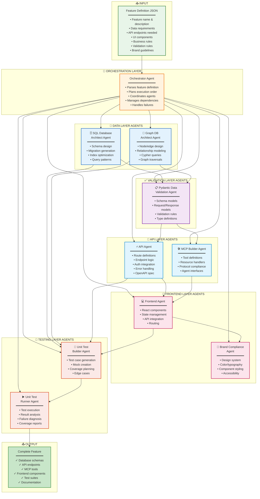
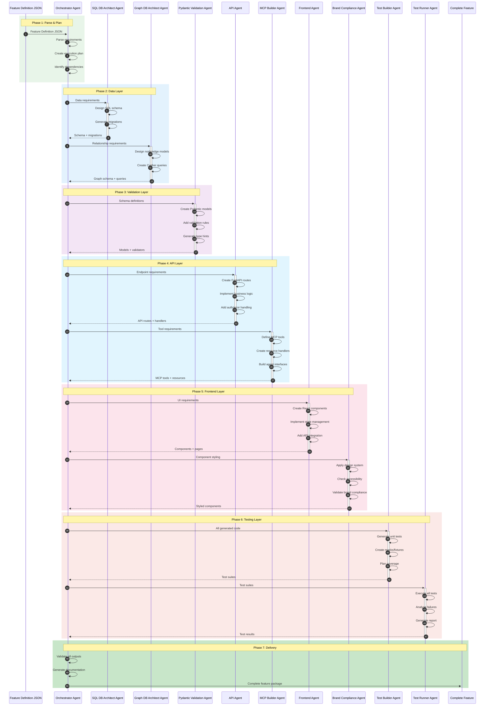
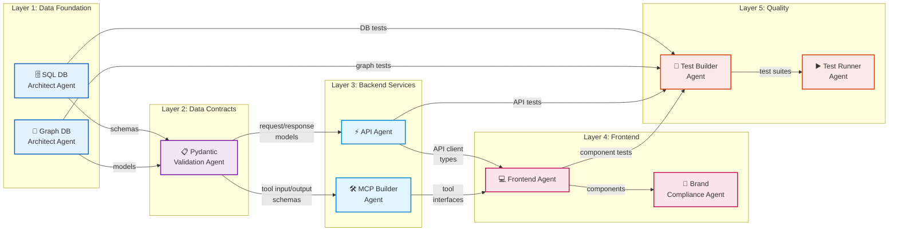
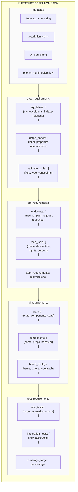
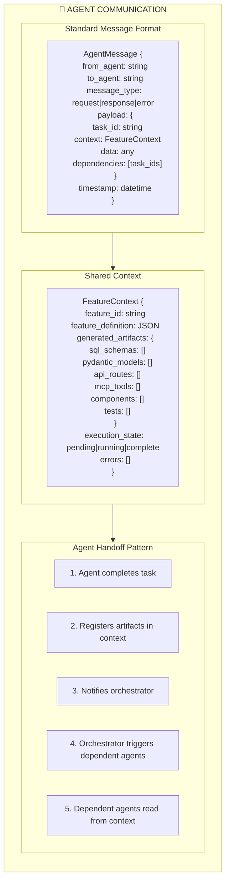

# Multi-Agent Full-Stack Development Architecture

This document illustrates how specialized AI agents collaborate to build complete full-stack features from a standardized feature definition JSON input.

---

## High-Level Agent Orchestration

---

## Agent Execution Flow (Sequence)

---

## Agent Dependency Graph

---

## Feature Definition JSON Schema

---

## Agent Responsibilities Detail

```mermaid
flowchart TB
    subgraph Agents["🤖 AGENT RESPONSIBILITIES"]
        direction TB

        subgraph SQLAgent["🗄️ SQL Database Architect Agent"]
            SQL1["INPUTS:<br/>• Table definitions<br/>• Column specs<br/>• Relationships"]
            SQL2["OUTPUTS:<br/>• CREATE TABLE statements<br/>• Alembic migrations<br/>• Index definitions<br/>• Foreign key constraints"]
            SQL3["CAPABILITIES:<br/>• Schema normalization<br/>• Query optimization<br/>• Migration planning<br/>• Rollback strategies"]
        end

        subgraph GraphAgent["🔗 Graph DB Architect Agent"]
            Graph1["INPUTS:<br/>• Node definitions<br/>• Edge relationships<br/>• Property specs"]
            Graph2["OUTPUTS:<br/>• Cypher CREATE statements<br/>• Constraint definitions<br/>• Index configurations<br/>• Query templates"]
            Graph3["CAPABILITIES:<br/>• Relationship modeling<br/>• Traversal optimization<br/>• Pattern matching<br/>• Graph algorithms"]
        end

        subgraph PydanticAgent["📋 Pydantic Validation Agent"]
            Pyd1["INPUTS:<br/>• Field definitions<br/>• Validation rules<br/>• Type requirements"]
            Pyd2["OUTPUTS:<br/>• BaseModel classes<br/>• Field validators<br/>• Type annotations<br/>• JSON schemas"]
            Pyd3["CAPABILITIES:<br/>• Type inference<br/>• Custom validators<br/>• Serialization config<br/>• OpenAPI generation"]
        end

        subgraph APIAgent["⚡ API Agent"]
            API1["INPUTS:<br/>• Endpoint specs<br/>• Request/response models<br/>• Auth requirements"]
            API2["OUTPUTS:<br/>• FastAPI routes<br/>• Dependency injection<br/>• Error handlers<br/>• OpenAPI docs"]
            API3["CAPABILITIES:<br/>• RESTful design<br/>• Auth middleware<br/>• Rate limiting<br/>• Response formatting"]
        end

        subgraph MCPAgent["🛠️ MCP Builder Agent"]
            MCP1["INPUTS:<br/>• Tool definitions<br/>• Resource specs<br/>• Protocol requirements"]
            MCP2["OUTPUTS:<br/>• Tool handlers<br/>• Resource providers<br/>• Schema definitions<br/>• Server config"]
            MCP3["CAPABILITIES:<br/>• Protocol compliance<br/>• Tool orchestration<br/>• Context management<br/>• Error handling"]
        end

        subgraph FrontendAgent["💻 Frontend Agent"]
            FE1["INPUTS:<br/>• Component specs<br/>• Page layouts<br/>• State requirements"]
            FE2["OUTPUTS:<br/>• React components<br/>• Hooks & state<br/>• API clients<br/>• Route configs"]
            FE3["CAPABILITIES:<br/>• Component design<br/>• State management<br/>• API integration<br/>• Performance optimization"]
        end

        subgraph BrandAgent["🎯 Brand Compliance Agent"]
            Brand1["INPUTS:<br/>• Components<br/>• Brand guidelines<br/>• Design system"]
            Brand2["OUTPUTS:<br/>• Styled components<br/>• CSS/Tailwind classes<br/>• Theme tokens<br/>• A11y attributes"]
            Brand3["CAPABILITIES:<br/>• Design system application<br/>• Color/typography<br/>• Responsive design<br/>• Accessibility audit"]
        end

        subgraph TestBuilderAgent["📝 Unit Test Builder Agent"]
            TB1["INPUTS:<br/>• Source code<br/>• Test requirements<br/>• Coverage targets"]
            TB2["OUTPUTS:<br/>• pytest test files<br/>• Jest test files<br/>• Mock factories<br/>• Fixtures"]
            TB3["CAPABILITIES:<br/>• Test case generation<br/>• Edge case identification<br/>• Mock creation<br/>• Coverage planning"]
        end

        subgraph TestRunnerAgent["▶️ Unit Test Runner Agent"]
            TR1["INPUTS:<br/>• Test suites<br/>• Environment config<br/>• Coverage requirements"]
            TR2["OUTPUTS:<br/>• Test results<br/>• Coverage reports<br/>• Failure analysis<br/>• Fix suggestions"]
            TR3["CAPABILITIES:<br/>• Test execution<br/>• Parallel running<br/>• Failure diagnosis<br/>• Regression detection"]
        end
    end
```

---

## End-to-End Feature Build Example

```mermaid
flowchart TB
    subgraph Example["📋 EXAMPLE: Build 'User Preferences' Feature"]
        direction TB

        subgraph Input["Feature Definition"]
            JSON["Feature: User Preferences<br/>━━━━━━━━━━━━━━━<br/>• Store user settings<br/>• Expose via API<br/>• MCP tool access<br/>• Settings UI page"]
        end

        subgraph Phase1["Phase 1: Data Layer"]
            SQL_Out["SQL Agent Output:<br/>━━━━━━━━━━━━━━━<br/>CREATE TABLE user_preferences (<br/>  id SERIAL PRIMARY KEY,<br/>  user_id INT REFERENCES users(id),<br/>  preference_key VARCHAR(100),<br/>  preference_value JSONB,<br/>  created_at TIMESTAMP<br/>);"]
            
            Graph_Out["Graph Agent Output:<br/>━━━━━━━━━━━━━━━<br/>(:User)-[:HAS_PREFERENCE]->(:Preference)<br/>(:Preference {key, value, category})"]
        end

        subgraph Phase2["Phase 2: Validation"]
            Pydantic_Out["Pydantic Agent Output:<br/>━━━━━━━━━━━━━━━<br/>class UserPreference(BaseModel):<br/>  user_id: int<br/>  key: str = Field(max_length=100)<br/>  value: dict<br/>  <br/>class PreferenceUpdate(BaseModel):<br/>  key: str<br/>  value: dict"]
        end

        subgraph Phase3["Phase 3: API Layer"]
            API_Out["API Agent Output:<br/>━━━━━━━━━━━━━━━<br/>@router.get('/preferences')<br/>@router.put('/preferences/{key}')<br/>@router.delete('/preferences/{key}')"]
            
            MCP_Out["MCP Agent Output:<br/>━━━━━━━━━━━━━━━<br/>@tool('get_user_preferences')<br/>@tool('update_user_preference')<br/>@resource('user://preferences')"]
        end

        subgraph Phase4["Phase 4: Frontend"]
            FE_Out["Frontend Agent Output:<br/>━━━━━━━━━━━━━━━<br/>PreferencesPage.tsx<br/>PreferenceCard.tsx<br/>PreferenceForm.tsx<br/>usePreferences.ts"]
            
            Brand_Out["Brand Agent Output:<br/>━━━━━━━━━━━━━━━<br/>Styled with design system<br/>Dark/light mode support<br/>Accessible form controls"]
        end

        subgraph Phase5["Phase 5: Testing"]
            Test_Out["Test Builder Output:<br/>━━━━━━━━━━━━━━━<br/>test_preferences_api.py<br/>test_preferences_service.py<br/>PreferencesPage.test.tsx"]
            
            Run_Out["Test Runner Output:<br/>━━━━━━━━━━━━━━━<br/>✓ 24 tests passed<br/>✓ 92% coverage<br/>✓ No regressions"]
        end

        subgraph Output["Complete Feature"]
            Final["✅ User Preferences Feature<br/>━━━━━━━━━━━━━━━<br/>• Database migration<br/>• 3 API endpoints<br/>• 2 MCP tools<br/>• 4 React components<br/>• 24 unit tests<br/>• Documentation"]
        end
    end

    JSON --> SQL_Out
    JSON --> Graph_Out
    SQL_Out --> Pydantic_Out
    Graph_Out --> Pydantic_Out
    Pydantic_Out --> API_Out
    Pydantic_Out --> MCP_Out
    API_Out --> FE_Out
    MCP_Out --> FE_Out
    FE_Out --> Brand_Out
    Brand_Out --> Test_Out
    Test_Out --> Run_Out
    Run_Out --> Final

    classDef input fill:#E8F5E9,stroke:#2E7D32,stroke-width:2px
    classDef phase fill:#FAFAFA,stroke:#9E9E9E,stroke-width:1px
    classDef output fill:#C8E6C9,stroke:#388E3C,stroke-width:2px

    class JSON input
    class Final output
```

---

## Agent Communication Protocol

---

## Summary: Agent Roles

| Agent | Layer | Primary Responsibility | Key Outputs |
|-------|-------|----------------------|-------------|
| **SQL DB Architect** | Data | Relational database design | Schemas, migrations, indexes |
| **Graph DB Architect** | Data | Graph database modeling | Nodes, edges, Cypher queries |
| **Pydantic Validation** | Contracts | Data validation & typing | Models, validators, schemas |
| **API Agent** | Backend | REST API implementation | Routes, handlers, OpenAPI |
| **MCP Builder** | Backend | Model Context Protocol tools | Tools, resources, handlers |
| **Frontend Agent** | Frontend | React UI implementation | Components, pages, hooks |
| **Brand Compliance** | Frontend | Design system enforcement | Styling, accessibility |
| **Test Builder** | Quality | Test case generation | Unit tests, mocks, fixtures |
| **Test Runner** | Quality | Test execution & reporting | Results, coverage, analysis |

---

## Benefits of Multi-Agent Architecture

1. **Separation of Concerns** - Each agent specializes in one domain
2. **Parallel Execution** - Independent agents can work simultaneously
3. **Consistent Quality** - Each agent enforces domain-specific best practices
4. **Reusability** - Agents can be reused across different features
5. **Testability** - Each agent's output can be validated independently
6. **Scalability** - Add new agents for new capabilities
7. **Maintainability** - Update one agent without affecting others

