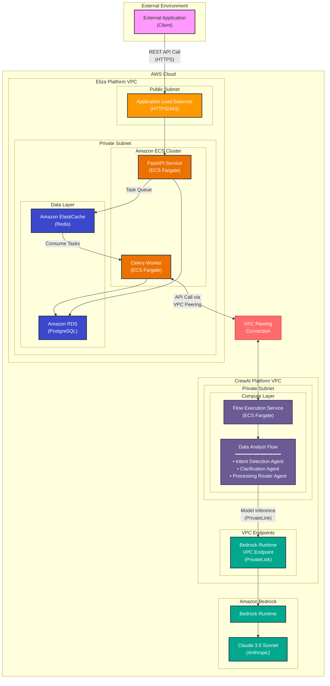
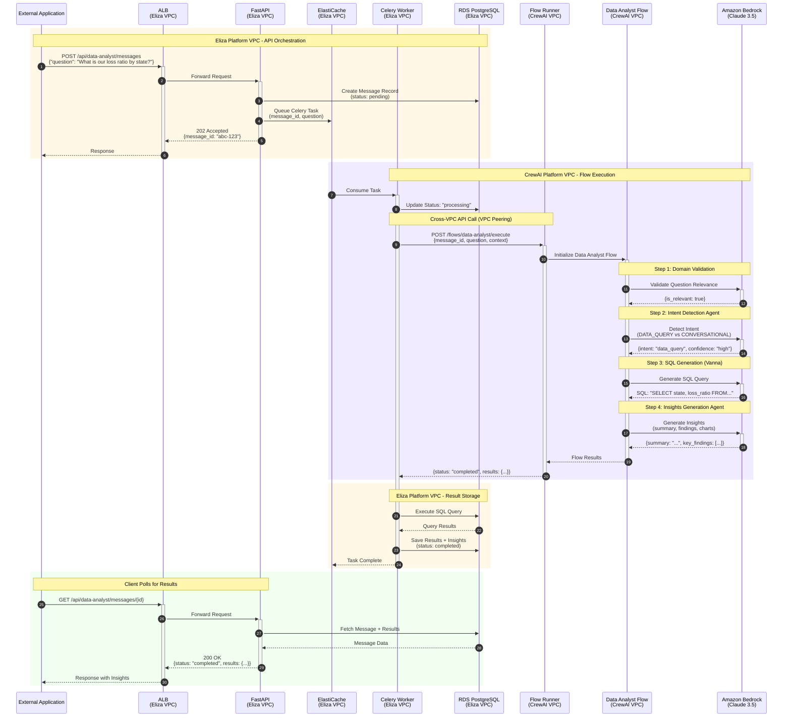
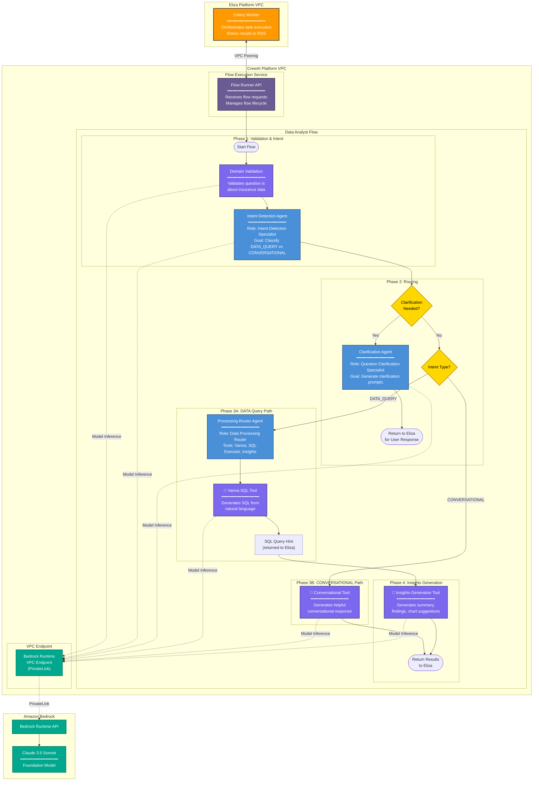
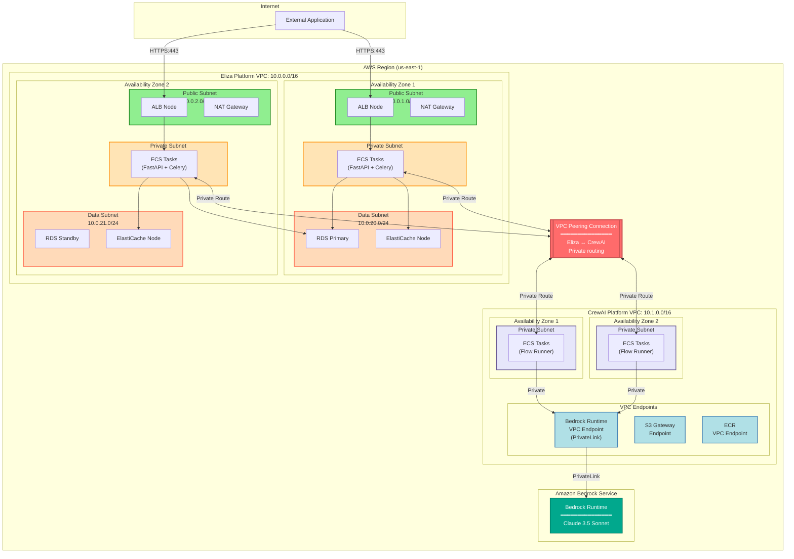

# AWS Architecture: Data Analyst Flow with Eliza + CrewAI Platforms

This document provides AWS-specific architecture diagrams showing the Data Analyst Flow across two separate VPCs: the **Eliza Platform** (API orchestration) and the **CrewAI Platform** (flow execution with Amazon Bedrock).

## Architecture Overview



---

## Data Analyst Flow - Detailed Sequence (Cross-VPC)



---

## Data Analyst Flow - Agent Architecture (CrewAI Platform)



---

## AWS Network Architecture (Dual VPC)



---

## Component Summary

### Eliza Platform VPC

| Component | AWS Service | Purpose |
|-----------|-------------|---------|
| **API Gateway** | Application Load Balancer | HTTPS ingress, SSL termination |
| **API Service** | ECS Fargate (FastAPI) | REST API, request validation, response handling |
| **Task Orchestration** | ECS Fargate (Celery) | Task queuing, cross-VPC flow invocation |
| **Task Queue** | ElastiCache (Redis) | Celery broker and result backend |
| **Database** | RDS PostgreSQL | Message storage, results, telemetry |

### CrewAI Platform VPC

| Component | AWS Service | Purpose |
|-----------|-------------|---------|
| **Flow Runner** | ECS Fargate | Hosts and executes CrewAI flows |
| **Data Analyst Flow** | CrewAI Framework | Agent orchestration, tool execution |
| **AI/ML** | Amazon Bedrock | Foundation model inference (Claude 3.5 Sonnet) |
| **Networking** | VPC Endpoint (PrivateLink) | Secure private connectivity to Bedrock |

### Cross-VPC Communication

| Component | AWS Service | Purpose |
|-----------|-------------|---------|
| **VPC Peering** | VPC Peering Connection | Private network path between Eliza and CrewAI VPCs |

---

## Security Considerations

1. **Network Isolation**: 
   - Eliza Platform handles external traffic via ALB
   - CrewAI Platform has NO internet-facing endpoints
   - Cross-VPC communication via private VPC Peering only

2. **VPC Peering Security**:
   - Non-transitive (only Eliza ↔ CrewAI, not through to Bedrock)
   - Security groups restrict traffic to specific ports/protocols
   - Route tables limit accessible CIDR ranges

3. **Bedrock Access**:
   - CrewAI VPC accesses Bedrock via PrivateLink (traffic never leaves AWS network)
   - IAM roles for ECS tasks (no API keys stored)
   - VPC Endpoint policies restrict Bedrock model access

4. **Data Security**:
   - All data stored in Eliza VPC (RDS, Redis)
   - CrewAI Platform is stateless - only processes, doesn't store
   - TLS encryption in transit between all components

5. **Additional Controls**:
   - AWS WAF on ALB for API protection
   - VPC Flow Logs for network monitoring
   - CloudTrail for API audit logging

---

## Data Flow Summary

```
┌─────────────────────────────────────────────────────────────────────────────┐
│                              EXTERNAL                                        │
│  External App ──► ALB                                                       │
└─────────────────────┬───────────────────────────────────────────────────────┘
                      │ HTTPS
┌─────────────────────▼───────────────────────────────────────────────────────┐
│                         ELIZA PLATFORM VPC                                   │
│  ALB ──► FastAPI ──► Redis Queue ──► Celery Worker ──► RDS                  │
│                                            │                                 │
│                                            │ Results saved                   │
└────────────────────────────────────────────┼────────────────────────────────┘
                                             │ VPC Peering (API Call)
┌────────────────────────────────────────────▼────────────────────────────────┐
│                         CREWAI PLATFORM VPC                                  │
│  Flow Runner ──► Data Analyst Flow ──► Agents ──► Bedrock (Claude)          │
│       │                                                                      │
│       └──────────────────────────────────────────────────────────────────►  │
│                              Flow Results returned                           │
└─────────────────────────────────────────────────────────────────────────────┘
```

1. **External Application** sends question via REST API to Eliza Platform
2. **Eliza Platform** (FastAPI) validates, queues task, returns message_id
3. **Celery Worker** (Eliza) invokes CrewAI Platform via VPC Peering
4. **CrewAI Platform** executes Data Analyst Flow with multiple Bedrock calls
5. **Flow Results** returned to Eliza via VPC Peering
6. **Eliza Platform** executes SQL, stores results in RDS
7. **Client** polls Eliza Platform for completed results
