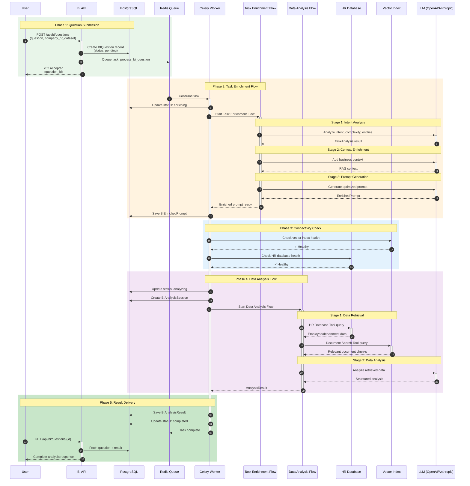
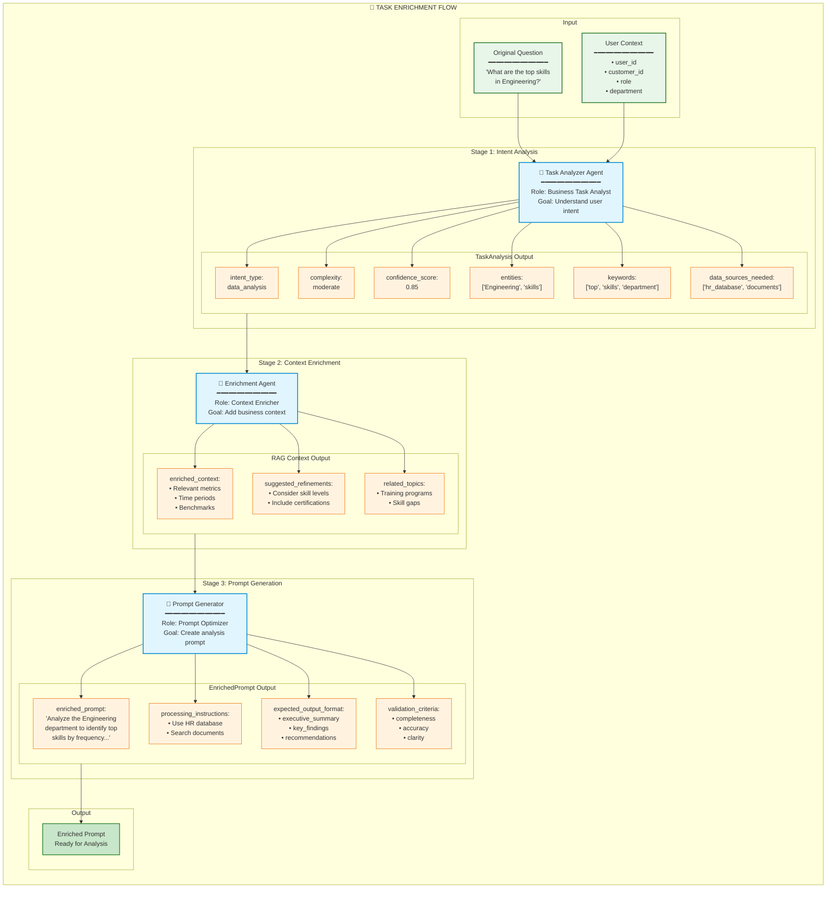
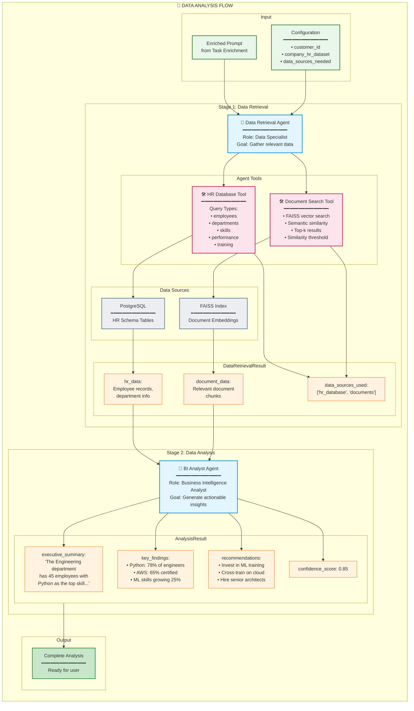
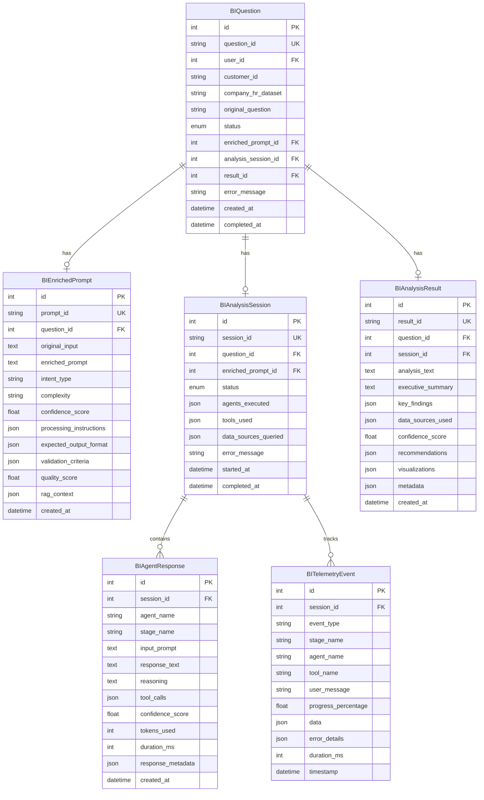
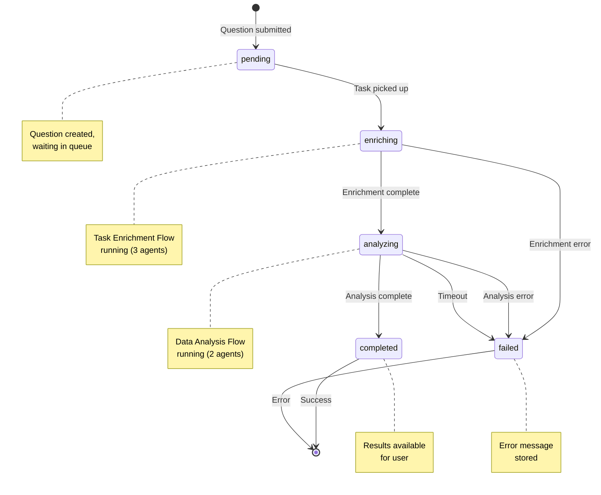
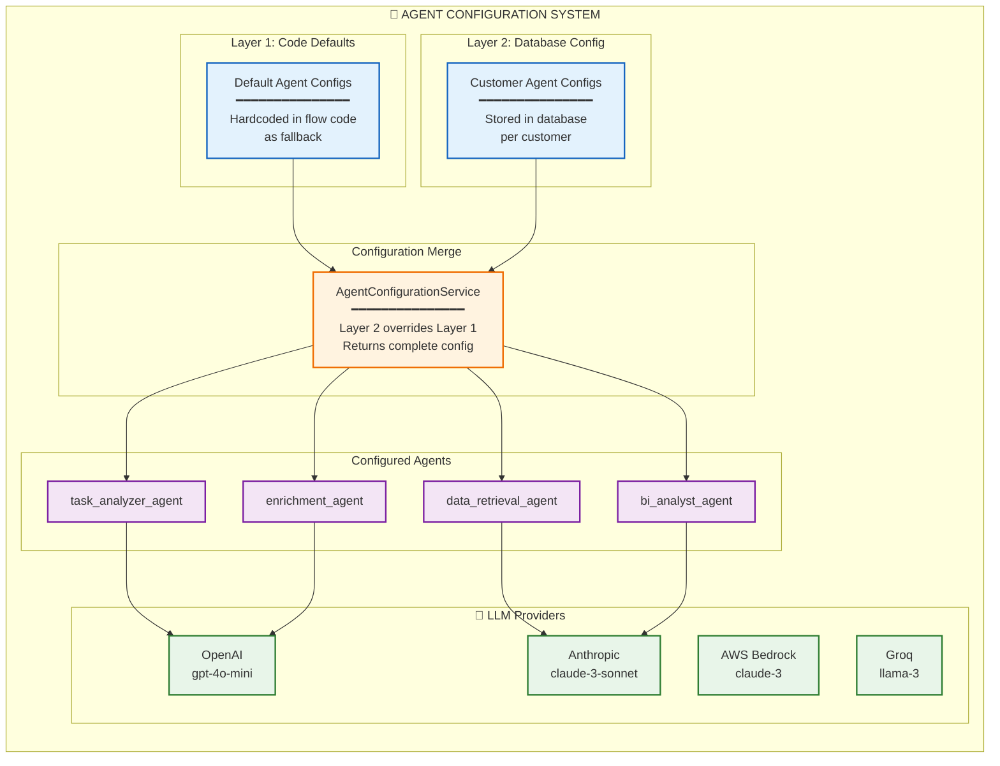

# Business Intelligence Flow Architecture

This document provides architecture diagrams for the Business Intelligence (BI) flow, which processes natural language questions and generates data-driven insights using AI agents.

---

## High-Level Architecture Overview

```mermaid
flowchart TB
    subgraph Input["📥 USER INPUT"]
        User["User"]
        Question["Natural Language Question<br/>━━━━━━━━━━━━━━━<br/>'What are the top skills<br/>in the Engineering department?'"]
    end

    subgraph API["🔌 API LAYER"]
        BIEndpoint["POST /api/bi/questions<br/>━━━━━━━━━━━━━━━<br/>• Validate request<br/>• Create question record<br/>• Queue Celery task"]
    end

    subgraph TaskQueue["📬 TASK QUEUE"]
        Redis["Redis<br/>━━━━━━━━━━━━━━━<br/>Celery Broker"]
        CeleryWorker["Celery Worker<br/>━━━━━━━━━━━━━━━<br/>process_bi_question task"]
    end

    subgraph Flow1["🔄 FLOW 1: Task Enrichment"]
        direction TB
        TEFlow["Task Enrichment Flow<br/>(CrewAI)"]
        
        subgraph TEAgents["Enrichment Agents"]
            IntentAgent["🤖 Task Analyzer Agent<br/>━━━━━━━━━━━━━━━<br/>• Detect intent type<br/>• Assess complexity<br/>• Extract entities"]
            EnrichAgent["🤖 Enrichment Agent<br/>━━━━━━━━━━━━━━━<br/>• Add business context<br/>• Suggest refinements<br/>• Identify related topics"]
            PromptAgent["🤖 Prompt Generator<br/>━━━━━━━━━━━━━━━<br/>• Create optimized prompt<br/>• Define output format<br/>• Set validation criteria"]
        end
    end

    subgraph Connectivity["🔗 CONNECTIVITY CHECK"]
        ConnCheck["Data Source Connectivity<br/>━━━━━━━━━━━━━━━<br/>• Vector Index (required)<br/>• HR Database (optional)"]
    end

    subgraph Flow2["🔄 FLOW 2: Data Analysis"]
        direction TB
        DAFlow["Data Analysis Flow<br/>(CrewAI)"]
        
        subgraph DAAgents["Analysis Agents"]
            RetrievalAgent["🤖 Data Retrieval Agent<br/>━━━━━━━━━━━━━━━<br/>• Query HR database<br/>• Search documents<br/>• Aggregate data"]
            AnalysisAgent["🤖 BI Analyst Agent<br/>━━━━━━━━━━━━━━━<br/>• Analyze data<br/>• Generate insights<br/>• Create recommendations"]
        end

        subgraph Tools["🛠️ Agent Tools"]
            HRTool["HR Database Tool<br/>━━━━━━━━━━━━━━━<br/>• employees<br/>• departments<br/>• skills<br/>• performance<br/>• training"]
            DocTool["Document Search Tool<br/>━━━━━━━━━━━━━━━<br/>• FAISS vector search<br/>• Semantic similarity<br/>• Company documents"]
        end
    end

    subgraph DataSources["💾 DATA SOURCES"]
        HRDB["HR Database<br/>(PostgreSQL)<br/>━━━━━━━━━━━━━━━<br/>Structured employee data"]
        VectorDB["Vector Index<br/>(FAISS)<br/>━━━━━━━━━━━━━━━<br/>Document embeddings"]
    end

    subgraph Output["📤 OUTPUT"]
        Result["Analysis Result<br/>━━━━━━━━━━━━━━━<br/>• Executive Summary<br/>• Key Findings<br/>• Recommendations<br/>• Data Sources Used"]
    end

    User --> Question
    Question --> BIEndpoint
    BIEndpoint --> Redis
    Redis --> CeleryWorker
    
    CeleryWorker --> TEFlow
    TEFlow --> IntentAgent
    IntentAgent --> EnrichAgent
    EnrichAgent --> PromptAgent
    PromptAgent --> ConnCheck
    
    ConnCheck --> DAFlow
    DAFlow --> RetrievalAgent
    RetrievalAgent --> HRTool
    RetrievalAgent --> DocTool
    HRTool --> HRDB
    DocTool --> VectorDB
    RetrievalAgent --> AnalysisAgent
    AnalysisAgent --> Result

    classDef input fill:#E8F5E9,stroke:#2E7D32,stroke-width:2px
    classDef api fill:#E3F2FD,stroke:#1565C0,stroke-width:2px
    classDef queue fill:#FFF3E0,stroke:#EF6C00,stroke-width:2px
    classDef flow fill:#F3E5F5,stroke:#7B1FA2,stroke-width:2px
    classDef agent fill:#E1F5FE,stroke:#0288D1,stroke-width:2px
    classDef tool fill:#FCE4EC,stroke:#C2185B,stroke-width:2px
    classDef data fill:#ECEFF1,stroke:#607D8B,stroke-width:2px
    classDef output fill:#C8E6C9,stroke:#388E3C,stroke-width:2px

    class User,Question input
    class BIEndpoint api
    class Redis,CeleryWorker queue
    class TEFlow,DAFlow flow
    class IntentAgent,EnrichAgent,PromptAgent,RetrievalAgent,AnalysisAgent agent
    class HRTool,DocTool tool
    class HRDB,VectorDB data
    class Result output
```

---

## Detailed Processing Flow (Sequence)

---

## Task Enrichment Flow Detail

---

## Data Analysis Flow Detail

---

## Database Schema

---

## Question Status Flow

---

## Agent Configuration

---

## Component Summary

| Component | Purpose | Technology |
|-----------|---------|------------|
| **BI API** | REST endpoints for questions | FastAPI |
| **Task Queue** | Async task processing | Celery + Redis |
| **Task Enrichment Flow** | Transform questions to prompts | CrewAI Flow |
| **Data Analysis Flow** | Retrieve & analyze data | CrewAI Flow |
| **HR Database Tool** | Query structured HR data | PostgreSQL |
| **Document Search Tool** | Semantic document search | FAISS + OpenAI Embeddings |
| **Agent Config Service** | Runtime agent configuration | Database + Code defaults |
| **Telemetry System** | Track execution & progress | PostgreSQL |

---

## Key Features

1. **Two-Phase Processing**
   - Phase 1: Enrich raw question into optimized prompt
   - Phase 2: Retrieve data and generate analysis

2. **Multi-Agent Architecture**
   - 5 specialized agents with distinct roles
   - Runtime-configurable LLM providers
   - Tool-equipped data retrieval agents

3. **Dual Data Sources**
   - Structured HR data (PostgreSQL)
   - Unstructured documents (FAISS vector search)

4. **Real-Time Telemetry**
   - Progress tracking per stage
   - Agent response logging
   - Tool execution tracking

5. **Configurable Agents**
   - Per-customer LLM configuration
   - Multiple provider support (OpenAI, Anthropic, Bedrock, Groq)
   - Layered configuration (code defaults + database overrides)

