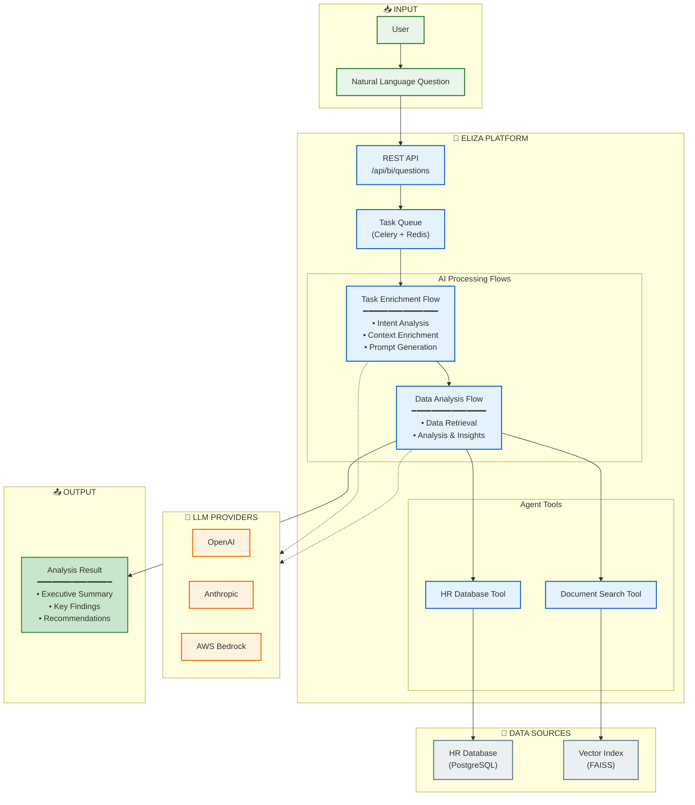
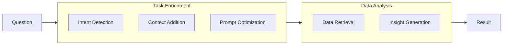

# Business Intelligence Flow - High Level Overview

A simplified architecture diagram showing the main components of the Business Intelligence system.

---

## Architecture Overview

---

## Processing Pipeline

---

## Key Components

| Component | Description |
|-----------|-------------|
| **REST API** | Receives questions, returns results |
| **Task Queue** | Async processing with Celery + Redis |
| **Task Enrichment Flow** | Transforms questions into optimized prompts |
| **Data Analysis Flow** | Retrieves data and generates insights |
| **HR Database Tool** | Queries structured employee data |
| **Document Search Tool** | Semantic search over company documents |
| **LLM Providers** | OpenAI, Anthropic, or AWS Bedrock |

