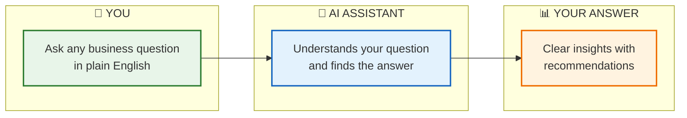
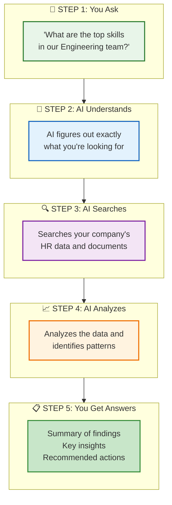
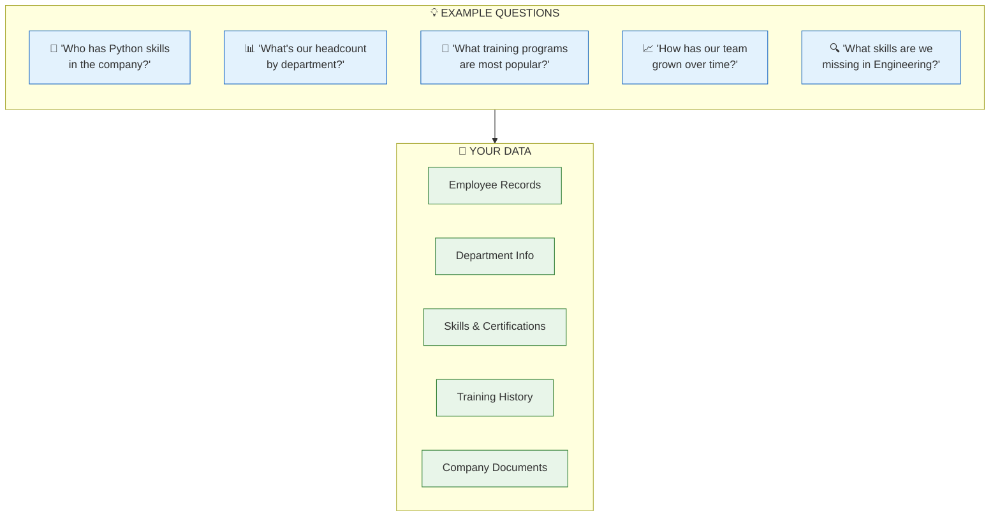
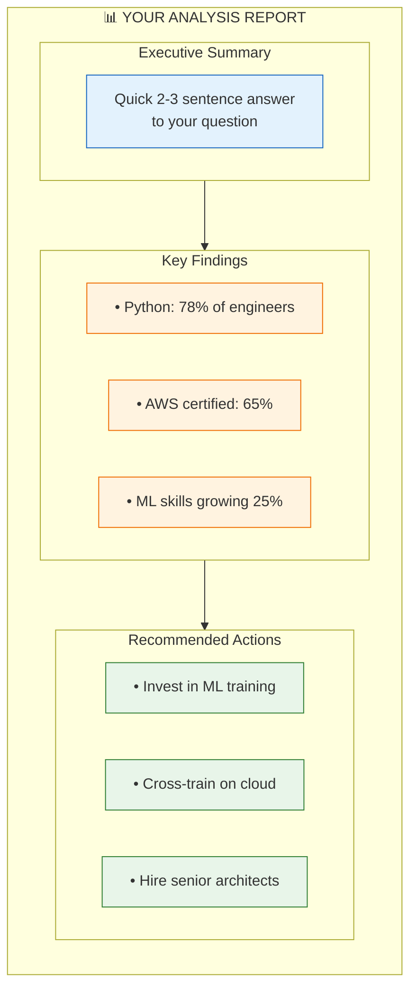

# Business Intelligence - How It Works

A simple guide to how our AI-powered Business Intelligence system answers your questions.

---

## Ask a Question, Get Insights

---

## What Happens Behind the Scenes

---

## What You Can Ask About

---

## What You Get Back

---

## Simple Summary

| What You Do | What You Get |
|-------------|--------------|
| 💬 Ask a question in plain English | 📋 Executive summary answering your question |
| 🤔 No need to know where data lives | 📊 Key findings with specific numbers |
| ⏱️ Wait 1-2 minutes | ✅ Actionable recommendations |

---

## Benefits

- **No technical skills needed** - Just ask questions like you would ask a colleague
- **All your data in one place** - Searches HR systems and documents automatically  
- **Actionable insights** - Not just data, but recommendations you can act on
- **Always available** - Get answers anytime, no need to wait for a report

