# Eliza Platform Architecture Diagram

```mermaid
graph LR
    subgraph UI["APPLICATION LAYER"]
        Apps[Applications & Interfaces]
    end

    subgraph DataForge["DATA FORGE<br/>Enterprise Data Integration"]
        subgraph DataCore["Core Services"]
            MCP[Orchestration Engine]
            Security[Security & Access Control]
            Metadata[Metadata Management]
            Audit[Audit & Logging]
        end
        
        subgraph DataSources["Data Sources"]
            Internal[Internal Systems<br/>CRM • ERP • Databases]
            External[External APIs<br/>Internet • Third-party]
            Documents[Document Stores<br/>Files • Knowledge Bases]
        end
    end

    subgraph AgentForge["AGENT FORGE<br/>Multi-Agent Orchestration"]
        subgraph AgentCore["Agent Platform"]
            Orchestrator[Agent Orchestrator]
            Memory[Memory & Context]
            Guardrails[Safety & Guardrails]
            RBAC[Access Control]
        end
        
        subgraph AgentTypes["Agent Types"]
            Specialist[Specialist Agents]
            Dynamic[Dynamic Agents]
            Custom[Custom Agents]
        end
        
        subgraph AgentRuntime["Runtime"]
            Tools[Tool Selection]
            Models[Model Selection]
            Execution[Execution Engine]
        end
    end

    subgraph ModelForge["MODEL FORGE<br/>AI Model Management"]
        subgraph ModelCore["Model Platform"]
            Router[Model Router]
            Registry[Model Registry]
        end
        
        subgraph ModelTypes["Model Types"]
            LLM[Large Language Models<br/>GPT • Claude • Gemini]
            SLM[Small Language Models<br/>Domain-tuned • Custom]
            Specialized[Specialized Models<br/>Embedding • Classification]
        end
        
        subgraph ModelOps["Model Operations"]
            Training[Training & Fine-tuning]
            Monitoring[Performance Monitoring]
            Versioning[Version Control]
        end
    end

    subgraph Teacher["LEARNING LAYER<br/>Continuous Improvement"]
        Analytics[Agent Analytics]
        Feedback[Feedback Loop]
        Optimization[Performance Optimization]
    end

    subgraph Foundation["FOUNDATION LAYER<br/>Core Platform Capabilities"]
        Eval[Evaluation & Testing]
        RAG[Secure RAG]
        Access[Access Controls]
        AuditPipe[Audit Pipeline]
        Maintenance[Model Maintenance]
    end

    %% Layer connections
    Apps -.-> Orchestrator
    
    Orchestrator --> AgentCore
    Orchestrator --> AgentTypes
    AgentTypes --> AgentRuntime
    
    AgentRuntime -.-> DataCore
    AgentRuntime -.-> ModelCore
    
    DataCore -.-> DataSources
    ModelCore -.-> ModelTypes
    
    AgentRuntime -.-> Teacher
    ModelOps -.-> Teacher
    
    %% Foundation supports all layers
    Foundation -.-> DataForge
    Foundation -.-> AgentForge
    Foundation -.-> ModelForge

    classDef appStyle fill:#e8f4f8,stroke:#0066cc,stroke-width:3px
    classDef dataStyle fill:#ffe6e6,stroke:#cc0000,stroke-width:3px
    classDef agentStyle fill:#fff0f0,stroke:#ff6b6b,stroke-width:3px
    classDef modelStyle fill:#fff5f5,stroke:#ff8787,stroke-width:3px
    classDef teacherStyle fill:#ffe6f0,stroke:#ff66b2,stroke-width:3px
    classDef foundationStyle fill:#e6f7ff,stroke:#0099cc,stroke-width:3px
    
    class UI appStyle
    class DataForge,DataCore,DataSources dataStyle
    class AgentForge,AgentCore,AgentTypes,AgentRuntime agentStyle
    class ModelForge,ModelCore,ModelTypes,ModelOps modelStyle
    class Teacher teacherStyle
    class Foundation foundationStyle
```

## Architecture Overview

The Eliza Platform is organized into six architectural layers:

### 1. Application Layer
- User-facing applications and interfaces
- API endpoints and integration points
- Client SDKs and developer tools

### 2. Data Forge (Enterprise Data Integration)
- **Orchestration Engine**: Centralized data access and routing
- **Security & Access Control**: Role-based permissions and data governance
- **Metadata Management**: Schema management and data cataloging
- **Data Sources**: Internal systems, external APIs, document stores

### 3. Agent Forge (Multi-Agent Orchestration)
- **Agent Orchestrator**: Task planning and agent coordination
- **Agent Platform**: Memory, context, safety guardrails, access control
- **Agent Types**: Specialist, dynamic, and custom agents
- **Runtime**: Tool selection, model selection, execution engine

### 4. Model Forge (AI Model Management)
- **Model Router**: Intelligent routing to optimal models
- **Model Registry**: Centralized model catalog and metadata
- **Model Types**: Large language models, small language models, specialized models
- **Model Operations**: Training, monitoring, versioning, deployment

### 5. Learning Layer (Continuous Improvement)
- **Agent Analytics**: Performance tracking and insights
- **Feedback Loop**: Learning from execution patterns
- **Performance Optimization**: Automated tuning and improvement

### 6. Foundation Layer (Core Platform Capabilities)
- **Evaluation & Testing**: Quality assurance and acceptance criteria
- **Secure RAG**: Retrieval-augmented generation with authorization
- **Access Controls**: Identity provider integration and permissions
- **Audit Pipeline**: Tamper-evident logs and compliance tracking
- **Model Maintenance**: Drift detection, regression testing, lifecycle management

## Key Design Principles

1. **Security First**: Every layer enforces access controls and audit logging
2. **Dynamic Intelligence**: Agents and models are selected based on task requirements
3. **Continuous Learning**: Platform improves performance over time through feedback
4. **Modular Architecture**: Each forge can be deployed and scaled independently
5. **Enterprise Ready**: Built for regulated environments with compliance requirements
6. **Extensible**: Plugin architecture for custom agents, tools, and models

