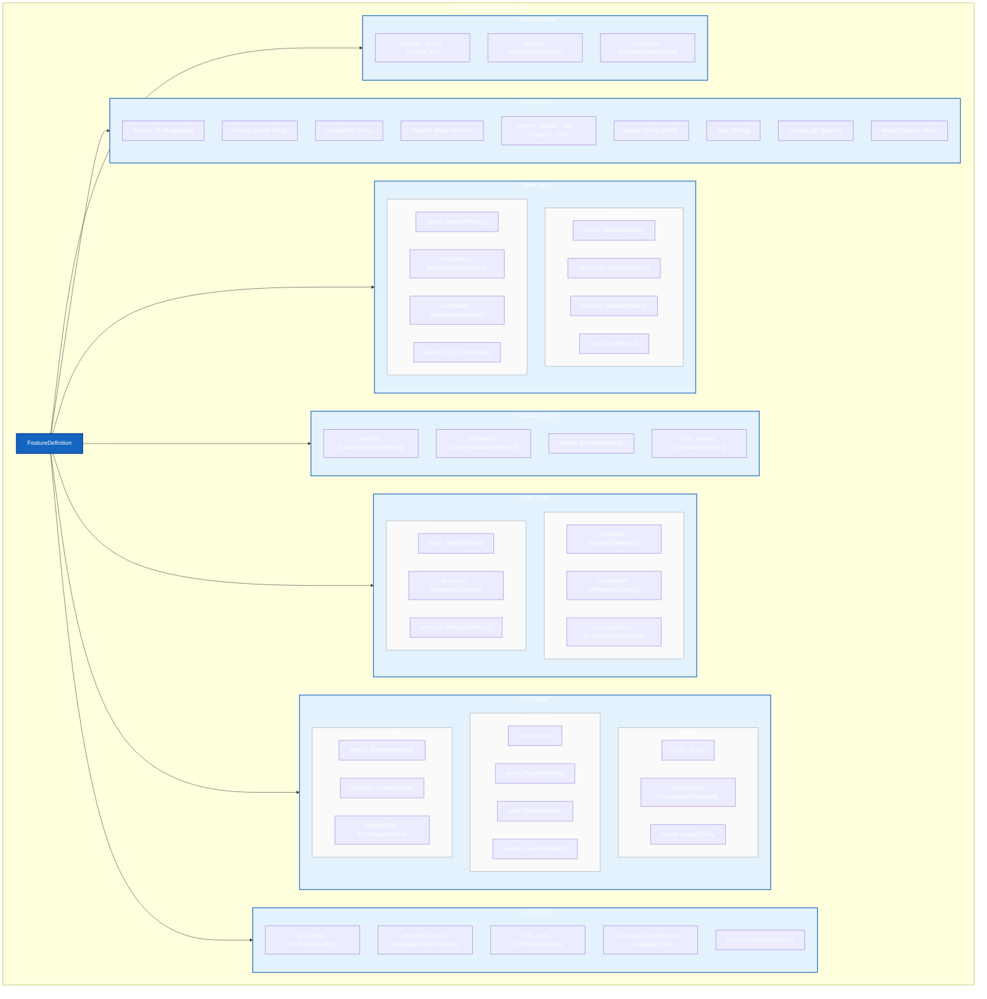
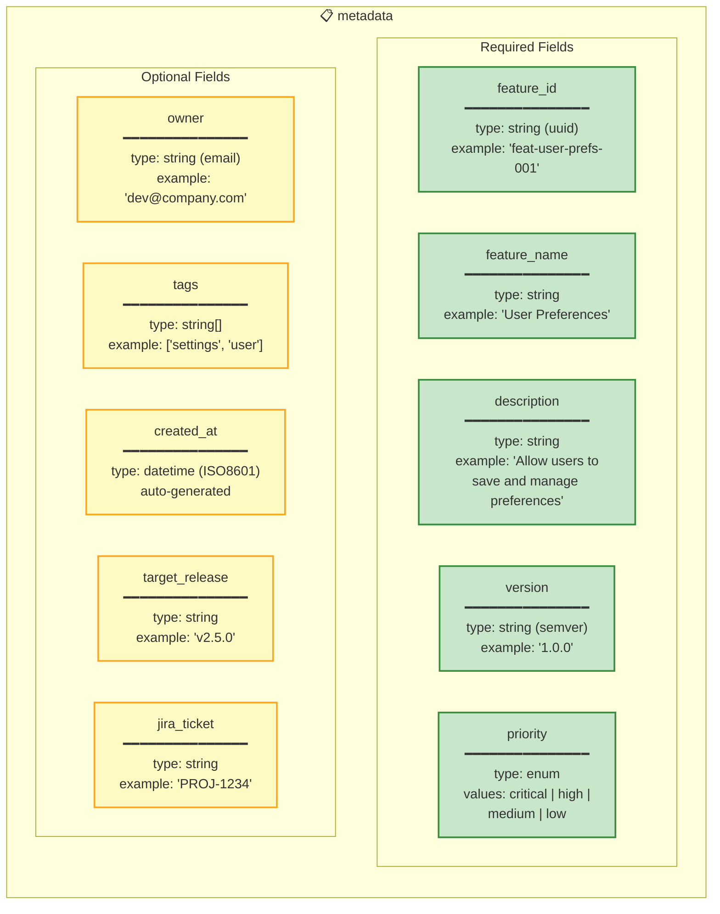
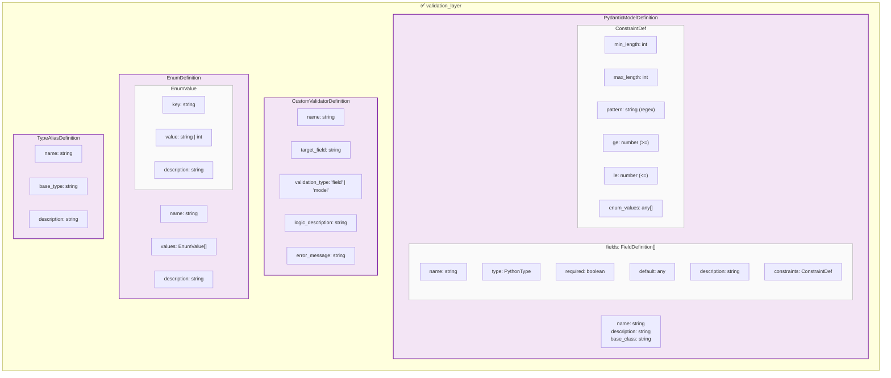
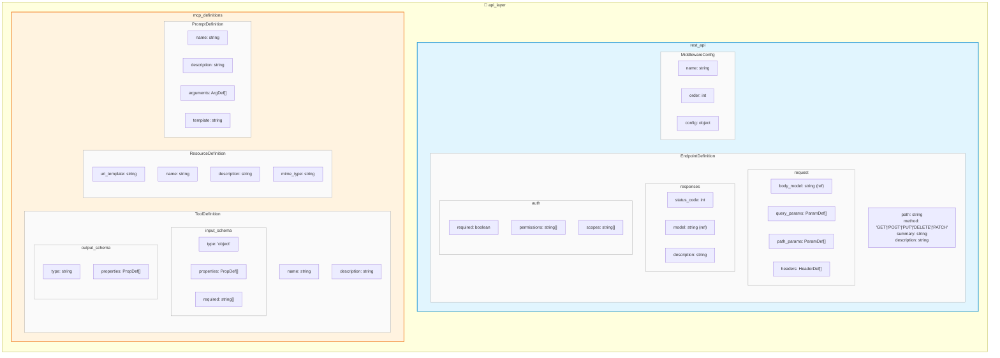
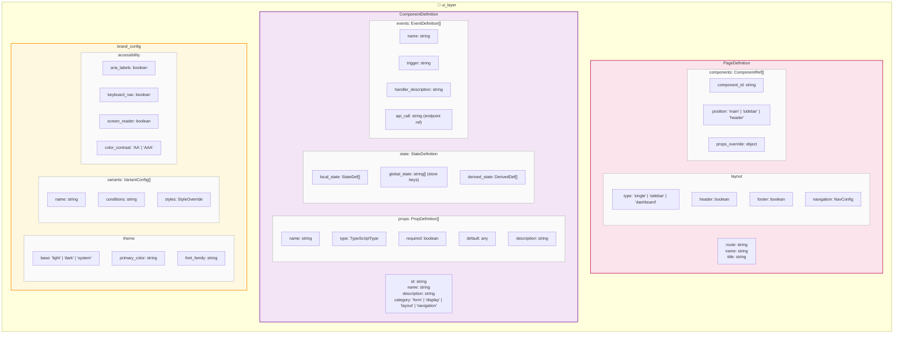
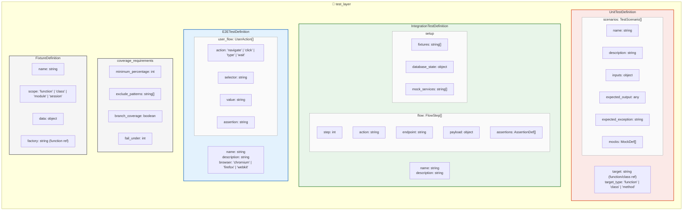
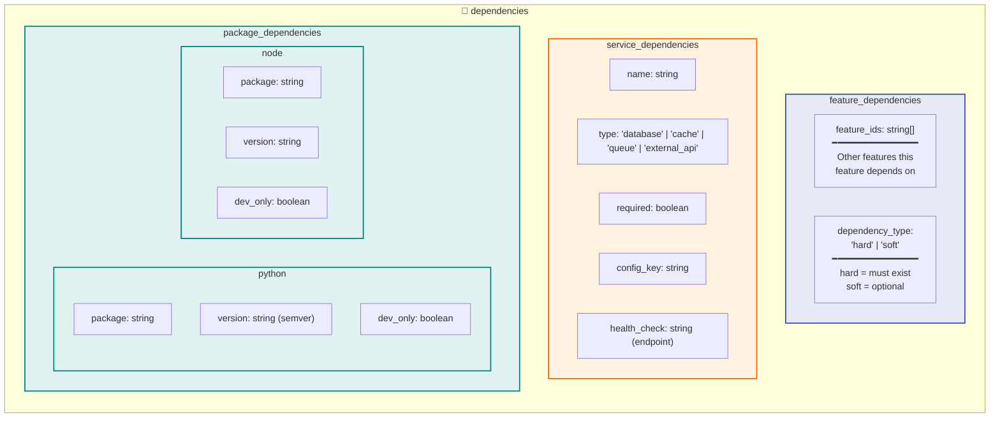
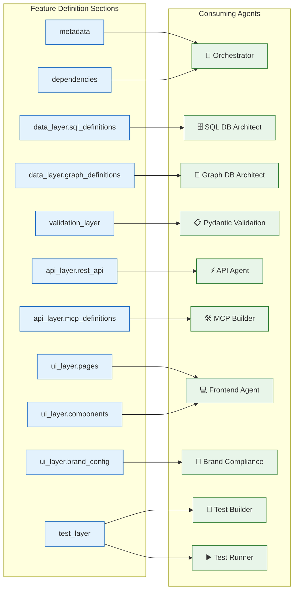

# Feature Definition JSON Schema

This document details the standardized Feature Definition JSON structure that serves as the input contract for the multi-agent development platform.

---

## Complete Schema Overview



---

## Detailed Section Schemas

### 1. Metadata Section



---

### 2. Data Layer Section

```mermaid
flowchart TB
    subgraph DataLayer["💾 data_layer"]
        direction TB

        subgraph SQLDefinitions["sql_definitions"]
            subgraph TableDef["TableDefinition"]
                T1["name: string<br/>schema: string (optional)<br/>description: string"]
                
                subgraph Columns["columns: ColumnDefinition[]"]
                    C1["name: string"]
                    C2["type: SQLType"]
                    C3["nullable: boolean"]
                    C4["default: any"]
                    C5["primary_key: boolean"]
                    C6["unique: boolean"]
                    C7["references: ForeignKeyRef"]
                end
            end

            subgraph IndexDef["IndexDefinition"]
                I1["name: string"]
                I2["columns: string[]"]
                I3["unique: boolean"]
                I4["type: 'btree' | 'hash' | 'gin'"]
            end

            subgraph MigrationDef["MigrationConfig"]
                MG1["auto_generate: boolean"]
                MG2["down_revision: string"]
                MG3["message: string"]
            end
        end

        subgraph GraphDefinitions["graph_definitions"]
            subgraph NodeDef["NodeDefinition"]
                N1["label: string"]
                N2["properties: PropertyDef[]"]
                N3["constraints: string[]"]
            end

            subgraph RelDef["RelationshipDefinition"]
                R1["type: string"]
                R2["from_node: string"]
                R3["to_node: string"]
                R4["properties: PropertyDef[]"]
                R5["cardinality: '1:1' | '1:N' | 'N:M'"]
            end

            subgraph QueryDef["QueryTemplate"]
                Q1["name: string"]
                Q2["cypher: string"]
                Q3["parameters: ParamDef[]"]
                Q4["returns: ReturnType"]
            end
        end
    end

    classDef sql fill:#E3F2FD,stroke:#1565C0,stroke-width:2px
    classDef graph fill:#E8F5E9,stroke:#2E7D32,stroke-width:2px
    classDef detail fill:#FAFAFA,stroke:#9E9E9E,stroke-width:1px

    class SQLDefinitions sql
    class GraphDefinitions graph
    class TableDef,IndexDef,MigrationDef,NodeDef,RelDef,QueryDef,Columns detail
```

---

### 3. Validation Layer Section



---

### 4. API Layer Section



---

### 5. UI Layer Section



---

### 6. Test Layer Section



---

### 7. Dependencies Section



---

## Complete JSON Example

```mermaid
flowchart TB
    subgraph Example["📋 EXAMPLE: User Preferences Feature"]
        direction TB

        subgraph JSON["feature_definition.json"]
            Code["
{
  'metadata': {
    'feature_id': 'feat-user-prefs-001',
    'feature_name': 'User Preferences',
    'description': 'Allow users to save preferences',
    'version': '1.0.0',
    'priority': 'high',
    'owner': 'team@company.com',
    'tags': ['settings', 'user', 'personalization']
  },
  
  'data_layer': {
    'sql_definitions': {
      'tables': [{
        'name': 'user_preferences',
        'columns': [
          {'name': 'id', 'type': 'SERIAL', 'primary_key': true},
          {'name': 'user_id', 'type': 'INTEGER', 'references': 'users.id'},
          {'name': 'key', 'type': 'VARCHAR(100)', 'nullable': false},
          {'name': 'value', 'type': 'JSONB'},
          {'name': 'created_at', 'type': 'TIMESTAMP', 'default': 'NOW()'}
        ]
      }]
    },
    'graph_definitions': {
      'nodes': [{'label': 'Preference', 'properties': ['key', 'value']}],
      'relationships': [{'type': 'HAS_PREFERENCE', 'from': 'User', 'to': 'Preference'}]
    }
  },
  
  'validation_layer': {
    'models': [{
      'name': 'UserPreference',
      'fields': [
        {'name': 'user_id', 'type': 'int', 'required': true},
        {'name': 'key', 'type': 'str', 'constraints': {'max_length': 100}},
        {'name': 'value', 'type': 'dict', 'required': true}
      ]
    }]
  },
  
  'api_layer': {
    'rest_api': {
      'endpoints': [
        {'path': '/preferences', 'method': 'GET', 'auth': {'required': true}},
        {'path': '/preferences/{key}', 'method': 'PUT', 'auth': {'required': true}},
        {'path': '/preferences/{key}', 'method': 'DELETE', 'auth': {'required': true}}
      ]
    },
    'mcp_definitions': {
      'tools': [
        {'name': 'get_user_preferences', 'description': 'Get all preferences'},
        {'name': 'update_preference', 'description': 'Update a preference'}
      ]
    }
  },
  
  'ui_layer': {
    'pages': [{
      'route': '/settings/preferences',
      'name': 'PreferencesPage',
      'components': ['PreferencesList', 'PreferenceEditor']
    }],
    'components': [
      {'id': 'PreferencesList', 'category': 'display'},
      {'id': 'PreferenceEditor', 'category': 'form'}
    ]
  },
  
  'test_layer': {
    'coverage_requirements': {'minimum_percentage': 85},
    'unit_tests': [
      {'target': 'PreferenceService', 'scenarios': ['get', 'update', 'delete']}
    ]
  },
  
  'dependencies': {
    'features': ['feat-auth-001'],
    'services': [{'name': 'postgres', 'type': 'database', 'required': true}]
  }
}
            "]
        end

        subgraph AgentUsage["How Agents Use This"]
            A1["🗄️ SQL Agent reads:<br/>data_layer.sql_definitions"]
            A2["🔗 Graph Agent reads:<br/>data_layer.graph_definitions"]
            A3["📋 Pydantic Agent reads:<br/>validation_layer.models"]
            A4["⚡ API Agent reads:<br/>api_layer.rest_api"]
            A5["🛠️ MCP Agent reads:<br/>api_layer.mcp_definitions"]
            A6["💻 Frontend Agent reads:<br/>ui_layer.pages, components"]
            A7["🎯 Brand Agent reads:<br/>ui_layer.brand_config"]
            A8["📝 Test Builder reads:<br/>test_layer.*"]
        end
    end

    JSON --> AgentUsage
```



---

## Schema Validation Rules

| Section | Required | Validated By |
|---------|----------|--------------|
| `metadata` | ✅ Yes | Orchestrator Agent |
| `metadata.feature_id` | ✅ Yes | Must be unique UUID |
| `metadata.feature_name` | ✅ Yes | Non-empty string |
| `metadata.version` | ✅ Yes | Valid semver |
| `data_layer` | ⚠️ Conditional | Required if feature has data |
| `validation_layer` | ⚠️ Conditional | Required if API layer exists |
| `api_layer` | ⚠️ Conditional | Required if feature has API |
| `ui_layer` | ⚠️ Conditional | Required if feature has UI |
| `test_layer` | ✅ Yes | Always required |
| `dependencies` | ⚠️ Optional | Validated against existing features |

---

## Agent-to-Schema Mapping




