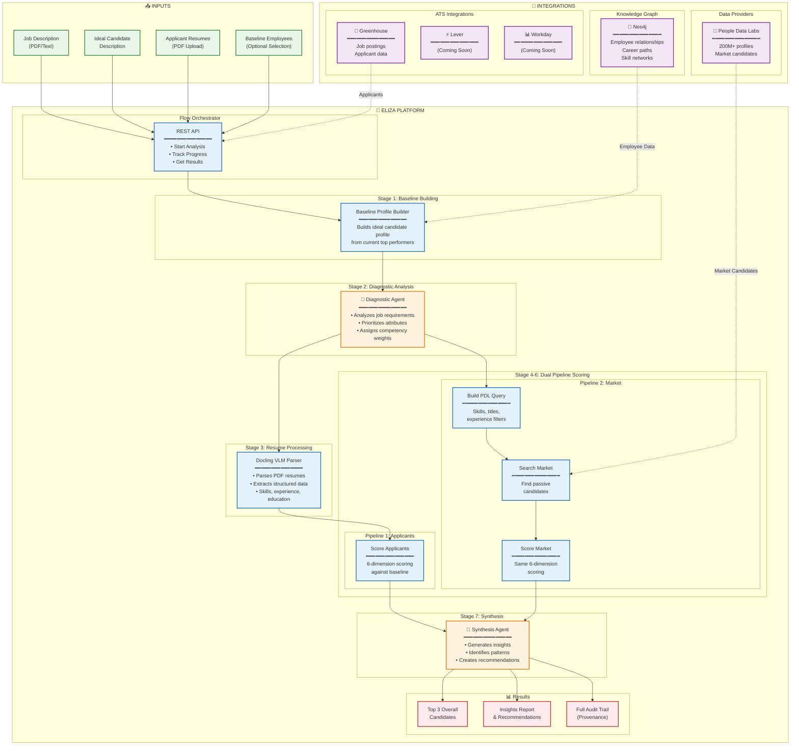
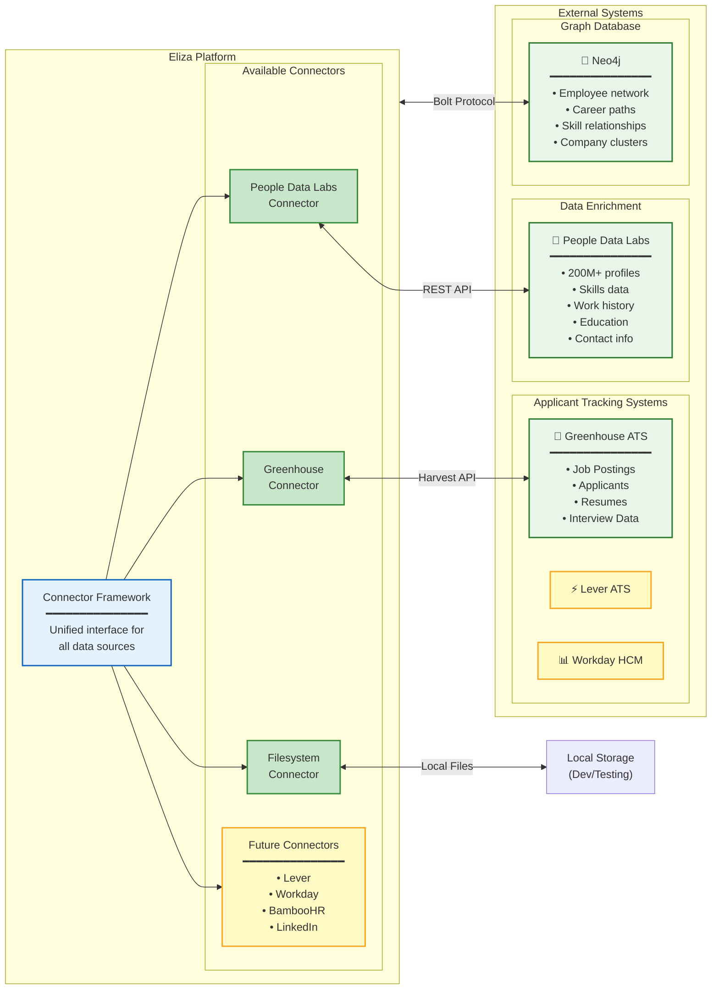
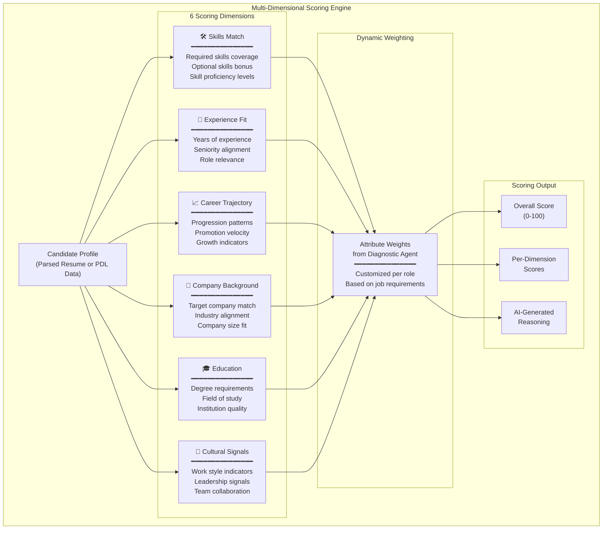
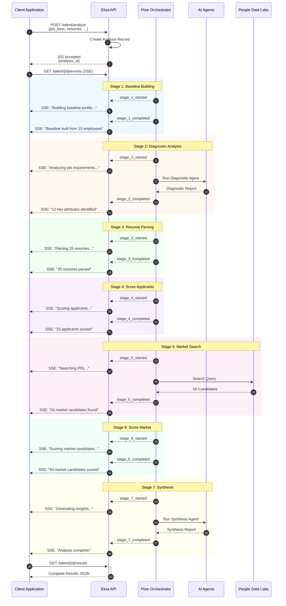

# Eliza Platform: HR Intelligence Flow

This document provides process flow diagrams for the HR Intelligence (Talent Intelligence) system, highlighting the complete workflow, AI agents, and available integrations.

---

## High-Level Process Flow

---

## Detailed Stage-by-Stage Flow

```mermaid
flowchart TB
    subgraph Input["📥 Analysis Request"]
        Start([User Starts Analysis])
        InputData["• Job Description (PDF/Text)<br/>• Ideal Candidate Description<br/>• Uploaded Resumes (50 max)<br/>• Selected Baseline Employees"]
    end

    subgraph Stage1["🏗️ STAGE 1: Build Baseline Profile"]
        S1Start["Query Neo4j for<br/>Current Top Performers"]
        S1Process["Extract Common Patterns:<br/>• Skills distributions<br/>• Career paths<br/>• Company backgrounds<br/>• Education patterns"]
        S1Output["Baseline Profile<br/>━━━━━━━━━━━━━━━<br/>Prototype employee IDs<br/>Attribute weights<br/>Success patterns"]
    end

    subgraph Stage2["🤖 STAGE 2: Diagnostic Agent (AI)"]
        S2Input["Inputs:<br/>• Job Description<br/>• Ideal Candidate<br/>• Baseline Profile"]
        S2Agent["Diagnostic Agent<br/>━━━━━━━━━━━━━━━<br/>LLM: GPT-4o-mini"]
        S2Output["Diagnostic Report<br/>━━━━━━━━━━━━━━━<br/>• Competency list<br/>• Attribute weights<br/>• Must-haves vs Nice-to-haves<br/>• Confidence score"]
    end

    subgraph Stage3["📄 STAGE 3: Parse Applicant Resumes"]
        S3Input["Resume PDFs<br/>(up to 50)"]
        S3Parser["Docling VLM Parser<br/>━━━━━━━━━━━━━━━<br/>Model: granite-docling-258M"]
        S3Output["Parsed Resumes<br/>━━━━━━━━━━━━━━━<br/>• Name, Contact<br/>• Skills list<br/>• Work history<br/>• Education<br/>• Certifications"]
    end

    subgraph Stage4["📊 STAGE 4: Score Applicants"]
        S4Input["Parsed Resumes +<br/>Diagnostic Report +<br/>Baseline Profile"]
        S4Scoring["Multi-Dimensional<br/>Scoring Engine"]
        S4Dims["6 Scoring Dimensions:<br/>━━━━━━━━━━━━━━━<br/>1. Skills Match<br/>2. Experience Fit<br/>3. Career Trajectory<br/>4. Company Background<br/>5. Education<br/>6. Cultural Signals"]
        S4Output["Scored Applicants<br/>━━━━━━━━━━━━━━━<br/>Overall score (0-100)<br/>Per-dimension scores<br/>Reasoning"]
    end

    subgraph Stage5["🔍 STAGE 5: Market Search (PDL)"]
        S5Query["Build PDL Query<br/>━━━━━━━━━━━━━━━<br/>• Required skills<br/>• Job titles<br/>• Experience range<br/>• Location filters"]
        S5API["People Data Labs API<br/>━━━━━━━━━━━━━━━<br/>200M+ professional profiles"]
        S5Output["Market Candidates<br/>━━━━━━━━━━━━━━━<br/>Passive candidates<br/>not yet applied"]
    end

    subgraph Stage6["📊 STAGE 6: Score Market Candidates"]
        S6Input["Market Candidates +<br/>Same Scoring Criteria"]
        S6Scoring["Same Multi-Dimensional<br/>Scoring Engine"]
        S6Output["Scored Market<br/>Candidates"]
    end

    subgraph Stage7["🧠 STAGE 7: Synthesis Agent (AI)"]
        S7Input["All Scored Candidates:<br/>• Applicants<br/>• Market candidates"]
        S7Agent["Synthesis Agent<br/>━━━━━━━━━━━━━━━<br/>LLM: GPT-4o-mini"]
        S7Process["Generates:<br/>• Executive Summary<br/>• Pattern Analysis<br/>• Key Insights<br/>• Recommendations"]
        S7Output["Final Report<br/>━━━━━━━━━━━━━━━<br/>Top 3 Overall<br/>Insights & Patterns<br/>Next Steps"]
    end

    subgraph Output["📤 Analysis Complete"]
        Results["Complete Results:<br/>━━━━━━━━━━━━━━━<br/>✓ Top 3 candidates (ranked)<br/>✓ All applicant scores<br/>✓ All market scores<br/>✓ Diagnostic report<br/>✓ Synthesis insights<br/>✓ Full provenance trail"]
        End([Analysis Delivered])
    end

    Start --> InputData
    InputData --> S1Start
    S1Start --> S1Process
    S1Process --> S1Output
    S1Output --> S2Input
    S2Input --> S2Agent
    S2Agent --> S2Output
    S2Output --> S3Input
    S3Input --> S3Parser
    S3Parser --> S3Output
    S3Output --> S4Input
    S4Input --> S4Scoring
    S4Scoring --> S4Dims
    S4Dims --> S4Output
    S2Output --> S5Query
    S5Query --> S5API
    S5API --> S5Output
    S5Output --> S6Input
    S6Input --> S6Scoring
    S6Scoring --> S6Output
    S4Output --> S7Input
    S6Output --> S7Input
    S7Input --> S7Agent
    S7Agent --> S7Process
    S7Process --> S7Output
    S7Output --> Results
    Results --> End

    classDef stage fill:#E3F2FD,stroke:#1565C0,stroke-width:2px
    classDef ai fill:#FFF3E0,stroke:#EF6C00,stroke-width:2px
    classDef external fill:#F3E5F5,stroke:#7B1FA2,stroke-width:2px
```

---

## Integration Architecture

---

## Scoring Dimensions Detail

---

## Real-Time Progress Tracking (SSE Events)

---

## Summary

### Key Components

| Component | Purpose | Technology |
|-----------|---------|------------|
| **Flow Orchestrator** | Coordinates all stages | Python async |
| **Diagnostic Agent** | Analyzes job requirements | GPT-4o-mini |
| **Docling VLM Parser** | Parses PDF resumes | granite-docling-258M |
| **Scoring Engine** | Multi-dimensional scoring | Custom algorithm |
| **PDL Query Builder** | Builds market search queries | PDL Elasticsearch DSL |
| **Synthesis Agent** | Generates insights | GPT-4o-mini |

### Available Integrations

| Integration | Status | Data Provided |
|-------------|--------|---------------|
| **Greenhouse ATS** | ✅ Available | Job postings, applicants, resumes |
| **People Data Labs** | ✅ Available | 200M+ professional profiles |
| **Neo4j** | ✅ Available | Employee graph, career paths |
| **Lever ATS** | 🔜 Coming Soon | Job postings, applicants |
| **Workday HCM** | 🔜 Coming Soon | Employee data, org structure |
| **BambooHR** | 🔜 Coming Soon | HR data, employee profiles |

### Output Deliverables

1. **Top 3 Overall Candidates** - Ranked by composite score
2. **All Applicant Scores** - With per-dimension breakdown
3. **All Market Scores** - Passive candidates from PDL
4. **Diagnostic Report** - Competencies and weights
5. **Synthesis Report** - Insights, patterns, recommendations
6. **Full Provenance** - Audit trail of every step

