# Eliza Platform: HR Intelligence User Journey

This document provides user-focused diagrams showing what users do with the HR Intelligence system, including the complete workflow from analysis setup through candidate outreach and engagement tracking.

---

## Complete User Journey Overview

```mermaid
flowchart TB
    subgraph UserActions["👤 USER ACTIONS"]
        direction TB
        
        subgraph Setup["🔧 SETUP & CONFIGURATION"]
            Login["Login to Eliza Platform"]
            SelectBaseline["Select Baseline Employees<br/>━━━━━━━━━━━━━━━<br/>Choose top performers<br/>to use as reference"]
            SelectDataSource["Select Data Source<br/>━━━━━━━━━━━━━━━<br/>• Greenhouse ATS<br/>• Resume uploads<br/>• PDL market search"]
        end

        subgraph Define["📝 DEFINE REQUIREMENTS"]
            UploadJD["Upload Job Description<br/>━━━━━━━━━━━━━━━<br/>PDF or paste text"]
            WriteIdeal["Describe Ideal Candidate<br/>━━━━━━━━━━━━━━━<br/>Natural language<br/>description of who<br/>you're looking for"]
            ConfigAnalysis["Configure Analysis<br/>━━━━━━━━━━━━━━━<br/>• PDL search limit<br/>• Email template<br/>• Review settings"]
        end

        subgraph Run["🚀 RUN ANALYSIS"]
            StartAnalysis["Click 'Run Analysis'"]
            WatchProgress["Watch Real-Time Progress<br/>━━━━━━━━━━━━━━━<br/>7 stages with live updates"]
        end

        subgraph Review["📊 REVIEW RESULTS"]
            ViewTop3["View Top 3 Candidates<br/>━━━━━━━━━━━━━━━<br/>Best matches overall"]
            ViewApplicants["View Applicant Scores<br/>━━━━━━━━━━━━━━━<br/>People who applied"]
            ViewMarket["View Market Candidates<br/>━━━━━━━━━━━━━━━<br/>Passive candidates<br/>from PDL"]
            ViewInsights["View AI Insights<br/>━━━━━━━━━━━━━━━<br/>Patterns, recommendations"]
            ExportCSV["Export Results to CSV"]
        end

        subgraph Outreach["📧 CANDIDATE OUTREACH"]
            SelectCandidates["Select Candidates<br/>to Contact"]
            ReviewEmail["Review Pre-Written Email<br/>━━━━━━━━━━━━━━━<br/>AI-generated based on<br/>candidate profile"]
            EditEmail["Edit Email Content<br/>━━━━━━━━━━━━━━━<br/>Customize subject/body"]
            SendEmail["Send via Gmail<br/>━━━━━━━━━━━━━━━<br/>Opens Gmail compose<br/>with tracking"]
        end

        subgraph Track["📈 TRACK ENGAGEMENT"]
            ViewMetrics["View Outreach Metrics<br/>━━━━━━━━━━━━━━━<br/>• Open rates<br/>• Click rates<br/>• Reply rates"]
            ViewDetails["View Email Details<br/>━━━━━━━━━━━━━━━<br/>Per-candidate engagement"]
            FollowUp["Send Follow-Up Emails"]
        end

        subgraph Feedback["💬 PROVIDE FEEDBACK"]
            RateCandidates["Rate Candidates<br/>━━━━━━━━━━━━━━━<br/>👍 / 👎 on matches"]
            AddComments["Add Comments<br/>━━━━━━━━━━━━━━━<br/>Notes for future<br/>analysis improvement"]
        end
    end

    Login --> SelectBaseline
    SelectBaseline --> SelectDataSource
    SelectDataSource --> UploadJD
    UploadJD --> WriteIdeal
    WriteIdeal --> ConfigAnalysis
    ConfigAnalysis --> StartAnalysis
    StartAnalysis --> WatchProgress
    WatchProgress --> ViewTop3
    ViewTop3 --> ViewApplicants
    ViewApplicants --> ViewMarket
    ViewMarket --> ViewInsights
    ViewInsights --> ExportCSV
    ExportCSV --> SelectCandidates
    SelectCandidates --> ReviewEmail
    ReviewEmail --> EditEmail
    EditEmail --> SendEmail
    SendEmail --> ViewMetrics
    ViewMetrics --> ViewDetails
    ViewDetails --> FollowUp
    FollowUp --> RateCandidates
    RateCandidates --> AddComments

    classDef setup fill:#E3F2FD,stroke:#1565C0,stroke-width:2px
    classDef define fill:#E8F5E9,stroke:#2E7D32,stroke-width:2px
    classDef run fill:#FFF3E0,stroke:#EF6C00,stroke-width:2px
    classDef review fill:#F3E5F5,stroke:#7B1FA2,stroke-width:2px
    classDef outreach fill:#E1F5FE,stroke:#0288D1,stroke-width:2px
    classDef track fill:#FBE9E7,stroke:#D84315,stroke-width:2px
    classDef feedback fill:#F1F8E9,stroke:#558B2F,stroke-width:2px

    class Login,SelectBaseline,SelectDataSource setup
    class UploadJD,WriteIdeal,ConfigAnalysis define
    class StartAnalysis,WatchProgress run
    class ViewTop3,ViewApplicants,ViewMarket,ViewInsights,ExportCSV review
    class SelectCandidates,ReviewEmail,EditEmail,SendEmail outreach
    class ViewMetrics,ViewDetails,FollowUp track
    class RateCandidates,AddComments feedback
```

---

## Step-by-Step User Workflow

```mermaid
flowchart TB
    subgraph Step1["STEP 1: Select Baseline Employees"]
        S1UI["🖥️ Employee Selector UI"]
        S1Action1["Browse current employees"]
        S1Action2["Filter by role/department"]
        S1Action3["Select top performers<br/>(1-10 employees)"]
        S1Action4["Or paste LinkedIn URLs"]
        S1Result["✅ Baseline selected"]
    end

    subgraph Step2["STEP 2: Choose Data Source"]
        S2UI["🖥️ Data Source Selector"]
        S2Option1["🌿 Greenhouse ATS<br/>━━━━━━━━━━━━━━━<br/>• Select job posting<br/>• Configure filters<br/>• Auto-sync applicants"]
        S2Option2["📁 Resume Upload<br/>━━━━━━━━━━━━━━━<br/>• Drag & drop PDFs<br/>• Up to 50 resumes<br/>• Batch processing"]
        S2Option3["👥 PDL Market Search<br/>━━━━━━━━━━━━━━━<br/>• Passive candidates<br/>• 200M+ profiles<br/>• AI-built query"]
        S2Result["✅ Data source configured"]
    end

    subgraph Step3["STEP 3: Define Job Requirements"]
        S3UI["🖥️ Job Requirements Form"]
        S3Action1["Upload job description PDF<br/>or paste text"]
        S3Action2["Write ideal candidate<br/>description in plain English"]
        S3Example["Example:<br/>'Looking for someone with<br/>5+ years ML experience,<br/>strong Python skills,<br/>startup background preferred'"]
        S3Result["✅ Requirements saved"]
    end

    subgraph Step4["STEP 4: Configure & Review"]
        S4UI["🖥️ Analysis Summary"]
        S4Config1["Set PDL search limit<br/>(1-50 candidates)"]
        S4Config2["Select email template<br/>for outreach"]
        S4Review["Review all settings"]
        S4Result["✅ Ready to analyze"]
    end

    subgraph Step5["STEP 5: Run Analysis"]
        S5UI["🖥️ Analysis Progress"]
        S5Stage1["Stage 1: Building baseline..."]
        S5Stage2["Stage 2: AI analyzing requirements..."]
        S5Stage3["Stage 3: Parsing resumes..."]
        S5Stage4["Stage 4: Scoring applicants..."]
        S5Stage5["Stage 5: Searching market..."]
        S5Stage6["Stage 6: Scoring market..."]
        S5Stage7["Stage 7: Generating insights..."]
        S5Result["✅ Analysis complete!"]
    end

    subgraph Step6["STEP 6: Review Results"]
        S6UI["🖥️ Results Dashboard"]
        S6Top3["🏆 Top 3 Overall<br/>Best matches across<br/>all candidates"]
        S6Applicants["📋 Applicant Scores<br/>All applicants ranked<br/>with 6-dimension scores"]
        S6Market["🌐 Market Candidates<br/>Passive candidates<br/>from PDL search"]
        S6Insights["💡 AI Insights<br/>Patterns, recommendations,<br/>market analysis"]
        S6Actions["Actions:<br/>• Export CSV<br/>• Copy to clipboard<br/>• View details"]
    end

    subgraph Step7["STEP 7: Outreach to Candidates"]
        S7UI["🖥️ Candidate Outreach"]
        S7Select["Select candidates to contact"]
        S7Preview["Preview AI-generated email<br/>━━━━━━━━━━━━━━━<br/>Personalized based on:<br/>• Candidate profile<br/>• Job requirements<br/>• Your company"]
        S7Edit["Edit email content<br/>Customize subject & body"]
        S7Send["Send via Gmail<br/>━━━━━━━━━━━━━━━<br/>Opens Gmail compose<br/>with tracking pixel<br/>and link tracking"]
    end

    subgraph Step8["STEP 8: Track Engagement"]
        S8UI["🖥️ Outreach Metrics"]
        S8Metrics["Dashboard shows:<br/>━━━━━━━━━━━━━━━<br/>📬 Total emails sent<br/>👁️ Open rate %<br/>🖱️ Click rate %<br/>💬 Reply rate %"]
        S8Details["Per-email details:<br/>━━━━━━━━━━━━━━━<br/>• When opened<br/>• Which links clicked<br/>• Reply status"]
        S8Actions["Actions:<br/>• Send follow-ups<br/>• Update status<br/>• Add notes"]
    end

    Step1 --> Step2
    Step2 --> Step3
    Step3 --> Step4
    Step4 --> Step5
    Step5 --> Step6
    Step6 --> Step7
    Step7 --> Step8

    classDef step fill:#FAFAFA,stroke:#9E9E9E,stroke-width:1px
    classDef ui fill:#E3F2FD,stroke:#1565C0,stroke-width:2px
    classDef action fill:#E8F5E9,stroke:#2E7D32,stroke-width:1px
    classDef result fill:#C8E6C9,stroke:#388E3C,stroke-width:2px
```

---

## Email Outreach Flow (Detailed)

```mermaid
flowchart TB
    subgraph CandidateSelection["📋 CANDIDATE SELECTION"]
        Results["View Analysis Results"]
        SelectOne["Click on Candidate"]
        ViewProfile["View Candidate Profile<br/>━━━━━━━━━━━━━━━<br/>• Score breakdown<br/>• Skills match<br/>• Experience<br/>• Why they're a fit"]
        AddToOutreach["Add to Outreach List"]
    end

    subgraph EmailPreparation["✍️ EMAIL PREPARATION"]
        ViewTemplate["View Pre-Written Email<br/>━━━━━━━━━━━━━━━<br/>AI-generated based on:<br/>• Candidate's background<br/>• Role requirements<br/>• Your company info"]
        EditSubject["Edit Subject Line"]
        EditBody["Edit Email Body<br/>━━━━━━━━━━━━━━━<br/>• Personalize greeting<br/>• Adjust tone<br/>• Add specifics"]
        Preview["Preview Final Email"]
    end

    subgraph EmailSending["📤 EMAIL SENDING"]
        ChooseMethod["Choose Send Method"]
        GmailCompose["Gmail Compose<br/>━━━━━━━━━━━━━━━<br/>Opens Gmail in new tab<br/>with pre-filled:<br/>• To: candidate email<br/>• Subject: your subject<br/>• Body: your message"]
        TrackingInjected["Tracking Automatically Added<br/>━━━━━━━━━━━━━━━<br/>• 1x1 pixel for opens<br/>• Link wrapping for clicks"]
        RecordSent["Email Recorded<br/>in Eliza Platform"]
    end

    subgraph Tracking["📊 ENGAGEMENT TRACKING"]
        OpenTracking["Open Tracking<br/>━━━━━━━━━━━━━━━<br/>When candidate opens email,<br/>tracking pixel fires"]
        ClickTracking["Click Tracking<br/>━━━━━━━━━━━━━━━<br/>When candidate clicks link,<br/>redirect captures click"]
        ReplyTracking["Reply Tracking<br/>━━━━━━━━━━━━━━━<br/>Gmail thread monitoring<br/>(if connected)"]
        MetricsDashboard["Metrics Dashboard<br/>━━━━━━━━━━━━━━━<br/>Real-time engagement<br/>data for all emails"]
    end

    subgraph FollowUp["🔄 FOLLOW-UP ACTIONS"]
        CheckStatus["Check Engagement Status"]
        NoResponse["No Response?<br/>━━━━━━━━━━━━━━━<br/>Send follow-up email<br/>after 3-5 days"]
        Opened["Opened but No Reply?<br/>━━━━━━━━━━━━━━━<br/>They're interested!<br/>Send personalized follow-up"]
        Replied["Replied!<br/>━━━━━━━━━━━━━━━<br/>Continue conversation<br/>in Gmail"]
        UpdateStatus["Update Candidate Status<br/>━━━━━━━━━━━━━━━<br/>• Interested<br/>• Not interested<br/>• Scheduled call<br/>• Hired"]
    end

    Results --> SelectOne
    SelectOne --> ViewProfile
    ViewProfile --> AddToOutreach
    AddToOutreach --> ViewTemplate
    ViewTemplate --> EditSubject
    EditSubject --> EditBody
    EditBody --> Preview
    Preview --> ChooseMethod
    ChooseMethod --> GmailCompose
    GmailCompose --> TrackingInjected
    TrackingInjected --> RecordSent
    RecordSent --> OpenTracking
    OpenTracking --> ClickTracking
    ClickTracking --> ReplyTracking
    ReplyTracking --> MetricsDashboard
    MetricsDashboard --> CheckStatus
    CheckStatus --> NoResponse
    CheckStatus --> Opened
    CheckStatus --> Replied
    NoResponse --> FollowUp
    Opened --> FollowUp
    Replied --> UpdateStatus

    classDef selection fill:#E3F2FD,stroke:#1565C0,stroke-width:2px
    classDef prep fill:#E8F5E9,stroke:#2E7D32,stroke-width:2px
    classDef send fill:#FFF3E0,stroke:#EF6C00,stroke-width:2px
    classDef track fill:#F3E5F5,stroke:#7B1FA2,stroke-width:2px
    classDef followup fill:#E1F5FE,stroke:#0288D1,stroke-width:2px

    class Results,SelectOne,ViewProfile,AddToOutreach selection
    class ViewTemplate,EditSubject,EditBody,Preview prep
    class ChooseMethod,GmailCompose,TrackingInjected,RecordSent send
    class OpenTracking,ClickTracking,ReplyTracking,MetricsDashboard track
    class CheckStatus,NoResponse,Opened,Replied,UpdateStatus followup
```

---

## Platform Features Summary

```mermaid
flowchart LR
    subgraph Platform["ELIZA HR INTELLIGENCE PLATFORM"]
        direction TB
        
        subgraph Analysis["🔍 ANALYSIS FEATURES"]
            F1["AI-Powered Scoring<br/>6 dimensions"]
            F2["Dual Pipeline<br/>Applicants + Market"]
            F3["Real-Time Progress<br/>Live stage updates"]
            F4["Baseline Comparison<br/>vs top performers"]
        end

        subgraph Results["📊 RESULTS FEATURES"]
            F5["Top 3 Rankings<br/>Best overall matches"]
            F6["AI Insights<br/>Patterns & recommendations"]
            F7["CSV Export<br/>Download results"]
            F8["Score Breakdown<br/>Per-dimension details"]
        end

        subgraph Outreach["📧 OUTREACH FEATURES"]
            F9["AI Email Generation<br/>Personalized templates"]
            F10["Gmail Integration<br/>One-click compose"]
            F11["Open Tracking<br/>Know when read"]
            F12["Click Tracking<br/>Link engagement"]
        end

        subgraph Metrics["📈 METRICS FEATURES"]
            F13["Outreach Dashboard<br/>Campaign metrics"]
            F14["Per-Email Details<br/>Individual tracking"]
            F15["Reply Tracking<br/>Response monitoring"]
            F16["Engagement Rates<br/>Open/click/reply %"]
        end

        subgraph Feedback["💬 FEEDBACK FEATURES"]
            F17["Candidate Ratings<br/>👍 / 👎 feedback"]
            F18["Analysis Comments<br/>Notes for improvement"]
            F19["History Tracking<br/>Past analyses"]
        end
    end

    subgraph Integrations["🔌 INTEGRATIONS"]
        I1["🌿 Greenhouse ATS"]
        I2["👥 People Data Labs"]
        I3["🔗 Neo4j Graph"]
        I4["📧 Gmail"]
    end

    Analysis --> Results
    Results --> Outreach
    Outreach --> Metrics
    Metrics --> Feedback

    I1 -.-> Analysis
    I2 -.-> Analysis
    I3 -.-> Analysis
    I4 -.-> Outreach

    classDef feature fill:#E8F5E9,stroke:#2E7D32,stroke-width:1px
    classDef integration fill:#F3E5F5,stroke:#7B1FA2,stroke-width:2px
```

---

## User Interface Screens

```mermaid
flowchart TB
    subgraph Screens["📱 PLATFORM SCREENS"]
        direction LR
        
        subgraph Screen1["Screen 1: Employee Selector"]
            S1["Select baseline employees<br/>from your organization"]
            S1a["• Search by name/role"]
            S1b["• Filter by department"]
            S1c["• Multi-select top performers"]
            S1d["• Or paste LinkedIn URLs"]
        end

        subgraph Screen2["Screen 2: Data Source"]
            S2["Choose where candidates<br/>come from"]
            S2a["• Greenhouse job posting"]
            S2b["• Upload resume PDFs"]
            S2c["• PDL market search"]
        end

        subgraph Screen3["Screen 3: Job Requirements"]
            S3["Define what you're<br/>looking for"]
            S3a["• Upload JD (PDF/text)"]
            S3b["• Describe ideal candidate"]
            S3c["• Natural language input"]
        end

        subgraph Screen4["Screen 4: Analysis Config"]
            S4["Review and configure<br/>analysis settings"]
            S4a["• PDL search limit"]
            S4b["• Email template"]
            S4c["• Summary of inputs"]
        end

        subgraph Screen5["Screen 5: Progress"]
            S5["Watch analysis run<br/>in real-time"]
            S5a["• 7 stage progress bar"]
            S5b["• Live status updates"]
            S5c["• ~2-5 minutes"]
        end

        subgraph Screen6["Screen 6: Results"]
            S6["View ranked candidates<br/>and insights"]
            S6a["• Top 3 hero section"]
            S6b["• Applicant tab"]
            S6c["• Market tab"]
            S6d["• AI insights panel"]
        end

        subgraph Screen7["Screen 7: Outreach"]
            S7["Contact top candidates"]
            S7a["• Select candidates"]
            S7b["• Edit AI email"]
            S7c["• Send via Gmail"]
        end

        subgraph Screen8["Screen 8: Metrics"]
            S8["Track email engagement"]
            S8a["• Open/click/reply rates"]
            S8b["• Per-email details"]
            S8c["• Follow-up actions"]
        end
    end

    Screen1 --> Screen2
    Screen2 --> Screen3
    Screen3 --> Screen4
    Screen4 --> Screen5
    Screen5 --> Screen6
    Screen6 --> Screen7
    Screen7 --> Screen8
```

---

## Key User Benefits

| Feature | User Benefit |
|---------|--------------|
| **Baseline Comparison** | Compare candidates against your actual top performers, not generic criteria |
| **Dual Pipeline** | Find both active applicants AND passive market candidates in one analysis |
| **AI Scoring** | Objective 6-dimension scoring removes bias and saves hours of manual review |
| **Natural Language Input** | Describe your ideal candidate in plain English - no complex forms |
| **Real-Time Progress** | Watch the analysis happen live - no waiting in the dark |
| **AI-Generated Emails** | Personalized outreach emails ready to send - just review and click |
| **Gmail Integration** | Send emails directly from your Gmail with one click |
| **Engagement Tracking** | Know exactly who opened, clicked, and replied to your emails |
| **Export & Share** | Download results as CSV to share with hiring team |
| **Feedback Loop** | Rate candidates to improve future analysis accuracy |

---

## Quick Reference: User Actions by Phase

### 🔧 Setup Phase
- Login to platform
- Select 1-10 baseline employees (top performers)
- Choose data source (Greenhouse, uploads, or PDL)

### 📝 Requirements Phase
- Upload job description (PDF or text)
- Write ideal candidate description (natural language)
- Select email template for outreach

### 🚀 Analysis Phase
- Click "Run Analysis"
- Watch 7-stage progress in real-time
- Wait 2-5 minutes for completion

### 📊 Review Phase
- View Top 3 overall candidates
- Browse all applicant scores
- Browse market candidates
- Read AI-generated insights
- Export results to CSV

### 📧 Outreach Phase
- Select candidates to contact
- Review/edit AI-generated emails
- Send via Gmail (with tracking)
- Schedule follow-ups

### 📈 Tracking Phase
- View outreach metrics dashboard
- Check per-email engagement
- Monitor open/click/reply rates
- Send follow-up emails
- Update candidate statuses

