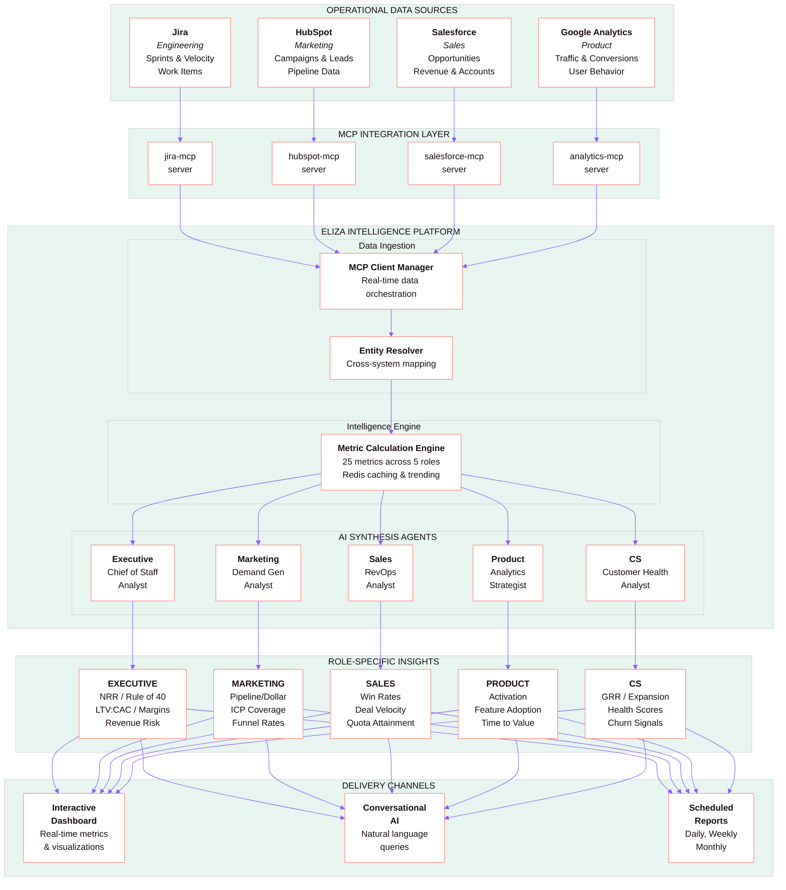
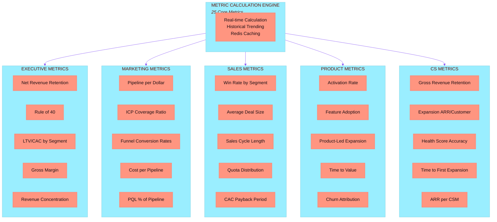
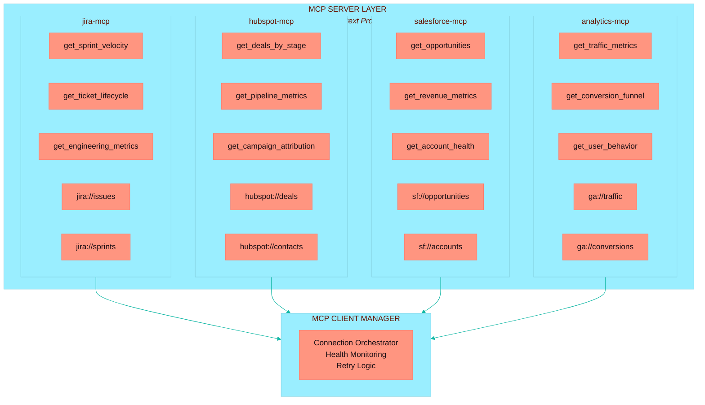
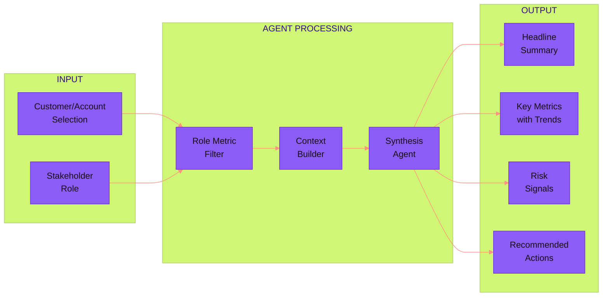
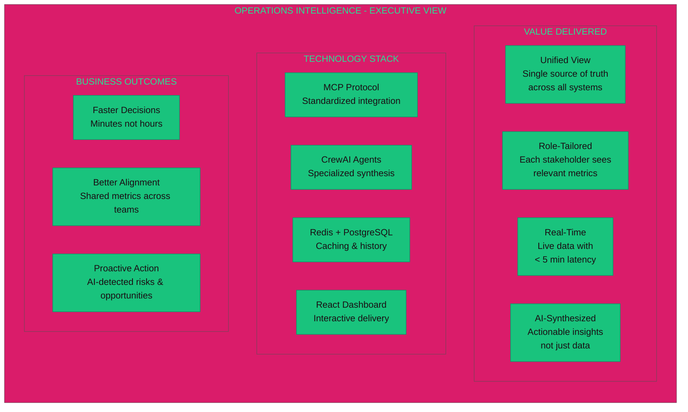
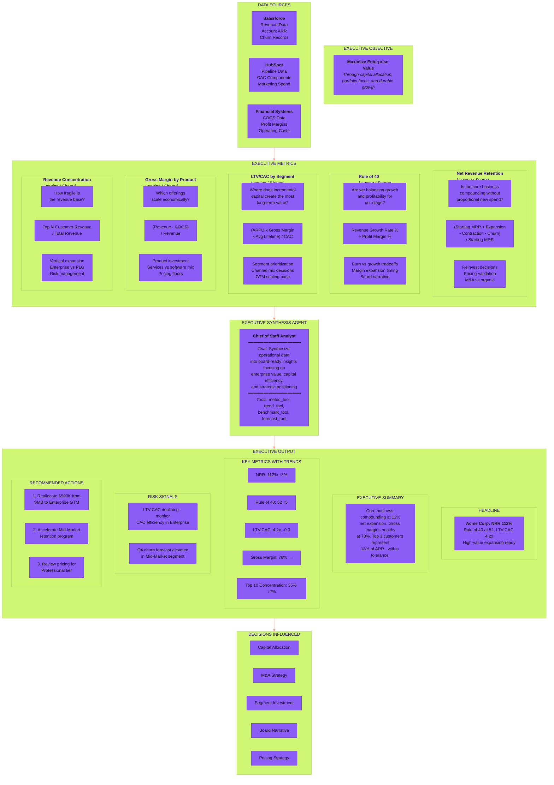
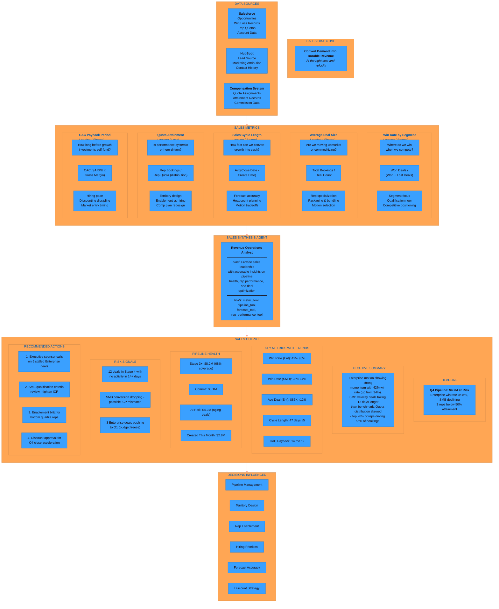
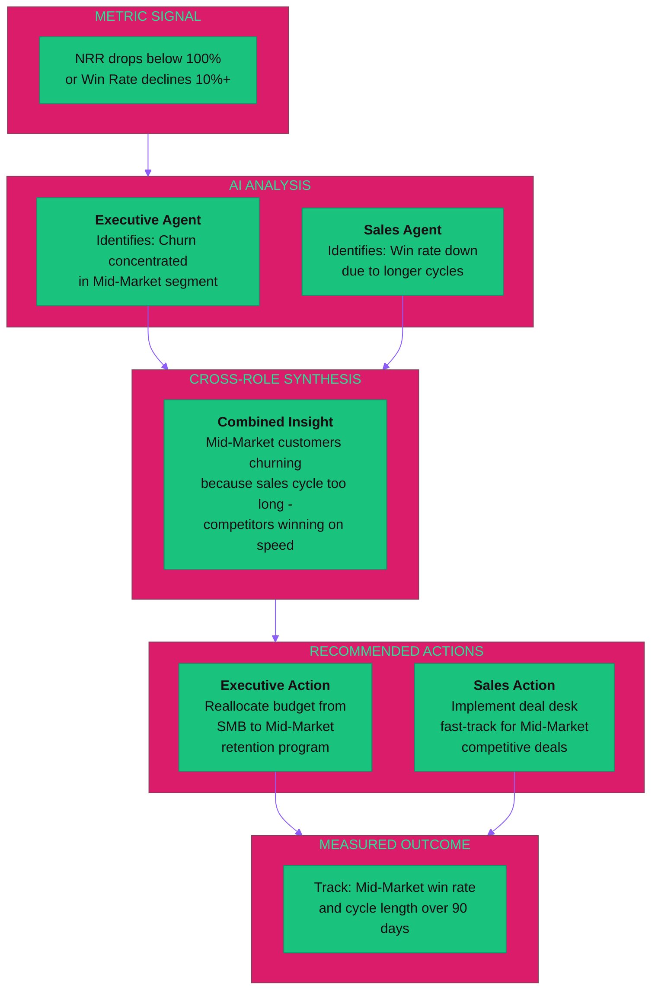

# Operations Intelligence - Architecture Diagram

A visual representation of the Operations Intelligence platform architecture for executive presentations.

---

## System Architecture Overview

---

## Data Flow Architecture

```mermaid
%%{init: {'theme': 'base', 'themeVariables': { 'primaryColor': '#FF9580', 'primaryTextColor': '#1a0d13', 'primaryBorderColor': '#FF7B6B', 'lineColor': '#8B5CF6', 'secondaryColor': '#F8F5F0', 'tertiaryColor': '#E8F5F0'}}}%%
flowchart LR
    subgraph Input["Data Sources"]
        Raw["Raw Operational<br/>Data"]
    end

    subgraph Transform["Transformation"]
        MCP["MCP Protocol<br/>Standardization"]
        Entity["Entity<br/>Resolution"]
        Metric["Metric<br/>Calculation"]
    end

    subgraph Intelligence["AI Processing"]
        Agent["Role-Specific<br/>Synthesis Agent"]
    end

    subgraph Output["Delivery"]
        Insight["Tailored<br/>Insights"]
    end

    Raw -->|"API Calls"| MCP
    MCP -->|"Normalized Data"| Entity
    Entity -->|"Unified Entities"| Metric
    Metric -->|"Calculated Metrics"| Agent
    Agent -->|"Synthesized Analysis"| Insight
```

---

## Role-Based Metric Distribution

---

## MCP Server Architecture

---

## AI Agent Synthesis Flow

---

## Executive Summary View

---

## DETAILED VIEW: Executive / HoldCo Role

---

## DETAILED VIEW: Sales Role

---

## Executive vs Sales: Metric Overlap

```mermaid
%%{init: {'theme': 'base', 'themeVariables': { 'primaryColor': '#FF9580', 'primaryTextColor': '#1a0d13', 'primaryBorderColor': '#FF7B6B', 'lineColor': '#8B5CF6'}}}%%
flowchart LR
    subgraph Shared["SHARED METRICS<br/><i>Both roles care about</i>"]
        S1["LTV/CAC Ratio"]
        S2["CAC Payback Period"]
        S3["Revenue by Segment"]
        S4["Win Rate Trends"]
    end

    subgraph ExecOnly["EXECUTIVE ONLY<br/><i>Board-level view</i>"]
        E1["Net Revenue Retention"]
        E2["Rule of 40"]
        E3["Gross Margin by Product"]
        E4["Revenue Concentration"]
    end

    subgraph SalesOnly["SALES ONLY<br/><i>Operational view</i>"]
        SA1["Quota Attainment Distribution"]
        SA2["Sales Cycle Length"]
        SA3["Pipeline Coverage Ratio"]
        SA4["Deal Velocity by Stage"]
    end

    ExecOnly --> Shared
    Shared --> SalesOnly
```

---

## Decision Flow: How Metrics Drive Action

---

## Color Reference (Eliza Platform)

| Element | Color | Hex |
|---------|-------|-----|
| Brand Primary | Coral Pink | `#FF9580` |
| Brand Strong | Salmon | `#FF7B6B` |
| AI Purple | Purple | `#8B5CF6` |
| AI Teal | Teal | `#14B8A6` |
| AI Success | Green | `#19C37D` |
| AI Info | Blue | `#3AA0FF` |
| AI Warning | Yellow | `#F4C542` |
| AI Danger | Red | `#EF4444` |
| Background | Cream | `#F8F5F0` |
| Text | Dark | `#1a0d13` |

---

## Usage Notes

These diagrams are designed for:
- Executive presentations
- Technical architecture reviews
- Stakeholder alignment meetings
- Product documentation

To render these diagrams:
1. **GitHub/GitLab**: Renders automatically in markdown files
2. **Mermaid Live Editor**: https://mermaid.live
3. **Confluence**: Use Mermaid plugin
4. **Slides**: Export as SVG from Mermaid Live Editor

