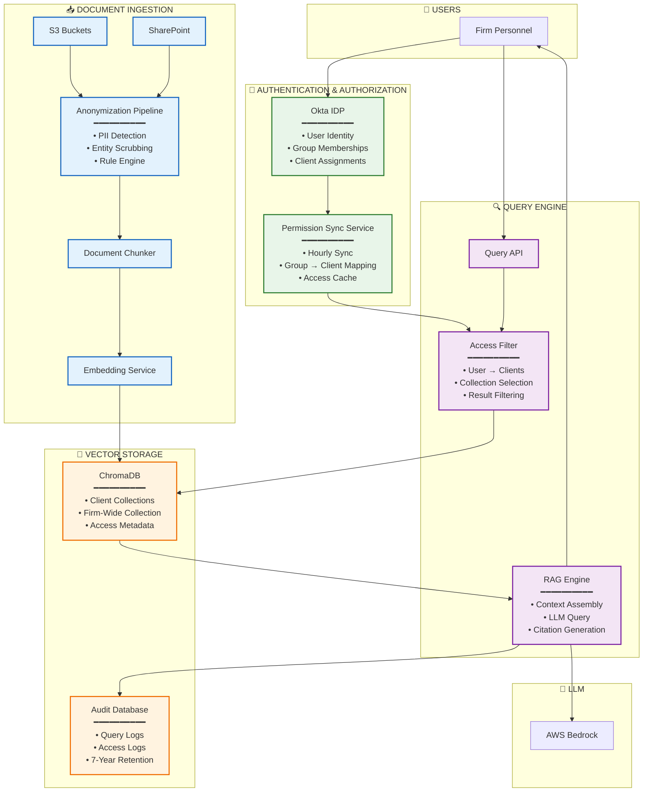
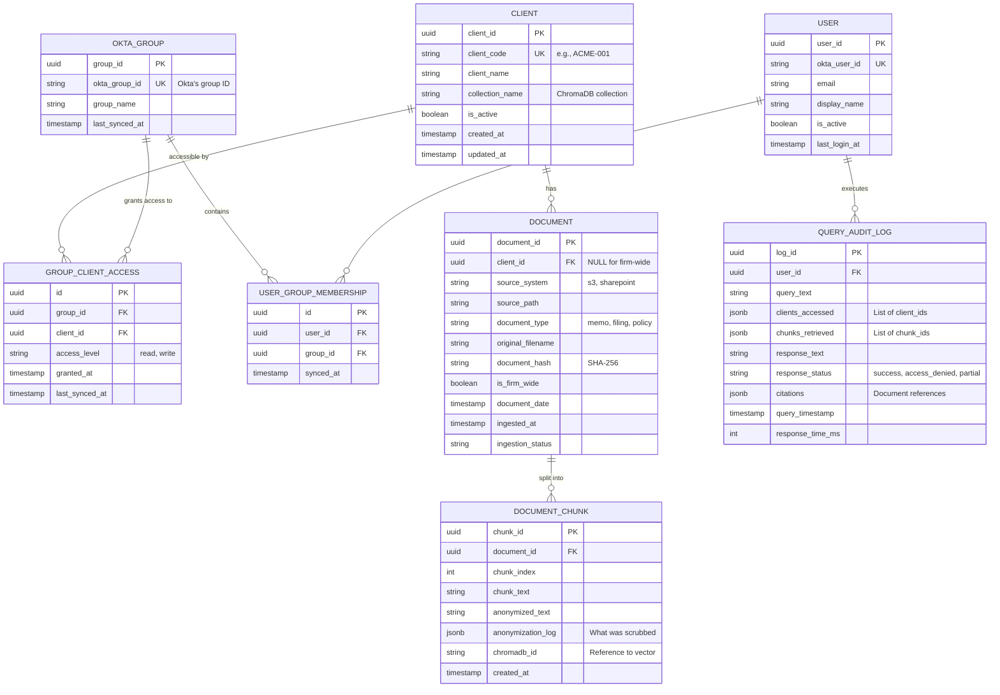
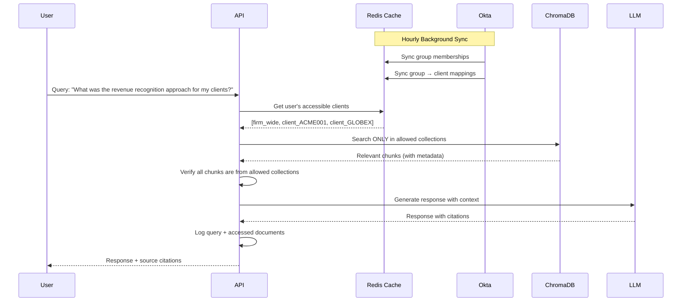
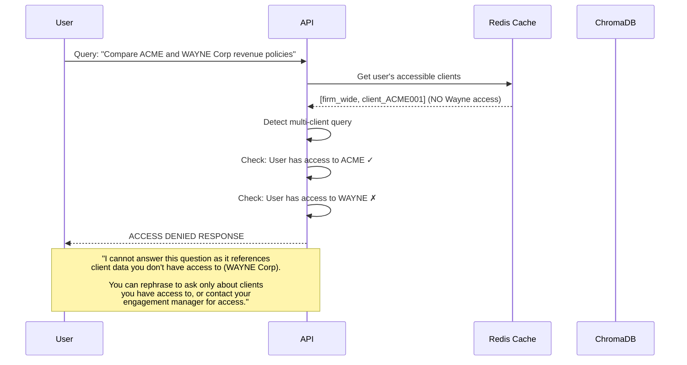
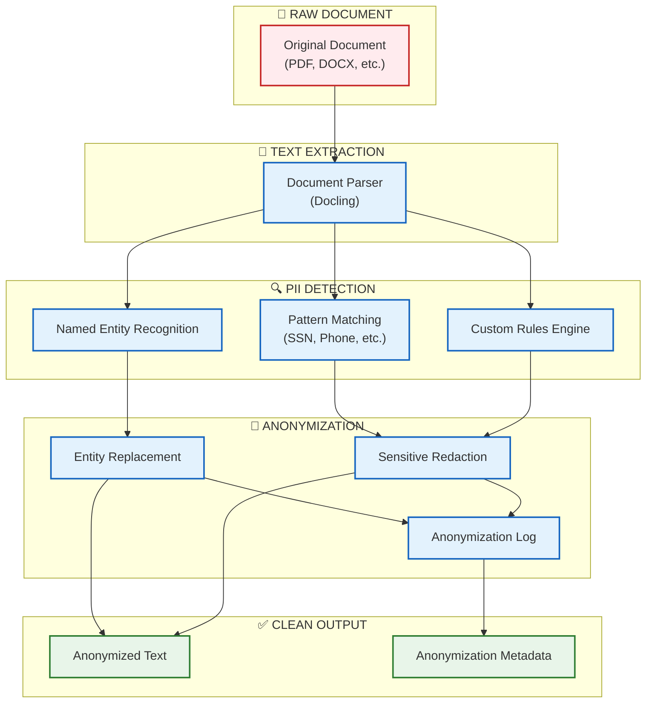
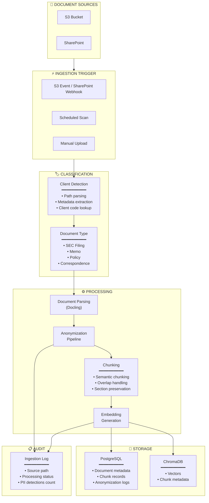
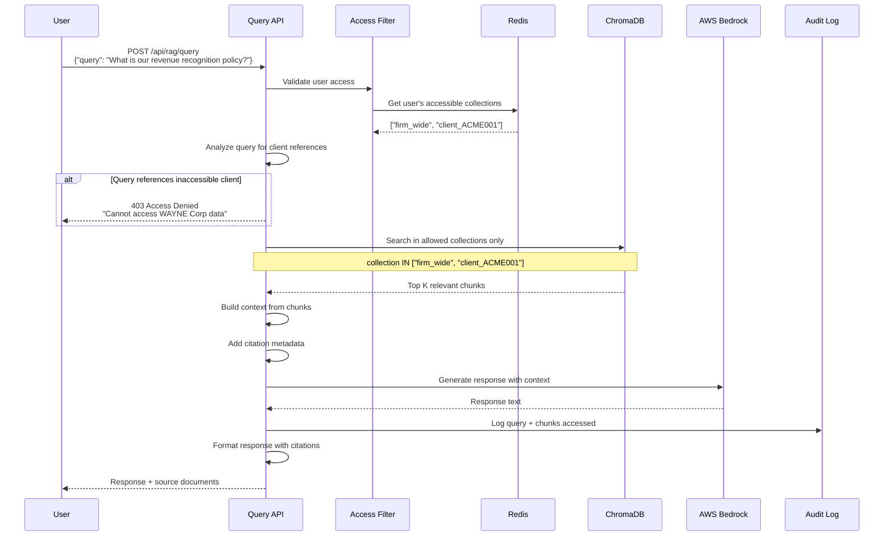
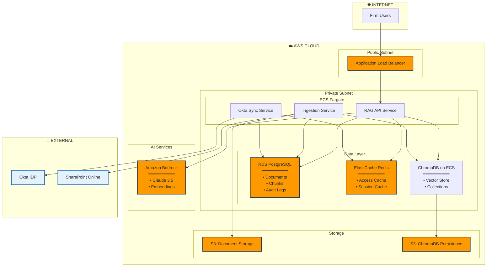

# RAG System with Native Access Controls - Technical Requirements

## Executive Summary

Technical requirements for a compliant RAG (Retrieval-Augmented Generation) system that enables firm personnel to query 15+ years of internal documents, accounting memos, and SEC filings while maintaining strict client data separation and SOX compliance.

**Key Principles:**
- Client data isolation enforced at the data model level
- Access controls derived from IDP (Okta) as single source of truth
- Full audit trail for 7+ year retention
- PII anonymization before embedding
- Clear user feedback when access boundaries are encountered

---

## 1. System Architecture Overview



---

## 2. Data Model

### 2.1 Core Entities



### 2.2 ChromaDB Collection Strategy

```
chromadb/
├── collections/
│   ├── firm_wide/                    # All users can access
│   │   └── embeddings + metadata
│   ├── client_ACME001/               # Only ACME team can access
│   │   └── embeddings + metadata
│   ├── client_GLOBEX/                # Only Globex team can access
│   │   └── embeddings + metadata
│   └── client_{client_code}/         # One collection per client
│       └── embeddings + metadata
```

**Collection Metadata Schema:**
```python
{
    "document_id": "uuid",
    "chunk_id": "uuid", 
    "document_type": "memo | filing | policy | correspondence",
    "document_date": "ISO-8601",
    "source_system": "s3 | sharepoint",
    "original_filename": "string",
    "section_title": "string (if applicable)",
    "page_number": "int (if applicable)",
    "is_anonymized": "boolean",
    "ingested_at": "ISO-8601"
}
```

### 2.3 Access Control Cache (Redis)

```python
# User's accessible clients - refreshed hourly from Okta
user_clients:{user_id} = {
    "client_ids": ["uuid1", "uuid2", ...],
    "collection_names": ["firm_wide", "client_ACME001", ...],
    "last_synced": "ISO-8601",
    "okta_groups": ["group1", "group2", ...]
}

# TTL: 2 hours (allows for sync delays)
```

---

## 3. Access Control Architecture

### 3.1 Permission Flow



### 3.2 Access Denial Flow



### 3.3 Okta Sync Service

```python
class OktaSyncService:
    """
    Hourly sync of Okta groups and memberships to local access cache.
    """
    
    def sync_all(self):
        """Main sync entry point - runs hourly via scheduled task."""
        # 1. Fetch all relevant groups from Okta
        okta_groups = self.okta_client.list_groups(filter="profile.groupType eq 'CLIENT_ACCESS'")
        
        # 2. For each group, get members and client mapping
        for group in okta_groups:
            group_members = self.okta_client.list_group_members(group.id)
            client_code = self.extract_client_code(group.profile.name)  # e.g., "Client-ACME001" → "ACME001"
            
            # 3. Update local database
            self.update_group_membership(group, group_members, client_code)
        
        # 4. Rebuild Redis cache for all affected users
        self.rebuild_user_access_cache()
        
        # 5. Log sync completion
        self.log_sync_audit(groups_synced=len(okta_groups))
    
    def get_user_accessible_collections(self, user_id: str) -> List[str]:
        """
        Returns list of ChromaDB collection names user can query.
        Always includes 'firm_wide'.
        """
        # Check cache first
        cached = self.redis.get(f"user_clients:{user_id}")
        if cached:
            return cached["collection_names"]
        
        # Fallback to database query
        collections = ["firm_wide"]  # Everyone gets firm-wide
        
        client_ids = self.db.query("""
            SELECT DISTINCT c.collection_name
            FROM clients c
            JOIN group_client_access gca ON c.client_id = gca.client_id
            JOIN user_group_membership ugm ON gca.group_id = ugm.group_id
            WHERE ugm.user_id = :user_id AND c.is_active = true
        """, user_id=user_id)
        
        collections.extend([c.collection_name for c in client_ids])
        
        # Cache for 2 hours
        self.redis.setex(f"user_clients:{user_id}", 7200, {
            "collection_names": collections,
            "last_synced": datetime.utcnow().isoformat()
        })
        
        return collections
```

---

## 4. Anonymization Pipeline

### 4.1 Pipeline Overview



### 4.2 Anonymization Rules Framework

```python
from enum import Enum
from typing import List, Dict, Callable, Pattern
from dataclasses import dataclass
import re

class PIICategory(Enum):
    """Categories of PII that can be detected and scrubbed."""
    SSN = "social_security_number"
    PHONE = "phone_number"
    EMAIL = "email_address"
    CREDIT_CARD = "credit_card"
    BANK_ACCOUNT = "bank_account"
    ADDRESS = "physical_address"
    DOB = "date_of_birth"
    PERSON_NAME = "person_name"
    EMPLOYEE_ID = "employee_id"
    SALARY = "salary_compensation"
    CUSTOM = "custom_rule"

class AnonymizationAction(Enum):
    """What to do when PII is detected."""
    REDACT = "redact"           # Replace with [REDACTED]
    MASK = "mask"               # Replace with XXX-XX-XXXX pattern
    GENERALIZE = "generalize"   # Replace with category (e.g., [PERSON])
    HASH = "hash"               # Replace with consistent hash (for linking)
    REMOVE = "remove"           # Remove entirely

@dataclass
class AnonymizationRule:
    """Definition of a single anonymization rule."""
    rule_id: str
    category: PIICategory
    description: str
    action: AnonymizationAction
    pattern: Pattern = None              # Regex pattern
    ner_labels: List[str] = None         # spaCy NER labels
    custom_detector: Callable = None     # Custom function
    replacement_template: str = None     # e.g., "[{category}]"
    is_active: bool = True
    priority: int = 100                  # Lower = higher priority

class AnonymizationRuleEngine:
    """
    Extensible rule engine for PII detection and anonymization.
    
    Rules can be:
    1. Regex-based (SSN, phone, email patterns)
    2. NER-based (person names, organizations)
    3. Custom function-based (domain-specific logic)
    """
    
    # Default rules - can be extended via configuration
    DEFAULT_RULES = [
        AnonymizationRule(
            rule_id="ssn_standard",
            category=PIICategory.SSN,
            description="US Social Security Number (XXX-XX-XXXX)",
            action=AnonymizationAction.REDACT,
            pattern=re.compile(r'\b\d{3}-\d{2}-\d{4}\b'),
            replacement_template="[SSN REDACTED]",
            priority=10
        ),
        AnonymizationRule(
            rule_id="ssn_no_dashes",
            category=PIICategory.SSN,
            description="US SSN without dashes (9 consecutive digits)",
            action=AnonymizationAction.REDACT,
            pattern=re.compile(r'\b\d{9}\b'),
            replacement_template="[SSN REDACTED]",
            priority=11
        ),
        AnonymizationRule(
            rule_id="phone_us",
            category=PIICategory.PHONE,
            description="US Phone numbers",
            action=AnonymizationAction.MASK,
            pattern=re.compile(r'\b(?:\+1[-.\s]?)?\(?\d{3}\)?[-.\s]?\d{3}[-.\s]?\d{4}\b'),
            replacement_template="[PHONE: XXX-XXX-XXXX]",
            priority=20
        ),
        AnonymizationRule(
            rule_id="email",
            category=PIICategory.EMAIL,
            description="Email addresses",
            action=AnonymizationAction.GENERALIZE,
            pattern=re.compile(r'\b[A-Za-z0-9._%+-]+@[A-Za-z0-9.-]+\.[A-Z|a-z]{2,}\b'),
            replacement_template="[EMAIL]",
            priority=30
        ),
        AnonymizationRule(
            rule_id="credit_card",
            category=PIICategory.CREDIT_CARD,
            description="Credit card numbers (major formats)",
            action=AnonymizationAction.REDACT,
            pattern=re.compile(r'\b(?:\d{4}[-\s]?){3}\d{4}\b'),
            replacement_template="[CREDIT CARD REDACTED]",
            priority=10
        ),
        AnonymizationRule(
            rule_id="person_name_ner",
            category=PIICategory.PERSON_NAME,
            description="Person names via NER",
            action=AnonymizationAction.GENERALIZE,
            ner_labels=["PERSON"],
            replacement_template="[PERSON]",
            priority=50
        ),
        AnonymizationRule(
            rule_id="salary_amount",
            category=PIICategory.SALARY,
            description="Salary/compensation amounts",
            action=AnonymizationAction.GENERALIZE,
            pattern=re.compile(r'\$[\d,]+(?:\.\d{2})?\s*(?:per\s+(?:year|annum|month)|annually|salary|compensation)', re.IGNORECASE),
            replacement_template="[COMPENSATION AMOUNT]",
            priority=40
        ),
    ]
    
    def __init__(self, custom_rules: List[AnonymizationRule] = None):
        self.rules = sorted(
            self.DEFAULT_RULES + (custom_rules or []),
            key=lambda r: r.priority
        )
        self.nlp = None  # Lazy load spaCy
    
    def add_rule(self, rule: AnonymizationRule):
        """Add a custom rule at runtime."""
        self.rules.append(rule)
        self.rules.sort(key=lambda r: r.priority)
    
    def anonymize(self, text: str) -> Dict:
        """
        Anonymize text according to configured rules.
        
        Returns:
            {
                "original_text": str,
                "anonymized_text": str,
                "detections": [
                    {
                        "rule_id": str,
                        "category": str,
                        "original_value": str,
                        "replacement": str,
                        "start_pos": int,
                        "end_pos": int
                    }
                ],
                "detection_count": int
            }
        """
        detections = []
        anonymized = text
        
        # Apply regex rules
        for rule in self.rules:
            if rule.pattern and rule.is_active:
                for match in rule.pattern.finditer(text):
                    detections.append({
                        "rule_id": rule.rule_id,
                        "category": rule.category.value,
                        "original_value": match.group(),
                        "replacement": rule.replacement_template,
                        "start_pos": match.start(),
                        "end_pos": match.end()
                    })
        
        # Apply NER rules
        ner_rules = [r for r in self.rules if r.ner_labels and r.is_active]
        if ner_rules:
            if self.nlp is None:
                import spacy
                self.nlp = spacy.load("en_core_web_lg")
            
            doc = self.nlp(text)
            for ent in doc.ents:
                for rule in ner_rules:
                    if ent.label_ in rule.ner_labels:
                        detections.append({
                            "rule_id": rule.rule_id,
                            "category": rule.category.value,
                            "original_value": ent.text,
                            "replacement": rule.replacement_template,
                            "start_pos": ent.start_char,
                            "end_pos": ent.end_char
                        })
        
        # Apply custom detector rules
        for rule in self.rules:
            if rule.custom_detector and rule.is_active:
                custom_detections = rule.custom_detector(text)
                detections.extend(custom_detections)
        
        # Sort detections by position (reverse) and apply replacements
        detections.sort(key=lambda d: d["start_pos"], reverse=True)
        for detection in detections:
            anonymized = (
                anonymized[:detection["start_pos"]] +
                detection["replacement"] +
                anonymized[detection["end_pos"]:]
            )
        
        return {
            "original_text": text,
            "anonymized_text": anonymized,
            "detections": sorted(detections, key=lambda d: d["start_pos"]),
            "detection_count": len(detections)
        }
```

### 4.3 Anonymization Configuration (YAML)

```yaml
# config/anonymization_rules.yaml
# Extend or override default anonymization rules

rules:
  # Firm-specific employee ID pattern
  - rule_id: firm_employee_id
    category: employee_id
    description: "Internal employee IDs (EMP-XXXXXX)"
    action: generalize
    pattern: "EMP-\\d{6}"
    replacement_template: "[EMPLOYEE_ID]"
    priority: 25
    is_active: true

  # Client account numbers
  - rule_id: client_account_number
    category: custom
    description: "Client account numbers"
    action: redact
    pattern: "ACC-[A-Z]{2}-\\d{8}"
    replacement_template: "[ACCOUNT REDACTED]"
    priority: 15
    is_active: true

  # Disable default email rule (if firm wants emails visible)
  - rule_id: email
    is_active: false

# Categories to always scrub (cannot be disabled)
mandatory_categories:
  - social_security_number
  - credit_card
  - bank_account

# Audit settings
audit:
  log_original_values: false  # Don't log actual PII in audit trail
  log_detection_counts: true
  retention_days: 2555  # 7 years
```

---

## 5. Document Ingestion Pipeline

### 5.1 Ingestion Flow



### 5.2 Ingestion Service

```python
class DocumentIngestionService:
    """
    Handles document ingestion from S3 and SharePoint into the RAG system.
    """
    
    def __init__(
        self,
        db: Session,
        chroma_client: chromadb.Client,
        anonymizer: AnonymizationRuleEngine,
        embedding_model: str = "text-embedding-3-small"
    ):
        self.db = db
        self.chroma = chroma_client
        self.anonymizer = anonymizer
        self.embedder = OpenAIEmbeddings(model=embedding_model)
        self.parser = DoclingParser()
    
    async def ingest_document(
        self,
        source_path: str,
        source_system: str,  # "s3" or "sharepoint"
        client_code: Optional[str] = None,  # None = firm-wide
        document_type: Optional[str] = None
    ) -> DocumentIngestionResult:
        """
        Ingest a single document into the RAG system.
        
        Steps:
        1. Download/access document
        2. Detect client (if not provided)
        3. Parse document to text
        4. Anonymize PII
        5. Chunk text
        6. Generate embeddings
        7. Store in ChromaDB + PostgreSQL
        """
        
        # 1. Access document
        if source_system == "s3":
            content = await self.s3_client.get_object(source_path)
        else:
            content = await self.sharepoint_client.get_file(source_path)
        
        # 2. Detect client from path if not provided
        if client_code is None:
            client_code = self._detect_client_from_path(source_path)
        
        is_firm_wide = client_code is None or client_code == "FIRM_WIDE"
        collection_name = "firm_wide" if is_firm_wide else f"client_{client_code}"
        
        # 3. Parse document
        parsed = await self.parser.parse(content)
        
        # 4. Create document record
        document = Document(
            document_id=uuid4(),
            client_id=self._get_client_id(client_code) if not is_firm_wide else None,
            source_system=source_system,
            source_path=source_path,
            document_type=document_type or self._detect_document_type(parsed),
            original_filename=Path(source_path).name,
            document_hash=hashlib.sha256(content).hexdigest(),
            is_firm_wide=is_firm_wide,
            document_date=parsed.metadata.get("date"),
            ingested_at=datetime.utcnow(),
            ingestion_status="processing"
        )
        self.db.add(document)
        
        # 5. Chunk and anonymize
        chunks = self._chunk_document(parsed.text, parsed.sections)
        
        chunk_records = []
        embeddings_to_store = []
        total_pii_detections = 0
        
        for idx, chunk_text in enumerate(chunks):
            # Anonymize
            anon_result = self.anonymizer.anonymize(chunk_text)
            total_pii_detections += anon_result["detection_count"]
            
            # Create chunk record
            chunk = DocumentChunk(
                chunk_id=uuid4(),
                document_id=document.document_id,
                chunk_index=idx,
                chunk_text=chunk_text,  # Original stored for audit
                anonymized_text=anon_result["anonymized_text"],
                anonymization_log=anon_result["detections"],
                chromadb_id=str(uuid4())
            )
            chunk_records.append(chunk)
            
            # Generate embedding from ANONYMIZED text only
            embedding = await self.embedder.embed(anon_result["anonymized_text"])
            
            embeddings_to_store.append({
                "id": chunk.chromadb_id,
                "embedding": embedding,
                "metadata": {
                    "document_id": str(document.document_id),
                    "chunk_id": str(chunk.chunk_id),
                    "document_type": document.document_type,
                    "document_date": document.document_date.isoformat() if document.document_date else None,
                    "original_filename": document.original_filename,
                    "chunk_index": idx,
                    "is_anonymized": anon_result["detection_count"] > 0
                },
                "document": anon_result["anonymized_text"]  # ChromaDB stores text too
            })
        
        # 6. Store in ChromaDB
        collection = self.chroma.get_or_create_collection(collection_name)
        collection.add(
            ids=[e["id"] for e in embeddings_to_store],
            embeddings=[e["embedding"] for e in embeddings_to_store],
            metadatas=[e["metadata"] for e in embeddings_to_store],
            documents=[e["document"] for e in embeddings_to_store]
        )
        
        # 7. Store chunks in PostgreSQL
        self.db.add_all(chunk_records)
        document.ingestion_status = "completed"
        self.db.commit()
        
        # 8. Log ingestion
        self._log_ingestion(
            document_id=document.document_id,
            source_path=source_path,
            chunks_created=len(chunk_records),
            pii_detections=total_pii_detections,
            collection_name=collection_name
        )
        
        return DocumentIngestionResult(
            document_id=document.document_id,
            chunks_created=len(chunk_records),
            pii_detections_scrubbed=total_pii_detections,
            collection_name=collection_name,
            status="success"
        )
    
    def _detect_client_from_path(self, path: str) -> Optional[str]:
        """
        Extract client code from document path.
        
        Expected patterns:
        - s3://firm-docs/clients/ACME001/... → ACME001
        - /sites/ClientDocs/GLOBEX/... → GLOBEX
        - s3://firm-docs/firm-wide/... → None (firm-wide)
        """
        # Client folder pattern
        match = re.search(r'/clients?/([A-Z0-9]+)/', path, re.IGNORECASE)
        if match:
            return match.group(1).upper()
        
        # Firm-wide indicators
        if '/firm-wide/' in path.lower() or '/internal/' in path.lower():
            return None
        
        # Default to firm-wide if can't determine
        return None
    
    def _chunk_document(
        self,
        text: str,
        sections: List[Dict] = None,
        chunk_size: int = 1000,
        overlap: int = 200
    ) -> List[str]:
        """
        Split document into chunks for embedding.
        
        Uses semantic chunking when sections are available,
        falls back to sliding window with overlap.
        """
        if sections:
            # Semantic chunking by section
            chunks = []
            for section in sections:
                section_text = section.get("text", "")
                if len(section_text) <= chunk_size:
                    chunks.append(section_text)
                else:
                    # Split large sections
                    chunks.extend(self._sliding_window_chunk(
                        section_text, chunk_size, overlap
                    ))
            return chunks
        else:
            # Sliding window fallback
            return self._sliding_window_chunk(text, chunk_size, overlap)
    
    def _sliding_window_chunk(
        self,
        text: str,
        chunk_size: int,
        overlap: int
    ) -> List[str]:
        """Simple sliding window chunking."""
        chunks = []
        start = 0
        while start < len(text):
            end = start + chunk_size
            chunk = text[start:end]
            
            # Try to break at sentence boundary
            if end < len(text):
                last_period = chunk.rfind('.')
                if last_period > chunk_size * 0.5:
                    chunk = chunk[:last_period + 1]
                    end = start + last_period + 1
            
            chunks.append(chunk.strip())
            start = end - overlap
        
        return chunks
```

---

## 6. Query Engine

### 6.1 Query Flow with Access Control



### 6.2 Query Service Implementation

```python
class RAGQueryService:
    """
    Query service with native access control enforcement.
    """
    
    def __init__(
        self,
        db: Session,
        chroma_client: chromadb.Client,
        okta_sync: OktaSyncService,
        llm_client: BedrockClient
    ):
        self.db = db
        self.chroma = chroma_client
        self.okta_sync = okta_sync
        self.llm = llm_client
        self.embedder = OpenAIEmbeddings(model="text-embedding-3-small")
    
    async def query(
        self,
        user_id: str,
        query_text: str,
        top_k: int = 10
    ) -> RAGQueryResponse:
        """
        Execute a RAG query with access control enforcement.
        """
        query_id = str(uuid4())
        start_time = datetime.utcnow()
        
        # 1. Get user's accessible collections
        accessible_collections = self.okta_sync.get_user_accessible_collections(user_id)
        
        if not accessible_collections:
            return self._access_denied_response(
                query_id=query_id,
                reason="You do not have access to any document collections. Please contact your administrator."
            )
        
        # 2. Check if query references specific clients
        referenced_clients = self._extract_client_references(query_text)
        
        if referenced_clients:
            # Verify user has access to ALL referenced clients
            inaccessible = []
            for client in referenced_clients:
                collection_name = f"client_{client}"
                if collection_name not in accessible_collections:
                    inaccessible.append(client)
            
            if inaccessible:
                return self._access_denied_response(
                    query_id=query_id,
                    reason=f"Your query references client data you don't have access to: {', '.join(inaccessible)}.",
                    suggestion="Please rephrase your question to only reference clients you have access to, or contact your engagement manager to request access."
                )
        
        # 3. Generate query embedding
        query_embedding = await self.embedder.embed(query_text)
        
        # 4. Search ONLY in accessible collections
        all_results = []
        collections_searched = []
        
        for collection_name in accessible_collections:
            try:
                collection = self.chroma.get_collection(collection_name)
                results = collection.query(
                    query_embeddings=[query_embedding],
                    n_results=top_k,
                    include=["documents", "metadatas", "distances"]
                )
                
                for i, doc in enumerate(results["documents"][0]):
                    all_results.append({
                        "text": doc,
                        "metadata": results["metadatas"][0][i],
                        "distance": results["distances"][0][i],
                        "collection": collection_name
                    })
                collections_searched.append(collection_name)
                
            except Exception as e:
                # Collection might not exist yet
                logger.warning(f"Could not search collection {collection_name}: {e}")
        
        if not all_results:
            return RAGQueryResponse(
                query_id=query_id,
                status="no_results",
                response_text="I couldn't find any relevant documents to answer your question. Please try rephrasing or ask about a different topic.",
                citations=[],
                collections_searched=collections_searched
            )
        
        # 5. Sort by relevance and take top K
        all_results.sort(key=lambda x: x["distance"])
        top_results = all_results[:top_k]
        
        # 6. Build context for LLM
        context = self._build_context(top_results)
        
        # 7. Generate response
        response_text = await self._generate_response(query_text, context)
        
        # 8. Build citations
        citations = self._build_citations(top_results)
        
        # 9. Log to audit trail
        await self._log_query_audit(
            query_id=query_id,
            user_id=user_id,
            query_text=query_text,
            collections_searched=collections_searched,
            chunks_retrieved=[r["metadata"]["chunk_id"] for r in top_results],
            response_text=response_text,
            response_time_ms=int((datetime.utcnow() - start_time).total_seconds() * 1000)
        )
        
        return RAGQueryResponse(
            query_id=query_id,
            status="success",
            response_text=response_text,
            citations=citations,
            collections_searched=collections_searched,
            chunks_used=len(top_results)
        )
    
    def _extract_client_references(self, query: str) -> List[str]:
        """
        Extract client codes/names from query text.
        
        Uses:
        1. Known client name lookup
        2. Pattern matching for client codes
        """
        referenced = []
        
        # Get all known clients
        clients = self.db.query(Client).filter(Client.is_active == True).all()
        
        query_lower = query.lower()
        for client in clients:
            if client.client_name.lower() in query_lower:
                referenced.append(client.client_code)
            elif client.client_code.lower() in query_lower:
                referenced.append(client.client_code)
        
        return list(set(referenced))
    
    def _access_denied_response(
        self,
        query_id: str,
        reason: str,
        suggestion: str = None
    ) -> RAGQueryResponse:
        """Build a clear access denied response."""
        
        response_text = f"⚠️ **Access Denied**\n\n{reason}"
        
        if suggestion:
            response_text += f"\n\n**Suggestion:** {suggestion}"
        
        return RAGQueryResponse(
            query_id=query_id,
            status="access_denied",
            response_text=response_text,
            citations=[],
            collections_searched=[],
            access_denied_reason=reason
        )
    
    def _build_context(self, results: List[Dict]) -> str:
        """Build context string from retrieved chunks."""
        context_parts = []
        
        for i, result in enumerate(results, 1):
            metadata = result["metadata"]
            context_parts.append(
                f"[Source {i}: {metadata.get('original_filename', 'Unknown')}]\n"
                f"{result['text']}\n"
            )
        
        return "\n---\n".join(context_parts)
    
    async def _generate_response(self, query: str, context: str) -> str:
        """Generate response using LLM with context."""
        
        prompt = f"""You are an AI assistant for a professional services firm. 
Answer the user's question based ONLY on the provided context documents.
If the context doesn't contain enough information to answer, say so clearly.
Always cite your sources by referring to [Source N] when using information from a document.

CONTEXT DOCUMENTS:
{context}

USER QUESTION:
{query}

ANSWER:"""
        
        response = await self.llm.invoke(prompt)
        return response.content
    
    def _build_citations(self, results: List[Dict]) -> List[Citation]:
        """Build citation objects from results."""
        citations = []
        
        for i, result in enumerate(results, 1):
            metadata = result["metadata"]
            citations.append(Citation(
                source_number=i,
                document_id=metadata.get("document_id"),
                document_name=metadata.get("original_filename", "Unknown"),
                document_type=metadata.get("document_type"),
                document_date=metadata.get("document_date"),
                chunk_id=metadata.get("chunk_id"),
                relevance_score=1 - result["distance"],  # Convert distance to similarity
                collection=result["collection"]
            ))
        
        return citations
    
    async def _log_query_audit(
        self,
        query_id: str,
        user_id: str,
        query_text: str,
        collections_searched: List[str],
        chunks_retrieved: List[str],
        response_text: str,
        response_time_ms: int
    ):
        """Log query to audit trail for compliance."""
        
        # Extract client IDs from collection names
        clients_accessed = []
        for coll in collections_searched:
            if coll.startswith("client_"):
                client_code = coll.replace("client_", "")
                client = self.db.query(Client).filter(
                    Client.client_code == client_code
                ).first()
                if client:
                    clients_accessed.append(str(client.client_id))
        
        audit_log = QueryAuditLog(
            log_id=uuid4(),
            user_id=user_id,
            query_text=query_text,
            clients_accessed=clients_accessed,
            chunks_retrieved=chunks_retrieved,
            response_text=response_text,
            response_status="success",
            citations=None,  # Added separately if needed
            query_timestamp=datetime.utcnow(),
            response_time_ms=response_time_ms
        )
        
        self.db.add(audit_log)
        self.db.commit()
```

---

## 7. API Endpoints

### 7.1 Query API

```python
from fastapi import APIRouter, Depends, HTTPException
from pydantic import BaseModel, Field
from typing import List, Optional

router = APIRouter(prefix="/api/rag", tags=["RAG"])

class RAGQueryRequest(BaseModel):
    query: str = Field(..., min_length=1, max_length=2000)
    top_k: int = Field(default=10, ge=1, le=50)

class Citation(BaseModel):
    source_number: int
    document_id: str
    document_name: str
    document_type: Optional[str]
    document_date: Optional[str]
    relevance_score: float
    collection: str

class RAGQueryResponse(BaseModel):
    query_id: str
    status: str  # success, access_denied, no_results, error
    response_text: str
    citations: List[Citation]
    collections_searched: List[str]
    chunks_used: Optional[int] = None
    access_denied_reason: Optional[str] = None

@router.post("/query", response_model=RAGQueryResponse)
async def query_rag(
    request: RAGQueryRequest,
    current_user = Depends(get_current_user),
    rag_service: RAGQueryService = Depends(get_rag_service)
):
    """
    Query the RAG system with access control enforcement.
    
    - User can only access firm-wide documents and client documents they have access to
    - Queries referencing inaccessible clients are rejected with clear explanation
    - All queries are logged for audit compliance
    """
    return await rag_service.query(
        user_id=str(current_user.id),
        query_text=request.query,
        top_k=request.top_k
    )
```

### 7.2 Admin APIs

```python
@router.post("/admin/ingest", response_model=DocumentIngestionResult)
async def ingest_document(
    request: DocumentIngestionRequest,
    current_user = Depends(require_admin),
    ingestion_service: DocumentIngestionService = Depends(get_ingestion_service)
):
    """
    Manually trigger document ingestion.
    Admin only.
    """
    return await ingestion_service.ingest_document(
        source_path=request.source_path,
        source_system=request.source_system,
        client_code=request.client_code,
        document_type=request.document_type
    )

@router.post("/admin/sync-permissions")
async def sync_permissions(
    current_user = Depends(require_admin),
    okta_sync: OktaSyncService = Depends(get_okta_sync)
):
    """
    Manually trigger Okta permission sync.
    Admin only.
    """
    await okta_sync.sync_all()
    return {"status": "sync_completed"}

@router.get("/admin/audit-logs", response_model=List[QueryAuditLogResponse])
async def get_audit_logs(
    start_date: datetime,
    end_date: datetime,
    user_id: Optional[str] = None,
    client_code: Optional[str] = None,
    current_user = Depends(require_admin),
    db: Session = Depends(get_db)
):
    """
    Retrieve query audit logs for compliance review.
    Admin only.
    """
    query = db.query(QueryAuditLog).filter(
        QueryAuditLog.query_timestamp >= start_date,
        QueryAuditLog.query_timestamp <= end_date
    )
    
    if user_id:
        query = query.filter(QueryAuditLog.user_id == user_id)
    
    if client_code:
        client = db.query(Client).filter(Client.client_code == client_code).first()
        if client:
            query = query.filter(
                QueryAuditLog.clients_accessed.contains([str(client.client_id)])
            )
    
    return query.order_by(QueryAuditLog.query_timestamp.desc()).limit(1000).all()
```

---

## 8. AWS Infrastructure

### 8.1 Architecture Diagram



### 8.2 Security Configuration

```yaml
# Infrastructure security requirements

network:
  vpc:
    cidr: "10.0.0.0/16"
    enable_dns_hostnames: true
    enable_dns_support: true
  
  subnets:
    public:
      - cidr: "10.0.1.0/24"
        az: "us-east-1a"
      - cidr: "10.0.2.0/24"
        az: "us-east-1b"
    private:
      - cidr: "10.0.10.0/24"
        az: "us-east-1a"
      - cidr: "10.0.11.0/24"
        az: "us-east-1b"
  
  security_groups:
    alb:
      ingress:
        - port: 443
          source: "0.0.0.0/0"
    
    ecs_services:
      ingress:
        - port: 8000
          source: "alb_sg"
      egress:
        - port: 443
          destination: "0.0.0.0/0"  # For Okta, Bedrock
        - port: 5432
          destination: "rds_sg"
        - port: 6379
          destination: "redis_sg"
    
    rds:
      ingress:
        - port: 5432
          source: "ecs_sg"
    
    redis:
      ingress:
        - port: 6379
          source: "ecs_sg"

encryption:
  at_rest:
    rds: "aws:kms"  # KMS encryption
    s3: "aws:kms"
    redis: "aws:kms"
    ebs: "aws:kms"
  
  in_transit:
    alb: "TLS 1.2+"
    rds: "require_ssl"
    redis: "in_transit_encryption"

iam:
  ecs_task_role:
    policies:
      - "s3:GetObject"  # Document access
      - "s3:PutObject"  # ChromaDB persistence
      - "bedrock:InvokeModel"
      - "secretsmanager:GetSecretValue"
      - "kms:Decrypt"
  
  okta_sync_role:
    # Minimal permissions for Okta API access
    policies:
      - "secretsmanager:GetSecretValue"  # Okta API token

logging:
  cloudwatch:
    log_groups:
      - "/ecs/rag-api"
      - "/ecs/ingestion-service"
      - "/ecs/okta-sync"
    retention_days: 2555  # 7 years for SOX
  
  cloudtrail:
    enabled: true
    include_global_service_events: true
    multi_region: true
```

---

## 9. Compliance & Audit

### 9.1 SOX Compliance Checklist

| Requirement | Implementation |
|-------------|----------------|
| **Access Control** | Okta-based RBAC, collection-level isolation |
| **Audit Trail** | All queries logged with user, timestamp, documents accessed |
| **Data Retention** | 7-year retention on audit logs (CloudWatch + RDS) |
| **Segregation of Duties** | Client data in separate collections, access enforced at query time |
| **Change Management** | Infrastructure as Code, PR reviews required |
| **Encryption** | At-rest (KMS) and in-transit (TLS) encryption |

### 9.2 Audit Log Schema

```sql
CREATE TABLE query_audit_logs (
    log_id UUID PRIMARY KEY,
    user_id UUID NOT NULL REFERENCES users(user_id),
    query_text TEXT NOT NULL,
    clients_accessed JSONB,  -- Array of client_ids
    chunks_retrieved JSONB,  -- Array of chunk_ids
    response_text TEXT,
    response_status VARCHAR(50),  -- success, access_denied, error
    citations JSONB,
    query_timestamp TIMESTAMPTZ NOT NULL DEFAULT NOW(),
    response_time_ms INTEGER,
    
    -- Indexing for compliance queries
    INDEX idx_audit_user (user_id),
    INDEX idx_audit_timestamp (query_timestamp),
    INDEX idx_audit_clients (clients_accessed) USING GIN
);

-- Retention policy: Archive to S3 after 1 year, delete after 7 years
-- Implemented via pg_cron or AWS DMS
```

### 9.3 Access Denial Logging

```python
class AccessDenialLog(BaseModel):
    """Log access denial events for security monitoring."""
    __tablename__ = "access_denial_logs"
    
    log_id = Column(UUID, primary_key=True)
    user_id = Column(UUID, ForeignKey('users.user_id'))
    query_text = Column(Text)
    requested_clients = Column(JSONB)  # Clients user tried to access
    accessible_clients = Column(JSONB)  # Clients user actually has access to
    denial_reason = Column(Text)
    timestamp = Column(DateTime, default=datetime.utcnow)
    
    # Alert threshold: >5 denials in 1 hour triggers security review
```

---

## 10. Implementation Phases

### Phase 1: Foundation (Weeks 1-3)
- [ ] Set up AWS infrastructure (VPC, ECS, RDS, Redis)
- [ ] Deploy ChromaDB on ECS with S3 persistence
- [ ] Implement data model (PostgreSQL schemas)
- [ ] Build Okta integration and permission sync service

### Phase 2: Ingestion Pipeline (Weeks 4-6)
- [ ] Implement document parser (Docling integration)
- [ ] Build anonymization rule engine with default rules
- [ ] Create chunking and embedding pipeline
- [ ] Set up S3 event triggers for automatic ingestion
- [ ] Build SharePoint connector

### Phase 3: Query Engine (Weeks 7-9)
- [ ] Implement access-controlled query service
- [ ] Build LLM integration (Bedrock)
- [ ] Create citation generation
- [ ] Implement access denial handling with clear messaging
- [ ] Build audit logging

### Phase 4: API & Integration (Weeks 10-11)
- [ ] Build REST API endpoints
- [ ] Implement authentication middleware (Okta JWT validation)
- [ ] Create admin endpoints for manual operations
- [ ] Build monitoring dashboards

### Phase 5: Testing & Compliance (Weeks 12-14)
- [ ] Security penetration testing
- [ ] Access control validation (cross-client query attempts)
- [ ] Performance testing
- [ ] SOX compliance audit
- [ ] Documentation and runbooks

---

## 11. Success Criteria

| Metric | Target |
|--------|--------|
| **Access Control Accuracy** | 100% - No cross-client data leakage |
| **Query Response Time** | < 5 seconds (p95) |
| **Audit Log Completeness** | 100% of queries logged |
| **Permission Sync Latency** | < 1 hour from Okta change |
| **PII Detection Rate** | > 95% of known PII patterns |
| **System Availability** | 99.9% uptime |

---

## Appendix A: Anonymization Rule Examples

```yaml
# Additional firm-specific rules

# Partner names (may want to preserve for context)
- rule_id: partner_name
  category: person_name
  description: "Preserve partner names (senior staff)"
  action: none  # Don't anonymize
  custom_detector: "is_partner_name"
  is_active: true

# Client employee names in memos
- rule_id: client_employee_name
  category: person_name
  description: "Client employee names"
  action: generalize
  replacement_template: "[CLIENT EMPLOYEE]"
  priority: 45

# Specific dollar amounts over threshold
- rule_id: large_dollar_amount
  category: custom
  description: "Dollar amounts over $1M"
  action: generalize
  pattern: "\\$[1-9]\\d{0,2}(?:,\\d{3}){2,}(?:\\.\\d{2})?"
  replacement_template: "[LARGE DOLLAR AMOUNT]"
  priority: 35
```

---

## Appendix B: Error Handling

```python
class RAGAccessError(Exception):
    """Raised when user attempts to access unauthorized data."""
    def __init__(self, user_id: str, requested_clients: List[str], reason: str):
        self.user_id = user_id
        self.requested_clients = requested_clients
        self.reason = reason
        super().__init__(f"Access denied for user {user_id}: {reason}")

class RAGIngestionError(Exception):
    """Raised when document ingestion fails."""
    def __init__(self, document_path: str, stage: str, reason: str):
        self.document_path = document_path
        self.stage = stage
        self.reason = reason
        super().__init__(f"Ingestion failed at {stage} for {document_path}: {reason}")
```


