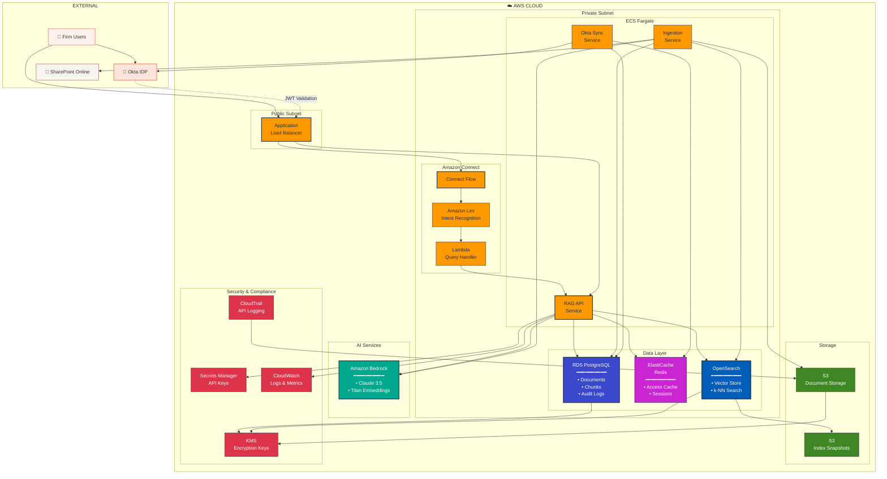

# RAG System - AWS Architecture

AWS infrastructure for the secure, compliant RAG system with Okta-based access control.

---

---

## Component Summary

| Layer | AWS Service | Purpose |
|-------|-------------|---------|
| **User Interface** | Amazon Connect + Lex | Voice/chat interface with intent recognition |
| **API Gateway** | Application Load Balancer | HTTPS termination, routing |
| **Compute** | ECS Fargate + Lambda | Serverless RAG API, ingestion, sync |
| **Vector Search** | OpenSearch (k-NN) | Semantic search over document embeddings |
| **Database** | RDS PostgreSQL | Documents, chunks, audit logs |
| **Cache** | ElastiCache Redis | Access permissions, session state |
| **Storage** | S3 | Document storage, index snapshots |
| **AI/ML** | Amazon Bedrock | Claude 3.5 (generation), Titan (embeddings) |
| **Auth** | Okta (external) | Identity, group-based access control |
| **Security** | KMS, Secrets Manager | Encryption, credential management |
| **Compliance** | CloudTrail, CloudWatch | Audit logging, 7-year retention |

---

## Security Controls

| Control | Implementation |
|---------|----------------|
| 🔐 **Encryption at Rest** | KMS-managed keys for RDS, S3, OpenSearch |
| 🔒 **Encryption in Transit** | TLS 1.2+ on all connections |
| 👤 **Authentication** | Okta JWT validation at ALB |
| 🚫 **Authorization** | Client-based collection isolation in OpenSearch |
| 📋 **Audit Trail** | CloudTrail + CloudWatch Logs (7-year retention) |
| 🔑 **Secrets** | Secrets Manager for API keys, DB credentials |

---

## Data Flow

1. **User Query** → Connect/Lex recognizes intent → Lambda invokes RAG API
2. **Access Check** → Redis cache validates user's client permissions (from Okta sync)
3. **Vector Search** → OpenSearch k-NN searches ONLY authorized collections
4. **Generation** → Bedrock Claude generates response with context
5. **Audit** → Query logged to RDS + CloudWatch for compliance

