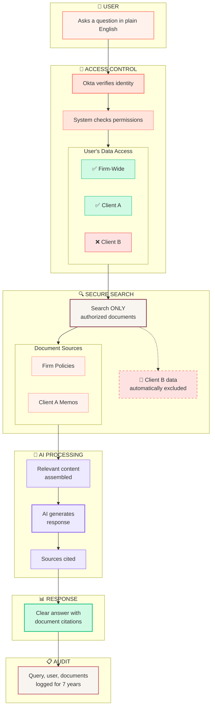

# RAG Query Flow - Executive Overview

How the system answers questions while protecting client data.

---

---

## Key Safeguards

| Protection | How It Works |
|------------|--------------|
| 🔐 **Identity Verification** | User identity confirmed via Okta before every query |
| 📁 **Data Isolation** | Each client's documents stored in separate collections |
| 🚫 **Access Enforcement** | System only searches documents user is authorized to see |
| 📋 **Full Audit Trail** | Every query logged with user, time, and documents accessed |
| ⚠️ **Clear Denials** | If user asks about restricted data, system explains why |

---

> **Bottom Line:** Users can only see data they're authorized to access. The system enforces this automatically, logs everything for compliance, and provides clear feedback when access is denied.

