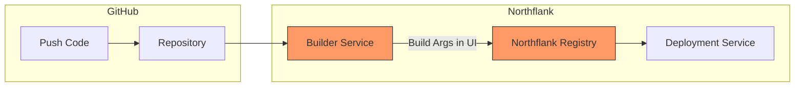
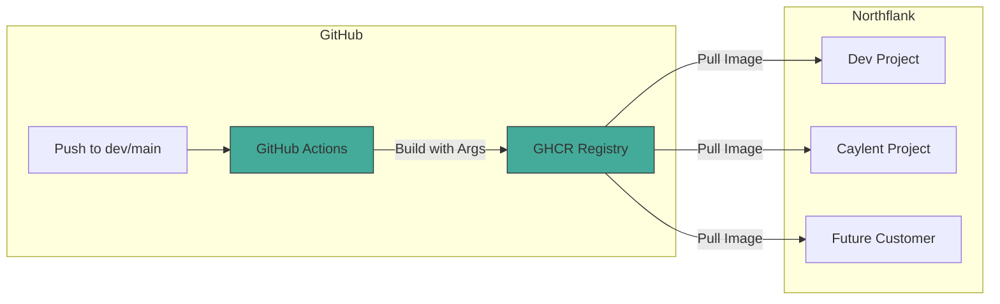
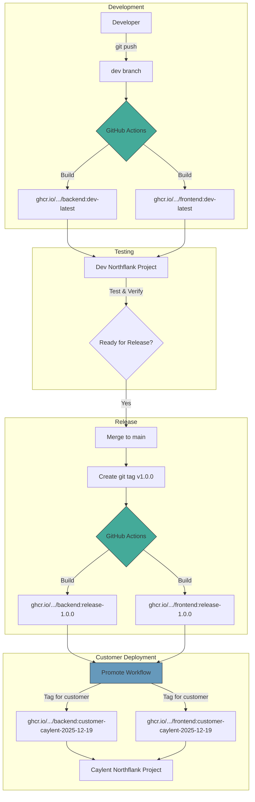
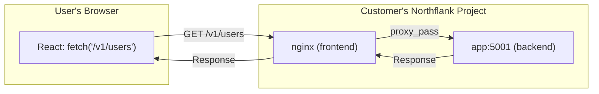
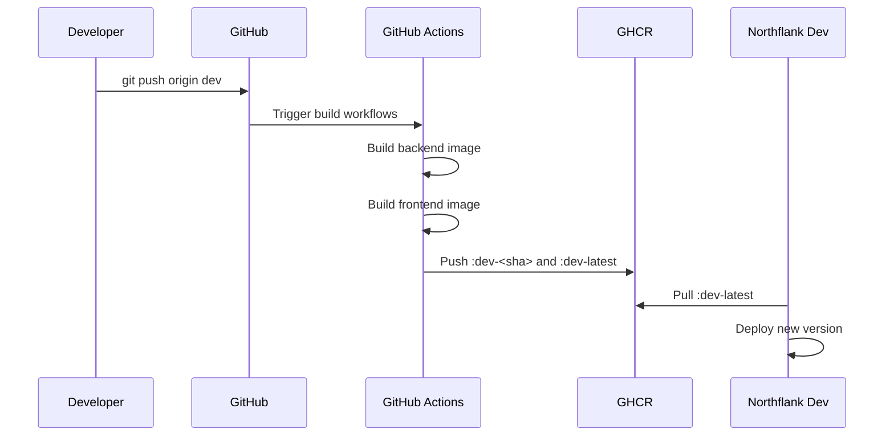

# CI/CD Pipeline & GHCR Setup

This document describes the GitHub Actions CI/CD pipeline for building Docker images and deploying to customer environments via Northflank.

## Architecture Overview

### Two Approaches Compared

| Aspect | Northflank Builders (Current) | GitHub Actions + GHCR (New) |
|--------|-------------------------------|------------------------------|
| **Who builds?** | Northflank | GitHub Actions |
| **Where images live** | Northflank Registry | GitHub Container Registry |
| **Northflank role** | Build + Deploy | Deploy only |
| **Build args managed in** | Northflank UI | GitHub Actions workflows |
| **Cross-project sharing** | Complex | Simple (one registry) |
| **Customer isolation** | Separate builds per project | One image, multiple deployments |

### Recommended: GitHub Actions + GHCR

With this approach:
- ✅ **Northflank builders are NOT needed** - delete them
- ✅ Build args are defined once in GitHub Actions
- ✅ Same image can deploy to multiple customers
- ✅ Version control for build configuration
- ✅ Faster deployments (no rebuild needed)

---

## Flow Diagrams

### Current Flow (Northflank Builders)



**Problems with this approach:**
- Build args scattered across Northflank UI
- Each customer project needs its own builder
- No version control for build configuration
- Harder to share images across projects

---

### New Flow (GitHub Actions + GHCR)



**Benefits:**
- Build args in version-controlled workflow files
- One build serves all customers
- Northflank only deploys (simpler, faster)
- Easy to add new customers

---

### Complete Pipeline Flow



---

## Migration: Northflank Builders → GitHub Actions

### Step 1: Note Your Current Build Args

Before removing Northflank builders, document all build args:

| Service | Build Arg | Current Value |
|---------|-----------|---------------|
| frontend-build | REACT_APP_API_URL | (your value) |
| backend-build | (any others) | (values) |

### Step 2: Verify Build Args in GitHub Actions

Check `.github/workflows/build-frontend.yml`:

```yaml
build-args: |
  REACT_APP_API_URL=${{ steps.api_url.outputs.url }}
```

Update the workflow if you need different URLs per environment.

### Step 3: Add GHCR Registry to Northflank

1. Go to Northflank → **Settings** → **Registries**
2. Add new registry:
   - **URL:** `ghcr.io`
   - **Username:** Your GitHub username
   - **Password:** GitHub PAT with `read:packages` scope

### Step 4: Create Deployment Services (Replace Builders)

For each service that was using a Northflank builder:

**Before (Builder):**
```
frontend-build (Combined Build Service)
  ↓ builds from git
  ↓ stores in Northflank registry
```

**After (External Image):**
```
frontend (Deployment Service)
  ↓ pulls from GHCR
  ↓ ghcr.io/eliza-hq/elizaplatform-frontend:dev-latest
```

### Step 5: Delete Northflank Builders

Once deployments are working with GHCR images, delete the old builder services.

---

## Build Args Management

### Where Build Args Are Now Defined

All build args are in the GitHub Actions workflow files:

**Backend** (`.github/workflows/build-backend.yml`):
```yaml
build-args: |
  BUILD_DATE=${{ github.event.head_commit.timestamp }}
  GIT_SHA=${{ github.sha }}
  GIT_REF=${{ github.ref_name }}
```

**Frontend** (`.github/workflows/build-frontend.yml`):
```yaml
build-args: |
  REACT_APP_API_URL=        # Empty! Uses relative URLs
  BUILD_DATE=${{ github.event.head_commit.timestamp }}
  GIT_SHA=${{ github.sha }}
  GIT_REF=${{ github.ref_name }}
```

---

## API URL Strategy: Relative URLs + Nginx Proxy

### The Problem

React's `REACT_APP_*` variables are baked in at build time. If you hardcode an API URL, you need a different image per customer.

### The Solution

**We use relative URLs so ONE frontend image works for ALL customers!**

| Component | Configuration |
|-----------|--------------|
| React code | Uses `/v1/...` (relative URLs, no domain) |
| nginx.conf | Proxies `/v1/` to `http://app:5001` |
| Northflank | Each project has its own `app` backend service |

### How It Works



### nginx.conf Configuration

The frontend already has the proxy configured:

```nginx
# frontend/nginx.conf (already configured!)
location /v1/ {
    proxy_pass http://app:5001;
    proxy_http_version 1.1;
    proxy_set_header Host $host;
    proxy_set_header X-Real-IP $remote_addr;
    proxy_set_header X-Forwarded-For $proxy_add_x_forwarded_for;
    proxy_set_header X-Forwarded-Proto $scheme;
}
```

### Why This Works for Multiple Customers

Each Northflank project has its own isolated services:

```
┌─────────────────────────────────────────────────────────────────┐
│                    SAME IMAGE, DIFFERENT PROJECTS                │
├─────────────────────────────────────────────────────────────────┤
│                                                                  │
│  ┌─────────────┐    ┌─────────────┐    ┌─────────────┐         │
│  │   Caylent   │    │    Acme     │    │     Dev     │         │
│  │   Project   │    │   Project   │    │   Project   │         │
│  ├─────────────┤    ├─────────────┤    ├─────────────┤         │
│  │ frontend    │    │ frontend    │    │ frontend    │         │
│  │ app         │    │ app         │    │ app         │         │
│  │ postgres    │    │ postgres    │    │ postgres    │         │
│  └─────────────┘    └─────────────┘    └─────────────┘         │
│        │                  │                  │                  │
│        ▼                  ▼                  ▼                  │
│  http://app:5001    http://app:5001    http://app:5001         │
│  (their backend)    (their backend)    (dev backend)           │
│                                                                  │
└─────────────────────────────────────────────────────────────────┘
```

The `app` hostname resolves to **that project's** backend service - complete isolation!

---

## Images

| Image | Registry Path | Dockerfile | Services |
|-------|---------------|------------|----------|
| Backend | `ghcr.io/eliza-hq/elizaplatform-backend` | `docker/Dockerfile` | app, celery-worker, celery-beat, flower |
| Frontend | `ghcr.io/eliza-hq/elizaplatform-frontend` | `frontend/Dockerfile` | frontend |
| Logstash | `ghcr.io/eliza-hq/elizaplatform-logstash` | `docker/logstash/Dockerfile` | logstash |

## Tagging Strategy

### Branch Tags (Automatic)

| Branch | Tags Created | Example |
|--------|--------------|---------|
| `dev` | `dev-<sha>`, `dev-latest` | `dev-abc1234`, `dev-latest` |
| `main` | `main-<sha>`, `main-latest` | `main-def5678`, `main-latest` |

### Release Tags (On Git Tags)

| Git Tag | Image Tags Created |
|---------|-------------------|
| `v2025.12.19.1` | `release-2025.12.19.1`, `2025.12.19.1` |
| `v1.0.0` | `release-1.0.0`, `1.0.0`, `1.0` |

### Customer Tags (Manual Promotion)

| Customer | Tag Format | Example |
|----------|-----------|---------|
| Caylent | `customer-caylent-<date>` | `customer-caylent-2025-12-19` |
| Acme Corp | `customer-acme-<date>` | `customer-acme-2025-12-19` |

---

## GitHub Actions Workflows

### 1. Build Backend (`build-backend.yml`)

**Triggers:**
- Push to `dev` or `main` branch (**only when backend files change**)
- Push of `v*` tags (releases - always builds)
- Manual dispatch

**Path Filters (only builds when these change):**
- `src/**` - Backend Python code
- `config/**` - Configuration files
- `alembic/**` - Database migrations
- `docker/Dockerfile`, `docker/entrypoint.sh` - Container config
- `requirements.txt`, `requirements-*.txt` - Dependencies

**Output:**
- Pushes image to `ghcr.io/eliza-hq/elizaplatform-backend`
- Generates build summary with digest for pinning

### 2. Build Frontend (`build-frontend.yml`)

**Triggers:**
- Push to `dev` or `main` branch (**only when frontend files change**)
- Push of `v*` tags (releases - always builds)
- Manual dispatch

**Path Filters (only builds when these change):**
- `frontend/**` - React app, nginx config, Dockerfile

**Build Args:**
- `REACT_APP_API_URL` - Empty (uses relative URLs + nginx proxy)

**Output:**
- Pushes image to `ghcr.io/eliza-hq/elizaplatform-frontend`

### 3. Build Logstash (`build-logstash.yml`)

**Triggers:**
- ⚠️ **Manual dispatch only** (infrastructure rarely changes)
- Push of `v*` tags (releases)

**Why manual-only?**
- Logstash config rarely changes
- Base image is large (~1GB), builds take 7-10 minutes
- No need to rebuild on every dev/main push

**To build manually:**
1. Go to **Actions** → **Build Logstash Image**
2. Click **Run workflow**
3. Select branch and run

**Output:**
- Pushes image to `ghcr.io/eliza-hq/elizaplatform-logstash`

### 4. Promote to Customer (`promote-release.yml`)

**Manual workflow for promoting tested images to customers.**

**Inputs:**
| Input | Description | Example |
|-------|-------------|---------|
| `image_type` | Which image to promote | `backend`, `frontend`, `both` |
| `source_tag` | Tag to promote from | `main-latest`, `release-2025.12.19.1` |
| `customer_name` | Customer identifier | `caylent` |
| `custom_suffix` | Optional custom suffix | `hotfix-123` |

**Usage:**
1. Go to **Actions** → **Promote to Customer**
2. Click **Run workflow**
3. Fill in the inputs
4. Run and copy the resulting tag for Northflank

---

## Northflank Configuration

### 1. Add GHCR Registry Credentials

In each Northflank project:

1. Go to **Settings** → **Registries**
2. Click **Add Registry**
3. Configure:
   - **Registry URL:** `ghcr.io`
   - **Username:** Your GitHub username or `eliza-hq`
   - **Password:** GitHub PAT with `read:packages` scope

### 2. Create GitHub Personal Access Token (PAT)

1. Go to GitHub → **Settings** → **Developer settings** → **Personal access tokens** → **Tokens (classic)**
2. Generate new token with scopes:
   - `read:packages` (for pulling images)
   - `write:packages` (if Northflank needs to push)
3. Save the token securely

### 3. Create Deployment Services (NOT Build Services)

For each service:

1. Create a new **Deployment** (not a Build service)
2. Select **External Image**
3. Enter image path:
   ```
   ghcr.io/eliza-hq/elizaplatform-backend:dev-latest
   ```
4. Select the GHCR registry credentials
5. Configure environment variables, networking, etc.
6. Deploy

**Northflank service types:**

| Old (Builder) | New (External Image) |
|---------------|---------------------|
| frontend-build | frontend |
| backend-build | app |
| (combined) | celery-worker |
| (combined) | celery-beat |
| (combined) | flower |

---

## Deployment Workflow

### Development Flow



### Release Flow

```bash
# 1. Merge dev to main
git checkout main
git merge dev
git push origin main

# 2. Create release tag
git tag v2025.12.19.1
git push origin v2025.12.19.1

# 3. GitHub Actions builds:
#    - ghcr.io/eliza-hq/elizaplatform-backend:main-<sha>
#    - ghcr.io/eliza-hq/elizaplatform-backend:main-latest
#    - ghcr.io/eliza-hq/elizaplatform-backend:release-2025.12.19.1
```

### Customer Promotion Flow

```bash
# 1. Test the release internally

# 2. Run "Promote to Customer" workflow:
#    - image_type: both
#    - source_tag: release-2025.12.19.1
#    - customer_name: caylent

# 3. Creates:
#    - ghcr.io/eliza-hq/elizaplatform-backend:customer-caylent-2025-12-19
#    - ghcr.io/eliza-hq/elizaplatform-frontend:customer-caylent-2025-12-19

# 4. Update customer's Northflank project to use new tags
```

---

## Image Pinning Best Practices

### For Production/Customers

**Always use immutable references:**

```bash
# ✅ GOOD: Immutable digest (best)
ghcr.io/eliza-hq/elizaplatform-backend@sha256:abc123...

# ✅ GOOD: Customer-specific dated tag
ghcr.io/eliza-hq/elizaplatform-backend:customer-caylent-2025-12-19

# ✅ GOOD: Release tag
ghcr.io/eliza-hq/elizaplatform-backend:release-2025.12.19.1
```

**Avoid mutable tags in production:**

```bash
# ❌ BAD: Mutable "latest" tags can change unexpectedly
ghcr.io/eliza-hq/elizaplatform-backend:main-latest
ghcr.io/eliza-hq/elizaplatform-backend:dev-latest
```

### For Development

Using `:dev-latest` is fine for internal development environments where you want automatic updates.

---

## Rollback Procedure

### Quick Rollback

```bash
# 1. Identify previous working tag
#    Check GitHub Actions history or GHCR tags

# 2. Update Northflank service to previous tag
#    e.g., change from :customer-caylent-2025-12-19 
#    to :customer-caylent-2025-12-15

# 3. Redeploy the service
```

### Emergency Rollback via Digest

```bash
# If you noted the digest from the build summary:
ghcr.io/eliza-hq/elizaplatform-backend@sha256:previous_digest_here
```

---

## Monitoring Builds

### GitHub Actions

- View all builds: https://github.com/eliza-hq/ElizaPlatform/actions
- Build artifacts include summaries with:
  - All generated tags
  - Image digest for pinning
  - Commands for Northflank deployment

### GHCR Package Page

- View all images: https://github.com/orgs/eliza-hq/packages
- See all tags and digests
- View image vulnerabilities (if enabled)

---

## Security Notes

### Secrets Management

| Secret | Where Stored | Purpose |
|--------|--------------|---------|
| `GITHUB_TOKEN` | GitHub Actions (automatic) | Push to GHCR |
| GHCR PAT | Northflank Registries | Pull from GHCR |
| API Keys | Northflank Secrets | Runtime configuration |

### Image Visibility

By default, GHCR images inherit repository visibility:
- **Private repo** → Private images (require authentication)
- **Public repo** → Public images

To change visibility:
1. Go to the package settings in GitHub
2. Change "Visibility" to private/public

---

## Troubleshooting

### Build Failures

```bash
# Check GitHub Actions logs
# Common issues:
# - Dockerfile syntax errors
# - Missing dependencies
# - Network timeouts (retry usually fixes)
```

### Pull Failures in Northflank

```bash
# Check:
# 1. Registry credentials are configured correctly
# 2. PAT has read:packages scope
# 3. Image tag exists in GHCR
# 4. Image visibility matches PAT permissions
```

### Image Not Found

```bash
# Verify image exists:
docker pull ghcr.io/eliza-hq/elizaplatform-backend:your-tag

# Check available tags:
# Go to https://github.com/eliza-hq/ElizaPlatform/pkgs/container/elizaplatform-backend
```

---

## Quick Reference

### Common Commands

```bash
# List available tags (requires gh CLI)
gh api /orgs/eliza-hq/packages/container/elizaplatform-backend/versions

# Pull specific image
docker pull ghcr.io/eliza-hq/elizaplatform-backend:main-latest

# Inspect image
docker inspect ghcr.io/eliza-hq/elizaplatform-backend:main-latest
```

### Useful Links

- [GitHub Actions Runs](https://github.com/eliza-hq/ElizaPlatform/actions)
- [Backend Package](https://github.com/eliza-hq/ElizaPlatform/pkgs/container/elizaplatform-backend)
- [Frontend Package](https://github.com/eliza-hq/ElizaPlatform/pkgs/container/elizaplatform-frontend)
- [GHCR Documentation](https://docs.github.com/en/packages/working-with-a-github-packages-registry/working-with-the-container-registry)

---

## FAQ

### Q: Do I still need Northflank builders?

**No.** With GitHub Actions + GHCR:
- GitHub Actions builds images
- GHCR stores images
- Northflank only deploys (pulls from GHCR)

Delete your Northflank builder services after migrating.

### Q: How do I keep build args in sync?

Build args are now in `.github/workflows/*.yml` files - they're version controlled! No more managing them in multiple Northflank UIs.

### Q: What about different API URLs for different customers?

**We use relative URLs - no customer-specific URLs needed!**

- Frontend uses `/v1/...` (no domain)
- nginx proxies to `http://app:5001`
- Each customer project has its own `app` service
- Same image works everywhere!

See the "API URL Strategy" section above for details.

### Q: Can customers share the same image?

**Yes!** That's the main benefit:
- ONE backend image for all customers
- ONE frontend image for all customers
- Customer isolation via separate Northflank projects
- Different environment variables per project (DB, secrets, etc.)

### Q: What's customer-specific then?

Only Northflank configuration:
- Environment variables (DATABASE_URL, API keys)
- Secrets
- Domain names
- Resource allocation

The Docker images are identical.
