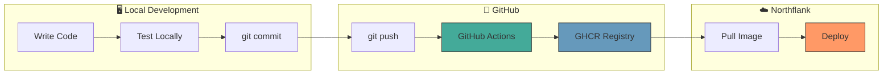
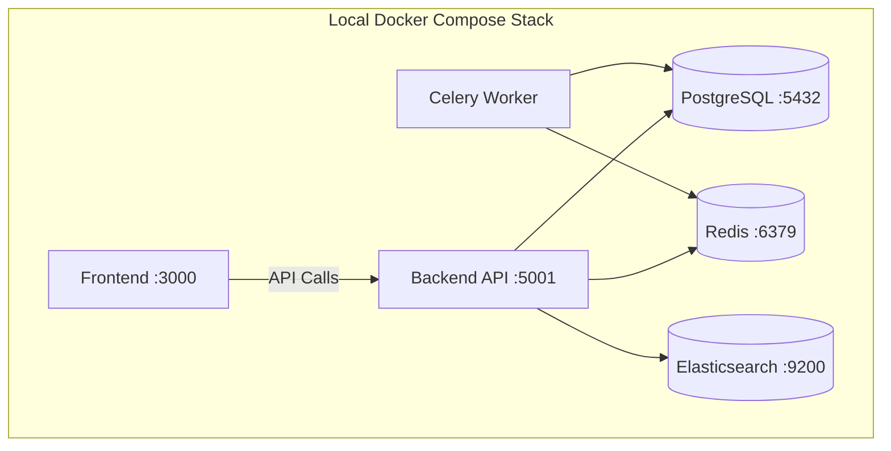
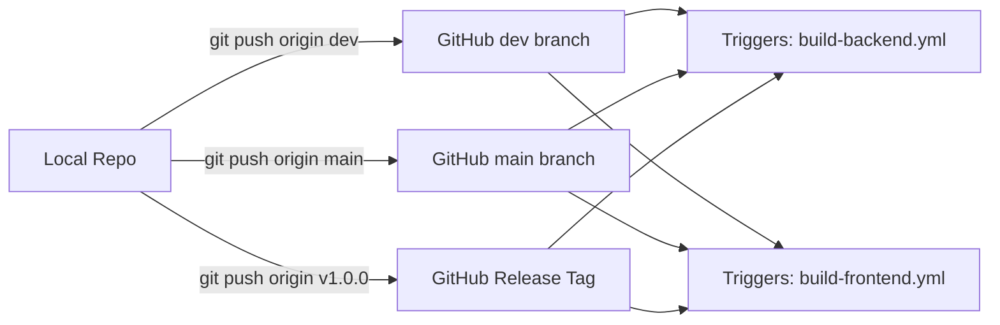
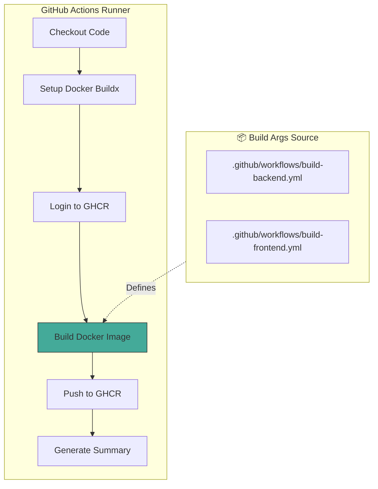
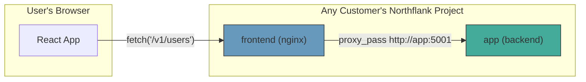
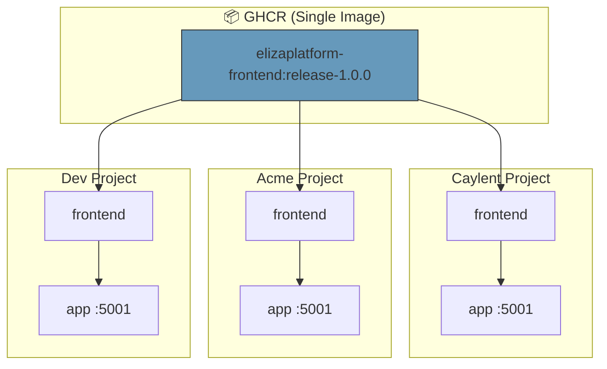
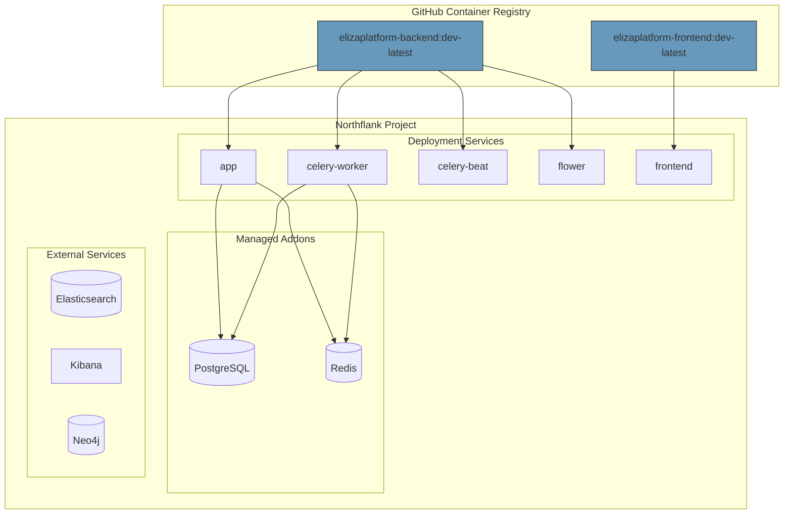
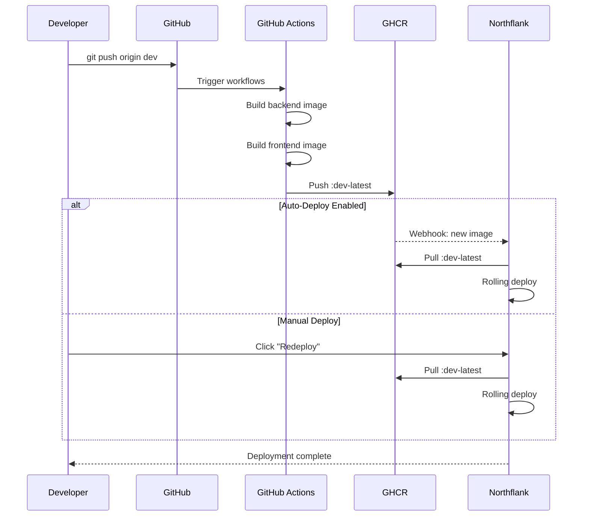
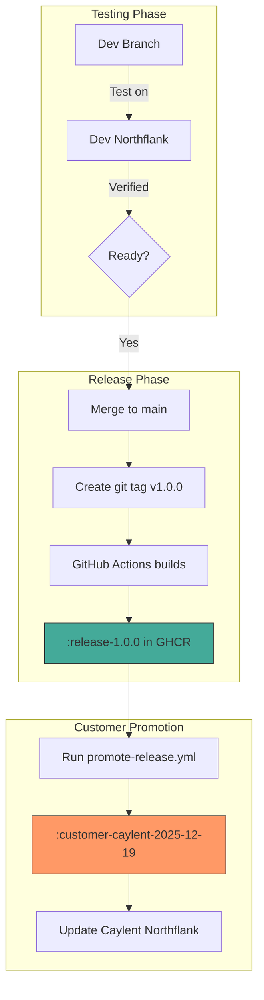
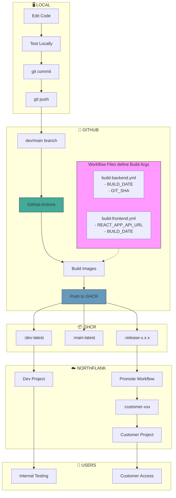

# Development to Deployment: End-to-End Flow

This document describes the complete flow from local development to production deployment.

---

## High-Level Overview



---

## Phase 1: Local Development

### 1.1 Start Local Environment

```bash
cd /path/to/ElizaPlatform

# Start all services locally
docker-compose -f docker/docker-compose.yml up -d

# Or for development with hot reload:
docker-compose -f docker/docker-compose.yml up -d postgres redis neo4j elasticsearch
cd frontend && npm start  # React dev server
cd .. && uvicorn src.main:app --reload  # FastAPI dev server
```

### 1.2 Make Code Changes

Edit your code in:
- `src/` - Backend (FastAPI, Celery, etc.)
- `frontend/src/` - Frontend (React)
- `config/` - Configuration files

### 1.3 Test Locally

```bash
# Run backend tests
pytest tests/

# Run frontend tests
cd frontend && npm test

# Manual testing
# Frontend: http://localhost:3000
# Backend API: http://localhost:5001
# API Docs: http://localhost:5001/docs
```



---

## Phase 2: Commit and Push

### 2.1 Commit Your Changes

```bash
git add .
git commit -m "feat: add new feature XYZ"
```

### 2.2 Push to GitHub

```bash
# For development/testing
git push origin dev

# For release
git push origin main
```



---

## Phase 3: GitHub Actions Build

### 3.1 Workflow Triggers

When you push, GitHub Actions automatically runs:

| Branch/Tag | Workflows Triggered | Images Built |
|------------|---------------------|--------------|
| `dev` | `build-backend.yml`, `build-frontend.yml` | `:dev-<sha>`, `:dev-latest` |
| `main` | `build-backend.yml`, `build-frontend.yml` | `:main-<sha>`, `:main-latest` |
| `v*` tag | `build-backend.yml`, `build-frontend.yml` | `:release-<version>` |

### 3.2 Build Process



### 3.3 Where Build Args Are Stored

**All build arguments are defined in the workflow files** (version controlled!):

#### Backend Build Args
📁 **File:** `.github/workflows/build-backend.yml`

```yaml
build-args: |
  BUILD_DATE=${{ github.event.head_commit.timestamp }}
  GIT_SHA=${{ github.sha }}
  GIT_REF=${{ github.ref_name }}
```

#### Frontend Build Args
📁 **File:** `.github/workflows/build-frontend.yml`

```yaml
build-args: |
  REACT_APP_API_URL=           # Empty! Uses relative URLs
  BUILD_DATE=${{ github.event.head_commit.timestamp }}
  GIT_SHA=${{ github.sha }}
  GIT_REF=${{ github.ref_name }}
```

### 3.4 API URL Strategy: Relative URLs + Nginx Proxy

**We use relative URLs so ONE frontend image works for ALL customers!**



**How it works:**

| Step | What Happens |
|------|--------------|
| 1 | React calls `/v1/users` (relative URL, no domain) |
| 2 | Browser sends request to frontend's domain |
| 3 | nginx receives request at `/v1/users` |
| 4 | nginx proxies to `http://app:5001/v1/users` |
| 5 | Backend responds, nginx forwards to browser |

**Why this is powerful:**
- ✅ ONE frontend image for ALL customers
- ✅ No API URL baked into the build
- ✅ Works because each Northflank project has its own `app` service
- ✅ Customer isolation is automatic



### 3.4 Images Pushed to GHCR

After build completes:

```
ghcr.io/eliza-hq/elizaplatform-backend:dev-abc1234
ghcr.io/eliza-hq/elizaplatform-backend:dev-latest
ghcr.io/eliza-hq/elizaplatform-frontend:dev-abc1234
ghcr.io/eliza-hq/elizaplatform-frontend:dev-latest
```

---

## Phase 4: Northflank Deployment

### 4.1 Northflank Architecture



### 4.2 Service Configuration

Each Northflank service pulls from GHCR:

| Service | Image | Tag Strategy |
|---------|-------|--------------|
| `app` | `ghcr.io/eliza-hq/elizaplatform-backend` | `:dev-latest` or pinned |
| `celery-worker` | `ghcr.io/eliza-hq/elizaplatform-backend` | `:dev-latest` or pinned |
| `celery-beat` | `ghcr.io/eliza-hq/elizaplatform-backend` | `:dev-latest` or pinned |
| `flower` | `ghcr.io/eliza-hq/elizaplatform-backend` | `:dev-latest` or pinned |
| `frontend` | `ghcr.io/eliza-hq/elizaplatform-frontend` | `:dev-latest` or pinned |

### 4.3 Deployment Trigger

Northflank can be configured to:

**Option A: Manual Deploy**
- You manually click "Deploy" or update the image tag in Northflank UI

**Option B: Auto-Deploy on Image Push**
- Configure Northflank to watch for new `:dev-latest` tags
- Auto-deploys when GHCR receives new image



---

## Phase 5: Customer Releases

### 5.1 Release Flow



### 5.2 Promoting to Customers

```bash
# 1. Go to GitHub Actions
# 2. Run "Promote to Customer" workflow
# 3. Fill in:
#    - image_type: both
#    - source_tag: release-1.0.0
#    - customer_name: caylent

# Result: Creates customer-specific tags
# ghcr.io/eliza-hq/elizaplatform-backend:customer-caylent-2025-12-19
# ghcr.io/eliza-hq/elizaplatform-frontend:customer-caylent-2025-12-19
```

---

## Complete End-to-End Flow



---

## Quick Reference

### File Locations

| What | Where |
|------|-------|
| Backend Dockerfile | `docker/Dockerfile` |
| Frontend Dockerfile | `frontend/Dockerfile` |
| Logstash Dockerfile | `docker/logstash/Dockerfile` |
| Backend build workflow | `.github/workflows/build-backend.yml` |
| Frontend build workflow | `.github/workflows/build-frontend.yml` |
| Logstash build workflow | `.github/workflows/build-logstash.yml` |
| Local dev compose | `docker/docker-compose.yml` |
| CI/CD docs | `docs/CICD_GHCR_SETUP.md` |

### Image Tags

| Tag Pattern | When Created | Use Case |
|-------------|--------------|----------|
| `:dev-<sha>` | Push to dev | Immutable dev builds |
| `:dev-latest` | Push to dev | Auto-updating dev |
| `:main-<sha>` | Push to main | Immutable main builds |
| `:main-latest` | Push to main | Pre-release testing |
| `:release-x.x.x` | Git tag v* | Releases |
| `:customer-<name>-<date>` | Manual promote | Customer deployments |

### Workflow Trigger Summary

| Workflow | Auto on dev/main | Path Filter | Auto on v* tags | Manual |
|----------|------------------|-------------|-----------------|--------|
| build-backend | ✅ Yes | `src/**`, `config/**`, `alembic/**`, `docker/Dockerfile`, `requirements*.txt` | ✅ Yes | ✅ Yes |
| build-frontend | ✅ Yes | `frontend/**` | ✅ Yes | ✅ Yes |
| build-logstash | ❌ No | N/A | ✅ Yes | ✅ Yes |
| promote-release | ❌ No | N/A | ❌ No | ✅ Yes |

**What this means:**
- 📝 Docs-only commits → No builds triggered
- 🐍 Backend code changes → Only backend builds
- ⚛️ Frontend code changes → Only frontend builds
- 🏷️ Release tags (v*) → All images build
- 🔧 Manual trigger → Always available

### Commands

```bash
# Local development
docker-compose -f docker/docker-compose.yml up -d

# Push to dev (triggers build)
git push origin dev

# Create release
git tag v1.0.0
git push origin v1.0.0

# View builds
open https://github.com/eliza-hq/ElizaPlatform/actions

# View images
open https://github.com/orgs/eliza-hq/packages
```

---

## Troubleshooting

### Build Failed in GitHub Actions

1. Check Actions tab: https://github.com/eliza-hq/ElizaPlatform/actions
2. Click on failed run
3. Expand failed step to see error

### Image Not Found in Northflank

1. Verify image exists in GHCR
2. Check Northflank registry credentials
3. Verify image tag is correct

### Wrong API URL in Frontend

1. Check `.github/workflows/build-frontend.yml`
2. Update the `Determine API URL` step
3. Push change to trigger new build

---

## Summary

```
┌─────────────────────────────────────────────────────────────────┐
│                     BUILD ARGS LOCATION                          │
├─────────────────────────────────────────────────────────────────┤
│                                                                  │
│  📁 .github/workflows/build-backend.yml                         │
│     └── BUILD_DATE, GIT_SHA, GIT_REF                            │
│                                                                  │
│  📁 .github/workflows/build-frontend.yml                        │
│     └── REACT_APP_API_URL="" (empty - uses relative URLs!)     │
│     └── BUILD_DATE, GIT_SHA, GIT_REF                            │
│                                                                  │
│  ⚠️  NOT in Northflank UI (Northflank doesn't build!)           │
│                                                                  │
└─────────────────────────────────────────────────────────────────┘

┌─────────────────────────────────────────────────────────────────┐
│                    API URL STRATEGY                              │
├─────────────────────────────────────────────────────────────────┤
│                                                                  │
│  Frontend uses RELATIVE URLs: /v1/users, /v1/auth/login, etc.  │
│                                                                  │
│  nginx.conf proxies /v1/* to http://app:5001                    │
│                                                                  │
│  Result: ONE image works for ALL customers!                     │
│                                                                  │
│  ┌─────────────┐    ┌─────────────┐    ┌─────────────┐         │
│  │   Caylent   │    │    Acme     │    │     Dev     │         │
│  │   Project   │    │   Project   │    │   Project   │         │
│  │             │    │             │    │             │         │
│  │  frontend ──┼───►│  frontend ──┼───►│  frontend ──│         │
│  │     │       │    │     │       │    │     │       │         │
│  │     ▼       │    │     ▼       │    │     ▼       │         │
│  │    app      │    │    app      │    │    app      │         │
│  └─────────────┘    └─────────────┘    └─────────────┘         │
│        ▲                  ▲                  ▲                  │
│        │                  │                  │                  │
│        └──────────────────┴──────────────────┘                  │
│                    SAME IMAGE!                                   │
│                                                                  │
└─────────────────────────────────────────────────────────────────┘

┌─────────────────────────────────────────────────────────────────┐
│                        FLOW SUMMARY                              │
├─────────────────────────────────────────────────────────────────┤
│                                                                  │
│  1. Local Dev    →  Edit & test code locally                    │
│  2. Git Push     →  Push to dev/main branch                     │
│  3. GH Actions   →  Builds images with args from workflow files │
│  4. GHCR         →  Stores images with tags                     │
│  5. Northflank   →  Pulls images, deploys (no building!)        │
│                                                                  │
└─────────────────────────────────────────────────────────────────┘
```

