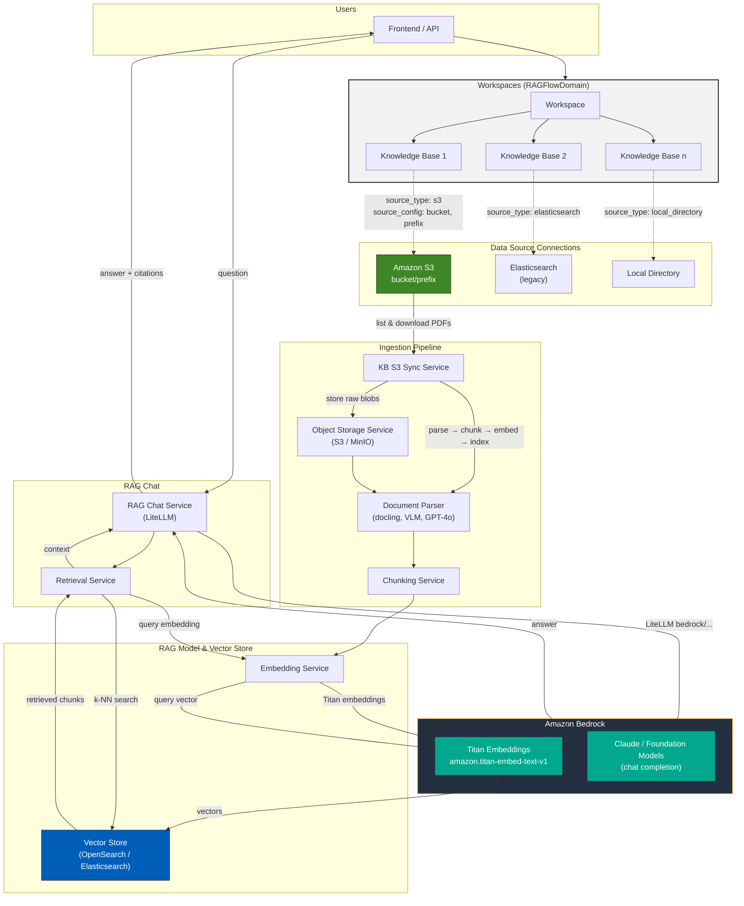

# RAG & Workspaces Architecture (ElizaPlatform)

Architecture diagram focused on **RAG**, **Workspaces**, **data source connections** (e.g. S3), and **Bedrock** as the inference service for embeddings and chat.

---

---

## Legend

| Component | Description |
|-----------|-------------|
| **Workspace (RAGFlowDomain)** | Tenant workspace; can have multiple knowledge bases. |
| **Knowledge Base** | Holds documents for RAG. Source type: `s3`, `elasticsearch`, or `local_directory`. |
| **S3** | Data source: bucket + prefix; sync via `KnowledgeBaseS3SyncService`. |
| **Object Storage** | Tenant S3/MinIO for raw document blobs (after upload or S3 sync). |
| **Document Parser** | docling, VLM, or GPT-4o for extract; then chunking. |
| **Embedding Service** | Configurable (OpenAI, local, or **Bedrock Titan**). Diagram shows Bedrock path. |
| **Vector Store** | AWS OpenSearch (or local Elasticsearch); company/domain-scoped indices. |
| **Bedrock** | **Embeddings**: Titan (`amazon.titan-embed-text-v1`). **Chat**: Claude/foundation models via LiteLLM `bedrock/...`. |

---

## Data flow summary

1. **Data source connections**  
   Each knowledge base has `source_type` and `source_config`. For S3: `bucket` + `prefix` (and optional `file_extensions`). S3 sync runs on a schedule or on-demand.

2. **Ingestion**  
   S3 sync (or upload) → raw files in object storage → document parser → chunks → **Bedrock Titan** embeddings → vectors written to **OpenSearch/Elasticsearch**.

3. **RAG query**  
   User question → **RetrievalService** (query embedding via **Bedrock Titan**, k-NN on vector store) → context + question → **RAG Chat Service** (LiteLLM) → **Bedrock** (e.g. Claude) → answer and citations back to UI.

---

## Config (relevant env)

- **RAG embeddings (Bedrock):** `RAG_EMBEDDING_PROVIDER=bedrock`, `RAG_BEDROCK_EMBEDDING_REGION`, `ragflow_default_embedding_model` (e.g. `amazon.titan-embed-text-v1`).
- **Vector store:** `RAG_OPENSEARCH_HOST`, `RAG_OPENSEARCH_REGION`, `RAG_OPENSEARCH_INDEX_PREFIX`; or `ELASTICSEARCH_HOSTS` + `RAG_USE_LOCAL_ELASTICSEARCH` for local ES.
- **S3 KB sync:** `RAG_KB_S3_SYNC_ENABLED`, `RAG_KB_S3_SYNC_INTERVAL_SECONDS`, `RAG_KB_S3_SYNC_MAX_FILES_PER_RUN`.
- **Chat model:** Customer AI provider “Bedrock” and model id (e.g. `bedrock/anthropic.claude-3-sonnet-...`) via LiteLLM.
