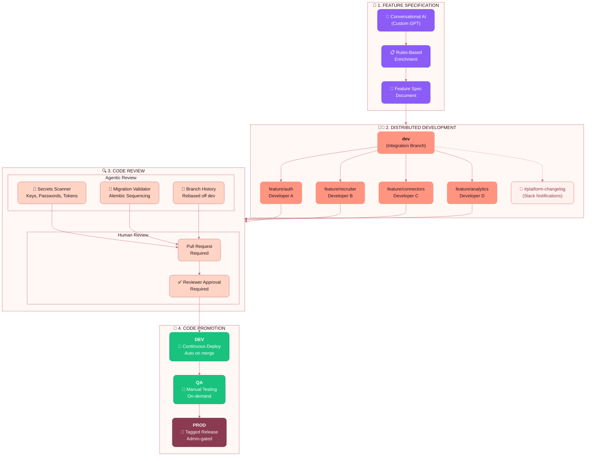
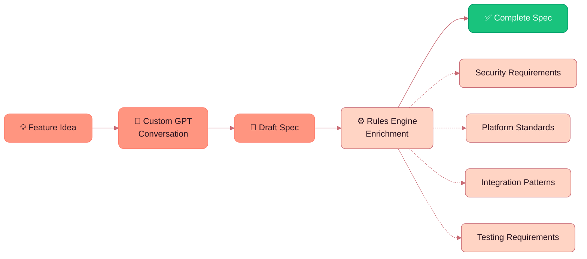
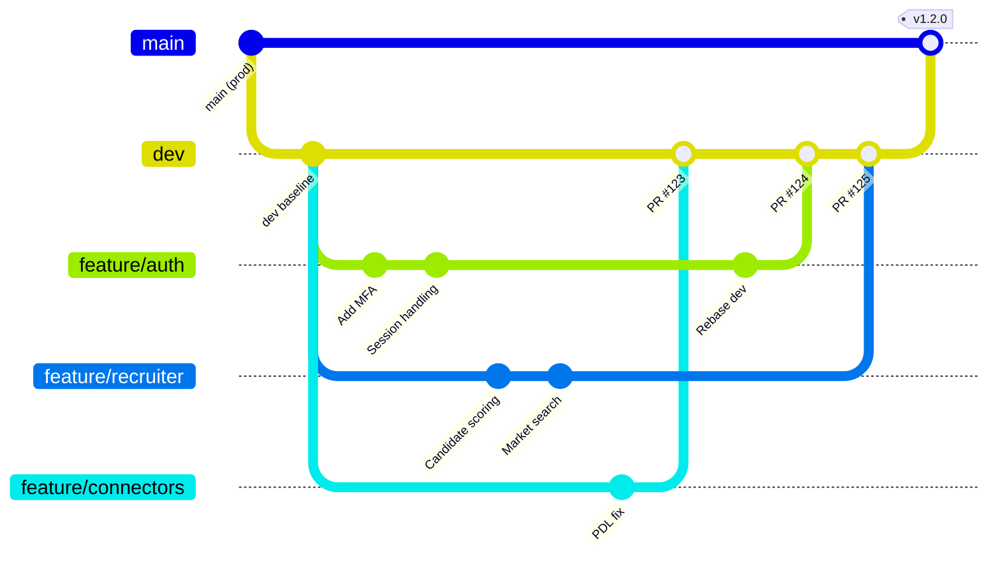
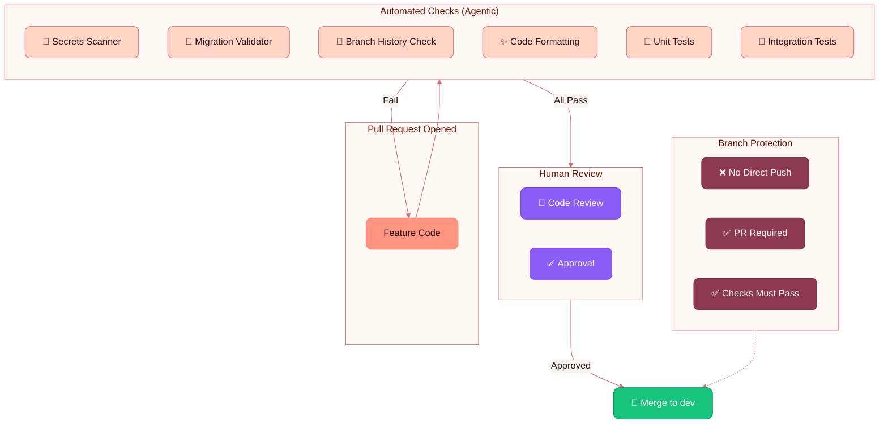
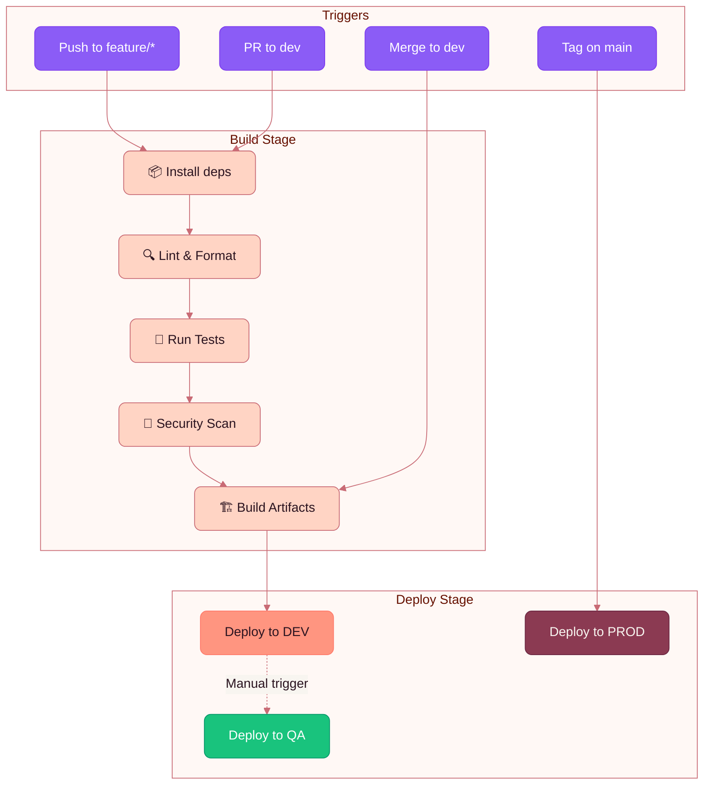

# Eliza Platform - Development Process & Code Promotion

## Development Workflow Overview



---

## Detailed Process Flow

### 1. Feature Specification



| Stage | Description |
|-------|-------------|
| **Ideation** | Product/engineering identifies feature need |
| **AI-Assisted Spec** | Conversational AI helps structure requirements, acceptance criteria, edge cases |
| **Rules Enrichment** | Automated enrichment adds security requirements, platform conventions, integration patterns |
| **Final Spec** | Complete specification ready for development |

---

### 2. Distributed Development



| Practice | Description |
|----------|-------------|
| **Branch from dev** | All feature work branches from the `dev` integration branch |
| **Isolated work** | Each developer works in their own feature branch |
| **Stay informed** | Changelog notifications to Slack keep all developers aware of platform changes |
| **Short-lived branches** | Feature branches are focused and merged promptly |

---

### 3. Code Review



#### Automated Review Checks

| Check | Tool | Description |
|-------|------|-------------|
| **Secrets Scanner** | AI Agent | Scans for API keys, passwords, tokens, credentials |
| **Migration Validator** | Alembic | Ensures migrations are properly chained and merged |
| **Branch History** | Git | Validates branch is rebased off current `dev` |
| **Code Formatting** | Pre-commit | Black, isort, Prettier enforce consistent style |
| **Tests** | pytest | Unit and integration tests must pass |

#### Branch Protection Rules

- **dev branch**: PR required, 1 approval, all checks pass
- **main branch**: PR required, 2 admin approvals, all checks pass, tagged releases only

---

### 4. Code Promotion

```mermaid
%%{init: {'theme': 'base', 'themeVariables': { 'primaryColor': '#FF9580', 'primaryTextColor': '#2B1420', 'primaryBorderColor': '#FF7B6B', 'lineColor': '#C96B75', 'secondaryColor': '#F8F5F0', 'background': '#F8F5F0', 'clusterBkg': '#FFF8F5', 'clusterBorder': '#C96B75'}}}%%

flowchart LR
    subgraph DEV["DEV Environment"]
        D1["🔄 Auto-deploy on merge"]
        D2["Continuous Integration"]
        D3["Feature testing"]
    end
    
    subgraph QA["QA Environment"]
        Q1["🧪 Manual validation"]
        Q2["On-demand deploy"]
        Q3["Regression testing"]
    end
    
    subgraph PROD["PROD Environment"]
        P1["🎯 Tagged releases only"]
        P2["Admin approval (1-2)"]
        P3["Production traffic"]
    end
    
    DEV --> |"Promote"| QA
    QA --> |"Release Tag"| PROD

    classDef dev fill:#FF9580,stroke:#FF7B6B,color:#2B1420,rx:8,ry:8
    classDef qa fill:#FFD4C4,stroke:#C96B75,color:#2B1420,rx:8,ry:8
    classDef prod fill:#8B3A52,stroke:#6B2742,color:#F8F5F0,rx:8,ry:8
    
    class D1,D2,D3 dev
    class Q1,Q2,Q3 qa
    class P1,P2,P3 prod
```



| Environment | Deployment | Access Control | Purpose |
|-------------|------------|----------------|---------|
| **DEV** | Continuous (auto on merge) | Development team | Integration testing, feature validation |
| **QA** | On-demand | QA + Development | Manual testing, regression validation |
| **PROD** | Tagged releases only | Repo admins (1-2 approvers) | Production users |

---

## CI/CD Pipeline



---

## Communication & Visibility

### Slack Integration

All merges to `dev` are posted to **#platform-changelog**:

```
📦 [DEV MERGE] feature/auth-improvements
👤 @developer-a merged at 2:30 PM
📝 Changes: Added MFA support, updated session handling
⚠️  Migration: Yes - new columns in users table
🔗 PR: #124

📦 [DEV MERGE] feature/connector-pdl-fix  
👤 @developer-b merged at 3:15 PM
📝 Changes: Fixed sync_config field name for PDL
⚠️  Migration: No
🔗 PR: #125
```

This keeps all feature developers informed of:
- Platform changes that may affect their work
- Migration updates requiring rebase
- Breaking changes requiring coordination

