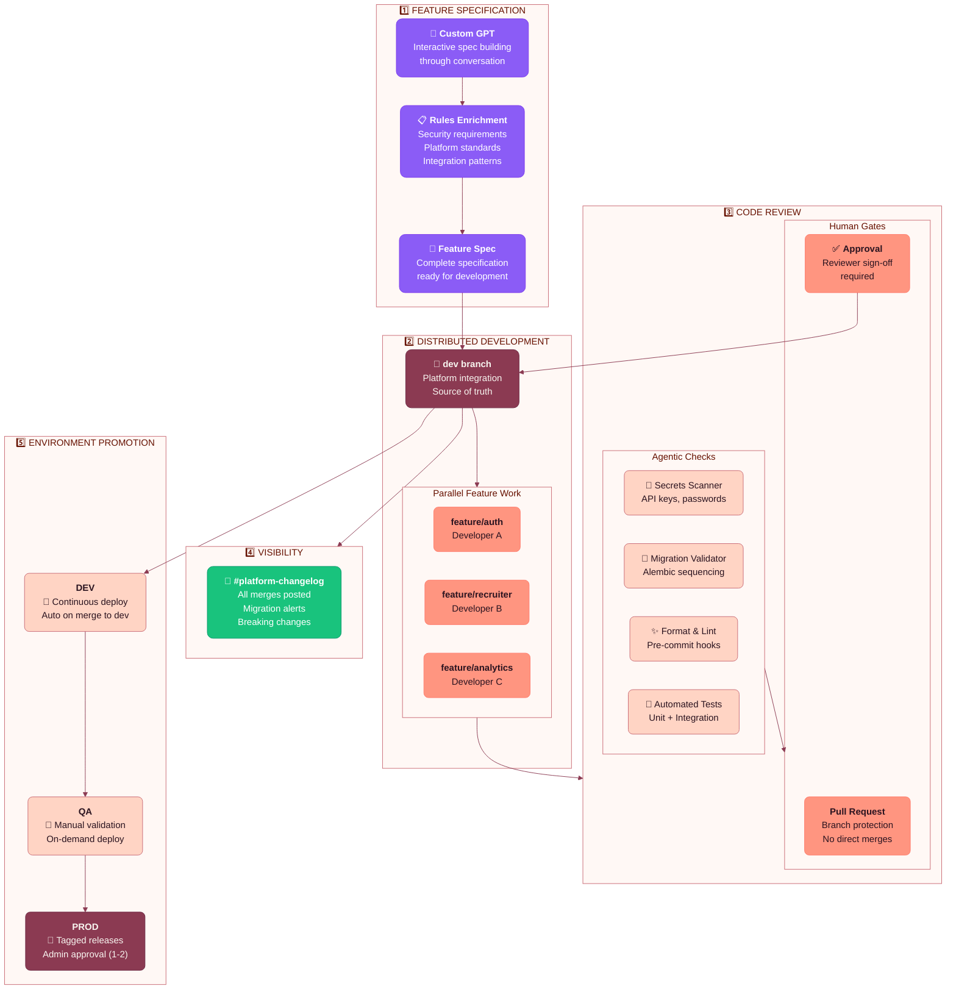

# Eliza Platform - Development Workflow

## Process Summary

### 1️⃣ Feature Specification
- **Custom GPT**: Interactive conversation to build requirements, acceptance criteria, edge cases
- **Rules Enrichment**: Automatic addition of security requirements, platform conventions, API patterns
- **Output**: Complete spec document ready for development

### 2️⃣ Distributed Development
- **dev branch**: The platform integration branch - single source of truth
- **Feature branches**: Each developer works in isolation (`feature/my-feature`)
- **Parallel work**: Multiple features developed simultaneously without conflicts

### 3️⃣ Code Review
**Agentic (Automated):**
- Secrets scanner catches API keys, passwords, tokens before they hit the repo
- Migration validator ensures Alembic migrations are properly sequenced
- Pre-commit hooks enforce consistent code formatting
- Full test suite runs on every PR

**Human (Required):**
- Branch protection prevents direct pushes to `dev`
- All changes require PR with reviewer approval
- CI checks must pass before merge is allowed

### 4️⃣ Visibility
- Every merge to `dev` posts to **#platform-changelog** in Slack
- Developers stay informed of platform changes affecting their work
- Migration alerts help teams know when to rebase

### 5️⃣ Environment Promotion
| Environment | Deployment | Control |
|-------------|------------|---------|
| **DEV** | Continuous (auto on merge) | Development team |
| **QA** | On-demand (manual trigger) | QA + Development |
| **PROD** | Tagged releases only | Repo admins (1-2 approvers) |
