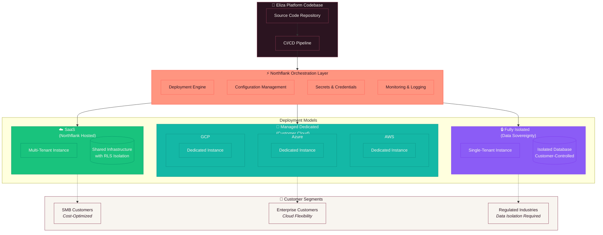
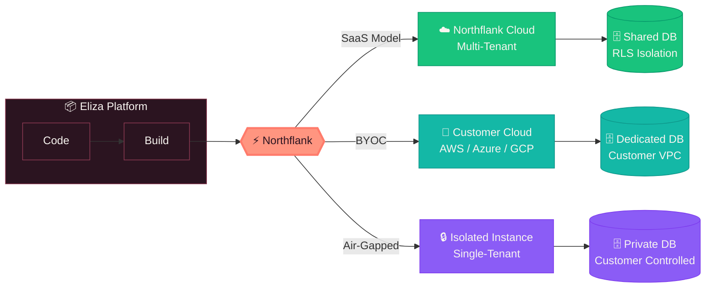

# Eliza Platform Multi-Deployment Architecture

**Version:** 1.0  
**Last Updated:** January 2026  
**Classification:** Internal Documentation

---

## Overview

The Eliza Platform leverages **Northflank** as its deployment orchestration layer, enabling flexible deployment options across multiple cloud providers and hosting models. This architecture supports diverse customer requirements—from cost-optimized SaaS to fully isolated instances for regulated industries.

---

## Deployment Architecture Diagram

---

## Simplified Deployment Flow

---

## Deployment Models

### ☁️ SaaS (Northflank Hosted)

| Aspect | Details |
|--------|---------|
| **Hosting** | Northflank managed infrastructure |
| **Isolation** | PostgreSQL Row-Level Security (RLS) |
| **Best For** | SMB customers, rapid onboarding |
| **Advantages** | Cost-effective, automatic updates, zero ops |
| **Data Residency** | Northflank data centers |

### 🔧 Managed Dedicated (Customer Cloud)

| Aspect | Details |
|--------|---------|
| **Hosting** | Customer's cloud account (AWS/Azure/GCP) |
| **Isolation** | Dedicated infrastructure per customer |
| **Best For** | Enterprise customers with cloud preferences |
| **Advantages** | Cloud flexibility, VPC integration, compliance |
| **Data Residency** | Customer-controlled region |

### 🔒 Fully Isolated (Data Sovereignty)

| Aspect | Details |
|--------|---------|
| **Hosting** | Single-tenant, customer-controlled |
| **Isolation** | Complete infrastructure isolation |
| **Best For** | Regulated industries (healthcare, finance, government) |
| **Advantages** | Full data sovereignty, air-gapped option |
| **Data Residency** | Customer-specified location |

---

## Northflank Capabilities

Northflank serves as our universal deployment orchestration layer, providing:

- **🚀 Multi-Cloud Deployment** — Deploy to AWS, Azure, GCP, or Northflank's own infrastructure
- **🔄 GitOps Workflow** — Automatic deployments triggered by code changes
- **🔐 Secrets Management** — Secure credential storage and injection
- **📊 Observability** — Built-in logging, metrics, and monitoring
- **🌐 Networking** — Automatic TLS, load balancing, and DNS management
- **📦 Container Registry** — Built-in image storage and versioning

---

## Color Legend

| Color | Meaning |
|-------|---------|
| 🟠 Coral (`#FF9580`) | Northflank / Orchestration |
| 🟢 Green (`#19C37D`) | SaaS / Multi-Tenant |
| 🔵 Teal (`#14B8A6`) | Managed / Customer Cloud |
| 🟣 Purple (`#8B5CF6`) | Isolated / Data Sovereignty |
| ⚫ Dark (`#2B1420`) | Source / Codebase |
| ⚪ Cream (`#F8F5F0`) | Customer Segments |

---

## Related Documentation

- [Platform Architecture](./PLATFORM_ARCHITECTURE.md)
- [Security Overview](../specs/security/security_quick_start.md)
- [Development Workflow](./DEVELOPMENT_WORKFLOW.md)

