# Eliza Platform Architecture

## Overview

The Eliza Platform is a two-layer architecture that separates shared platform capabilities from the solutions built on top.

```mermaid
%%{init: {'theme': 'base', 'themeVariables': { 'primaryColor': '#FF9580', 'primaryTextColor': '#2B1420', 'primaryBorderColor': '#FF7B6B', 'lineColor': '#C96B75', 'secondaryColor': '#F8F5F0', 'tertiaryColor': '#FFF2ED', 'background': '#F8F5F0', 'mainBkg': '#F8F5F0', 'nodeBorder': '#8B3A52', 'clusterBkg': '#FFF8F5', 'clusterBorder': '#C96B75', 'titleColor': '#2B1420', 'edgeLabelBackground': '#F8F5F0'}}}%%

graph TB
    subgraph SOLUTIONS["🚀 SOLUTIONS"]
        direction LR
        
        AI_ASST["<b>AI Assistant</b><br/>Document Q&A<br/>Business Intelligence"]
        AI_REC["<b>AI Recruiter</b><br/>Talent Intelligence<br/>Candidate Scoring<br/>Market Search"]
        REF["<b>Reference Checks</b><br/>Automated Collection<br/>Analysis & Synthesis"]
        ANALYTICS["<b>Analytics Dashboard</b><br/>Metrics & Reporting<br/>Operational Insights"]
        ENGAGE["<b>Engage</b><br/>Candidate Outreach<br/>Client Engagement"]
    end

    subgraph PLATFORM["⚙️ PLATFORM CAPABILITIES"]
        direction TB
        
        subgraph CORE["Core Services"]
            AUTH["<b>Auth & Multi-Tenancy</b><br/>SSO, MFA, Sessions<br/>Tenant Isolation"]
            RBAC["<b>RBAC & Permissions</b><br/>Role Management<br/>Feature Access Control"]
            AUDIT["<b>Audit & Logging</b><br/>Activity Tracking<br/>Compliance Logs"]
        end
        
        subgraph DATA["Data Layer"]
            CONN["<b>Data Connectors</b><br/>Greenhouse, PDL<br/>File Systems, APIs"]
            DOCS["<b>Document Processing</b><br/>Parsing, Chunking<br/>Embedding Generation"]
            VECTOR["<b>Vector Search</b><br/>Semantic Search<br/>Document Retrieval"]
        end
        
        subgraph COMPUTE["Compute & Orchestration"]
            AGENTS["<b>Agent Framework</b><br/>CrewAI Orchestration<br/>LLM Integration"]
            TASKS["<b>Task Queue</b><br/>Celery Workers<br/>Background Jobs"]
            API["<b>API Gateway</b><br/>FastAPI<br/>Rate Limiting"]
        end
        
        subgraph STORAGE["Storage"]
            PG["<b>PostgreSQL</b><br/>Primary Database<br/>Multi-tenant Data"]
            NEO["<b>Neo4j</b><br/>Graph Database<br/>Relationship Mapping"]
            ES["<b>Elasticsearch</b><br/>Search Index<br/>Full-text Search"]
            REDIS["<b>Redis</b><br/>Cache & Sessions<br/>Task Broker"]
        end
    end

    %% Solution dependencies on platform
    AI_ASST --> AUTH
    AI_ASST --> VECTOR
    AI_ASST --> AGENTS
    AI_ASST --> DOCS
    
    AI_REC --> AUTH
    AI_REC --> CONN
    AI_REC --> AGENTS
    AI_REC --> VECTOR
    
    REF --> AUTH
    REF --> AGENTS
    REF --> TASKS
    
    ANALYTICS --> AUTH
    ANALYTICS --> PG
    ANALYTICS --> ES
    
    ENGAGE --> AUTH
    ENGAGE --> TASKS
    ENGAGE --> AGENTS

    %% Platform internal connections
    AUTH --> PG
    AUTH --> REDIS
    RBAC --> PG
    AUDIT --> PG
    AUDIT --> ES
    
    CONN --> TASKS
    DOCS --> VECTOR
    DOCS --> ES
    VECTOR --> ES
    
    AGENTS --> TASKS
    API --> AUTH
    API --> RBAC
    
    TASKS --> REDIS

    %% Eliza Brand Styling (Coral/Rose/Burgundy palette)
    classDef solution fill:#FF9580,stroke:#FF7B6B,color:#2B1420,stroke-width:2px,rx:10,ry:10
    classDef platform fill:#FFF2ED,stroke:#C96B75,color:#2B1420,stroke-width:1px,rx:8,ry:8
    classDef storage fill:#8B3A52,stroke:#6B2742,color:#F8F5F0,stroke-width:2px,rx:8,ry:8
    classDef coreService fill:#FFD4C4,stroke:#C96B75,color:#2B1420,stroke-width:1px,rx:8,ry:8
    
    class AI_ASST,AI_REC,REF,ANALYTICS,ENGAGE solution
    class AUTH,RBAC,AUDIT,CONN,DOCS,VECTOR,AGENTS,TASKS,API coreService
    class PG,NEO,ES,REDIS storage
```

## Layer Details

### Solutions Layer

Solutions are complete products that solve specific business problems. Each solution leverages multiple platform capabilities.

| Solution | Description | Key Platform Dependencies |
|----------|-------------|---------------------------|
| **AI Assistant** | Natural language Q&A over documents and business intelligence queries | Vector Search, Agents, Document Processing |
| **AI Recruiter** | End-to-end talent intelligence: candidate scoring, market search, outreach automation | Data Connectors, Agents, Vector Search |
| **Reference Checks** | Automated reference collection, analysis, and synthesis | Agents, Task Queue, Auth |
| **Analytics Dashboard** | Metrics, reporting, and operational insights across the platform | PostgreSQL, Elasticsearch, Auth |
| **Engage** | Candidate and client engagement workflows | Agents, Task Queue, Auth |

### Platform Capabilities Layer

Platform capabilities are shared, robust services that all solutions depend on.

#### Core Services
- **Auth & Multi-Tenancy**: SSO integration, MFA, session management, complete tenant isolation
- **RBAC & Permissions**: Granular role-based access control, feature-level permissions
- **Audit & Logging**: Comprehensive activity tracking for compliance and debugging

#### Data Layer
- **Data Connectors**: Pluggable integrations (Greenhouse, People Data Labs, file systems, custom APIs)
- **Document Processing**: PDF/DOCX parsing, intelligent chunking, embedding generation
- **Vector Search**: Semantic similarity search, RAG retrieval, document discovery

#### Compute & Orchestration
- **Agent Framework**: CrewAI-based multi-agent orchestration, LLM provider abstraction
- **Task Queue**: Celery-powered background job processing, scheduled tasks
- **API Gateway**: FastAPI-based REST API, rate limiting, request validation

#### Storage
- **PostgreSQL**: Primary relational database with multi-tenant data isolation
- **Neo4j**: Graph database for relationship mapping (skills, companies, people)
- **Elasticsearch**: Full-text search and analytics indexing
- **Redis**: Caching layer, session storage, Celery message broker

