# AGENTS.MD Executive Summary Diagrams

> **Purpose:** Visual representations of the agentic development framework documented in AGENTS.md

---

## Comprehensive Overview

```mermaid
%%{init: {'theme': 'base', 'themeVariables': { 'primaryColor': '#4F46E5', 'primaryTextColor': '#fff', 'primaryBorderColor': '#3730A3', 'lineColor': '#6366F1', 'secondaryColor': '#F3F4F6', 'tertiaryColor': '#E0E7FF'}}}%%
flowchart TB
    subgraph AGENTS["📘 AGENTS.MD - Agentic Development Guide"]
        direction TB
        
        subgraph WORKFLOW["🔄 5-Step Agent Workflow"]
            direction LR
            W1["1️⃣ UNDERSTAND<br/>PRDs, Past Runs,<br/>Codebase Map"]
            W2["2️⃣ PLAN<br/>Check Skills,<br/>Select Templates"]
            W3["3️⃣ IMPLEMENT<br/>Use Templates,<br/>Follow Patterns"]
            W4["4️⃣ VALIDATE<br/>Run Checks,<br/>Rebuild Containers"]
            W5["5️⃣ COMPLETE<br/>Log Work for<br/>Future Agents"]
            W1 --> W2 --> W3 --> W4 --> W5
        end
        
        subgraph SKILLS["🎯 Skills Library (11 Domains)"]
            direction TB
            S1["⚙️ Common Actions<br/>Local Dev, Northflank, DB"]
            S2["🤖 CrewAI<br/>Flows, Agents, Tools"]
            S3["🎨 Design System<br/>UI Components"]
            S4["🔐 Row-Level Security<br/>Multi-Tenancy"]
            S5["⚡ Celery Tasks<br/>Async Processing"]
            S6["🌐 FastAPI<br/>REST Endpoints"]
            S7["📊 Migrations<br/>Database Schema"]
            S8["🔌 Connectors<br/>Data Sources"]
            S9["📡 SSE<br/>Real-Time Updates"]
        end
        
        subgraph TEMPLATES["📋 Code Templates (7 Types)"]
            direction TB
            T1["API Endpoint"]
            T2["Celery Task"]
            T3["Database Model"]
            T4["Migration"]
            T5["Service Layer"]
            T6["Frontend Page"]
            T7["SSE Hook"]
        end
        
        subgraph SUPPORT["🛠️ Support Resources"]
            direction TB
            R1["📍 Codebase Map<br/>Module Navigation"]
            R2["🚨 Error Playbook<br/>Quick Fixes"]
            R3["✅ Validation Script<br/>Pre-PR Checks"]
            R4["📝 Agent Run Logs<br/>Learning History"]
        end
        
        subgraph RULES["⚠️ Critical Rules"]
            direction TB
            C1["🗃️ DB Sessions<br/>Module Import Pattern"]
            C2["🐳 Containers<br/>Always Rebuild"]
            C3["👥 Multi-Tenant<br/>company_hr_dataset"]
            C4["🖥️ Frontend<br/>Runs Locally"]
        end
    end
    
    WORKFLOW --> SKILLS
    WORKFLOW --> TEMPLATES
    SKILLS --> SUPPORT
    TEMPLATES --> SUPPORT
    SUPPORT --> RULES
    
    style AGENTS fill:#1E1B4B,stroke:#4F46E5,stroke-width:3px,color:#fff
    style WORKFLOW fill:#312E81,stroke:#6366F1,stroke-width:2px,color:#fff
    style SKILLS fill:#3730A3,stroke:#818CF8,stroke-width:2px,color:#fff
    style TEMPLATES fill:#4338CA,stroke:#A5B4FC,stroke-width:2px,color:#fff
    style SUPPORT fill:#4F46E5,stroke:#C7D2FE,stroke-width:2px,color:#fff
    style RULES fill:#6366F1,stroke:#E0E7FF,stroke-width:2px,color:#fff
```

---

## Simplified Value Proposition

```mermaid
%%{init: {'theme': 'base', 'themeVariables': { 'primaryColor': '#059669', 'primaryTextColor': '#fff', 'lineColor': '#10B981'}}}%%
flowchart LR
    subgraph INPUT["🎯 Agent Receives Task"]
        A1["Feature Request"]
    end
    
    subgraph AGENTS_MD["📘 AGENTS.MD Provides"]
        direction TB
        B1["✅ Clear Workflow<br/><i>5-step process</i>"]
        B2["✅ Domain Skills<br/><i>11 specialized guides</i>"]
        B3["✅ Code Templates<br/><i>7 copy-paste starters</i>"]
        B4["✅ Error Recovery<br/><i>Searchable fixes</i>"]
        B5["✅ Validation<br/><i>Automated checks</i>"]
        B6["✅ Learning Loop<br/><i>Run logs for improvement</i>"]
    end
    
    subgraph OUTPUT["🚀 Result"]
        C1["Production-Ready<br/>Feature"]
    end
    
    INPUT --> AGENTS_MD --> OUTPUT
    
    style INPUT fill:#1F2937,stroke:#374151,stroke-width:2px,color:#fff
    style AGENTS_MD fill:#065F46,stroke:#059669,stroke-width:3px,color:#fff
    style OUTPUT fill:#1F2937,stroke:#374151,stroke-width:2px,color:#fff
```

---

## Executive Summary Table

| Category | What We Built | Agent Benefit |
|----------|--------------|---------------|
| **Structured Workflow** | 5-step development process | Agents know exactly what to do at each stage |
| **Skills Library** | 11 domain-specific guides | Prevents mistakes before they happen |
| **Code Templates** | 7 copy-paste starters | 80% of boilerplate pre-written |
| **Error Recovery** | Searchable fix playbook | Self-service troubleshooting |
| **Validation** | Automated pattern checker | Catches issues before PR |
| **Learning Loop** | Run logs & insights | Agents learn from past work |

---

## Key Metrics

- **11** specialized skill guides
- **7** copy-paste code templates
- **5** step development workflow
- **4** critical rules emphasized
- **1** comprehensive guide (AGENTS.md)

---

## Bottom Line

An AI agent reading AGENTS.md has everything needed to build production-quality features independently, while avoiding the common pitfalls that typically require human intervention.
