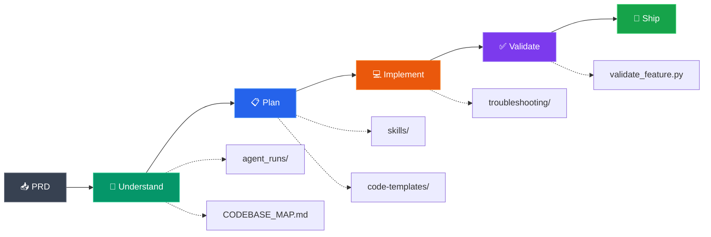

# Development Flow Diagram

> **Purpose:** Visual representation of the feature development workflow for the Eliza Platform.

---

## Feature Development Flow

```mermaid
flowchart TD
    subgraph INTAKE["📥 INTAKE"]
        A1[/"Feature Request"/]
        A2["Create PRD in<br/>features/active/[name]/"]
    end

    subgraph UNDERSTAND["1️⃣ UNDERSTAND"]
        B1["Read PRD"]
        B2["Check agent_runs/<br/>for similar work"]
        B3["Review CODEBASE_MAP.md"]
    end

    subgraph PLAN["2️⃣ PLAN"]
        C1["Check relevant<br/>skills/[domain]/"]
        C2["Select code templates<br/>from skills/code-templates/"]
        C3["Create Technical Spec"]
        C4["Create Implementation Plan"]
    end

    subgraph IMPLEMENT["3️⃣ IMPLEMENT"]
        D1["Copy template<br/>boilerplate"]
        D2["Follow skill<br/>patterns"]
        D3{"Stuck?"}
        D4["Check<br/>troubleshooting/"]
        D5["Write code"]
    end

    subgraph VALIDATE["4️⃣ VALIDATE"]
        E1["Run validate_feature.py"]
        E2{"Passed?"}
        E3["Fix issues"]
        E4["Rebuild containers<br/>docker-compose build"]
        E5["Test functionality"]
    end

    subgraph COMPLETE["5️⃣ COMPLETE"]
        F1["Log work in<br/>agent_runs/completed/"]
        F2["Commit & Push"]
        F3["Create PR"]
        F4[/"Feature Delivered"/]
    end

    A1 --> A2 --> B1
    B1 --> B2 --> B3 --> C1
    C1 --> C2 --> C3 --> C4 --> D1
    D1 --> D2 --> D3
    D3 -->|Yes| D4 --> D5
    D3 -->|No| D5
    D5 --> E1
    E1 --> E2
    E2 -->|No| E3 --> E1
    E2 -->|Yes| E4 --> E5 --> F1
    F1 --> F2 --> F3 --> F4

    style INTAKE fill:#1F2937,stroke:#374151,color:#fff
    style UNDERSTAND fill:#065F46,stroke:#10B981,color:#fff
    style PLAN fill:#1E40AF,stroke:#3B82F6,color:#fff
    style IMPLEMENT fill:#7C2D12,stroke:#F97316,color:#fff
    style VALIDATE fill:#581C87,stroke:#A855F7,color:#fff
    style COMPLETE fill:#166534,stroke:#22C55E,color:#fff
```

---

## Simplified Linear Flow

---

## Key Resources at Each Stage

| Stage | Primary Resource | Purpose |
|-------|-----------------|---------|
| **Understand** | `agent_runs/completed/` | Learn from past similar work |
| **Understand** | `docs/CODEBASE_MAP.md` | Navigate module relationships |
| **Plan** | `skills/[domain]/` | Get domain-specific rules |
| **Plan** | `skills/code-templates/` | Select boilerplate to copy |
| **Implement** | `skills/troubleshooting/` | Fix errors quickly |
| **Validate** | `scripts/validate_feature.py` | Automated pattern checks |
| **Complete** | `agent_runs/templates/` | Log work for future agents |
