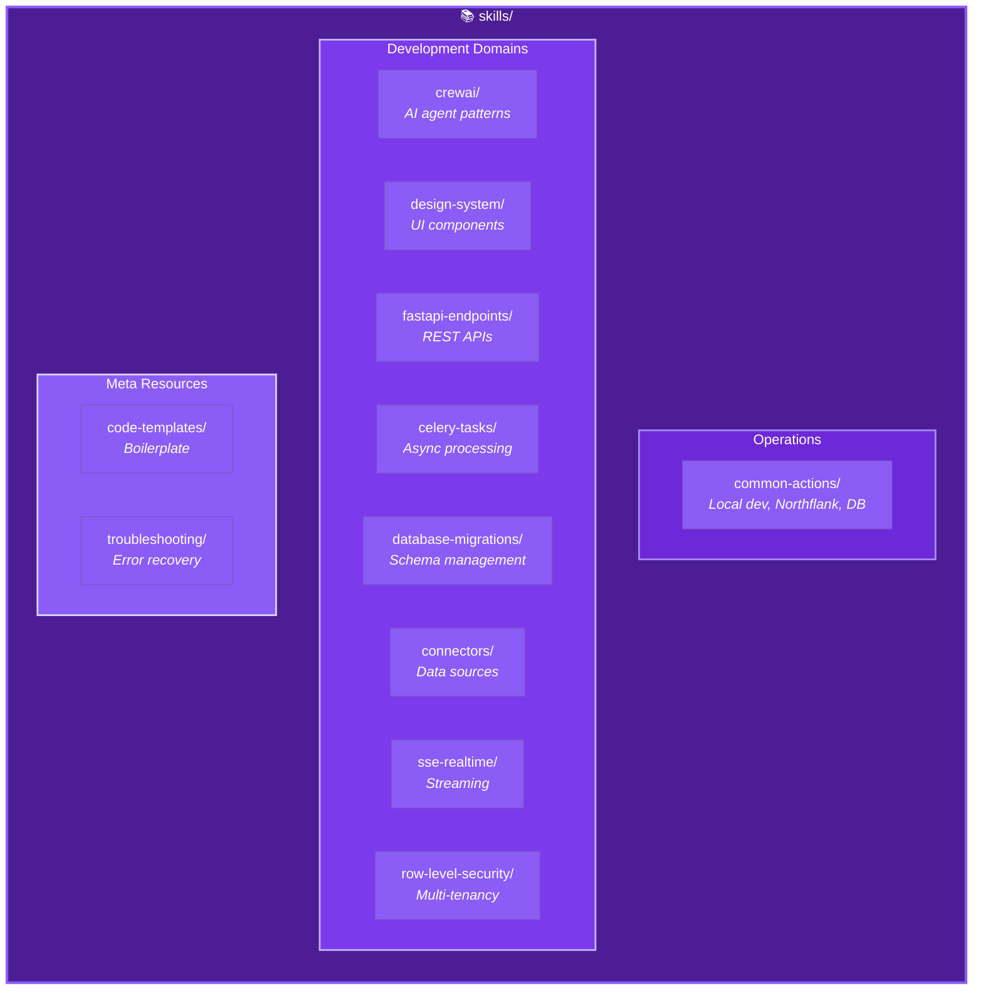

# Repository Structure - Framework Level

> **Purpose:** High-level visualization of the Eliza Platform repository structure, focusing on framework components (not individual features).

---

## Architecture Overview

```mermaid
%%{init: {'theme': 'base', 'themeVariables': { 'primaryColor': '#3B82F6', 'primaryTextColor': '#fff', 'lineColor': '#60A5FA', 'secondaryColor': '#1E3A5F'}}}%%
flowchart TB
    subgraph FRONTEND["🎨 Frontend Layer"]
        direction LR
        FE1["React + TypeScript"]
        FE2["Design System<br/><i>components/ui/</i>"]
        FE3["Orval API Client<br/><i>Auto-generated</i>"]
        FE4["SSE Hooks<br/><i>Real-time updates</i>"]
    end
    
    subgraph API["🌐 API Layer"]
        direction LR
        API1["FastAPI Routes<br/><i>api/routes/</i>"]
        API2["Pydantic Schemas<br/><i>api/schemas/</i>"]
        API3["Auth Middleware<br/><i>JWT + RBAC</i>"]
    end
    
    subgraph ASYNC["⚡ Async Processing"]
        direction LR
        ASYNC1["Celery Tasks<br/><i>tasks/</i>"]
        ASYNC2["Redis Queue"]
        ASYNC3["Flower Monitor"]
    end
    
    subgraph AI["🤖 AI Agent Layer"]
        direction LR
        AI1["CrewAI Flows<br/><i>flows/</i>"]
        AI2["Custom Tools<br/><i>crewai_custom_tools/</i>"]
        AI3["Agent State<br/><i>Pydantic Models</i>"]
    end
    
    subgraph DATA["🗃️ Data Layer"]
        direction LR
        DATA1["PostgreSQL<br/><i>Primary DB</i>"]
        DATA2["Elasticsearch<br/><i>Vector Search</i>"]
        DATA3["Redis<br/><i>Cache + Queue</i>"]
    end
    
    subgraph SERVICES["⚙️ Services Layer"]
        direction LR
        SVC1["Business Logic<br/><i>services/</i>"]
        SVC2["Connectors<br/><i>ingestion/connectors/</i>"]
        SVC3["Search<br/><i>Vector + Semantic</i>"]
    end
    
    FRONTEND -->|HTTP/SSE| API
    API -->|Sync| SERVICES
    API -->|Async| ASYNC
    ASYNC --> AI
    AI --> SERVICES
    SERVICES --> DATA
    
    style FRONTEND fill:#1E40AF,stroke:#3B82F6,stroke-width:2px,color:#fff
    style API fill:#7C3AED,stroke:#A78BFA,stroke-width:2px,color:#fff
    style ASYNC fill:#DC2626,stroke:#F87171,stroke-width:2px,color:#fff
    style AI fill:#059669,stroke:#34D399,stroke-width:2px,color:#fff
    style SERVICES fill:#D97706,stroke:#FBBF24,stroke-width:2px,color:#fff
    style DATA fill:#4B5563,stroke:#9CA3AF,stroke-width:2px,color:#fff
```



---

## Skills Directory Structure



---

## Agent Development Workflow

```mermaid
%%{init: {'theme': 'base', 'themeVariables': { 'primaryColor': '#10B981', 'primaryTextColor': '#fff', 'lineColor': '#34D399'}}}%%
flowchart LR
    subgraph PHASE1["1️⃣ Understand"]
        P1A["features/active/"]
        P1B["agent_runs/completed/"]
        P1C["docs/CODEBASE_MAP.md"]
    end
    
    subgraph PHASE2["2️⃣ Plan"]
        P2A["skills/[domain]/"]
        P2B["skills/code-templates/"]
    end
    
    subgraph PHASE3["3️⃣ Implement"]
        P3A["Copy template"]
        P3B["Follow patterns"]
        P3C["Check troubleshooting/"]
    end
    
    subgraph PHASE4["4️⃣ Validate"]
        P4A["validate_feature.py"]
        P4B["docker-compose build"]
    end
    
    subgraph PHASE5["5️⃣ Complete"]
        P5A["agent_runs/completed/"]
    end
    
    PHASE1 --> PHASE2 --> PHASE3 --> PHASE4 --> PHASE5
    
    style PHASE1 fill:#065F46,stroke:#10B981,stroke-width:2px,color:#fff
    style PHASE2 fill:#047857,stroke:#34D399,stroke-width:2px,color:#fff
    style PHASE3 fill:#059669,stroke:#6EE7B7,stroke-width:2px,color:#fff
    style PHASE4 fill:#10B981,stroke:#A7F3D0,stroke-width:2px,color:#fff
    style PHASE5 fill:#34D399,stroke:#D1FAE5,stroke-width:2px,color:#fff
```



---

## Directory Overview

```
eliza-platform/
├── AGENTS.md                 # 📘 Main development guide
├── skills/                   # 🎯 Domain-specific guidance (11 skills)
├── features/                 # 📋 Feature specs (PRD → Tech → Implementation)
├── agent_runs/               # 📝 Execution history & learning
├── docs/
│   ├── CODEBASE_MAP.md       # 🗺️ Module navigation
│   └── diagrams/             # 📊 Visual documentation
├── scripts/
│   └── validate_feature.py   # ✅ Pre-PR validation
├── src/                      # 💻 Application source code
├── frontend/                 # 🎨 React application
├── alembic/                  # 📊 Database migrations
└── docker/                   # 🐳 Container configuration
```
