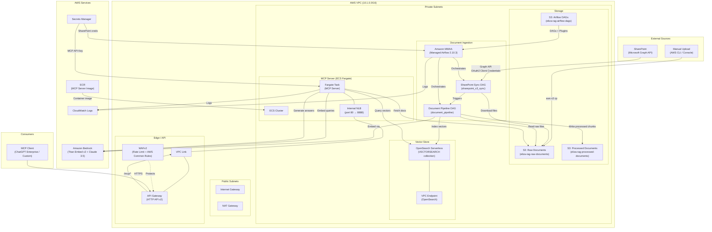

# Deploying the Eliza RAG Pipeline for a New Customer

## Executive Summary

The Eliza RAG Pipeline is a self-contained, Terraform-managed infrastructure stack that deploys a complete **Retrieval-Augmented Generation (RAG)** system on AWS. It ingests documents from SharePoint (or manual S3 upload), processes and chunks them, generates vector embeddings via Amazon Bedrock, indexes them in OpenSearch Serverless, and exposes a query API through an MCP (Model Context Protocol) server running on ECS Fargate behind API Gateway.

This guide is a **standalone step-by-step playbook** for DevOps and Developers: assumptions, permissions, deployment, and proof that it works. Building this from scratch typically takes **about 2 months**; following this playbook you can get it done **in a day**.

---

## Value Creation

Use this playbook to deliver:

- **Regulatory / compliance knowledge base** — RAG over policy and procedure docs with full citation trails for audits.
- **Internal Q&A over company docs** — SharePoint, S3, or RDS-sourced content chunked, embedded, and queryable via natural language.
- **AI-native search with citations** — Hybrid vector + keyword search, reranked answers, and source links for exec and support teams.
- **MCP-ready AI layer** — Secured MCP endpoint so ChatGPT Enterprise, Claude, or custom clients can query your data with minimal integration work.
- **Unified data foundation** — One pipeline for multiple data sources (SharePoint, S3, RDS) with a single query API and governance boundary.

**Time to value:** Doing this on your own usually takes **~2 months**. With this repo and playbook, you can deploy and prove value **in a day**.

---

## What You Get (Playbook 1)

You get **three things** in one package:

1. **The code** — A repo containing this Terraform config, MCP server, Airflow DAGs, and ingestion package. No black box; you own and can modify it.
2. **This playbook** — Step-by-step instructions to deploy that repo: configure, apply, deploy assets, build/push the MCP image, and verify. DevOps and Developer paths are spelled out below.
3. **What you get, and time you save** — A production-style RAG pipeline: ingestion (SharePoint, S3, RDS), chunking/embedding, OpenSearch Serverless, and a secured MCP API. Value creation in a day instead of months.

**In short:** You get the repo; this doc is how to deploy that repo and prove it works. Digestible in 15–30 seconds: **code + playbook + deployed RAG in a day.**

**Technical outcomes after deployment:**
- Automated document ingestion from SharePoint (and/or S3, RDS) via Apache Airflow (MWAA)
- Intelligent document processing (classification, extraction, chunking, embedding)
- Vector and keyword search over the document corpus
- A secured MCP API endpoint for AI-powered Q&A with source citations
- Full infrastructure isolation in a dedicated VPC

---

## Who This Guide Is For

- **DevOps** — You own AWS accounts, IAM, Terraform, and Airflow/MWAA. Follow the [DevOps path](#devops-path-before-you-enable-the-pipeline) first, then the [Step-by-Step Deployment Guide](#step-by-step-deployment-guide).
- **Developers** — You need to prove the deployment works and connect exec or product to the MCP (e.g. OpenAI or Claude). Follow the [Developer path](#developer-path-prove-the-deployment-works) after DevOps has applied Terraform and deployed assets.

---

## DevOps Path: Before You Enable the Pipeline

**Goal:** Get the repo deployed in AWS with least-privilege IAM and no surprises. Do this before handing off to developers or exec.

### IAM You Need to Create (Least-Privilege, SOC-Friendly)

The pipeline needs an IAM user or role that can run Terraform and create the resources. We do **not** grant broad `AdministratorAccess` by default; the roles are scoped so you can stay within SOC and access controls.

**Reference:** All IAM roles and policies are defined in **`iam.tf`** in this repo. Use it as the single source of truth.

| Role / policy | Purpose | Where it’s used |
|---------------|---------|------------------|
| **Terraform runner** | User or role that runs `terraform plan` / `apply`. Needs permissions to create VPC, S3, MWAA, OpenSearch Serverless, ECS, API Gateway, Secrets Manager, ECR, WAF, CloudWatch, IAM roles/policies. | Your CI/CD or laptop. Prefer a dedicated deployment role with a permission boundary if your org requires it. |
| **MWAA execution role** | Created by Terraform in `iam.tf`. Used by Airflow workers for S3, Bedrock, OpenSearch, Secrets Manager, CloudWatch, SQS. | MWAA environment. |
| **MWAA UI access policy** | Created by Terraform in `iam.tf` (`mwaa_ui_access`). Attach to IAM users/roles that need to open the Airflow UI. | See [Setting Up Permissions for Individuals](#setting-up-permissions-for-individuals). |
| **ECS task execution + task roles** | Created by Terraform in `iam.tf`. ECS pull image, write logs; MCP task calls Bedrock, S3, OpenSearch, Secrets Manager. | ECS Fargate. |

**Recommendation:** Create a dedicated IAM role for Terraform (e.g. `eliza-rag-terraform-role`) with a minimal policy that allows only the resource types in this stack. Avoid using an account root or a role with `*` on `*` to stay compliant with SOC and access reviews.

### Setting Up Permissions for Individuals

People who need to **open the Airflow UI** must have the MWAA web login permission.

**Step 1 — Identify the policy in this repo**  
Terraform creates a policy named `{project}-mwaa-ui-access` (e.g. `acme-rag-mwaa-ui-access`). Definition is in **`iam.tf`** under `aws_iam_policy.mwaa_ui_access`.

**Step 2 — Attach the policy to the IAM user or role**  
Attach that policy to the IAM user or role the person uses to sign into the AWS Console (e.g. SSO role):

```bash
# Replace with your project output and the IAM user/role name
PROJECT=$(terraform -chdir=terraform/rag-pipeline output -raw project 2>/dev/null || echo 'eliza-rag')
POLICY_ARN="arn:aws:iam::$(aws sts get-caller-identity --query Account --output text):policy/${PROJECT}-mwaa-ui-access"

# For an IAM user
aws iam attach-user-policy --user-name "developer-jane" --policy-arn "$POLICY_ARN"

# For an IAM role (e.g. SSO)
aws iam attach-role-policy --role-name "MySSORole" --policy-arn "$POLICY_ARN"
```

**Step 3 — Open the Airflow UI**  
In AWS Console → Amazon MWAA → select the environment → **Open Airflow UI**. The browser will use the credentials of the user/role that has the policy above.

**Gotchas:**
- **403 or hang on "Open Airflow UI"** — The user/role does not have `airflow:CreateWebLoginToken` and `airflow:GetEnvironment` on the MWAA environment. Attach the `{project}-mwaa-ui-access` policy.
- **Policy not found** — Ensure Terraform has been applied and the policy name matches your `project` variable (see `iam.tf`).
- **SSO / assumed role** — Attach the policy to the **role** that SSO assumes, not the user in the IdP.

### Why So Many Resources? (Resource Type Counts)

When you run `terraform plan`, you’ll see roughly **12 S3-related resources**, **~10 VPC-related resources**, and **5 OpenSearch-related resources**. Here’s why:

| Category | Approx. count | Reason |
|----------|----------------|--------|
| **S3 (~12)** | 3 buckets × (bucket + versioning + encryption + public-access block); raw bucket also has lifecycle. | Three buckets: raw documents, processed documents, Airflow DAGs. Each has security and ops settings. |
| **VPC (~10)** | 1 VPC, 1 IGW, 2 public subnets, 2 private subnets, 1 EIP, 1 NAT, 2 route tables, 4 route-table associations. | One VPC, two AZs for HA; public subnets for NAT, private for MWAA/ECS/OpenSearch. |
| **OpenSearch (5)** | 1 encryption policy, 1 network policy, 1 data access policy, 1 VPC endpoint, 1 collection. | Serverless requires encryption, network (VPC-only), and data-access policies before the collection. |

No extra “hidden” environments: one deployment = one VPC, one OpenSearch collection, three S3 buckets.

---

## Architecture Diagram



### Data Flow Summary

1. **Ingest** -- Documents arrive in S3 via SharePoint sync (automated), manual S3 upload, or other sources (e.g. RDS export).
2. **Process** -- Airflow DAGs classify, extract text, chunk, and embed documents using Bedrock Titan.
3. **Index** -- Embeddings and metadata are indexed into OpenSearch Serverless.
4. **Query** -- MCP server receives queries via API Gateway, performs hybrid search (vector + keyword), reranks with Claude, and returns cited answers.

### Basic Data Sources (What You Can Ingest)

The pipeline is designed to work with these data sources out of the box or with minimal setup:

| Source | How it’s used | Notes |
|--------|----------------|--------|
| **SharePoint** | DAG syncs documents from a SharePoint site (Microsoft Graph API) into the raw S3 bucket, then the document pipeline chunks and indexes them. | Configure Azure AD app and `sharepoint_*` variables; see [SharePoint Configuration (Optional)](#sharepoint-configuration-optional). |
| **S3 bucket** | You upload files (PDFs, Office, etc.) to the **raw documents** S3 bucket. The document pipeline reads from S3, chunks, embeds, and indexes. | Use `aws s3 cp` or `aws s3 sync` to the raw bucket; trigger the `document_pipeline` DAG. Ideal for one-off or batch uploads. |
| **RDS (or other DBs)** | Export content (e.g. from RDS) to files or sync to S3, then use the same document pipeline to chunk and index. | No direct RDS connector in this repo; use an Airflow DAG or ETL to write files into the raw S3 bucket, then run the document pipeline. |

SharePoint and S3 are the primary supported sources; RDS is supported by feeding exported data into S3 and reusing the same chunking/indexing pipeline.

---

## Tech Stack Requirements

| Category | Technology | Version / Details |
|----------|-----------|-------------------|
| **IaC** | Terraform | >= 1.5 |
| **Cloud Provider** | AWS | Single-region deployment |
| **CLI Tools** | AWS CLI | v2 (configured with valid credentials) |
| **Container Runtime** | Docker | Required for MCP server image build |
| **Language Runtime** | Python 3 | For building `eliza-rag-ingestion` wheel |
| **Version Control** | Git | For accessing the source repository |
| **Networking** | AWS VPC | Dedicated VPC with public/private subnets |
| **Orchestration** | Amazon MWAA | Managed Apache Airflow 2.10.3 |
| **Vector Store** | OpenSearch Serverless | VECTORSEARCH collection type |
| **Compute** | ECS Fargate | MCP server container |
| **AI/ML** | Amazon Bedrock | Titan Embed Text v2 + Claude 3.5 Sonnet |
| **API** | API Gateway v2 | HTTP API with VPC Link |
| **Security** | WAFv2 | Rate limiting + AWS managed rules |
| **Secrets** | AWS Secrets Manager | SharePoint creds + MCP API key |
| **Container Registry** | Amazon ECR | MCP server Docker images |
| **Logging** | CloudWatch Logs | Airflow + ECS + API Gateway logs |
| **Document Source** | SharePoint Online | Via Microsoft Graph API (optional) |
| **Identity (SharePoint)** | Azure AD / Entra ID | App registration for Graph API access |

### AWS Services Quota Check

Before deploying, verify the customer's AWS account has sufficient quotas for:

> **ASSUMPTION:** The target AWS account has no restrictive Service Control Policies (SCPs) that block creation of VPCs, MWAA environments, OpenSearch Serverless collections, ECS clusters, or Bedrock model access.

- **VPC**: At least 1 available VPC (default limit: 5 per region)
- **Elastic IPs**: At least 1 available (for NAT Gateway)
- **MWAA Environments**: At least 1 available (default limit: 10)
- **OpenSearch Serverless**: Collection capacity available
- **Bedrock Model Access**: `amazon.titan-embed-text-v2:0` and `anthropic.claude-3-5-sonnet-20241022-v2:0` must be enabled in the target region
- **ECS Fargate**: Sufficient vCPU/memory quota

---

## Assumptions Checklist

**DevOps:** Complete this checklist before running `terraform apply`. **Developers:** Ensure DevOps has confirmed these (especially AWS/Bedrock and repo layout) so your verification and MCP steps succeed.

Review and confirm each assumption before starting deployment.

### AWS Assumptions

- [ ] AWS account ID and region are known
- [ ] IAM user/role running Terraform has sufficient permissions to create the resources in this stack (VPCs, IAM roles, MWAA, OpenSearch Serverless, ECS, API Gateway, Secrets Manager, ECR, WAF, CloudWatch). Prefer a **least-privilege deployment role** as described in [IAM You Need to Create](#iam-you-need-to-create-least-privilege-soc-friendly); see **`iam.tf`** for the roles Terraform creates for MWAA and ECS.
- [ ] AWS CLI is configured and `aws sts get-caller-identity` succeeds
- [ ] **Bedrock models are enabled** in the target region -- navigate to AWS Console > Bedrock > Model access and enable:
  - `amazon.titan-embed-text-v2:0` (embeddings)
  - `anthropic.claude-3-5-sonnet-20241022-v2:0` (LLM for reranking/responses)
- [ ] No VPC CIDR conflicts with `10.1.0.0/16` in the target account/region
- [ ] S3 bucket names are globally unique -- the default prefix `eliza-rag` must not already exist (e.g., `eliza-rag-raw-documents` must be available)
- [ ] No SCPs or permission boundaries block the required AWS services
- [ ] Target region supports all services (MWAA, OpenSearch Serverless, Bedrock, ECS Fargate)

### SharePoint Assumptions (if using SharePoint sync)

- [ ] An Azure AD (Entra ID) tenant exists for the customer
- [ ] An App Registration has been created with a client secret
- [ ] The app has **Sites.Read.All** (or **Sites.ReadWrite.All**) Microsoft Graph **application** permission
- [ ] Admin consent has been granted for the permission
- [ ] The SharePoint site ID has been retrieved via Graph API
- [ ] The client secret has not expired

### Repository Assumptions

- [ ] The Eliza Platform repository is cloned locally <---TODO Update this with best practices for modular constructed repo, mainly supporting scripts and terraform configs. This needs to be in the cloud session for AWS
- [ ] The `dags/` directory exists at the repo root (contains Airflow DAG files)
- [ ] The `packages/eliza-rag-ingestion/` directory exists at the repo root (Python package for document processing)

---

## Step-by-Step Deployment Guide

**Linear flow:** Complete the [DevOps path](#devops-path-before-you-enable-the-pipeline) (IAM, permissions, assumptions) first. Then follow these steps in order: configure variables → backend (if production) → init → plan → apply → deploy MWAA assets → build/push MCP image. Developers can then use the [Developer path](#developer-path-prove-the-deployment-works) to prove the deployment and connect exec.

### Step 0: Verify Prerequisites

Run these checks from your workstation:

```bash
# Verify tools are installed
terraform --version    # Must be >= 1.5
aws --version          # AWS CLI v2
docker --version       # Docker for image builds
python3 --version      # Python 3 for wheel builds
git --version          # Git

# Verify AWS credentials
aws sts get-caller-identity --region us-east-1
```

> **ASSUMPTION:** The operator's local machine has network access to AWS APIs. If deploying from a CI/CD pipeline, ensure the runner has these tools and credentials.

---

### Step 1: Configure Customer-Specific Variables

Navigate to the Terraform directory and create the customer's variable file:

```bash
cd terraform/rag-pipeline
```

Create or edit `terraform.tfvars` with customer-specific values:

```hcl
# ─────────────────────────────────────────────
# REQUIRED: Core Configuration
# ─────────────────────────────────────────────
aws_region = "us-east-1"              # Target AWS region
project    = "customername-rag"        # Resource naming prefix (must be unique per account)
env        = "production"              # Environment label: development | staging | production

# ─────────────────────────────────────────────
# REQUIRED: MCP Server Authentication
# ─────────────────────────────────────────────
mcp_api_key = "generate-a-strong-random-key-here"   # API key for MCP endpoint auth

# ─────────────────────────────────────────────
# OPTIONAL: SharePoint Integration
# (leave empty to deploy infra without SharePoint sync)
# ─────────────────────────────────────────────
sharepoint_tenant_id     = ""          # Azure AD tenant ID
sharepoint_client_id     = ""          # Azure AD app registration client ID
sharepoint_client_secret = ""          # Azure AD app client secret
sharepoint_site_id       = ""          # SharePoint site ID (from Graph API)

# ─────────────────────────────────────────────
# OPTIONAL: Infrastructure Sizing
# ─────────────────────────────────────────────
mwaa_environment_class    = "mw1.medium"   # mw1.small | mw1.medium | mw1.large
mwaa_min_workers          = 1
mwaa_max_workers          = 10
mcp_server_image_tag      = "latest"
mcp_server_cpu            = "512"          # Fargate CPU units
mcp_server_memory         = "1024"         # Fargate memory (MB)
mcp_server_desired_count  = 1

# ─────────────────────────────────────────────
# OPTIONAL: Networking (change only if CIDR conflicts)
# ─────────────────────────────────────────────
vpc_cidr             = "10.1.0.0/16"
public_subnet_cidrs  = ["10.1.1.0/24", "10.1.2.0/24"]
private_subnet_cidrs = ["10.1.10.0/24", "10.1.11.0/24"]
```

#### What to change for each customer

| Variable | What to Set | Notes |
|----------|-------------|-------|
| `project` | Customer-specific prefix (e.g., `acme-rag`) | Used in all resource names and S3 bucket names. **Must be globally unique for S3.** |
| `env` | `development`, `staging`, or `production` | Affects Secrets Manager paths and MWAA config prefix |
| `aws_region` | Customer's preferred region | Must support MWAA, OpenSearch Serverless, and Bedrock |
| `mcp_api_key` | Strong random string | Secures the MCP API endpoint. Generate with `openssl rand -hex 32` |
| `vpc_cidr` | Non-conflicting CIDR | Change if `10.1.0.0/16` conflicts with existing VPCs |
| `sharepoint_*` | Customer's Azure AD credentials | See [SharePoint Setup](#sharepoint-configuration-optional) section |

> **ASSUMPTION:** The `project` variable value, when combined with bucket suffixes (e.g., `customername-rag-raw-documents`), produces globally unique S3 bucket names. If bucket creation fails with "BucketAlreadyExists", choose a different project prefix.

#### Key files this affects

The `project` variable flows into every resource name. Here's how it's used in the Terraform files:

From `s3.tf` -- bucket naming:

```hcl
resource "aws_s3_bucket" "raw_documents" {
  bucket = "${var.project}-raw-documents"
}

resource "aws_s3_bucket" "processed_documents" {
  bucket = "${var.project}-processed-documents"
}

resource "aws_s3_bucket" "airflow_dags" {
  bucket = "${var.project}-airflow-dags"
}
```

From `opensearch.tf` -- collection naming:

```hcl
resource "aws_opensearchserverless_collection" "rag_vectors" {
  name = "${var.project}-rag-vectors"
  type = "VECTORSEARCH"
}
```

From `mwaa.tf` -- environment naming:

```hcl
resource "aws_mwaa_environment" "main" {
  name            = "${var.project}-mwaa"
  airflow_version = "2.10.3"
}
```

From `secrets.tf` -- secret paths:

```hcl
resource "aws_secretsmanager_secret" "sharepoint_creds" {
  name = "${var.project}/${var.env}/sharepoint-credentials"
}

resource "aws_secretsmanager_secret" "mcp_api_key" {
  name = "${var.project}/${var.env}/mcp-api-key"
}
```

---

### Step 2: Configure Terraform Backend (Recommended for Production)

By default, Terraform state is stored locally. For production deployments, enable the S3 backend.

In `providers.tf`, the backend block is commented out:

```hcl
terraform {
  required_version = ">= 1.5"
  required_providers {
    aws = {
      source  = "hashicorp/aws"
      version = "~> 5.0"
    }
  }

  # backend "s3" {
  #   bucket = "your-tfstate-bucket"
  #   key    = "rag-pipeline/terraform.tfstate"
  #   region = "us-east-1"
  # }
}
```

For production, uncomment and configure:

```hcl
terraform {
  required_version = ">= 1.5"
  required_providers {
    aws = {
      source  = "hashicorp/aws"
      version = "~> 5.0"
    }
  }

  backend "s3" {
    bucket         = "customername-terraform-state"    # Pre-create this bucket
    key            = "rag-pipeline/terraform.tfstate"
    region         = "us-east-1"
    dynamodb_table = "terraform-locks"                 # Optional: state locking
    encrypt        = true
  }
}
```

> **ASSUMPTION:** If using S3 backend, the state bucket and (optional) DynamoDB lock table already exist in the target account. These must be created manually or via a separate bootstrap Terraform config before `terraform init`.

---

### Step 3: Initialize Terraform

```bash
cd terraform/rag-pipeline

terraform init
```

This downloads the AWS provider (version `~> 5.0`) and initializes the working directory. You should see:

```
Terraform has been successfully initialized!
```

---

### Step 4: Review the Execution Plan

```bash
terraform plan -var-file=terraform.tfvars
```

Review the plan output carefully. For a fresh deployment, you should see approximately **30+ resources** to create. For why you see ~12 S3, ~10 VPC, and 5 OpenSearch resources, see [Why So Many Resources?](#why-so-many-resources-resource-type-counts).

| Resource Type | Count | Source File |
|--------------|-------|-------------|
| VPC, Subnets, IGW, NAT, Route Tables | ~10 | `vpc.tf` |
| Security Groups | 2 | `security_groups.tf` |
| S3 Buckets + configs | ~12 | `s3.tf` |
| OpenSearch Serverless (collection, policies, VPC endpoint) | 5 | `opensearch.tf` |
| MWAA Environment + S3 objects | 3 | `mwaa.tf` |
| IAM Roles + Policies | ~7 | `iam.tf` |
| ECR Repository | 2 | `ecr.tf` |
| ECS Cluster, Task Definition, Service, Service Discovery | 5 | `ecs.tf` |
| NLB, Target Group, Listener | 3 | `nlb_mcp.tf` |
| API Gateway, Stage, VPC Link, Integration, Routes | 6 | `api_gateway.tf` |
| WAFv2 Web ACL | 1 | `api_gateway.tf` |
| Secrets Manager | 4 | `secrets.tf` |
| CloudWatch Log Groups | 2 | `ecs.tf`, `api_gateway.tf` |

> **ASSUMPTION:** No Terraform state exists yet for this deployment. If re-deploying or migrating, you may need to import existing resources.

---

### Step 5: Apply Terraform

```bash
terraform apply -var-file=terraform.tfvars
```

Type `yes` when prompted, or use `--auto-approve` for CI/CD pipelines.

**Expected duration:** 20-40 minutes. The MWAA environment creation alone can take 15-25 minutes.

**Key outputs after apply:**

```bash
terraform output
```

You will see:

| Output | Description | Example |
|--------|-------------|---------|
| `vpc_id` | VPC ID | `vpc-0abc123def456` |
| `private_subnet_ids` | Private subnet IDs | `["subnet-aaa", "subnet-bbb"]` |
| `mwaa_webserver_url` | Airflow UI URL (private) | `f375cc90-...airflow.us-east-1.on.aws` |

**Airflow UI:** After deployment, open the Airflow UI from AWS Console → Amazon MWAA → select your environment → **Open Airflow UI** (requires [MWAA UI access policy](#setting-up-permissions-for-individuals) for your IAM user/role). You’ll see DAGs such as `sharepoint_s3_sync` and `document_pipeline`.

  
*Optional: add a screenshot here (e.g. `docs/images/airflow-ui.png`) showing the Airflow UI and the RAG DAGs.*

For how to use Airflow (triggering DAGs, viewing logs, variables): [Amazon MWAA – Using Apache Airflow](https://docs.aws.amazon.com/mwaa/latest/userguide/airflow-ui.html).
| `s3_raw_bucket` | Raw document bucket name | `customername-rag-raw-documents` |
| `s3_processed_bucket` | Processed document bucket | `customername-rag-processed-documents` |
| `s3_dags_bucket` | Airflow DAGs bucket | `customername-rag-airflow-dags` |
| `opensearch_endpoint` | OpenSearch collection endpoint | `https://...aoss.us-east-1.amazonaws.com` |
| `api_gateway_url` | Public MCP API endpoint | `https://k0z3na8vm1.execute-api.us-east-1.amazonaws.com` |
| `mcp_nlb_target_group_arn` | NLB target group for MCP | `arn:aws:elasticloadbalancing:...` |

**Save these outputs** -- you'll need them in the following steps.

---

### Step 6: Deploy MWAA Assets (DAGs + Package)

Terraform creates the infrastructure but does **not** upload the Airflow DAG files or the `eliza-rag-ingestion` package. This step uploads them to the DAGs S3 bucket.

From the **repository root**:

```bash
terraform/rag-pipeline/scripts/deploy_mwaa_assets.sh \
  --bucket "$(terraform -chdir=terraform/rag-pipeline output -raw s3_dags_bucket)" \
  --region us-east-1
```

This script:

1. Builds the `eliza-rag-ingestion` Python wheel from `packages/eliza-rag-ingestion/`
2. Creates `plugins.zip` containing the wheel
3. Syncs `dags/` to `s3://<bucket>/dags/`
4. Uploads `requirements/requirements.txt`
5. Uploads the wheel and `plugins/plugins.zip`

> **ASSUMPTION:** The `dags/` and `packages/eliza-rag-ingestion/` directories exist at the repo root. If deploying from an extracted copy, ensure these are present alongside the `terraform/rag-pipeline/` directory.

MWAA installs the package through this mechanism (from `files/requirements-airflow.txt`):

```
boto3>=1.35.0
botocore>=1.35.0
requests>=2.31.0
requests-aws4auth>=1.2.0
msgraph-sdk>=1.12.0
azure-identity>=1.19.0
openpyxl>=3.1.0
pandas>=2.2.0
python-pptx>=1.0.0
python-docx>=1.1.0
beautifulsoup4>=4.12.0
nltk>=3.9.0
tiktoken>=0.8.0
--find-links /usr/local/airflow/plugins
eliza-rag-ingestion
```

The `--find-links` directive tells pip to look for the wheel in the plugins directory, where MWAA extracts `plugins.zip`.

---

### Step 7: Build and Push the MCP Server Docker Image

The MCP server runs on ECS Fargate and needs its Docker image pushed to the ECR repository created by Terraform.

From the **repository root**:

```bash
# Get the ECR repository URL
ECR_REPO=$(terraform -chdir=terraform/rag-pipeline output -raw mcp_server_ecr_repo 2>/dev/null || \
  aws ecr describe-repositories \
    --repository-names "$(terraform -chdir=terraform/rag-pipeline output -raw project 2>/dev/null || echo 'eliza-rag')-mcp-server" \
    --region us-east-1 \
    --query 'repositories[0].repositoryUri' \
    --output text)

# Authenticate Docker to ECR
aws ecr get-login-password --region us-east-1 | \
  docker login --username AWS --password-stdin "$(echo "$ECR_REPO" | cut -d/ -f1)"

# Build the image (context must be repo root for COPY paths in Dockerfile)
docker build \
  -f terraform/rag-pipeline/mcp_server/Dockerfile \
  -t mcp-server:latest \
  .

# Tag and push
docker tag mcp-server:latest "$ECR_REPO:latest"
docker push "$ECR_REPO:latest"
```

The Dockerfile builds from the repo root because it needs both the MCP server source and the `eliza-rag-ingestion` package:

```dockerfile
FROM python:3.11-slim

WORKDIR /app

RUN apt-get update && apt-get install -y --no-install-recommends \
        build-essential \
    && rm -rf /var/lib/apt/lists/*

COPY terraform/rag-pipeline/mcp_server/requirements.txt /app/requirements.txt
RUN pip install --no-cache-dir -r /app/requirements.txt

COPY packages/eliza-rag-ingestion /app/packages/eliza-rag-ingestion
RUN pip install --no-cache-dir --no-deps /app/packages/eliza-rag-ingestion

COPY terraform/rag-pipeline/mcp_server/ /app/mcp_server/

ENV PYTHONPATH=/app
ENV MCP_TRANSPORT=sse
EXPOSE 8888

CMD ["python", "-m", "mcp_server.server"]
```

> **ASSUMPTION:** If building on an Apple Silicon (ARM) machine, you may need to build for `linux/amd64` since Fargate runs on x86_64:
> ```bash
> docker build --platform linux/amd64 -f terraform/rag-pipeline/mcp_server/Dockerfile -t mcp-server:latest .
> ```

After pushing, force a new ECS deployment to pick up the image:

```bash
aws ecs update-service \
  --cluster "$(terraform -chdir=terraform/rag-pipeline output -raw project 2>/dev/null || echo 'eliza-rag')-cluster" \
  --service mcp-server \
  --force-new-deployment \
  --region us-east-1
```

---

### Step 8: Alternative -- One-Command Deployment

Steps 5-7 can be combined using the bootstrap script:

```bash
terraform/rag-pipeline/scripts/release_bootstrap.sh \
  --tfvars terraform/rag-pipeline/terraform.tfvars \
  --region us-east-1 \
  --auto-approve
```

This single script:
1. Runs `terraform init` / `plan` / `apply`
2. Deploys MWAA assets (DAGs, requirements, plugins.zip)
3. Builds and pushes the MCP server Docker image to ECR

Use `--skip-mcp-image` to skip the Docker build/push step.

---

## Verification Checklist

After deployment completes, verify each component:

### 1. Terraform Outputs

```bash
terraform -chdir=terraform/rag-pipeline output
```

Confirm all outputs have valid values (no empty strings or errors).

### 2. MWAA Environment Status

```bash
aws mwaa get-environment \
  --name "$(terraform -chdir=terraform/rag-pipeline output -raw project 2>/dev/null || echo 'eliza-rag')-mwaa" \
  --region us-east-1 \
  --query 'Environment.Status'
```

Expected: `"AVAILABLE"` (may take 15-25 minutes after apply).

### 3. S3 DAGs Bucket Contents

```bash
DAGS_BUCKET=$(terraform -chdir=terraform/rag-pipeline output -raw s3_dags_bucket)
aws s3 ls "s3://$DAGS_BUCKET/" --recursive --region us-east-1
```

Verify you see:
- `dags/` (DAG Python files)
- `requirements/requirements.txt`
- `plugins/plugins.zip`
- `startup.sh`

### 4. ECS Service Health

```bash
aws ecs describe-services \
  --cluster "$(terraform -chdir=terraform/rag-pipeline output -raw project 2>/dev/null || echo 'eliza-rag')-cluster" \
  --services mcp-server \
  --region us-east-1 \
  --query 'services[0].{desired: desiredCount, running: runningCount, status: status}'
```

Expected: `running` equals `desired`, status is `ACTIVE`.

### 5. MCP Server Health Check

```bash
API_URL=$(terraform -chdir=terraform/rag-pipeline output -raw api_gateway_url)
curl -s "$API_URL/mcp/health" | jq .
```

Expected response:
```json
{
  "status": "healthy",
  "service": "eliza-rag-mcp"
}
```

> **Note:** The `/health` endpoint does not require API key authentication.

### 6. OpenSearch Serverless Collection

```bash
aws opensearchserverless batch-get-collection \
  --names "$(terraform -chdir=terraform/rag-pipeline output -raw project 2>/dev/null || echo 'eliza-rag')-rag-vectors" \
  --region us-east-1 \
  --query 'collectionDetails[0].status'
```

Expected: `"ACTIVE"`

---

## Developer Path: Prove the Deployment Works

**Goal:** Prove the pipeline works and get exec (or product) querying the data via their AI tools in minutes. You need the MCP base URL and API key from Terraform outputs; then configure OpenAI or Claude and optionally share a short handoff (Slack + video/screenshots).

### MCP Endpoints and API Key

After deployment you have **one public MCP base URL** and one API key:

```bash
API_URL=$(terraform -chdir=terraform/rag-pipeline output -raw api_gateway_url)
# e.g. https://abc123.execute-api.us-east-1.amazonaws.com
# MCP base path: $API_URL/mcp
# SSE endpoint:  $API_URL/mcp/sse
```

Auth: send the API key in the `Authorization: Bearer <key>` header or `x-api-key` header. The same key is in Secrets Manager and in your `terraform.tfvars` (`mcp_api_key`).

### MCP Client Requirements (OpenAI vs Claude)

- **OpenAI (e.g. ChatGPT / OpenAI development environment)**  
  The OpenAI MCP integration typically expects **up to 3 endpoints** (e.g. base URL, SSE endpoint, and optional message endpoint). Use:
  - **MCP server URL:** `$API_URL/mcp/sse` (or the base `$API_URL/mcp` as required by the client).
  - Configure the client with this URL and the API key. Exact fields depend on the OpenAI product (e.g. “MCP server URL” / “Transport” / “Headers”). Put the API key in the auth header as above.
- **Claude (Anthropic)**  
  Claude MCP usually needs **one endpoint**: the MCP server URL. Use `$API_URL/mcp/sse` (or `$API_URL/mcp` if the client uses that) and the same API key in the auth header.

**MCP config:** Whatever tool you use (OpenAI dev environment, Claude, or another MCP client), the config must point at these endpoints and include the API key so the client can talk to your deployed MCP server.

### Exposing the MCP Server in the OpenAI Development Environment

1. Get the MCP base URL and API key from Terraform outputs (or from DevOps).
2. In the OpenAI development environment, add an MCP server:
   - **Server URL:** `https://<your-api-gateway-id>.execute-api.<region>.amazonaws.com/mcp/sse` (use `api_gateway_url` + `/mcp/sse`).
   - **Authentication:** Add header `Authorization: Bearer <mcp_api_key>` or `x-api-key: <mcp_api_key>`.
3. Save; the environment can now call your RAG tools (e.g. `ask`, `vector_search`, `hybrid_search`). Exec can use the same URL and key in their ChatGPT (or other) setup.

### Handoff to Exec: “Connect and Ask Questions Right Away”

So exec can use the deployment immediately:

1. **Slack (or email) them:**
   - The MCP server link: `$API_URL/mcp/sse`.
   - The API key (via a secure channel or secrets manager link).
   - One line: “In ChatGPT [or your AI tool], add this MCP server URL and paste the API key when prompted; then you can ask questions against our docs.”
2. **Optional but recommended:** Attach a **short video (MP4)** and **screenshots** showing:
   - Adding the MCP server in the AI tool.
   - Pasting the URL and API key.
   - Asking a question and getting a cited answer.

Keep the video under a couple of minutes and the steps minimal so exec can do it in under 5 minutes. If you add an MP4 to the repo (e.g. `docs/videos/mcp-setup-exec.mp4`), link it in this section so future deployers can reuse it.

**Example placeholder:**  
*[Short video: Connecting to the RAG MCP from ChatGPT](videos/mcp-setup-exec.mp4) (add MP4 to repo when available).*

---

## SharePoint Configuration (Optional)

SharePoint integration is optional. Documents can be manually uploaded to S3 without any SharePoint setup. This section covers the Azure AD configuration needed for automated SharePoint sync.

### 1. Create Azure AD App Registration

> **ASSUMPTION:** You have Global Administrator or Application Administrator rights in the customer's Azure AD (Entra ID) tenant.

1. Navigate to **Azure Portal** > **Microsoft Entra ID** > **App registrations** > **New registration**
2. Name: `Eliza RAG SharePoint Sync` (or customer-specific name)
3. Supported account type: **Single tenant**
4. Click **Register**
5. Note from the Overview page:
   - **Application (client) ID** → `sharepoint_client_id`
   - **Directory (tenant) ID** → `sharepoint_tenant_id`

### 2. Create Client Secret

1. Go to **Certificates & secrets** > **New client secret**
2. Add description (e.g., "Eliza RAG Sync")
3. Choose expiry (recommended: 12-24 months)
4. Click **Add**
5. **Copy the Value immediately** (shown only once) → `sharepoint_client_secret`

> **ASSUMPTION:** Someone will track the client secret expiry date and rotate it before expiration. When rotating, update the Terraform variable and re-apply, or update the secret directly in AWS Secrets Manager.

### 3. Grant API Permissions

1. Go to **API permissions** > **Add a permission** > **Microsoft Graph** > **Application permissions**
2. Add: **Sites.Read.All** (minimum for read-only sync)
3. Click **Grant admin consent for [Organization]**
4. Verify the status column shows "Granted for [Organization]"

### 4. Get SharePoint Site ID

> **ASSUMPTION:** You know the SharePoint site URL (e.g., `https://contoso.sharepoint.com/sites/TeamSite`).

Using Microsoft Graph Explorer or API:

```http
GET https://graph.microsoft.com/v1.0/sites/{hostname}:/sites/{site-path}
```

Example:
```http
GET https://graph.microsoft.com/v1.0/sites/contoso.sharepoint.com:/sites/TeamSite
```

The response `id` field is your `sharepoint_site_id` (format: `contoso.sharepoint.com,guid1,guid2`).

### 5. Update Terraform Variables

Add the values to `terraform.tfvars`:

```hcl
sharepoint_tenant_id     = "xxxxxxxx-xxxx-xxxx-xxxx-xxxxxxxxxxxx"
sharepoint_client_id     = "xxxxxxxx-xxxx-xxxx-xxxx-xxxxxxxxxxxx"
sharepoint_client_secret = "your-client-secret-value"
sharepoint_site_id       = "contoso.sharepoint.com,guid1,guid2"
```

Re-apply Terraform to store them in Secrets Manager:

```bash
terraform apply -var-file=terraform.tfvars
```

### 6. Add MWAA Environment Variables

The SharePoint sync DAG reads credentials from MWAA environment variables:

1. **AWS Console** > **Amazon MWAA** > select environment > **Edit**
2. Under **Environment variables**, add:

| Key | Value |
|-----|-------|
| `SHAREPOINT_TENANT_ID` | Your Azure tenant ID |
| `SHAREPOINT_CLIENT_ID` | Your app client ID |
| `SHAREPOINT_CLIENT_SECRET` | Your client secret |
| `SHAREPOINT_SITE_ID` | Your SharePoint site ID |

3. Save (MWAA update takes ~15-20 minutes)

> **ASSUMPTION:** MWAA environment variables are used because the sync DAG reads them directly. In the future, the DAG could be updated to read from Secrets Manager using the Airflow Secrets Backend already configured in `mwaa.tf`.

---

## Infrastructure Deep Dive

### Networking (vpc.tf)

The stack creates a fully isolated VPC:

```
VPC: 10.1.0.0/16
├── Public Subnet AZ-a:  10.1.1.0/24  (Internet Gateway route)
├── Public Subnet AZ-b:  10.1.2.0/24  (Internet Gateway route)
├── Private Subnet AZ-a: 10.1.10.0/24 (NAT Gateway route)
└── Private Subnet AZ-b: 10.1.11.0/24 (NAT Gateway route)
```

All workloads (MWAA, ECS, OpenSearch) run in **private subnets**. Outbound internet access (for pulling packages, calling Bedrock API) goes through the NAT Gateway.

> **ASSUMPTION:** The CIDR `10.1.0.0/16` does not overlap with any existing VPCs in the account that might need peering. If it does, change `vpc_cidr` and the subnet CIDRs.

### Security Groups (security_groups.tf)

Two security groups control network access:

| Security Group | Inbound | Outbound | Used By |
|----------------|---------|----------|---------|
| `mwaa-sg` | Self-referencing (all traffic between MWAA components) | All outbound (0.0.0.0/0) | MWAA environment |
| `ecs-sg` | Self-referencing + all TCP from `mwaa-sg` | All outbound (0.0.0.0/0) | ECS tasks, OpenSearch VPC endpoint, NLB, VPC Link |

The ECS security group allows MWAA workers to communicate with ECS services (e.g., if DAGs call the MCP server internally).

### IAM Roles (iam.tf)

| Role | Purpose | Key Permissions |
|------|---------|-----------------|
| `mwaa-execution-role` | MWAA Airflow workers | S3 (DAGs + document buckets), CloudWatch Logs, SQS (Celery), Bedrock, OpenSearch Serverless, Secrets Manager |
| `ecs-exec-role` | ECS task execution (image pull, logs) | ECSTaskExecutionRolePolicy, Secrets Manager read |
| `ecs-task-role` | MCP server runtime permissions | CloudWatch Logs, Bedrock (invoke + list models), S3 document buckets, OpenSearch Serverless, Secrets Manager |

The MWAA role is configured to use the Airflow Secrets Manager backend (from `mwaa.tf`):

```hcl
airflow_configuration_options = {
  "core.load_examples" = "false"
  "secrets.backend"    = "airflow.providers.amazon.aws.secrets.secrets_manager.SecretsManagerBackend"
  "secrets.backend_kwargs" = jsonencode({
    connections_prefix = "${var.project}/${var.env}/airflow/connections"
    variables_prefix   = "${var.project}/${var.env}/airflow/variables"
    full_url_mode      = false
  })
}
```

### S3 Buckets (s3.tf)

| Bucket | Purpose | Features |
|--------|---------|----------|
| `{project}-raw-documents` | Original documents from SharePoint or manual upload | Versioning, AES256 encryption, Glacier archival (30d noncurrent), public access blocked |
| `{project}-processed-documents` | Chunked/processed document data | Versioning, AES256 encryption, public access blocked |
| `{project}-airflow-dags` | Airflow DAG files, requirements, plugins | Versioning, AES256 encryption, public access blocked |

### OpenSearch Serverless (opensearch.tf)

A VECTORSEARCH collection with three security policies:

1. **Encryption policy** -- AWS-owned key encryption
2. **Network policy** -- Access only via VPC endpoint (no public access)
3. **Data access policy** -- Grants index and collection permissions to the ECS task role, MWAA execution role, and the account root

The VPC endpoint uses the ECS security group and private subnets:

```hcl
resource "aws_opensearchserverless_vpc_endpoint" "main" {
  name               = "${var.project}-rag-vpce"
  vpc_id             = aws_vpc.main.id
  subnet_ids         = aws_subnet.private[*].id
  security_group_ids = [aws_security_group.ecs.id]
}
```

> **ASSUMPTION:** OpenSearch Serverless is available in the target region. As of early 2026, it is available in most commercial AWS regions but not all GovCloud or opt-in regions.

### API Gateway + WAF (api_gateway.tf)

The MCP server is exposed through an HTTP API (v2) with a VPC Link:

```
Client → API Gateway (HTTPS) → VPC Link → NLB (port 80) → ECS Task (port 8888)
```

Routes:
- `ANY /mcp/{proxy+}` -- proxies all requests under `/mcp/` to the MCP server
- `ANY /mcp` -- handles the root MCP path

WAF rules (created but **not associated** -- see note below):
- **Rate limiting**: 1000 requests per 5 minutes per IP
- **AWS Common Rules**: Managed rule set for common web exploits

> **IMPORTANT:** WAFv2 cannot be directly associated with HTTP API (v2). The Web ACL is created but the association resource is commented out. To enforce WAF, either:
> 1. Place CloudFront in front of API Gateway and attach the WAF to CloudFront
> 2. Switch to REST API (v1) instead of HTTP API (v2)

### MCP Server (ecs.tf, nlb_mcp.tf)

The MCP server runs as a Fargate task with these environment variables injected:

| Variable | Source | Purpose |
|----------|--------|---------|
| `MCP_TRANSPORT` | Hardcoded `sse` | Server-Sent Events transport |
| `MCP_SSE_PORT` | Hardcoded `8888` | Server listen port |
| `RAG_OPENSEARCH_HOST` | Terraform output | OpenSearch collection endpoint |
| `RAG_OPENSEARCH_REGION` | Variable | AWS region for OpenSearch signing |
| `RAG_OPENSEARCH_INDEX_PREFIX` | Hardcoded `rag_domains` | Index naming prefix |
| `BEDROCK_EMBEDDING_MODEL` | Hardcoded | `amazon.titan-embed-text-v2:0` |
| `BEDROCK_EMBEDDING_REGION` | Variable | Region for Bedrock calls |
| `MCP_LLM_MODEL` | Hardcoded | `anthropic.claude-3-5-sonnet-20241022-v2:0` |
| `MCP_LLM_REGION` | Variable | Region for LLM calls |
| `S3_RAW_BUCKET` | Terraform output | Raw documents bucket |
| `S3_PROCESSED_BUCKET` | Terraform output | Processed documents bucket |
| `MCP_API_KEY` | Secrets Manager | API authentication key |

The MCP server exposes these tools to clients:

| Tool | Description |
|------|-------------|
| `vector_search` | Semantic vector similarity search |
| `keyword_search` | BM25 keyword search |
| `hybrid_search` | Combined semantic + keyword with RRF scoring |
| `metadata_filter_search` | Semantic search with metadata filters |
| `fetch_document` | Retrieve a document from S3 |
| `ask` | Full RAG pipeline: hybrid search → rerank → cited answer |
| `plan_and_execute` | Decompose complex queries into sub-queries and synthesize |

---

## Post-Deployment Operations

### Uploading Documents (Without SharePoint)

Upload documents manually to the raw S3 bucket under the `sharepoint/` prefix:

```bash
RAW_BUCKET=$(terraform -chdir=terraform/rag-pipeline output -raw s3_raw_bucket)

# Single file
aws s3 cp /path/to/document.pdf "s3://$RAW_BUCKET/sharepoint/customer-docs/document.pdf" --region us-east-1

# Entire directory
aws s3 sync /path/to/local/docs/ "s3://$RAW_BUCKET/sharepoint/customer-docs/" --region us-east-1
```

### Triggering the Document Pipeline

The `document_pipeline` DAG has `schedule=None` -- it only runs when triggered.

**Via AWS CLI (no VPN needed):**

```bash
MWAA_NAME=$(terraform -chdir=terraform/rag-pipeline output -raw project 2>/dev/null || echo 'eliza-rag')-mwaa
TOKEN_JSON=$(aws mwaa create-cli-token --name "$MWAA_NAME" --region us-east-1)
CLI_TOKEN=$(echo "$TOKEN_JSON" | jq -r '.CliToken')
HOST=$(echo "$TOKEN_JSON" | jq -r '.WebServerHostname')

curl -X POST "https://$HOST/aws_mwaa/cli" \
  -H "Authorization: Bearer $CLI_TOKEN" \
  -H "Content-Type: text/plain" \
  -d "dags trigger document_pipeline"
```

**Via Airflow UI** (requires VPC network access):

```bash
terraform -chdir=terraform/rag-pipeline output -raw mwaa_webserver_url
# Open https://<url> in browser (requires VPN or SSM port forwarding)
```

> **ASSUMPTION:** The MWAA webserver runs in private subnets with no public endpoint. Access requires either VPN connectivity to the VPC, VPC peering, or AWS Session Manager port forwarding from an EC2 instance in the same VPC.

### Querying via MCP

```bash
API_URL=$(terraform -chdir=terraform/rag-pipeline output -raw api_gateway_url)
MCP_KEY="your-mcp-api-key"  # Same value set in terraform.tfvars

# Health check (no auth)
curl "$API_URL/mcp/health"

# MCP SSE endpoint (for MCP clients like ChatGPT Enterprise)
# Endpoint: $API_URL/mcp/sse
# Auth header: Authorization: Bearer $MCP_KEY
# Or: x-api-key: $MCP_KEY
```

### Updating DAGs or Package Code

When DAG code or the `eliza-rag-ingestion` package changes:

```bash
# Re-deploy assets only (no infra changes)
terraform/rag-pipeline/scripts/deploy_mwaa_assets.sh \
  --bucket "$(terraform -chdir=terraform/rag-pipeline output -raw s3_dags_bucket)" \
  --region us-east-1
```

### Updating the MCP Server

When MCP server code changes:

```bash
# Rebuild and push
docker build -f terraform/rag-pipeline/mcp_server/Dockerfile -t mcp-server:latest .
docker tag mcp-server:latest "$ECR_REPO:latest"
docker push "$ECR_REPO:latest"

# Force ECS to pull the new image
aws ecs update-service --cluster <cluster-name> --service mcp-server --force-new-deployment --region us-east-1
```

### Scaling

| Component | How to Scale | Variable |
|-----------|-------------|----------|
| MWAA Workers | Increase `mwaa_max_workers` in tfvars | `mwaa_max_workers` |
| MWAA Environment | Change class to `mw1.large` | `mwaa_environment_class` |
| MCP Server replicas | Increase desired count | `mcp_server_desired_count` |
| MCP Server resources | Increase CPU/memory | `mcp_server_cpu`, `mcp_server_memory` |
| OpenSearch Serverless | Auto-scales (serverless) | N/A |

---

## Cost Considerations

> **ASSUMPTION:** These are rough monthly estimates for the default configuration in `us-east-1`. Actual costs vary by usage.

| Service | Default Config | Estimated Monthly Cost |
|---------|---------------|----------------------|
| MWAA (mw1.medium) | 1 environment | ~$350-400 |
| OpenSearch Serverless | 1 collection | ~$175+ (2 OCU minimum) |
| NAT Gateway | 1 gateway + data transfer | ~$35+ |
| ECS Fargate | 0.5 vCPU / 1 GB | ~$15-25 |
| API Gateway | Per-request pricing | ~$1-5 (varies) |
| S3 | Standard storage | ~$1-10 (varies by data volume) |
| Secrets Manager | 2 secrets | ~$1 |
| ECR | Image storage | ~$1 |
| CloudWatch Logs | Log storage | ~$5-15 |
| Bedrock | Per-token pricing | Varies significantly by usage |
| **Total (idle)** | | **~$600-700/month** |

The largest fixed costs are MWAA and OpenSearch Serverless (both have minimum charges regardless of usage). For development/testing, consider:
- Using `mw1.small` for MWAA to reduce cost
- Destroying the environment when not in use

---

## Troubleshooting

This section gives only high-level pointers. For detailed diagnosis and fixes, use your internal runbooks or contact the team that provides this playbook (we’re here to help).

- **MWAA stuck in "UPDATING"** — Initial create/update can take 15–25 minutes. Wait for `AVAILABLE` before running DAGs.
- **"Unable to read .../plugins/plugins.zip"** — Run `deploy_mwaa_assets.sh` so the DAG bucket has `plugins/plugins.zip`. Optionally set `mwaa_plugins_s3_path = ""` to disable plugins.
- **ECS shows 0 running tasks** — Confirm ECR has the image (correct tag), CloudWatch logs for the MCP service, and that the task role can read Secrets Manager.
- **API Gateway 503** — Usually NLB has no healthy targets (ECS not running or unhealthy). Check ECS service and NLB target health.
- **SharePoint sync DAG fails** — Confirm all `SHAREPOINT_*` env vars in MWAA and Azure AD app permissions (e.g. `Sites.Read.All`) with admin consent; check client secret expiry and Airflow task logs.
- **OpenSearch "Access Denied"** — Data access policy in `opensearch.tf` allows ECS task role, MWAA execution role, and account root. If you use another role, add it to that policy.

For anything beyond these, reach out to your support channel or the service team.

---

## Extracting for Standalone Customer Repo

The `terraform/rag-pipeline/` directory is designed to work independently:

```bash
# Copy terraform + MCP server
cp -r terraform/rag-pipeline /path/to/customer-repo/

# Copy the required package dependency
cp -r packages/eliza-rag-ingestion /path/to/customer-repo/packages/

# Copy DAGs
cp -r dags /path/to/customer-repo/

# Deploy from the customer repo
cd /path/to/customer-repo
terraform -chdir=rag-pipeline init
terraform -chdir=rag-pipeline plan
terraform -chdir=rag-pipeline apply
```

The extracted project has **zero dependencies** on the Eliza Platform Terraform. No remote state references, no cross-stack data sources.

---

## Cleanup / Teardown

To destroy all resources for a customer:

```bash
cd terraform/rag-pipeline
terraform destroy -var-file=terraform.tfvars
```

> **WARNING:** This permanently deletes all S3 buckets (including documents), the OpenSearch collection (including all indexed vectors), the MWAA environment, and all other resources. Ensure backups exist before destroying.

The S3 buckets have versioning enabled, so objects are not immediately deleted unless `force_destroy` is also set. You may need to empty the buckets manually before `terraform destroy` succeeds:

```bash
# Empty buckets if destroy fails
for BUCKET in $(terraform output -json | jq -r '.s3_raw_bucket.value, .s3_processed_bucket.value, .s3_dags_bucket.value'); do
  aws s3 rm "s3://$BUCKET" --recursive --region us-east-1
  aws s3api delete-objects --bucket "$BUCKET" \
    --delete "$(aws s3api list-object-versions --bucket "$BUCKET" --query '{Objects: Versions[].{Key:Key,VersionId:VersionId}}')" \
    --region us-east-1 2>/dev/null
done
```
